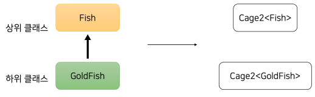

# 제네릭

## 1. 제네릭과 타입 파라미터

### 1-1. 제네릭과 타입 파라미터

 - `예제 클래스`
```kotlin
abstract class Animal(
  val name: String,
)

abstract class Fish(name: String) : Animal(name)

// 금붕어
class GoldFish(name: String) : Fish(name)

// 잉어
class Carp(name: String) : Fish(name)

// Cage
class Cage {
  private val animals: MutableList<Animal> = mutableListOf()

  fun getFirst(): Animal {
    return animals.first()
  }

  fun put(animal: Animal) {
    this.animals.add(animal)
  }

  fun moveFrom(cage: Cage) {
    this.animals.addAll(cage.animals)
  }
}
```
<br/>

 - `예제 메인`
```kotlin
// ❌ Carp대신 GoldFish를 넣으면 런타임이 되어야 에러를 찾을 수 있다.
val cage = Cage()
cage.put(Carp("잉어"))
val carp: Carp = cage.getFirst() as Carp

// ❌ Safe Type Casting과 Elvis Operator
// 실수가 발생하면 IllegalArgumentException 발생
val cage = Cage()
cage.put(Carp("잉어"))
val carp: Carp = cage.getFirst() as? Carp ?: throw IllegalArgumentException()
```
<br/>

#### 제네릭 사용

 - `Cage2`
```kotlin
class Cage2<T : Any> {
  private val animals: MutableList<T> = mutableListOf()

  fun getFirst(): T {
    return animals.first()
  }

  fun put(animal: T) {
    this.animals.add(animal)
  }

  fun moveFrom(otherCage: Cage2<T>) {
    this.animals.addAll(otherCage.animals)
  }

  fun moveTo(otherCage: Cage2<T>) {
    otherCage.animals.addAll(this.animals)
  }
}

// ✔ 특정 타입을 넣어준다.
// 제네릭을 사용하여 타입 캐스팅 없이 사용 가능
val cage = Cage2<Carp>()
cage.put(Carp("잉어"))
val carp: Carp = cage.getFirst()
```
<br/>

## 2. 배열과 리스트, 제네릭과 무공변

```kotlin
val goldFishCage = Cage2<GoldFish>()
goldFishCage.put(GoldFish("금붕어"))

val cage = Cage2<Fish>()
cage.moveFrom(goldFishCage) // ❌ Type Mismatch

// Cage2<Fish>에 Cage2<GoldFish>를 대입 불가
// Fish에 GoldFish는 대입 가능
```

<div align="center">
    
</div>
<br/>

 - `Java 코드`
    - Java 배열은 공변하다.
    - List는 제네릭을 사용하여 무공변하다.
```java
// ✔ String[]은 Object[]의 하위 타입이니 objs에 strs를 넣을 수 있다.
String[] strs = new String[]{"A", "B", "C"};
Object[] objs = strs;
objs[0] = 1; // ❌ objs은 String[]으로 int를 넣을 수 없어 런타임 에러 발생

// ❌ 컴파일 에러
List<String> strs = List.of("A", "B", "C");
List<Object> objs = strs; // ❌ Type Mismatch
```
<br/>

## 3. 공변과 반공변

제네릭에 out 키워드를 정의하면 제네릭 타입의 상속 관계가 제네릭 클래스까지 이어지게 된다.  
out 변성 어노테이션이 붙은 파라미터는 오직 생산자 역할만 할 수 있다. 데이터를 꺼내기만 할 수 있다. put() 같은 메서드를 사용할 수 없다.  
in 변성 어노테이션이 붙은 파라미터는 오직 소비자 역할만 할 수 있다.  

 - `Cage2`
    - out: 생산자, 공변
    - in: 소비자, 반공변
```kotlin
class Cage2<T : Any> {
  private val animals: MutableList<T> = mutableListOf()

  fun getFirst(): T {
    return animals.first()
  }

  fun put(animal: T) {
    this.animals.add(animal)
  }

  fun moveFrom(otherCage: Cage2<out T>) {
    this.animals.addAll(otherCage.animals)
  }

  fun moveTo(otherCage: Cage2<in T>) {
    otherCage.animals.addAll(this.animals)
  }
}

// ✔ out 소비자 역할을 막은 이유로는 타입 안정성에 있다.
val goldFishCage = Cage2<GoldFish>()
goldFishCage.put(GoldFish("금붕어"))

val cage2 = Cage2<Fish>()
cage2.put(Carp("잉어")) // Fish에 잉어를 넣을 수 있다.
cage2.moveFrom(goldFishCage) // 잉어를 금붕어로 옮기는 것은 불가능하다.
```

<br/>

 - `Java와 Kotlin`
```
<out T> = <? extends T>
<in T> = <? super T>
```
