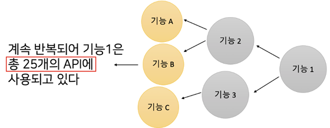
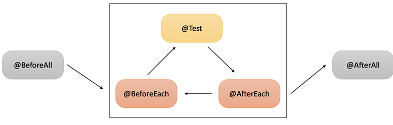
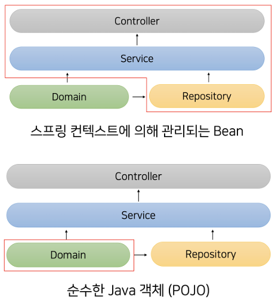
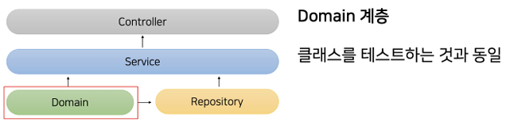
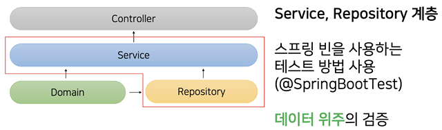
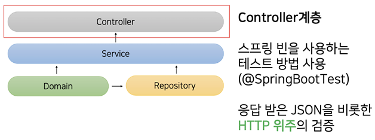

# 도서관리 애플리케이션 리팩토링 준비하기

## 도서관리 애플리케이션

 - `API 기능`
```
★ 사용자 관련 기능
POST /user: 사용자 정보 등록 API
GET /user: 사용자 목록 조회 API
PUT /user: 사용자 이름 업데이트 API
DELETE /user: 사용자 정보 삭제 API

★ 도서 관련 기능
POST /book: 도서 정보 등록 API
POST /bolok/loan: 도서 대출 API
PUT /book/return: 도서 반납 API
```
<br/>

### 코드 이해하기

#### 프로젝트 설정

 - `build.gradle`
    - JDK 11, Spring Boot 2.6.8
    - JPA, Web, H2, Test
```groovy
plugins {
    id 'org.springframework.boot' version '2.6.8'
    id 'io.spring.dependency-management' version '1.0.11.RELEASE'
    id 'java'
}

group = 'com.group'
version = '0.0.1-SNAPSHOT'
sourceCompatibility = '11'

repositories {
    mavenCentral()
}

dependencies {
    implementation 'org.springframework.boot:spring-boot-starter-data-jpa'
    implementation 'org.springframework.boot:spring-boot-starter-web'
    runtimeOnly 'com.h2database:h2'
    testImplementation 'org.springframework.boot:spring-boot-starter-test'
}

tasks.named('test') {
    useJUnitPlatform()
}
```
<br/>

 - `application.yml`
    - H2 DB 설정, JPA 설정
```yml
spring:
  datasource:
    url: 'jdbc:h2:mem:library'
    username: 'user'
    password: ''
    driver-class-name: org.h2.Driver
  jpa:
    hibernate:
      ddl-auto: create
    properties:
      hibernate:
        format_sql: true
        show_sql: true
  h2:
    console:
      enabled: true
      path: '/h2-console'
```

#### 도메인 및 레포지토리 코드

 - `Book`
```java
// Book
@Entity
public class Book {

  @Id
  @GeneratedValue(strategy = IDENTITY)
  private Long id;

  @Column(nullable = false)
  private String name;

  public Book() {
  }

  public Book(String name) {
    if (name.isBlank()) {
      throw new IllegalArgumentException("이름은 비어 있을 수 없습니다");
    }
    this.name = name;
  }

  public String getName() {
    return name;
  }

}

// BookRepository
public interface BookRepository extends JpaRepository<Book, Long> {
  Optional<Book> findByName(String bookName);
}
```
<br/>

 - `User`
```java
// User
@Entity
public class User {

  @Id
  @GeneratedValue(strategy = IDENTITY)
  private Long id;

  @Column(nullable = false)
  private String name;

  private Integer age;

  @OneToMany(mappedBy = "user", cascade = CascadeType.ALL, orphanRemoval = true)
  private final List<UserLoanHistory> userLoanHistories = new ArrayList<>();

  public User() {

  }

  public User(String name, Integer age) {
    if (name.isBlank()) {
      throw new IllegalArgumentException("이름은 비어 있을 수 없습니다");
    }
    this.name = name;
    this.age = age;
  }

  public void updateName(String name) {
    this.name = name;
  }

  public void loanBook(Book book) {
    this.userLoanHistories.add(new UserLoanHistory(this, book.getName(), false));
  }

  public void returnBook(String bookName) {
    UserLoanHistory targetHistory = this.userLoanHistories.stream()
        .filter(history -> history.getBookName().equals(bookName))
        .findFirst()
        .orElseThrow();
    targetHistory.doReturn();
  }

  public String getName() {
    return name;
  }

  public Integer getAge() {
    return age;
  }

  public Long getId() {
    return id;
  }

}

// UserLoanHistory
@Entity
public class UserLoanHistory {

  @Id
  @GeneratedValue(strategy = IDENTITY)
  private Long id;

  @ManyToOne
  private User user;

  private String bookName;

  private boolean isReturn;

  public UserLoanHistory() {

  }

  public UserLoanHistory(User user, String bookName, boolean isReturn) {
    this.user = user;
    this.bookName = bookName;
    this.isReturn = isReturn;
  }

  public String getBookName() {
    return this.bookName;
  }

  public void doReturn() {
    this.isReturn = true;
  }

}

// UserRepository
public interface UserRepository extends JpaRepository<User, Long> {
  Optional<User> findByName(String name);
}

// UserLoanHistoryRepository
public interface UserLoanHistoryRepository extends JpaRepository<UserLoanHistory, Long> {
  UserLoanHistory findByBookNameAndIsReturn(String bookName, boolean isReturn);
}
```
<br/>

#### 서비스(비즈니스) 코드

 - `BookService`
    - saveBook(): 도서 정보 등록
    - loanBook(): 도서 대출
        - 도서 정보를 조회하고, 이미 대출되었는지 검증한다.
        - 사용자 정보를 조회하고, 연관된 사용자 대출 도메인에 대출 정보를 등록한다.
    - returnBook(): 도서 반납
        - 사용자 정보를 조회하고, 연관된 사용자 대출 도메인에 대출 정보에 반납 여부를 변경한다.
```java
@Service
public class BookService {

  private final BookRepository bookRepository;
  private final UserRepository userRepository;
  private final UserLoanHistoryRepository userLoanHistoryRepository;

  public BookService(
      BookRepository bookRepository,
      UserRepository userRepository,
      UserLoanHistoryRepository userLoanHistoryRepository
  ) {
    this.bookRepository = bookRepository;
    this.userRepository = userRepository;
    this.userLoanHistoryRepository = userLoanHistoryRepository;
  }

  @Transactional
  public void saveBook(BookRequest request) {
    Book newBook = new Book(request.getName());
    bookRepository.save(newBook);
  }

  @Transactional
  public void loanBook(BookLoanRequest request) {
    Book book = bookRepository.findByName(request.getBookName()).orElseThrow(IllegalArgumentException::new);
    if (userLoanHistoryRepository.findByBookNameAndIsReturn(request.getBookName(), false) != null) {
      throw new IllegalArgumentException("진작 대출되어 있는 책입니다");
    }

    User user = userRepository.findByName(request.getUserName()).orElseThrow(IllegalArgumentException::new);
    user.loanBook(book);
  }

  @Transactional
  public void returnBook(BookReturnRequest request) {
    User user = userRepository.findByName(request.getUserName()).orElseThrow(IllegalArgumentException::new);
    user.returnBook(request.getBookName());
  }

}
```
<br/>

 - `UserService`
    - saveUser(): 사용자 정보 등록
    - getUsers(): 사용자 목록 조회
    - updateUserName(): 사용자 정보 변경
    - deleteUser(): 사용자 정보 삭제
```java
@Service
public class UserService {

  private final UserRepository userRepository;

  public UserService(UserRepository userRepository) {
    this.userRepository = userRepository;
  }

  @Transactional
  public void saveUser(UserCreateRequest request) {
    User newUser = new User(request.getName(), request.getAge());
    userRepository.save(newUser);
  }

  @Transactional(readOnly = true)
  public List<UserResponse> getUsers() {
    return userRepository.findAll().stream()
        .map(UserResponse::new)
        .collect(Collectors.toList());
  }

  @Transactional
  public void updateUserName(UserUpdateRequest request) {
    User user = userRepository.findById(request.getId()).orElseThrow(IllegalArgumentException::new);
    user.updateName(request.getName());
  }

  @Transactional
  public void deleteUser(String name) {
    User user = userRepository.findByName(name).orElseThrow(IllegalArgumentException::new);
    userRepository.delete(user);
  }

}
```
<br/>

## 테스트 코드

### 테스크 코드란?

테스트 코드란 프로그래밍 코드를 사용해 무엇인가를 검증하는 것을 의미하고, 자동으로 테스트를 할 수 있다.  
 - 개발 과정에서 문제를 미리 발견할 수 있다.
 - 기능 추가와 리팩토링을 안심하게 할 수 있다.
 - 빠른 시간 내 코드의 동작 방식과 결과를 확인할 수 있다.
 - 좋은 테스트 코드를 작성하려 하다보면, 자연스럽게 좋은 코드가 만들어 진다.
 - 잘 작성한 테스트는 문서 역할을 한다. (코드 리뷰를 돕는다.)

```
★ 새로운 기능 추가

기능 1이 존재한다고 가정한다.
기능 1은 기능 2와 기능 3에서 사용된다.
기능 2는 기능 A와 기능 B에서 사용되고, 기능 3은 기능 C에서 사용된다.

이떄, 기능 1이 총 25개의 API에 사용되고 있다고 가정한다.

기획자가 새로운 기능이 필요하다는 요구가 들어온다.
개발자는 새로운 기능을 만들기 위해 코드를 확인하며, 기능 1을 수정해야 겠다고 생각한다.
기능 1을 수정을 해야만 새로운 기능을 만들 수 있다.
하지만, 이 기능 1은 25개의 API에 사용되고 있다.

즉, 기능 1을 바꾸는 순간 25개의 API에 영향이 간다.
기존에 존재하는 API가 정상 동작하는 것을 보증해야 한다.
25개의 API를 확인해야 하는데, 이 과정을 사람이 하는 것은 무척이나 번거롭다.


★ 새로운 팀원 합류

최초 개발자가 기능 1을 만들었다.
이후 다른 팀원이 합류하여 기능 1을 수정해야 한다.
다른 팀원은 최초 개발한 사람만큼 이해도가 높지 않을 수 있다.
테스트가 없다면 버그 확률이 높아진다.

즉, 협업 할 때에도 테스트 코드가 있어야 한다.


★ 리팩토링

리팩토링을 할 때마다 사람이 직접 수동으로 기능 검증한다면 무척이나 번거롭다.
```
<div align="center">
    <br/>
    
</div>
<br/>

### 코틀린 코드 작성 준비하기

현재 프로젝트를 Java 기준으로 즉시 Kotlin 코드를 작성하고 실행할 수 없다.  
Kotlin을 적용하기 위해서는 플러그인과 의존성을 추가해야 한다.  

 - `build.gradle`
```groovy
// org.jetbrains.kotlin.jvm 플러그인 추가
plugins {
    id 'org.springframework.boot' version '2.6.8'
    id 'io.spring.dependency-management' version '1.0.11.RELEASE'
    id 'java'
    id 'org.jetbrains.kotlin.jvm' version '1.6.21'
}

// kotlin-stdlib-jdk8 의존성 추가
dependencies {
    implementation 'org.springframework.boot:spring-boot-starter-data-jpa'
    implementation 'org.springframework.boot:spring-boot-starter-web'
    // ..

    implementation 'org.jetbrains.kotlin:kotlin-stdlib-jdk8'
}

compileKotlin {
    kotlinOptions {
        jvmTarget = "11"
    }
}

compileTestKotlin {
    kotlinOptions {
        jvmTarget = "11"
    }
}
```
<br/>

 - `디렉토리 생성`

기존에 'src/main/java/group/libraryapp'을 루트 디렉토리로 사용되었다.  
'src/main/kotlin/group/libraryapp'을 만들어 사용한다.  
'src/main'과 '/src/test' 폴더 하위에 kotlin 디렉토리를 만들어준다.  

<br/>

### 사칙연산 계산기에 대해 테스트 코드 작성하기

테스트 코드에 대한 감을 익히기 위해 순수한 Kotlin 코드에 대해서 테스트해본다.  

<br/>

 - `Calculator.kt`
    - 계산기는 정수만을 취급한다.
    - 계산기가 생성될 때 숫자를 1개 받는다.
    - 최초 숫자가 기록된 이후에는 연산자 함수를 통해 숫자를 받아 지속적으로 계산한다.
```kotlin
class Calculator(
  var number: Int
) {

  fun add(operand: Int) {
    this.number += operand
  }

  fun minus(operand: Int) {
    this.number -= operand
  }

  fun multiply(operand: Int) {
    this.number *= operand
  }

  fun divide(operand: Int) {
    if (operand == 0) {
      throw IllegalArgumentException("0으로 나눌 수 없습니다")
    }
    this.number /= operand
  }

}
```
<br/>

 - `CalculatorTest`
```kotlin
fun main() {
  val calculatorTest = CalculatorTest()
  calculatorTest.addTest()
  calculatorTest.minusTest()
  calculatorTest.multiplyTest()
  calculatorTest.divideTest()
  calculatorTest.divideExceptionTest()
}

class CalculatorTest {

  fun addTest() {
    // given
    val calculator = Calculator(5)

    // when
    calculator.add(3)

    // then
    if (calculator.number != 8) {
      throw IllegalStateException()
    }
  }

  fun minusTest() {
    // given
    val calculator = Calculator(5)

    // when
    calculator.minus(3)

    // then
    if (calculator.number != 2) {
      throw IllegalStateException()
    }
  }

  fun multiplyTest() {
    // given
    val calculator = Calculator(5)

    // when
    calculator.multiply(3)

    // then
    if (calculator.number != 15) {
      throw IllegalStateException()
    }
  }

  fun divideTest() {
    // given
    val calculator = Calculator(5)

    // when
    calculator.divide(2)

    // then
    if (calculator.number != 2) {
      throw IllegalStateException()
    }
  }

  fun divideExceptionTest() {
    // given
    val calculator = Calculator(5)

    // when
    try {
      calculator.divide(0)
    } catch(e: IllegalArgumentException) {
      if (e.message != "0으로 나눌 수 없습니다") {
        throw IllegalStateException("메시지가 다릅니다.")
      }
      // 테스트 성공!!
      return
    } catch(e: Exception) {
      throw IllegalStateException()
    }
    throw IllegalStateException("기대하는 예외가 발생하지 않았습니다.")
  }


}
```
<br/>

### JUnit5 사용법과 테스트 코드 리팩토링

#### 수동으로 만든 테스트 코드의 단점

 - 테스트 클래스와 메서드가 생길 때마다 메인 메서드에 수동으로 코드를 작성해주어야 하고, 메인 메서드가 아주 커진다. 또한, 테스트 메서드를 개별적으로 실행하기도 어렵다.
 - 테스트가 실패한 경우 무엇을 기대하였고, 어떤 잘못된 값이 들어와 실패했는지 알려주지 않는다.
 - 테스트 메서드별로 공통적으로 처리해야 하는 기능이 있다면, 메서드마다 중복이 생긴다.

<br/>

#### JUnit5에서 사용되는 5가지 어노테이션

JUnit5를 사용하면, 메서드 단위로 테스트를 실행시킬 수 있고, 클래스 단위로 테스트를 실행시킬 수도 있다.  

 - @Test: 테스트 메서드를 지정한다. 테스트 메서드를 실행하는 과정에서 오류가 없다면 성공이다.
 - @BeforeEach: 각 테스트 메서드가 수행되기 전에 실행되는 메서드를 지정한다.
 - @AfterEach: 각 테스트가 수행된 후에 실행되는 메서드를 지정한다.
 - @BeforeAll: 모든 테스트를 수행하기 전에 최초 1회 수행되는 메서드를 지정한다.
    - 코틀린에서는 @JvmStatic을 붙여 주어야 한다.
 - @AfterAll: 모든 테스트를 수행한 후 최후 1회 수행되는 메서드를 지정한다.
    - 코틀린에서는 @JvmStatic을 붙여 주저야 한다.

<div align="center">
    
</div>
<br/>

```kotlin
import org.junit.jupiter.api.AfterAll
import org.junit.jupiter.api.AfterEach
import org.junit.jupiter.api.BeforeAll
import org.junit.jupiter.api.BeforeEach
import org.junit.jupiter.api.Test

class JunitTest {

  // @BeforeAll과 @AfterAll은 static 함수여야 한다.
  // 코틀린에서는 static 함수를 companion object 안에 정의한다.
  companion object {
    @BeforeAll
    @JvmStatic
    fun beforeAll() {
      println("모든 테스트 시작 전")
    }

    @AfterAll
    @JvmStatic
    fun afterAll() {
      println("모든 테스트 종료 후")
    }
  }

  @BeforeEach
  fun beforeEach() {
    println("각 테스트 시작 전")
  }

  @AfterEach
  fun afterEach() {
    println("각 테스트 종료 후")
  }

  @Test
  fun test1() {
    println("테스트 1")
  }

  @Test
  fun test2() {
    println("테스트 2")
  }

}
```
<br/>

 - `자주 사용되는 단언문`
    - assertThat(확인하고 싶은 값)
    - .isEqualTo(기대값)
```kotlin
// 주어진 값이 특정 값 인지 검증
val variable1 = 1
assertThat(variable1).isEqualTo(1)

// 주어진 값이 true/false 인지 검증
val isNew = true
assertThat(isNew).isTrue
assertThat(isNew).isFalse

// 주어진 컬렉션의 Size가 원하는 값인지 검증
val people = listOf(Person("A"), Person("B"))
assertThat(people).hasSize(2)

// 주어진 컬렉션 안의 item들에서 name이라는 프로퍼티를 추출한 후,
// 그 값이 A와 B인지 검증 (순서는 중요하지 않음)
val people = listOf(Person("A"), Person("B"))
asseretThat(people).extracting("name").containsExactlyInAnyOrder("A", "B")

// 순서도 체크
asseretThat(people).extracting("name").containsExactly("A", "B")

// 특정 함수를 실행햇을 때, 특정 에러가 발생하는지 검증
assertThrows<IllegalArgumentException> {
    function1()
}

// message를 가져와 예외 메시지 확인
val message = assertThrows<IllegalArgumentException> {
    function1()
}.message
assertThat(message).isEqualTo("잘못된 값이 들어왔습니다")
```
<br/>

#### 사칙연산 계산기 JUnit5 테스트 코드

 - `JunitCalculatorTest`
```kotlin
import org.assertj.core.api.AssertionsForInterfaceTypes.assertThat
import org.junit.jupiter.api.Test
import org.junit.jupiter.api.assertThrows

class JunitCalculatorTest {

  @Test
  fun addTest() {
    // given
    val calculator = Calculator(5)

    // when
    calculator.add(3)

    // then
    assertThat(calculator.number).isEqualTo(8)
  }

  @Test
  fun minusTest() {
    // given
    val calculator = Calculator(5)

    // when
    calculator.minus(3)

    // then
    assertThat(calculator.number).isEqualTo(2)
  }

  @Test
  fun multiplyTest() {
    // given
    val calculator = Calculator(5)

    // when
    calculator.multiply(3)

    // then
    assertThat(calculator.number).isEqualTo(15)
  }

  @Test
  fun divideTest() {
    // given
    val calculator = Calculator(5)

    // when
    calculator.divide(2)

    // then
    assertThat(calculator.number).isEqualTo(2)
  }

  @Test
  fun divideExceptionTest() {
    // given
    val calculator = Calculator(5)

    // when & then
    assertThrows<IllegalArgumentException> {
      calculator.divide(0)
    }.apply {
      assertThat(message).isEqualTo("0으로 나눌 수 없습니다")
    }
  }

}
```
<br/>

### JUnit5 Spring Boot 테스트

#### Spring Boot 계층별 특징

<div align="center">
    
</div>
<br/>

Controller, Service,  Repository는 스프링 컨텍스트에 의해 관리되는 빈이고, Domain 계층은 순수한 Java 객체이다.  
각 계층을 테스트 하는 방법이 조금씩 다르다.  

<div align="center">
    <br/>
    <br/>
    <br/>
</div>
<br/>

 - __어떤 계층을 테스트 해야하는가?__
    - 당연히 최선은 모든 계층에 대해서 많은 경우를 검증하는 것이 좋다.
    - 하지만, 현실적으로 코딩 시간을 고려해 딱 1개 계층만을 테스트 한다면 일반적인 상황에서는, Service 계층 테스트를 선호한다.
    - Service 계층을 테스트 함으로써 A를 보냈을 때, B가 잘 나오는지, 또는 원하는 로직을 잘 수행하는지 검증할 수 있기 때문이다.  

<br/>

#### 유저 관련 기능 테스트 작성

 - `UserServiceTest`
    - Java 코드에서 Kotlin 호환을 위해 Null 여부를 정의하는 @NotNull, @Nullable 어노테이션을 정의한다.
    - 클래스로 테스트를 실행하면, 각 메서드별로 동일한 Spring Context를 공유한다. 때문에, 테스트별로 고유하게 실행하기 위해서는 테스트 종료시 자원을 정리해주어야 한다. @AfterEach 어노테이션을 통해 각 테스트 별로 초기화 테스트를 실행하도록 한다.
```kotlin
@SpringBootTest
class UserServiceTest @Autowired constructor(
  private val userRepository: UserRepository,
  private val userService: UserService,
) {

  @AfterEach
  fun clean() {
    userRepository.deleteAll()
  }

  @Test
  @DisplayName("유저 저장이 정상 동작한다")
  fun saveUserTest() {
    // given
    val request = UserCreateRequest("로그", null)

    // when
    userService.saveUser(request)

    // then
    val results = userRepository.findAll()
    assertThat(results).hasSize(1)
    assertThat(results[0].name).isEqualTo("로그")
    assertThat(results[0].age).isNull()
  }

  @Test
  @DisplayName("유저 조회가 정상 동작한다")
  fun getUsersTest() {
    // given
    userRepository.saveAll(listOf(
      User("A", 20),
      User("B", null),
    ))

    // when
    val results = userService.getUsers()

    // then
    assertThat(results).hasSize(2) // [UserResponse(), UserResponse()]
    assertThat(results).extracting("name").containsExactlyInAnyOrder("A", "B") // ["A", "B"]
    assertThat(results).extracting("age").containsExactlyInAnyOrder(20, null)
  }

  @Test
  @DisplayName("유저 업데이트가 정상 동작한다")
  fun updateUserNameTest() {
    // given
    val savedUser = userRepository.save(User("A", null))
    val request = UserUpdateRequest(savedUser.id!!, "B")

    // when
    userService.updateUserName(request)

    // then
    val result = userRepository.findAll()[0]
    assertThat(result.name).isEqualTo("B")
  }

  @Test
  @DisplayName("유저 삭제가 정상 동작한다")
  fun deleteUserTest() {
    // given
    userRepository.save(User("A", null))

    // when
    userService.deleteUser("A")

    // then
    assertThat(userRepository.findAll()).isEmpty()
  }

}
```
<br/>

#### 도서 관련 기능 테스트 작성

```kotlin
@SpringBootTest
class BookServiceTest @Autowired constructor(
  private val bookService: BookService,
  private val bookRepository: BookRepository,
  private val userRepository: UserRepository,
  private val userLoanHistoryRepository: UserLoanHistoryRepository,
) {

  @AfterEach
  fun clean() {
    bookRepository.deleteAll()
    userRepository.deleteAll()
  }

  @Test
  @DisplayName("책 등록이 정상 동작한다")
  fun saveBookTest() {
    // given
    val request = BookRequest("이상한 나라의 엘리스")

    // when
    bookService.saveBook(request)

    // then
    val books = bookRepository.findAll()
    assertThat(books).hasSize(1)
    assertThat(books[0].name).isEqualTo("이상한 나라의 엘리스")
  }

  @Test
  @DisplayName("책 대출이 정상 동작한다")
  fun loanBookTest() {
    // given
    bookRepository.save(Book("이상한 나라의 엘리스"))
    val savedUser = userRepository.save(User("로그", null))
    val request = BookLoanRequest("로그", "이상한 나라의 엘리스")

    // when
    bookService.loanBook(request)

    // then
    val results = userLoanHistoryRepository.findAll()
    assertThat(results).hasSize(1)
    assertThat(results[0].bookName).isEqualTo("이상한 나라의 엘리스")
    assertThat(results[0].user.id).isEqualTo(savedUser.id)
    assertThat(results[0].isReturn).isFalse
  }

  @Test
  @DisplayName("책이 진작 대출되어 있다면, 신규 대출이 실패한다")
  fun loanBookFailTest() {
    // given
    bookRepository.save(Book("이상한 나라의 엘리스"))
    val savedUser = userRepository.save(User("로그", null))
    userLoanHistoryRepository.save(UserLoanHistory(savedUser, "이상한 나라의 엘리스", false))
    val request = BookLoanRequest("로그", "이상한 나라의 엘리스")

    // when & then
    val message = assertThrows<IllegalArgumentException> {
      bookService.loanBook(request)
    }.message
    assertThat(message).isEqualTo("진작 대출되어 있는 책입니다")
  }

  @Test
  @DisplayName("책 반납이 정상 동작한다")
  fun returnBookTest() {
    // given
    val savedUser = userRepository.save(User("로그", null))
    userLoanHistoryRepository.save(UserLoanHistory(savedUser, "이상한 나라의 엘리스", false))
    val request = BookReturnRequest("로그", "이상한 나라의 엘리스")

    // when
    bookService.returnBook(request)

    // then
    val results = userLoanHistoryRepository.findAll()
    assertThat(results).hasSize(1)
    assertThat(results[0].isReturn).isTrue
  }

}
```

