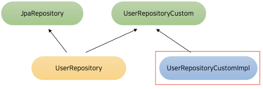

# 네 번째 요구사항 추가하기 - QueryDSL

 - JPQL과 QueryDSL의 장단점을 이해할 수 있다.
 - QueryDSL을 Kotlin + Spring Boot와 함께 사용할 수 있다.
 - QueryDSL을 활용해 기존에 존재하던 Repository를 리팩토링할 수 있다.

<br/>

## 1. QueryDSL 도입하기

### JPQL의 단점

 - @Query 어노테이션을 이용한 JPQL은 하이라이트가 되어있지만, 문자열이기 때문에 버그를 찾기가 어렵다. (오타, 띄어쓰기 등)
 - JPQL 문법이 일반 SQL과 조금 달라 복잡한 쿼리를 작성할 때마다 찾아보아야 한다.
 - Spring Data JPA의 쿼리 메서드로 간단한 쿼리를 쉽게 만들 수 있지만, 조건이 복잡한 동적 쿼리를 작성할 때마다 함수가 계속해서 늘어난다.
    - 쿼리 메서드에 필드 이름을 직접 사용하기 떄문에, 도메인에 필드가 변경되었을 때 취약하다.

<br/>

### QueryDSL

QueryDSL은 코드로 쿼리를 작성하게 해주는 도구이다.  

```kotlin
fun findAll(name: String): List<User> {
    return queryFactory
        .select(user)
        .from(user)
        .where(
            user.name.eq(name)
        )
        .fetch()
}
```
<br/>

### QueryDSL 적용하기

 - `build.gradle`
    - 빌드를 진행하면 'build/generated/source/kapt' 안에 Q 클래스가 생성된다.
```groovy
// org.jetbrains.kotlin.kapt 플러그인 추가
plugins {
    id 'org.springframework.boot' version '2.6.8'
    id 'io.spring.dependency-management' version '1.0.11.RELEASE'
    id 'java'
    id 'org.jetbrains.kotlin.jvm' version '1.6.21'
    id 'org.jetbrains.kotlin.plugin.jpa' version '1.6.21'
    id 'org.jetbrains.kotlin.plugin.spring' version '1.6.21'
    id 'org.jetbrains.kotlin.kapt' version '1.6.21'
}

// QueryDSL 의존성 추가
dependencies {
    // ..
    implementation 'com.querydsl:querydsl-jpa:5.0.0'
    kapt("com.querydsl:querydsl-apt:5.0.0:jpa")
    kapt("org.springframework.boot:spring-boot-configuration-processor")
}
```
<br/>

 - `QuerydslConfig`
    - JPAQueryFactory를 빈으로 등록해준다.
```kotlin
@Configuration
class QuerydslConfig(
  private val em: EntityManager,
) {

  @Bean
  fun querydsl(): JPAQueryFactory {
    return JPAQueryFactory(em)
  }

}
```
<br/>

## 2. QueryDSL 사용하기 - 첫 번째 방법

<div align="centger">
    
</div>
<br/>

 - `UserRepositoryCustom.kt`
```kotlin
interface UserRepositoryCustom {
  fun findAllWithHistories(): List<User>
}
```
<br/>

 - `UserRepository`
    - UserRepositoryCustom를 상속받는다.
```kotlin
interface UserRepository : JpaRepository<User, Long>, UserRepositoryCustom {
  fun findByName(name: String): User?
}
```
<br/>

 - `UserRepositoryCustomImpl`
    - UserRepositoryCustom 인터페이스를 구현한다.
```kotlin
class UserRepositoryCustomImpl(
  private val queryFactory: JPAQueryFactory,
) : UserRepositoryCustom {

  override fun findAllWithHistories(): List<User> {
    return queryFactory
        .select(user).distinct()
        .from(user)
            .leftJoin(userLoanHistory)
                .on(userLoanHistory.user.id.eq(user.id)).fetchJoin()
        .fetch()
  }

}
```
<br/>

## 3. QueryDSL 사용하기 - 두 번째 방법

QueryDSL을 이용하는 Repository를 따로 만든다.  
클래스만 만들면 되어 간결하다.  
필요에 따라 두 Repository를 불러와야 한다.  

<br/>
사람마다 선호하는 방식이 다르지만, 멀티 모듈을 사용하는 경우 모듈 별로만 Repository를 쓰는 경우가 많아서 QueryDSL용 클래스만 따로 만드는 방법을 선호한다.  

<br/>

 - `BookQuerydslRepository`
```kotlin
@Component
class BookQuerydslRepository(
    private val queryFactory: JPAQueryFactory,
) {

    fun getStats(): List<BookStatResponse> {
        return queryFactory
            .select(
                Projections.constructor(
                    BookStatResponse::class.java,
                    book.type,
                    book.id.count()
                )
            )
            .from(book)
            .groupBy(book.type)
            .fetch()
    }

}
```
<br/>

## 4. UserLoanHistoryRepository를 QueryDSL로 리팩토링

### 기존 UserLoanHistoryRepository 코드

 - `UserLoanHistoryRepository`
```kotlin
interface UserLoanHistoryRepository : JpaRepository<UserLoanHistory, Long> {
    fun findByBookNameAndStatus(bookName: String, status: UserLoanStatus): UserLoanHistory?

    fun countByStatus(status: UserLoanStatus): Long
}
```
<br/>

### QueryDSL로 리팩토링

기존에도 @Query를 사용하지 않아 쿼리가 따로 없었지만, QueryDSL로 옮기면 동적 쿼리에 이점이 생긴다.  


```kotlin
@Component
class UserLoanHistoryQuerydslRepository(
    private val queryFactory: JPAQueryFactory,
) {

    fun find(bookName: String, status: UserLoanStatus? = null): UserLoanHistory? {
        return queryFactory.select(userLoanHistory)
            .from(userLoanHistory)
            .where(
                userLoanHistory.bookName.eq(bookName),
                status?.let { userLoanHistory.status.eq(status) }
            )
            .limit(1)
            .fetchOne()
    }

    fun count(status: UserLoanStatus): Long {
        return queryFactory
            .select(userLoanHistory.count())
            .from(userLoanHistory)
            .where(
                userLoanHistory.status.eq(status)
            )
            .fetchOne() ?: 0L
    }

}
```

