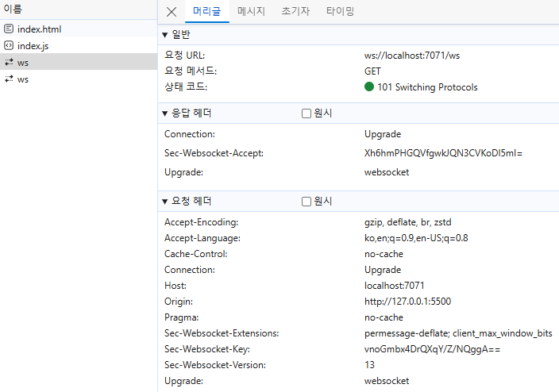

# WebSocket

WebSocket은 웹 애플리케이션에서 클라이언트와 서버 간의 양방향 통신을 가능하게 하는 프로토콜입니다. 웹소켓은 HTML5 표준의 일부로, HTTP 프로토콜과는 별개로 동작합니다.  

 - 양방향 통신 (Full-Duplex Communication): 클라이언트와 서버 간에 동시에 데이터를 주고받을 수 있습니다. 이는 HTTP 프로토콜의 요청-응답 방식과는 다릅니다.
 - 지속적인 연결 (Persistent Connection): 한 번 연결이 성립되면, 클라이언트와 서버 간의 연결이 유지됩니다. 이를 통해 실시간 데이터 전송이 가능합니다.
 - 낮은 오버헤드 (Low Overhead): HTTP 헤더의 반복적인 전송 없이, 최소한의 데이터만 전송하여 통신 오버헤드를 줄입니다.
 - 표준화된 프로토콜: WebSocket은 RFC 6455에 정의된 표준 프로토콜입니다.

```
★ 동작 흐름

1. Handshake
WebSocket 연결은 HTTP 프로토콜을 사용하여 초기화됩니다. 클라이언트는 HTTP 요청을 통해 WebSocket 핸드셰이크를 시작합니다.
서버는 이 요청을 받아들여 핸드셰이크 응답을 보내고, 이를 통해 WebSocket 연결이 성립됩니다.

2. 데이터 프레임
WebSocket은 메시지를 작은 데이터 프레임으로 나누어 전송합니다. 이러한 데이터 프레임은 텍스트 또는 바이너리 데이터를 포함할 수 있습니다.

3. 연결 유지
연결이 성립된 후, 클라이언트와 서버는 자유롭게 메시지를 주고받을 수 있습니다. 이는 채팅 애플리케이션, 주식 거래 플랫폼 등 실시간 업데이트가 필요한 다양한 응용 프로그램에 유용합니다.

4. 연결 종료
클라이언트 또는 서버가 연결을 종료하고자 하면, 종료 프레임을 전송하여 연결을 종료할 수 있습니다.
```
<br/>

## Polling 방식

### Polling

Polling은 클라이언트가 주기적으로 서버에 요청을 보내 최신 데이터를 가져오는 방식입니다. 특정 시간 간격으로 서버에 HTTP 요청을 보내고, 서버는 요청에 대한 응답으로 데이터를 반환합니다.
 - 클라이언트가 일정한 간격으로 서버에 요청을 보내서 결과를 전달하는 방식
 - 폴링의 주기가 짧으면 서버의 성능에 부담이 가게 되고, 주기가 길면 실시간성이 좋지 않다.
 - 서버에서 바뀐 데이터가 없어도 계속 요청을 해야하므로, 불필요한 트래픽이 발생한다.

<br/>

### Long Polling

Long Polling은 클라이언트가 서버에 요청을 보내고, 서버가 새로운 데이터가 준비될 때까지 응답을 지연시키는 방식입니다. 새로운 데이터가 준비되면 서버는 응답을 보내고, 클라이언트는 응답을 받은 후 즉시 다음 요청을 보냅니다.  
 - Polling에 비해 서버와 클라이언트 간의 불필요한 트래픽이 줄어든다.
 - 응답을 지연시키기 위해 클라이언트의 요청을 오래 유지해야 한다.

<br/>

### Streaming

스트리밍(Streaming)은 클라이언트와 서버 간의 데이터 전송 방식 중 하나로, 데이터를 작은 조각으로 나누어 연속적으로 전송하는 방식입니다. 스트리밍은 특히 실시간 데이터 전송에 유리하며, 동영상, 음악, 게임 등 다양한 애플리케이션에 사용됩니다.  
 - 양방향 소통보다는 서버에서 계속 요청을 받는 것에 유용

<br/>

### Polling과 Streaming 단점

Polling, Long Polling, HTTP Streaming 모두 HTTP 프로토콜을 이용하며, 이러한 HTTP 요청과 응답에 Header가 같이 전달된다. 이러한 Header에는 많은 데이터가 들어 있어 너무 많은 요청과 응답 교환은 부담을 주게 된다.  

<br/>

## WebSocket

WebSocket은 처음에 접속 확립(Handshake)을 위해서만 HTTP 프로토콜을 이용하고, 그 이후 부터는 독립적인 프로토콜인 ws를 사용하게 된다.  
또한, HTTP 요청은 응답이 온 후 연결이 끊기게 되지만 WebSocket은 핸드 쉐이크가 완료되고 임의로 연결을 끊기 전까지 계속해서 연결되어 있다.

<br/>

### WebSocket 흐름

처음 핸드쉐이크 과정으로 GET 요청을 보내며, 헤더에 Sec-Websocket-Key 라는 랜덤하게 생성한 키를 보낸다.  
서버에서는 해당 키를 기반으로 토큰을 만들어, Sec-Websocket-Accept 헤더로 응답한다. 해당 토큰으로 사용자를 식별할 수 있다.  
응답 코드는 101 Switching Protocols로 첫 HTTP 요청 이후 ws 프로토콜로 변환하여 연결을 유지한다.  

<div align="center">
    
</div>
<br/>

