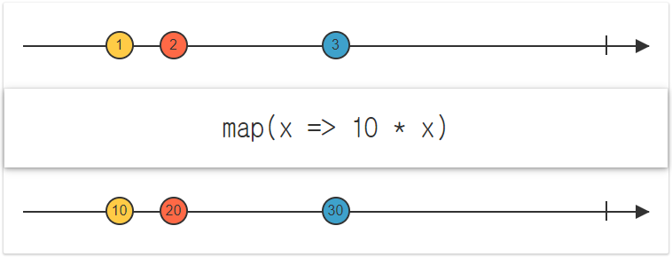
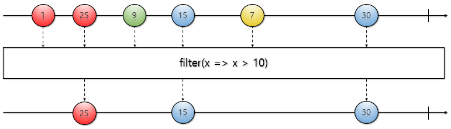

# 리액티브 프로그래밍 개요

## 리액티브 프로그래밍이란?

리액티브 프로그래밍(Reactive Programming)은 비동기적인 데이터 스트림 또는 이벤트 스트림을 처리하기 위한 프로그래밍 패러다임입니다. 이 패러다임은 데이터나 이벤트의 변화에 대응하여 시스템이 반응하는 것을 강조합니다.  
 - __변화의 전파와 데이터 흐름__: 데이터가 변경될 때마다 이벤트를 발생시켜서 데이터를 계속적으로 전달한다.
 - __선언적 프로그래밍__: 실행할 동작을 구체적으로 명시하는 명령형 프로그래밍과 달리 선언형 프로그래밍은 단순히 목표를 선언한다.

<br/>

### 명령형 프로그래밍과 선언형 프로그래밍 비교

 - `명령형 프로그래밍`
    - 명령형 프로그래밍 방식에서는 for문이나 if문을 사용하여 구체적인 알고리즘을 명시한다.
```java
public class ImperativeProgramming {
    public static void main(String[] args){
        // List에 있는 숫자들 중에서 6보다 큰 홀수들의 합계를 구하세요.
        List<Integer> numbers = Arrays.asList(1, 3, 21, 10, 8, 11);
        int sum = 0;

        for(int number : numbers){
             if(number > 6 && (number % 2 != 0)){
                 sum += number;
             }
        }

        System.out.println("# 명령형 프로그래밍 사용: " + sum);
    }
}
```

<br/>

 - `선언형 프로그래밍`
    - JDK 8+ 에서는 Stream API를 사용하여 선언형 프로그래밍 방식을 구현할 수 있다.
```java
public class DeclarativePrograming {
    public static void main(String[] args){
        // List에 있는 숫자들 중에서 6보다 큰 홀수들의 합계를 구하세요.
        List<Integer> numbers = Arrays.asList(1, 3, 21, 10, 8, 11);

        int sum = numbers.stream()
                .filter(number -> number > 6 && (number % 2 != 0))
                .mapToInt(number -> number)
                .sum();

        System.out.println("# 선언형 프로그래밍 사용: " + sum);
    }
}
```

<br/>

### 리액티브 개념이 적용된 예시

 - `Push 방식`
    - 데이터의 변화가 발생했을 때 변경이 발생한 곳에서 데이터를 보내주는 방식
    - RTC, 소켓 프로그래밍, DB Trigger, Spring의 ApplicationEvent, Angular의 데이터 바인딩, 스마트폰의 Push 메시지 등
 - `Pull 방식`
    - 변경된 데이터가 있는지 요청을 보내 질의하고 변경된 데이터를 가져오는 방식
    - 클라이언트 요청 & 서버 응답 방식의 애플리케이션, Java와 같은 절차형 프로그래밍 언어 등

<br/>

### 리액티브 프로그래밍을 위해 알아야 할 것

 - __Observable__: 데이터 소스
 - __리액티브 연산자__: 데이터 소스를 처리하는 함수
 - __스케줄러__: 스레드 관리자
 - __Subscriber__: Observable이 발행하는 데이터를 구독하는 구독자
 - __함수형 프로그래밍__: RxJava에서 제공하는 연산자(Operator) 함수를 사용

<br/>

```java
public class ToDoSample {
    public static void main(String[] args) throws InterruptedException {
        Observable.just(100, 200, 300, 400, 500) // 1. 데이터 발행
                // 2. 데이터 발행시 onNext() 함수가 실행된다.
                .doOnNext(data -> System.out.println(getThreadName() + " : " + "#doOnNext() : " + data))
                // 3. subscribeOn() 함수를 활성화하면, main 쓰레드가 아닌 다른 쓰레드에서 실행된다.
                    // 즉, 데이터의 발행 및 데이터의 흐름을 결정짓는 쓰레드를 결정
                .subscribeOn(Schedulers.io())
                // 4. observeOn() 함수를 활성화하면, main 쓰레드가 아닌 다른 쓰레드에서 실행된다.
                    // 발행된 데이터를 가공하고, 구독해서 처리하는 쓰레드를 결정
                .observeOn(Schedulers.computation())
                .filter(number -> number > 300)
                .subscribe(num -> System.out.println(getThreadName() + " : result : " + num)); // 데이터 구독 처리

        Thread.sleep(500);
    }
```

<br/>

## 마블 다이어그램 소개

마블 다이어그램(Marble Diagram)은 리액티브 프로그래밍에서 비동기 데이터 스트림 또는 이벤트 스트림을 시각적으로 표현하는 도구입니다. 이러한 다이어그램은 이벤트나 데이터의 흐름, 연산자의 적용, 스트림의 변형 등을 명확하게 보여줍니다.  

마블 다이어그램은 일반적으로 시간이 흐름에 따라 수평적으로 배치된 직선 위에 마블 모양의 표기를 사용합니다. 각 마블은 이벤트나 데이터를 나타내며, 해당 이벤트가 발생한 시간을 나타냅니다. 연산자는 마블 다이어그램 상에서 이벤트 스트림에 적용되는 변환을 나타내는데, 이러한 연산자들은 마블 다이어그램 상에서 화살표로 표현됩니다.  

 - 리액티브 프로그래밍을 통해 발생하는 비동기적인 데이터의 흐름을 시간의 흐름에 따라 시각적으로 표시한 다이어그램
    - 문장으로 적혀 있는 리액티브 연산자의 기능을 이해하기 어려움
    - 리액티브 연산자의 기능이 시각화 되어 있어서 이해하기 쉬움
    - 리액티브 프로그래밍의 핵심인 연산자를 사용하기 위한 핵심 도구

<br/>

<div align="center">
    <br/>
    이미지 출처 - https://reactivex.io/documentation/operators/map.html
</div>
<br/>

<div align="center">
    <br/>
    이미지 출처 - KEVIN'S IT VILLAGE
</div>
<br/>

```java
public class MarbleExample01 {
    public static void main(String[] args){
        Observable.just(1, 25, 9, 15, 7, 30)
                .filter(x -> x > 10)
                .subscribe(x -> System.out.println(x));
    }
}
```

