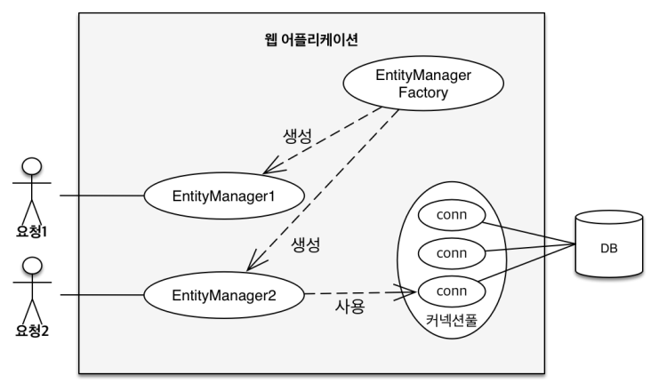
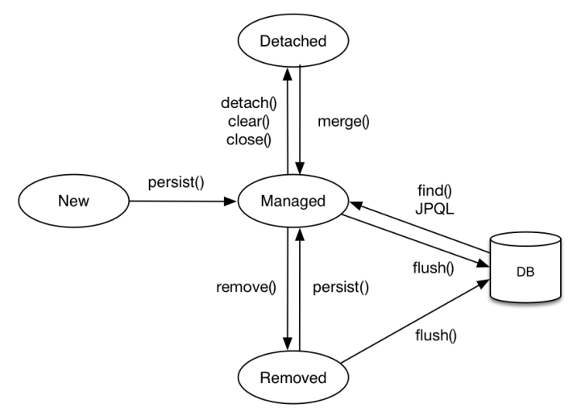
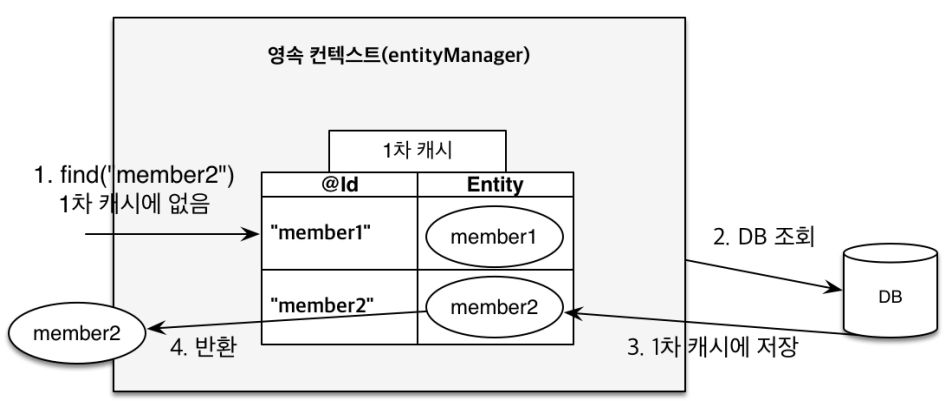
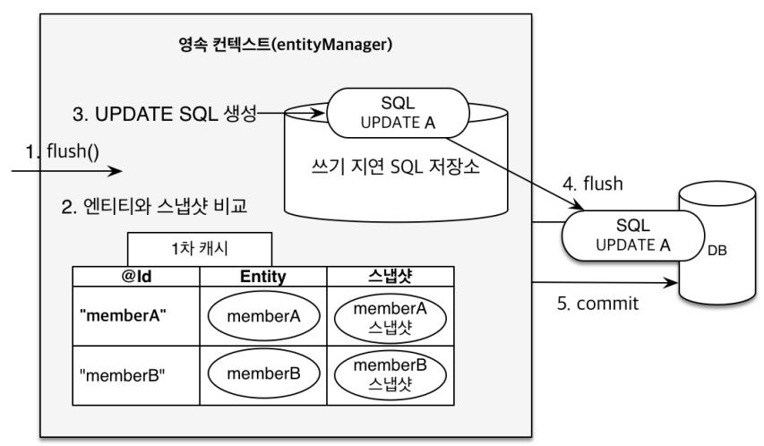

# 영속성 관리

## 1. 영속성 컨텍스트

클라이언트 요청시 EntityManagerFactory는 클라이언트 요청마다 EntityManager를 생성한다.  
EntityManager는 내부적으로 DB Connection을 이용하여 DB를 이용하게 된다.  

<div align="center">
    
</div>
<br/>

영속성 컨텍스트는 엔티티를 영구 저장하는 환경으로 EntityManager를 통해서 영속성 컨텍스트에 접근할 수 있다.  
EntityManager가 생성되면, 그에 대응하는 PersistenceContext(영속성 컨텍스트)가 1:1로 생성이 된다.  

<br/>

### 1-1. 엔티티의 생명주기

 - __비영속 (new/transient)__
    - 영속성 컨텍스트와 전혀 관계가 없는 새로운 상태
    - Member 엔티티를 생성했지만, 아직 EntityManager에 의해 관리되지 않는다.
```java
//객체를 생성한 상태(비영속) 
Member member = new Member(); 
member.setId("member1"); 
member.setUsername("회원1");
```
<br/>


 - __영속 (managed)__
    - 영속성 컨텍스트에 관리되는 상태
    - Member 엔티티를 생성하고, EntityManager의 persisnt() 메서드를 통해 해당 객체가 영속성 컨텍스트에 관리되도록 한다.
```java
//객체를 생성한 상태(비영속) 
Member member = new Member(); 
member.setId("member1"); 
member.setUsername(“회원1”);

EntityManager em = emf.createEntityManager();
em.getTransaction().begin();

//객체를 저장한 상태(영속)
em.persist(member);
```
<br/>

 - __준영속 (detached)__
    - 영속성 컨텍스트에 저장되었다가 분리된 상태
    - 엔티티 매니저에 의해 관리되는 Member 객체를 detach() 메서드를 호출하여 영속성 컨텍스트에서 제거하고, 관리되지 않도록 한다.
```java
//회원 엔티티를 영속성 컨텍스트에서 분리, 준영속 상태 
em.detach(member);
```
<br/>

 - __삭제 (removed)__
    - 삭제된 상태
```java
//객체를 삭제한 상태(삭제) 
em.remove(member);
```
<br/>

<div align="center">
    
</div>
<br/>

### 1-2. 영속성 컨텍스트의 이점

 - __1차 캐시__
    - 1차 캐시는 데이터베이스 트랜잭션 하나에서 확보하기 때문에, 성능 향상에 큰 도움이 되지는 않는다.
```java
// 엔티티를 생성한 상태(비영속) 
Member member = new Member(); 
member.setId("member1"); 
member.setUsername("회원1");

// 엔티티를 영속, 1차 캐시에 저장된다.
em.persist(member);

// 1차 캐시에서 조회, DB에서 조회하지 않고 1차 캐시에서 조회된다.
Member findMember = em.find(Member.class, "member1");
```
<div align="center">
    
</div>
<br/>

 - __동일성(identity) 보장__
```java
Member a = em.find(Member.class, "member1"); 
Member b = em.find(Member.class, "member1");

System.out.println(a == b); //동일성 비교 true
```
<br/>

 - __트랜잭션을 지원하는 쓰기 지연(버퍼링 기능)__
    - 엔티티 매니저는 데이터 변경시 트랜잭션을 시작해야 한다.
    - 변경에 대한 메서드 호출시 SQL을 DB에 바로 전송하지 않고, 쓰기 지연 SQL 저장소에 저장하고, 트랜잭션이 종료될 때 모든 SQL을 한 번에 보내게 된다.
```java
EntityManager em = emf.createEntityManager();
EntityTransaction transaction = em.getTransaction();
//엔티티 매니저는 데이터 변경시 트랜잭션을 시작해야 한다.
transaction.begin(); // [트랜잭션] 시작

em.persist(memberA);
em.persist(memberB);
//여기까지 INSERT SQL을 데이터베이스에 보내지 않는다.

//커밋하는 순간 데이터베이스에 INSERT SQL을 보낸다.
transaction.commit(); // [트랜잭션] 커밋
```
<br/>

 - __변경 감지(Dirty Checking)__
    - JPA는 Entity를 영속성 컨텍스트에 보관할 때 1차 캐시로 원본 객체의 스냅샷을 저장한다.
    - 이후에, DB 트랜잭션을 커밋하는 순간 변경된 Entity와 원본 스냅샷을 비교하게 된다. 만약, 변경된 부분이 있으면 UPDATE SQL을 쓰기 지연 SQL 저장소에 저장하고, flush를 호출하여 DB에 SQL을 호출하고 트랜잭션을 종료하게 된다.
```java
EntityManager em = emf.createEntityManager();
EntityTransaction transaction = em.getTransaction();
transaction.begin(); // [트랜잭션] 시작

// 영속 엔티티 조회
Member memberA = em.find(Member.class, "memberA");

// 영속 엔티티 데이터 수정
memberA.setUsername("hi");
memberA.setAge(10);

//em.update(member) 이런 코드가 있어야 하지 않을까?
transaction.commit(); // [트랜잭션] 커밋
```
<div align="center">
    
</div>
<br/>

### 1-3. 플러시

플러시를 해야 DB에 SQL을 호출하게 된다. 기본적으로 플러시가 발생했다고 해서 커밋을 한 것은 아니다. 떄문에, 트랜잭션이 종료되지는 않는다.  
JPA는 기본적으로 commit을 호출하면 flush가 발생하도록 되어있다.  
 - 변경 감지
 - 수정된 엔티티 쓰기 지연 SQL 저장소에 등록
 -  쓰기 지연 SQL 저장소의 쿼리를 데이터베이스에 전송 (등록, 수정, 삭제 쿼리)

<br/>

#### 영속성 컨텍스트를 플러시하는 방법

 - 직접 호출: em.flush()
 - 플러시 자동 호출: 트랜잭션 커밋시 자동 호출
 - 플러시 자동 호출: JPQL쿼리 실행시 자동 호출
    - JPQL 쿼리 실행시에는 플러시가 자동으로 호출된다.
```java
// 1. memberA, memberB, memberC를 영속성 컨텍스트에 보관한다.
em.persist(memberA);
em.persist(memberB);
em.persist(memberC);

// 2. 아직 SQL이 실제로 호출되지 않았다. 즉, DB에 정보가 없다.

// 3. JPQL을 통해 memberA, memberB, memberC를 조회하고 싶다.
// JPQL은 객체지향 SQL을 직접 정의하고, DB SQL로 변환되어 DB에 SQL이 요청되게 된다.
// 하지만, 아직 영속성 컨텍스트에만 존재하고 DB에 정보가 없다.
// 이러한 문제를 방지하기 위해 JPQL 호출시에 플러시가 자동으로 호출된다.
query = em.createQuery("select m from Member m", Member.class);
List<Member> members= query.getResultList();
```

<br/>

#### 플러시 모드 옵션

 - FlushModeType.AUTO: 커밋이나 쿼리를 실행할 때 플러시 (기본값) 
 - FlushModeType.COMMIT: 커밋할 때만 플러시

```java
em.setFlushMode(FlushModeType.COMMIT)
```

<br/>

### 1-4. 준영속 상태

준영속 상태는 영속 상태의 엔티티가 영속성 컨텍스트에서 분리된 상태이다.  
영속성 컨텍스트가 제공하는 기능을 사용하지 못한다. 즉, 비영속과 별반 차이가 없다.  

<br/>

#### 준영속 상태로 만드는 방법

 - em.detach(entity): 특정 엔티티만 준영속 상태로 전환 
 - em.clear(): 영속성 컨텍스트를 완전히 초기화 
 - em.close(): 영속성 컨텍스트를 종료

```java
// 엔티티 조회: 조회한 엔티티는 영속성 컨텍스트에서 관리된다.
Member member = em.find(Member.class, 1L);
member.setName("홍길동");

// 준영속 상태로 변환: 엔티티 컨텍스트에서 제거
em.detach(member);

// 트랜잭션 커밋
tx.commit();

// 플러시 되는 순간, 1차 캐시와 스냅샷을 비교하게 되는데
// 1차 캐시에 엔티티 정보가 없다. 즉, UPDATE 쿼리가 수행되지 않는다.
```

