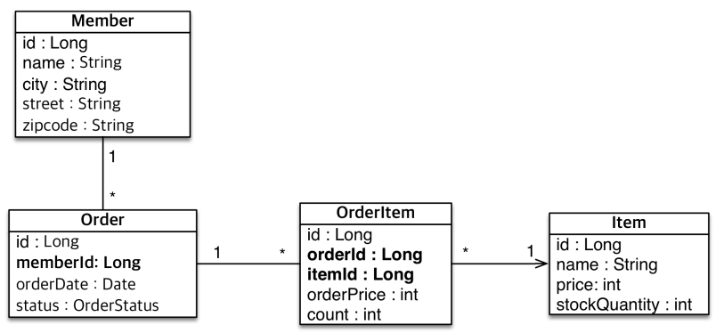

# 엔티티 매핑

## 1. 객체와 테이블 매핑

 - 객체와 테이블 매핑: @Entity, @Table
 - 필드와 컬럼 매핑: @Column
 - 기본키 매핑: @Id
 - 연관 관계 매핑: @OneToOne, @OneToMany, @ManyToOne, @ManyToMany, @JoinColumn

<br/>

### @Entity

@Entity 어노테이션이 정의된 클래스는 JPA가 관리하며 엔티티 클래스라고 한다. JPA를 사용해서 테이블과 매핑할 클래스는 @Entity 어노테이션이 필수이다.  
 - 기본 생성자가 필요하다.
 - final 클래스, enum, interface, inner 클래스에는 사용할 수 없다.
 - 저장할 필드에 final을 사용할 수 없다.
 - 제공 옵션
    - name
        - 엔티티 이름을 지정한다.
        - 기본값으로는 클래스 이름을 그대로 사용한다.
```java
@Entity(name = "Member")
public class Member {
    @Id
    private Long id;

    private String name;
}
```

<br/>

### @Table

@TABLE은 엔티티와 매핑할 테이블을 지정한다.  
 - name: 매핑할 테이블 이름, 기본값은 엔티티 이름을 사용한다.
 - catalong: 데이터베이스 catalog 매핑
 - schema: 데이터베이스 schema 매핑
 - uniqueConstraints: DDL 생성시에 유니크 제약 조건 생성
```java
@Entity
@Table(name = "MEMBER_TBL")
public class Member {
    @Id
    private Long id;

    private String name;
}
```

<br/>

## 2. 데이터베이스 스키마 자동 생성

JPA에서는 애플리케이션 로딩 시점에 DB 테이블을 자동으로 생성하는 기능을 제공해준다.  
 - 데이터베이스 방언을 활용해서 데이터베이스에 맞는 적절한 DDL을 생성한다.
 - __운영 환경에서는 절대로 create, create-drop, update를 사용하면 안된다.__
    - __개발 초기 단계에서 create 또는 update__
    - __테스트 서버 단계에서 update 또는 validate__
    - __스테이징과 운영 서버는 validate 또는 none__
    - 애플리케이션용 DB 계정에서는 ALTER, DROP을 사용할 수 없도록 해야한다.

<br/>

### 2-1. hibernate.hbm2ddl.auto 옵션

 - create: 기존 테이블 삭제 후 다시 생성(DROP + CREATE)
 - create-drop: create와 같으나 종료시점에 테이블 DROP
 - update: 변경분만 반영(추가하는 경우에만 적용, 컬럼 정보 삭제시 미반영)
 - validate: 엔티티와 테이블이 정상 매핑되었는지 확인
 - none: 사용하지 않음

<br/>

### 2-2. DDL 생성 기능

@Column 어노테이션을 통해 자동 DDL 생성시 옵션을 추가할 수 있다.  
DDL 생성 기능은 DDL을 자동 생성할 때만 사용되고, JPA의 실행 로직에는 영향을 주지 않는다. (런타임시에는 영향 X, 처음 애플리케이션 실행시에만 적용)  

 - @Column(nullable = false, length = 10)
    - 회원 이름은 필수 입려깅고, 10글자를 초과할 수 없다.
 - 유니크 제약 조건 추가
    - @Table(uniqueConstraints = {@UniqueConstraint(name = "NAME_AGE_UNIQUE", columnNames={"NAME", "AGE"})})
```java
@Entity
public class Member {
    @Id
    private Long id;

    @Column(unique = true, length = 10)
    private String name;
}
```

<br/>

## 3. 필드와 컬럼 매핑

 - @Column: 컬럼 매핑
 - @Temporal: 날짜 타입 매핑
 - @Enumerated: enum 타입 매핑
 - @Lob: BLOB, CLOB 매핑
 - @Transient: 특정 필드를 컬럼에 매핑에서 제외

```java
@Entity
public class Member {

    @Id
    private Long id;

    @Column(name = "name")
    private String username;

    private Integer age;

    // Enum Type 매핑
    @Enumerated(EnumType.STRING)
    private RoleType roleType;

    // 날짜 Type 매핑
    @Temporal(TemporalType.TIMESTAMP)
    private Date createdDate;

    @Temporal(TemporalType.TIMESTAMP)
    private Date lastModifiedDate;

    // BLOB, CLOB 매핑
    @Lob
    private String description;

    @Transient
    private int temp;
}
```

<br/>

### 3-1. @Column 옵션

 - name
    - 필드와 매핑할 테이블의 컬럼 이름 지정
    - 기본값으로는 필드명과 컬럼명을 매핑한다.
 - insertable, updatable
    - 등록, 변경 가능 여부
    - 기본값은 True 이다. (변경 가능)
 - nullable(DDL)
    - null 값의 허용 여부를 지정
    - false로 설정하면 DDL 생성 시에 not null 제약조건을 지정한다.
 - unique(DDL)
    - @Table의 uniqueConstraints와 같지만 헌 컬럼에 간단히 유니크 제약 조건을 지정할 때 사용한다.
    - 하지만, 유니크 제약 조건의 이름을 랜덤하게 만들어주기 때문에 운영시에 사용하기 어렵다. @Table의 uniqueConstraints 옵션으로 사용하는 방식이 선호된다.
 - columnDefinition(DDL)
    - 데이터베이스 컬럼 정보를 직접 설정
    - ex) columnDefinition = "varchar(100) default 'EMPTY'"
 - length(DDL)
    - 문자 길이 제약 조건 지정
    - String 타입에만 사용한다.
    - 기본 값은 255로 설정된다.
 - precision, scale(DDL)
    - BigDecimal 타입에서 사용한다.
    - precision은 소수점을 포함한 전체 자릿수, scale은 소수의 자릿수를 지정한다.
    - double과 float 타입에는 적용되지 않는다.

<br/>

### 3-2. @Enumerated

Enum 타입을 매핑할 떄 사용한다.  
 - EnumType.ORDINAL: Enum 순서 값을 데이터베이스에 저장
 - EnumType.STRING: Enum 이름 값을 데이터베이스에 저장
 - 기본값으로 EnumType.ORDINAL이 사용된다.
 - __EnumType.ORDINAL 사용시 애플리케이션에서 타입이 추가되는 경우 순서에 의한 문제가 발생할 수 있다. 떄문에, EnumType.STRING 사용이 권장된다.__
```java
@Entity
public class Member {

    ..

    // Enum Type 매핑
    @Enumerated(EnumType.STRING)
    private RoleType roleType;

}
```

<br/>

### 3-3. @Temporal

JDK 8버전 이하에서 날짜 타입(java.util.Date, java.util.Calendar)을 매핑할 때 사용된다.  
 - JDK 8+의 LocalDate, LocalDateTime을 사용할 때는 생략이 가능하다.
 - TemporalType.DATE: 날짜, 데이터베이스 date 타입과 매핑
 - TemporalType.TIME: 시간, 데이터베이스 time 타입과 매핑
 - TemporalType.TIMESTAMP: 날짜와 시간, 데이터베이스 timestamp 타입과 매핑

<br/>

### 3-4. @Lob

데이터베이스 BLOB, CLOB 타입과 매핑된다.  
 - 매핑하는 필드 타입이 문자면 CLOB 매핑, 나머지는 BLOB와 매핑된다.
 - CLOB: String, char[], java.sql.CLOB
 - BLOB: byte[], java.sql.BLOB

<br/>

### 3-5. @Transient

해당 필드는 데이터베이스 컬럼과 매핑되지 않는다.  
 - 데이터베이스에 저장, 조회 모두 되지 않는다.
 - 주로 메모리상에서만 임시로 어떤 값을 보관하고 싶을 때 사용한다.

<br/>

## 4. 기본 키 매핑

기본 키 매핑으로는 @Id와 @GeneratedValue 어노테이션이 사용된다.  
 - 직접 할당: @Id만 사용
 - 자동 생성(@GeneratedValue)
    - IDENTITY: 데이터베이스에 위임, MySQL
    - SEQUENCE: 데이터베이스 시퀀스 오브젝트 사용, Oracle
        - @SequenceGenerator 필요
    - TABLE: 키 생성용 테이블 사용, 모든 DB에서 사용
        - @TableGenerator 필요
    - AUTO: 방언에 따라 자동 지정

<br/>

### 4-1. IDENTITY 전략

기본 키 생성을 데이터베이스에 위임한다.  
주로 MySQL, PostgreSQL, SQL Server, DB2에서 사용된다. (AUTO_INCREMENT)  
 - JPA는 보통 트랜잭션 커밋 시점에 INSERT SQL을 실행한다.
 - AUTO_INCREMENT는 데이터베이스에 INSERT SQL을 실행한 이후에 ID 값을 알 수 있다.
 - __IDENTITY 전략은 em.persist() 시점에 즉시 INSERT SQL을 실행하고, DB에서 식별자를 조회한다.__
 - __영속성 컨텍스트에 관리되기 위해서는 PK가 있어야 한다. 하지만, IDENTITY 전략은 DB의 행이 등록될 때 AUTO_INCREMENT 값으로 저장된다. 떄문에, 해당 전략에서는 em.persist()를 호출하자마자 DB에 INSERT SQL을 수행하게 된다.__

<br/>

### 4-2. SEQUENCE 전략

데이터베이스 시퀀스는 유일한 값을 순서대로 생성하는 특별한 데이터베이스 오브젝트이다. SEQUENCE 전략은 이러한 시퀀스를 이용한다.  
주로 Oracle, PostgreSQL, DB2, H2 데이터베이스에서 사용된다.  
 - INSERT SQL을 실행하기 전에 SEQUENCE Call을 호출하여 시퀀스 값을 얻어온다. 해당 시퀀스를 키로 영속성 컨텍스트에 보관된다.
 - 트랜잭션이 종료되어 INSERT SQL이 수행되는 시점에 시퀀스 값을 PK로 SQL이 수행되게 된다. (버퍼링)

```java
@Entity
public class Member {
    @Id
    @GeneratedValue(strategy = GenerationType.SEQUENCE)
    private Long id;

    ..
}

@Entity
@SequenceGenerator(
    name = "MEMBER_SEQ_GENERATOR",
    sequenceName = "MEMBER_SEQ", // 매핑할 데이터베이스 시퀀스 이름
    initialValue = 1,
    allocationSize = 1
)
public class Member {
    @Id
    @GeneratedValue(
        strategy = GenerationType.SEQUENCE,
        generator = "MEMBER_SEQ_GENERATOR"
    )
    private Long id;

    ..
}
```

<br/>

#### @SequenceGenerator 옵션

 - name: 식별자 생성기 이름
 - sequenceName: 데이터베이스에 등록되어 있는 시퀀스 이름
 - initialValue: DDL 생성 시에만 사용, 시퀀스 DDL을 생성할 떄 처음 초기화 숫자를 지정
 - allocationSize: 시퀀스 한 번 호출에 증가하는 수
 - catalog, schema: 데이터베이스 catalog, schema 이름

<br/>

#### allocationSize 옵션

allocationSize의 기본 값은 1이 아니라, 50으로 설정되어 있다.  
시퀀스는 1씩 증가해야 할 텐데 해당 값이 50으로 설정되어 있는 이유는 엔티티를 저장시에 영속성 컨텍스트에 보관하기 위해서 시퀀스 값이 필요하다. 이것을 얻기 위해서는 SEQUENCE Call이 발생하여 네트워크를 타게 된다. 이후에 INSERT SQL은 버퍼링 기능으로 한 번에 수행되게 된다.  

즉, 네트워크 성능을 조금이라도 올리기 위해서 DB에 시퀀스를 한 번에 50개를 올리고 JVM 메모리상에서 가져온 시퀀스를 관리하여 사용한다.  
가져온 50개의 시퀀스를 사용하고, 다시 SEQUENCE Call을 하게 된다.  

<br/>

### 4-3. TABLE 전략

키 생성 전용 테이블을 하나 만들어서 데이터베이스 시퀀스를 흉내내는 전략으로 모든 데이터베이스에 적용이 가능하다.  
다만, AUTO_INCREMENT나 SEQUENCE 처럼 최적화된 방식이 아니고 테이블을 이용한 방식으로 Table Lock 등을 통해 성능 이슈가 있을 수 있다.  

```sql
create table MY_SEQUENCES (
    sequence_name varchar(255) not null,
    next_val bigint,
    primary key (sequence_name)
)
```
```java
@Entity
@TableGenerator(
    name = "MEMBER_SEQ_GENERATOR",
    table = "MY_SEQUENCES",
    pkCloumnValue = "MEMBER_SEQ",
    allocationSize = 1
)
public class Member {

    @Id GeneratedValue(
        strategy = GenerationType.TABLE,
        generator = "MEMBER_SEQ_GENERATOR"
    )
    private Long id;
}
```

<br/>

#### 4-4. @TableGenerator 옵션

 - name: 식별자 생성기 이름
 - table: 키 생성 테이블명
 - pkColumnName: 시퀀스 컬럼명
 - valueColumnNa: 시퀀스 값 컬럼명
 - pkColumnValue: 키로 사용할 값 이름
 - initialValue: 초기 값, 마지막으로 생성된 값이 기준
 - allocationSize: 시퀀스 한 번 호출에 증가하는 수
 - catalog, schema: 데이터베이스 catalog, schema 이름
 - uniqueConstraints(DDL): 유니크 제약 조건 지정

<br/>

### 4-5. 권장하는 식별자 전략

기본 키 제약 조건으로는 NULL이 아니여야 하고, 유일하며, 변하면 안 된다.  
미래까지 이 조건을 만족하는 자연키(비즈니스적으로 의미있는 키)를 찾기는 어렵다. 떄문에, 대리키(대체키)를 사용한다. 예를 들어, 주민등록번호는 기본 키로 적절하지 않다.  
 - 권장: Long형, 대체키(uuid), 키 생성전략 등을 사용

<br/>

## 5. 실전 예제

 - 회원은 상품을 주문할 수 있다.
 - 주문 시 여러 종류의 상품을 선택할 수 있다.

<br/>

### 5-1. 기능 목록

 - 회원 기능
    - 회원 등록, 회원 조회
 - 상품 기능
    - 상품 등록, 상품 수정, 상품 조회
 - 주문 기능
    - 상품 주문, 주문 내역 조회, 주문 취소

<br/>

### 5-2. 도메인 모델 분석

 - 회원과 주문 관계: 회원은 여러 번 주문할 수 있다. (1:N)
 - 주문과 상품 관계: 주문할 때 여러 상품을 선택할 수 있다. 반대로 같은 상품도 여러 번 주문될 수 있다. 주문 상품이라는 모델을 만들어서 다대다 관계를 일대다, 다대일 관계로 풀어낸다.

<div align="center">
    <br/>
    
</div>
<br/>

## 6. 예제 코드(데이터 중심 설계)

 - `엔티티 클래스`
```java
// Member: 회원
@Getter
@Setter
@Entity
public class Member {
    @Id @GeneratedValue(strategy = GenerationType.AUTO)
    @Column(name = "MEMBER_ID")
    private Long id;

    private String name;
    private String city;
    private String street;
    private String zipcode;
}

// Order: 주문
@Getter
@Setter
@Entity
@Table(name = "ORDERS")
public class Order {
    @Id @GeneratedValue(strategy = GenerationType.AUTO)
    @Column(name = "ORDER_ID")
    private Long id;

    @Column(name = "MEMBER_ID")
    private Long memberId;

    private LocalDateTime orderDate;

    @Enumerated(EnumType.STRING)
    private OrderStatus status;
}

public enum OrderStatus {
    ORDER, CANCEL
}

// Item: 상품
@Getter
@Setter
@Entity
public class Item {
    @Id @GeneratedValue(strategy = GenerationType.AUTO)
    @Column("ITEM_ID")
    private Long id;

    private String name;
    private int price;
    private int stockQuantity;
}

// OrderItem: 주문 상품
@Getter
@Setter
@Entity
public class OrderItem {
    @Id @GeneratedValue(strategy = GenerationType.AUTO)
    @Column(name = "ORDER_ITEM_ID")
    private Long id;

    @Column("ORDER_ID")
    private Long orderId;

    @Column("ITEM_ID")
    private Long itemId;

    private int orderPrice;
    private int count;
}
```

<br/>

 - `JpaMain`
```java
public class JpaMain {
    public static void main(String[] args) {
        EntityManagerFactory emf = Persistence.createEntityManagerFactory("hello");
        EntityManager em = emf.createEntityManager();
        EntityTransaction tx = em.getTransaction();
        
        tx.begin();
        try {
            Order order = em.find(Order.class, 1L);
            Long memberId = order.getMemberId();

            Member member = em.find(Member.class, memberId);

            tx.commit();
        } catch (Exception e) {
            tx.rollback();
        } finally {
            em.close();
        }
        em.close()
    }
}
```

<br/>

### 6-1. 데이터 중심 설계의 문제점

현재 방식은 객체 설계를 테이블 설계에 맞춘 방식이다.  
테이블의 외래키를 객체에 그대로 가져온다.  
즉, 객체 그래프 탐색이 불가능하다.  
```java
// 데이터 중심 설계
Order order = em.find(Order.class, 1L);
Long memberId = order.getMemberId();

Member member = em.find(Member.class, memberId);

// 객체 중심 설계
Order order = em.find(Order.class, 1L);
Member member = order.getMember();
```

