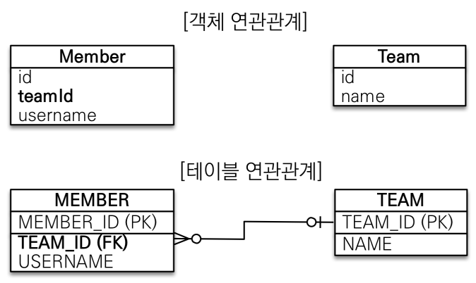
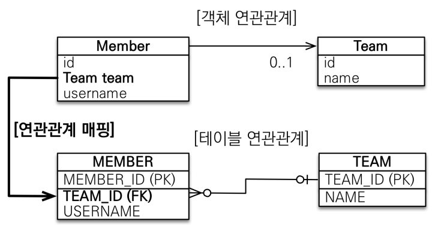
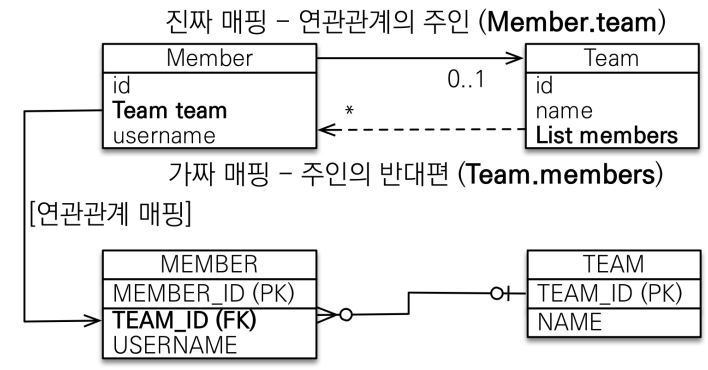

# 연관관계 매핑 기초

 - 방향(Direction): 단방향, 양방향
 - 다중성: 다대일(N:1), 일대다(1:N), 일대일(1:1), 다대다(N:M)
 - 연관관계의 주인: 객체 양방향 연관관계는 관리 주인이 필요

<br/>

## 1. 객체를 테이블에 맞추어 모델링

 - 회원과 팀이 있다.
 - 회원은 하나의 팀에만 소속될 수 있다.
 - 회원과 팀은 다대일 관계다.
    - 팀에는 여러 회원이 있다.
    - 회원은 하나의 팀에 가입되어 있다.

<div align="center">
    
</div>
<br/>

 - `엔티티 클래스`
```java
@Entity
public class Member { 
    @Id @GeneratedValue
    private Long id;

    @Column(name = "USERNAME")
    private String name;

    @Column(name = "TEAM_ID")
    private Long teamId; 
}

@Entity
public class Team {
    @Id @GeneratedValue
    private Long id;

    private String name; 

}
```
<br/>

 - `저장과 조회`
    - 외래키 식별자를 직접 다룬다.
    - 회원에 연관된 팀 정보를 얻기 위해서는 식별자를 통해 팀을 다시 조회하여야 한다.
```java
//팀 저장
Team team = new Team();
team.setName("TeamA");
em.persist(team);

//회원 저장
Member member = new Member();
member.setName("member1");
member.setTeamId(team.getId());
em.persist(member);

/* 조회 */
//조회
Member findMember = em.find(Member.class, member.getId());

//연관관계가 없음
Team findTeam = em.find(Team.class, team.getId());
```
<br/>

__객체를 테이블에 맞추어 데이터 중심으로 모델링하면, 협력 관계를 만들 수 없다.__  
 - 테이블은 외래 키로 조인해서 연관된 테이블을 찾는다.
 - 객체는 참조를 사용해서 연관된 객체를 찾는다.

<br/>

## 2. 단방향 연관관계

회원은 하나의 팀에 소속된다.  
팀에는 여러 회원이 존재한다.  
즉, 회원과 팀은 다대일 관계가 된다. (회원 기준 @ManyToOne)  

<div align="center">
    
</div>
<br/>

 - `엔티티 클래스`
```java
@Entity
public class Member { 
    @Id @GeneratedValue
    private Long id;

    @Column(name = "USERNAME")
    private String name;

    @ManyToOne
    @JoinColumn(name = "TEAM_ID")
    private Team team;
}

@Entity
public class Team {
    @Id @GeneratedValue
    private Long id;

    private String name; 

}
```

<br/>

 - `저장과 조회`
```java
//팀 저장
Team team = new Team();
team.setName("TeamA");
em.persist(team);

//회원 저장
Member member = new Member();
member.setName("member1");
member.setTeam(team); //단방향 연관관계 설정, 참조 저장
em.persist(member);

/* 조회 */
//조회
Member findMember = em.find(Member.class, member.getId()); 
Team findTeam = findMember.getTeam(); //참조를 사용해서 연관관계 조회
```
<br/>

## 3. 양방향 매핑

양방향 매핑은 연관되어 있는 엔티티 클래스 양쪽 모두 참조해서 갈 수 있도록 만드는 것이다.  
실제로는 A -> B 단방향과 B -> A 단방향 연관 관계를 서로 맺어 단방향 2개인 것과 같다.  

 - `엔티티 클래스`
```java
@Entity
public class Member { 
    @Id @GeneratedValue
    private Long id;

    @Column(name = "USERNAME")
    private String name;

    // Member와 Team 매핑(N:1)
    @ManyToOne
    @JoinColumn(name = "TEAM_ID")
    private Team team;
}

@Entity
public class Team {
    @Id @GeneratedValue
    private Long id;

    private String name; 

    // Team과 Member 매핑(1:N)
    @OneToMany(mappedBy = "team")
    List<Member> members = new ArrayList<Member>();
}

// 양방향 매핑: 객체 그래프 탐색 예시
Team findTeam = em.find(Team.class, team.getId()); 
int memberSize = findTeam.getMembers().size(); //역방향 조회
```

<br/>

#### 객체와 테이블이 관계를 맺는 차이

 - __객체 연관 관계__
    - 단방향의 연관 관계가 2개이다.
    - 회원 -> 팀 (단방향)
    - 팀 -> 회원 (단방향)
 - __테이블 연관 관계__
    - 회원과 팀끼리 양방향 연관 관계이다.

<br/>

객체의 양방향 관계는 사실 양방향 관계가 아니라 서로 다른 단방향 관계 2개이다.  
때문에, 둘 중 하나로 외래 키를 관리해야 한다.  

<br/>

#### 연관관계의 주인

 - 양방향 매핑 규칙
    - 객체의 두 관계중 하나를 연관관계의 주인으로 지정한다.
    - 연관관계의 주인만이 외래 키를 관리한다. (등록, 수정)
    - 주인이 아닌쪽은 읽기만 가능하다.
    - 주인은 mappedBy 속성을 사용하지 않고, 주인이 아닌쪽이 mappedBy 속성으로 주인을 지정한다.
```java
// ❌ 역방향(주인이 아닌 방향)만 연관관계 설정
team.getMembers().add(member);

// ✔ 연관관계의 주인에 값 설정
member.setTeam(team);
```

<br/>

#### 주인이 되는 대상

외래 키가 있는 곳을 주인으로 지정한다.  

 - 회원과 팀의 관계에서는 Team 이라는 테이블의 TEAM_ID를 Member 테이블에서 참조한다.
    - 보통, 일대다 관계에서 많은 쪽(N)이 연관 관계의 주인이 된다.

<div align="center">
    
</div>
<br/>

#### 양방향 연관관계 주의

 - __순수 객체 상태를 고려해서 항상 양쪽에 값을 설정한다.__
 - __연관 관계 편의 메소드를 생성한다.__
 - 양방향 매핑시에 무한 루프를 조심한다.
    - toString(), lombok, JSON 생성 라이브러리

```java
/* 1. 순수한 객체 사용(한쪽에 값 설정) */
// 아래는 순수한 객체가 1차 캐시에 저장되었다.
// 즉, 따라서 Team의 getMembers()를 하면 값이 없다.
// 의도치 않은 결과가 발생한다.
Team team = new Team();
team.setName("TeamA");
em.persist(team);

Member member = new Member();
member.setUsername("member1");
member.setTeam(team);
em.persist(member);

// 1차 캐시에서 조회
Team findTeam = em.find(Team.class, team.getId());
List<Member> members = findTeam.getMembers();
for(Member member: members) {
    System.out.println("member = " + member.getUsername());
}

/* 2. 순수한 객체 사용(양쪽에 값 설정) */
Team team = new Team();
team.setName("TeamA");
em.persist(team);

Member member = new Member();
member.setUsername("member1");
member.setTeam(team);
em.persist(member);

team.getMembers().add(member); // Team에도 Member를 등록

// 1차 캐시에서 조회
Team findTeam = em.find(Team.class, team.getId());
List<Member> members = findTeam.getMembers();
for(Member member: members) {
    System.out.println("member = " + member.getUsername());
}
```

<br/>

 - `연관관계 편의 메서드`
    - Member의 setTeam()과 Team의 add(member)를 동시에 호출하기에는 번거로움이 있다.
    - 때문에, 편의 메서드를 만들어 동시에 두 값이 설정되도록 한다.
```java
@Entity
public class Member {
    ..

    public void setTeam(Team team) {
        // Member의 Team 설정
        this.team = team;

        // Team의 Member를 등록(this는 Member이다.)
        team.getMembers().add(this);
    }
}
```
<br/>

#### 양방향 매핑 정리

 - 단방향 매핑만으로도 이미 연관관계 매핑은 완료
 - 양방향 매핑은 반대 방향으로 조회(객체 그래프 탐색) 기능이 추가된 것 뿐
 - JPQL에서 역방향으로 탐색할 일이 많음
 - 단방향 매핑을 잘 하고 양방향은 필요할 때 추가해도 됨(테이블에 영향을 주지 않음)
 - 연관관계의 주인은 외래 키의 위치를 기준으로 정해야함

