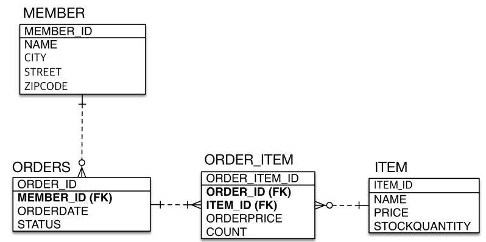
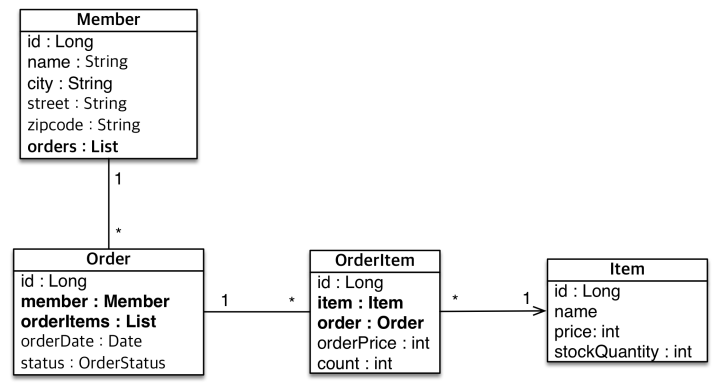

# 실전 예제 - 연관관계 매핑

## 테이블 구조

<div align="center">
    
</div>
<br/>

## 객체 구조

 - 회원과 주문(1:N)
 - 주문과 주문 제품(1:N)
 - 주문 제품과 제품(N:1)

<div align="center">
    
</div>
<br/>

## 예제 코드

 - `Order`
    - 주문과 회원은 N:1 관계이다.
```java
@Getter @Setter
@Entity
@Table(name = "ORDERS")
public class Order {
    @Id @GeneratedValue
    @Column(name = "ORDER_ID")
    private Long id;

    @ManyToOne
    @JoinColumn(name = "MEMBER_ID")
    private Member member;

    private LocalDateTime orderDate;

    @Enumerated(EnumType.STRING)
    private OrderStatus status;

}
```

<br/>

 - `OrderItem`
    - 주문제품과 주문은 N:1 관계이다. 주문에 제품이 여러개
    - 주문제품과 제품은 N:1 관계이다. 하나의 제품은 여러 주문에 사용된다.
```java
@Getter @Setter
@Entity
@Table(name = "ORDERS")
public class OrderItem {
    @Id @GeneratedValue
    @Column(name = "ORDER_ITEM_ID")
    private Long id;

//    @Column(name = "ORDER_ID")
//    private Long orderId;

    @ManyToOne
    @JoinColumn(name = "ORDER_ID")
    private Order order;

//    @Column(name = "ITEM_ID")
//    private Long itemId;

    @ManyToOne
    @JoinColumn(name = "ITEM_ID")
    private Item item;

    private int orderPrice;
    private int count;

}
```

<br/>

Item에서는 OrderItem을 참조하지 않는다.  
주문 입장에서 상품이 어떤 것들이 있는지 중요하지만, 상품 입장에서는 어떤 주문에 사용되었는지 중요하지 않다.  

<br/>

## Member와 Order를 양방향 매핑

주문 테이블에 이미 MEMBER_ID를 FK로 갖고 있기 때문에, 해당 컬럼을 통해 조회하지 회원에서 주문으로 갈 필요는 없다.  

 - `Member`
```java
@Entity
public class Member {
    @Id @GeneratedValue
    @Column(name = "MEMBER_ID")
    private Long id;

    private String name;
    private String city;
    private String street;
    private String zipcode;

    @OneToMany(mappedBy = "member")
    private List<Order> orders;
}
```
<br/>

 - `Order`
```java
@Getter @Setter
@Entity
@Table(name = "ORDERS")
public class Order {
    @Id @GeneratedValue
    @Column(name = "ORDER_ID")
    private Long id;

    @ManyToOne
    @JoinColumn(name = "MEMBER_ID")
    private Member member;

    @OneToMany(mappedBy = "order")
    private List<OrderItem> orderItems = new ArrayList<>();

    private LocalDateTime orderDate;

    @Enumerated(EnumType.STRING)
    private OrderStatus status;

    public void addOrderItem(OrderItem orderItem) {
        orderItems.add(orderItem);
        orderItem.setOrder(this);
    }

}
```

<br/>

## 예제 코드

```java
Order order = new Order();
order.addOrderItem(new OrderItem());
```

