# 다양한 연관관계 매핑

 - 연관관계 매핑시 고려사항 3가지
 - 다대일(N:1)
 - 일대다(1:N)
 - 일대일(1:1)
 - 다대다(N:M)

<br/>

## 1. 연관관계 매핑시 고려사항 3가지

 - __다중성__
    - 다대일(N:1): @ManyToOne
    - 일대다(1:N): @OneToMany
    - 일대일(1:1): @OneToOne
    - 다대다(N:M): @ManyToMany
 - __단방향, 양방향__
    - 테이블
        - 외래 키 하나로 양쪽 조인 가능
        - 사실 방향이라는 개념이 없다.
    - 객체
        - 참조용 필드가 있는 쪽으로만 참조 가능
        - 한쪽만 참조하면 단방향
        - 양쪽이 서로 참조하면 양방향
 - __연관관계의 주인__
    - 테이블은 외래 키 하나로 두 테이블이 연관관계를 맺음
    - 객체 양방향 관계는 A->B, B->A 처럼 참조가 2군데
    - 객체 양방향 관계는 참조가 2군데가 있다. 둘 중 테이블의 외래 키를 관리할 곳을 지정해야 한다.
    - 연관관계의 주인: 외래 키를 관리하는 참조
    - 주인의 반대편: 외래 키에 영향을 주지 않음, 단순 조회만

<br/>

## 2. 다대일(N:1)

### 2-1.다대일 단방향

- 가장 많이 사용하는 연관 관계
- 다대일의 반대는 일대다
```java
@Entity
public class Member {
    @Id @GeneratedValue
    @Column(name = "MEMBER_ID")

    @ManyToOne
    @JoinColumn(name = "TEAM_ID")
    private Team team;

    ..
}
```

<div align="center">
    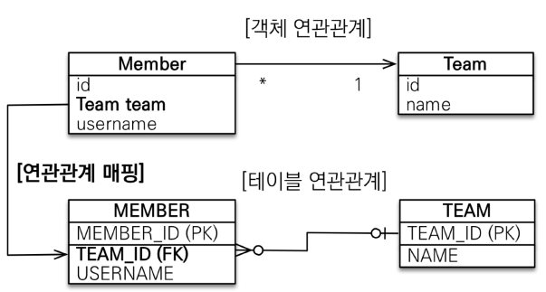
</div>
<br/>

### 2-2. 다대일 양방향

 - 외래 키가 있는 쪽이 연관관계의 주인
 - 양쪽을 서로 참조하도록 개발
```java
@Entity
public class Member {
    @Id @GeneratedValue
    @Column(name = "MEMBER_ID")
    private Long id;

    @ManyToOne
    @JoinColumn(name = "TEAM_ID")
    private Team team;

    ..
}

@Entity
public class Team {
    @Id @GeneratedValue
    @Column(name = "TEAM_ID")
    private Long id;

    @OneToMany(mappedBy = "team")
    private List<Member> members = new ArrayList<>();

    ..
}
```

<div align="center">
    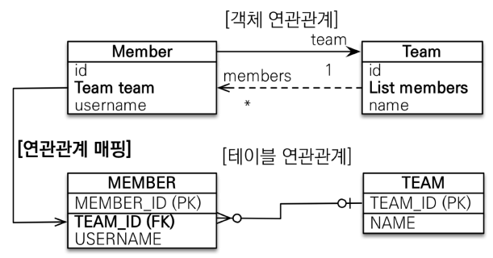
</div>
<br/>

## 3. 일대다(1:N)

### 3-1. 일대다 단방향

 - 일대다 단방향은 일대다(1:N)에서 일(1)이 연관관계의 주인
 - 테이블 일대다 관계는 항상 다(N) 쪽에 외래 키가 있음
 - 객체와 테이블의 차이 때문에 반대편 테이블의 외래 키를 관리하는 특이한 구조
 - @JoinColumn을 꼭 사용해야 함. 그렇지 않으면 조인 테이블 방식을 사용함(중간에 테이블을 하나 추가함)

<div align="center">
    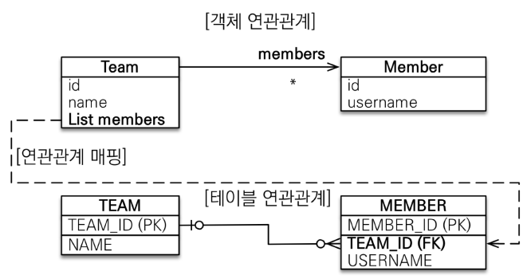
</div>
<br/>

#### 일대다 단방향 매핑의 단점

엔티티가 관리하는 외래 키는 보통 다(N) 테이블에 존재한다.  
연관관계 관리를 위해 추가로 UPDATE SQL이 실행된다.  
 - 일대다 단방향 매핑보다는 다대일 양방향 매핑을 사용하는 것이 권장된다.
```java
Member member = new Member();
member.setUsername("member1");
em.persist(member); // INSERT SQL

Team team = new Team();
team.setName("teamA");
team.getMembers().add(member);
em.persist(team); // Team INSERT SQL, Member UPDATE SQL 수행
```
<br/>

### 3-2. 일대다 양방향

일대다 양방향 매핑은 공식적으로 존재하지 않는다.  
@JoinColumn(insertable=false, updatable=false) 옵션으로 읽기 전용 필드를 사용해서 양방향처럼 사용할 수 있다.  
 - 다대일 양방향을 사용을 권장된다.

<div align="center">
    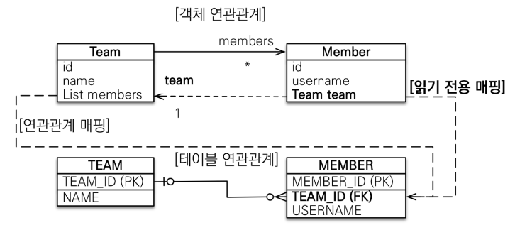
</div>
<br/>

## 4. 일대일(1:1)

 - 일대일 관계는 그 반대도 일대일
 - 주 테이블이나 대상 테이블 중에 외래 키 선택 가능
    - 주 테이블에 외래 키
    - 대상 테이블에 외래 키
 - 외래 키에 데이터베이스 유니크(UNI) 제약조건 추가

<br/>

### 4-1. 주 테이블에 외래 키 단방향

```java
@Entity
public class Locker {
    @Id @GeneratedValue
    @Column(name = "LOCKER_ID")
    private Long id;

    private Stirng name;
}

@Entity
public class Locker {
    @Id @GeneratedValue
    private Long id;

    private Stirng name;

    @OneToOne
    @JoinColumn(name = "LOCKER_ID")
    private Locker locker;
}
```

<div align="center">
    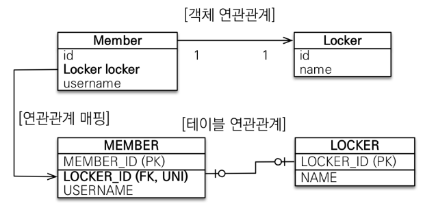
</div>
<br/>

### 4-2. 주 테이블에 외래 키 양방향

```java
@Entity
public class Locker {
    @Id @GeneratedValue
    @Column(name = "LOCKER_ID")
    private Long id;

    private Stirng name;

    // 해당 Member는 읽기 전용
    @OneToOne(mappedBy = "locker")
    private Member member;
}

@Entity
public class Locker {
    @Id @GeneratedValue
    private Long id;

    private Stirng name;

    @OneToOne
    @JoinColumn(name = "LOCKER_ID")
    private Locker locker;
}
```

<div align="center">
    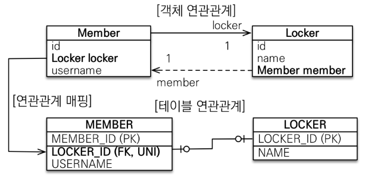
</div>
<br/>

### 4-3. 대상 테이블에 외래 키 단방향

대상 테이블에 외래 키 단방향 관계는 지원되지 않는다.  

<div align="center">
    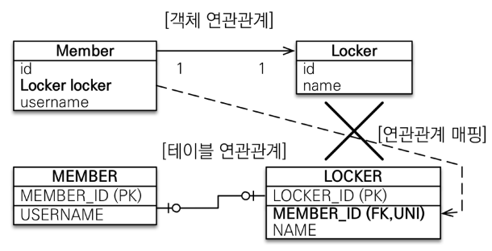
</div>
<br/>

### 4-4. 대상 테이블에 외래 키 양방향

일대일 주 테이블에 외래 키 양방향 매핑 방법과 동일하다.  

<div align="center">
    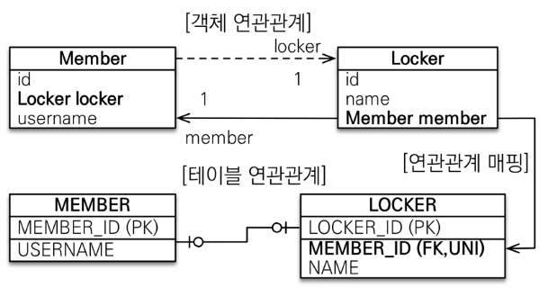
</div>
<br/>

### 4-5. 일대일 관계 정리

 - __주 테이블에 외래 키__
    - 주 객체가 대상 객체의 참조를 가지는 것 처럼 주 테이블에 외래 키를 두고 대상 테이블을 찾음
    - 객체지향 개발자 선호
    - JPA 매핑 편리
    - 장점: 주 테이블만 조회해도 대상 테이블에 데이터가 있는지 확인 가능
    - 단점: 값이 없으면 외래 키에 null 허용
 - __대상 테이블에 외래 키__
    - 대상 테이블에 외래 키가 존재
    - 전통적인 데이터베이스 개발자 선호
    - 장점: 주 테이블과 대상 테이블을 일대일에서 일대다 관계로 변경할 때 테이블 구조 유지
    - 단점: 프록시 기능의 한계로 지연 로딩으로 설정해도 항상 즉시 로딩됨

<br/>

## 5. 다대다(N:M)

관계형 데이터베이스는 정규화된 테이블 2개로 다대다 관계를 표현할 수 없다. 떄문에, 연결 테이블을 추가해서 일대다, 다대일 관계로 풀어내야한다.  

<div align="center">
    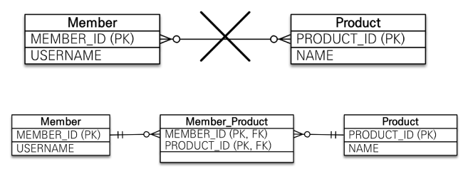
</div>
<br/>

객체는 컬렉션을 사용해서 객체 2개로 다대다 관계가 가능하다.  

<div align="center">
    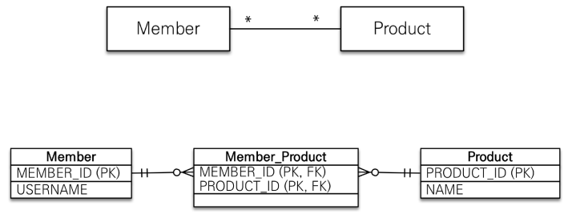
</div>
<br/>

### 5-1. 다대다

 - @ManyToMany 사용
 - @JoinTable로 연결 테이블 지정
 - 다대다 매핑: 단방향, 양방향 가능

```java
@Entity
public class Product {
    @Id @GeneratedValue
    private Long id;
    
    private String name;

    @ManyToMany(mappedBy = "products")
    private List<Member> members = new ArrayList<>();
}

@Entity
public class Member {
    @Id @GeneratedValue
    private Long id;

    @ManyToMany
    @JoinTable(name = "MEMBER_PRODUCT")
    private List<Product> products = new ArrayList<>();
}
```
<br/>

#### 다대다 매핑의 한계 및 극복

@ManyToMany는 편리해보이지만 실무에서는 사용할 수 없다.  
연결 테이블이 단순히 연결만하고 끝나지 않는다.  
떄문에, 다대다 관계인 경우에 연결 테이블을 엔티티로 승격시키는 방법을 사용한다.  
연결 테이블을 @OneToMany, @ManyToOne 연관 관계 매핑을 이용한다.  

```java
@Entity
public class Member {
    @Id @GeneratedValue
    private Long id;

    @OneToMany(mappedBy = "member")
    private List<Product> memberProducts = new ArrayList<>();
}

@Entity
public class MemberProduct {

    @Id @GeneratedValue
    private Long id;

    @ManyToOne
    @JoinColumn(name = "MEMBER_ID")
    private Member member;

    @ManyToOne
    @JoinColumn(name = "PRODUCT_ID")
    private Product product;

    private int count;
    private int price;
    private LocalDateTime orderDateTime;
}

@Entity
public class Product {
    @Id @GeneratedValue
    private Long id;
    
    private String name;

    @OneToMany(mappedBy = "product")
    private List<MemberProduct> members = new ArrayList<>();
}
```

<div align="center">
    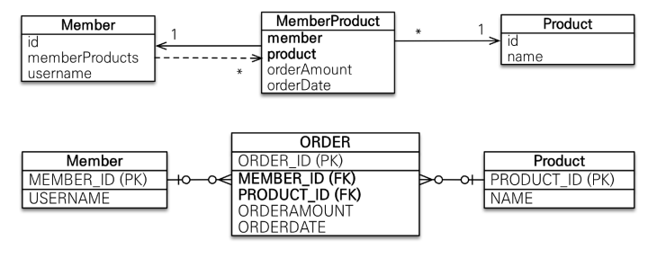
</div>
<br/>
