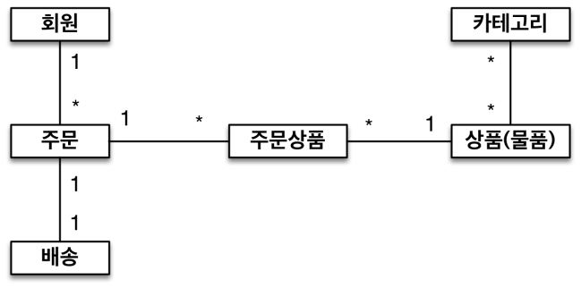
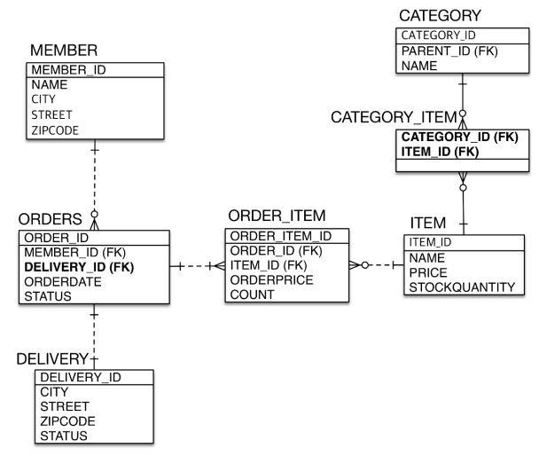
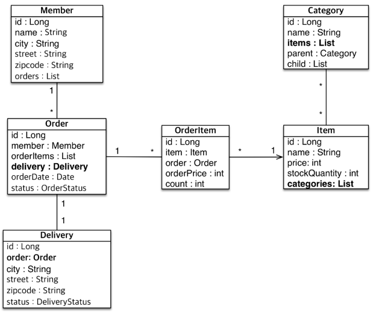

# 실전 예제 - 다양한 연관관계 매핑

 - 주문과 배송은 1:1(@OneToOne)
 - 상품과 카테고리는 N:M(@ManyToMany)

<div align="center">
    
</div>
<br/>

## 1. ERD

<div align="center">
    
</div>
<br/>

## 2. 엔티티 관계도

<div align="center">
    
</div>
<br/>

## 3. 코드

 - `Member`
```java
@Entity
public class Delivery {
    @Id @GeneratedValue
    @Column(name = "MEMBER_ID")
    private Long id;
    private String name;
    private String city;
    private String street;
    private String zipcode;

    @OneToMany(mappedBy = "member")
    private List<Order> orders = new ArrayList<>();
}
```
<br/>

 - `Delivery`
```java
@Entity
public class Delivery {
    @Id @GeneratedValue
    private Long id;
    private String city;
    private String street;
    private String zipcode;
    private DeliveryStatus status;

    @OneToOne(mappedBy = "delivery")
    private Order order; 
}

public enum DeliveryStatus{

}
```
<br/>

 - `Category`
```java
@Entity
public class Category {
    @Id @GeneratedValue
    private Long id;
    private String name;

    @ManyToOne
    @JoinColumn(name = "PARENT_ID")
    private Category parent;

    @OneToMany(mappedBy = "parent")
    private List<Category> child = new ArrayList<>();

    @ManyToMany
    @JoinTable(
        name = "CATEGORY_ITEM",
        joinColumns = @JoinColumn(name = "CATEGORY_ID"),
        inverseJoinColumns = @JoinColumn(name = "ITEM_ID")
    )
    private Li0st<Item> items = new ArrayList<>();
}
```
<br/>

 - `Order`
```java
@Entity
@Table(name = "ORDERS")
public class Order {
    @Id @GeneratedValue
    @Column(name = "ORDER_ID")
    private Long id;

    @ManyToOne
    @JoinColumn(name = "MEMBER_ID")
    private Member member;

    @OneToOne
    @JoinColumn(name = "DELIVERY_ID")
    private Delivery delivery;

    @OneToMany(mappedBy = "order")
    private List<OrderItem> orderItems = new ArrayList<>();

    private LocalDateTime orderDate;

    @Enumerated(EnumType.STRING)
    private OrderStatus status;
}
```
<br/>

 - `Item`
```java
@Entity
public class Item {
    @Id @GeneratedValue
    @Column(name = "ITEM_ID")
    private Long id;

    private String name;
    private int price;
    private int stockQuantity;

    @ManyToMany(mappedBy = "items")
    private List<Category> categories = new ArrayList();
}
```
<br/>

## 4. 활용 팁

### 다대다의 관계는 일대다, 다대일 관계로 사용한다.

 - 테이블의 N:M 관계는 중간 테이블을 이용해서 1:N, N:1
 - 실전에서는 중간 테이블이 단순하지 않다.
 - @ManyToMany는 제약: 필드 추가X, 엔티티 테이블 불일치
 - 실전에서는 @ManyToMany 사용X

<br/>

### JoinColumn 옵션

 - name: 매핑할 외래 키 이름
 - referencedColumnName: 외래 키가 참조하는 대상 테이블의 컬럼명
 - foreignKey(DDL): 외래키 제약조건을 직접 지정, 테이블 생성시에만 사용된다.
 - unique, nullable, insertable, updatable, columnDefinition, table: @Column의 속성과 동일

<br/>

### @ManyToOne 주요 속성

 - optional: false로 지정하면 연관된 엔티티가 항상 있어야 한다.
 - fetch: 글로벌 패치 전략을 설정한다.
 - cascade: 영속성 전이 기능을 사용한다.
 - targetEntity: 연관된 엔티티의 타입 정보를 설정한다.

<br/>

### @OneToMany 주요 속성

 - mappedBy: 연관 관계의 주인 필드를 선택한다.
 - fetch: 글로벌 패치 전략을 설정한다.
 - cascade: 영속성 전이 기능을 사용한다.
 - targetEntity: 연관된 엔티티의 타입 정보를 설정한다.

