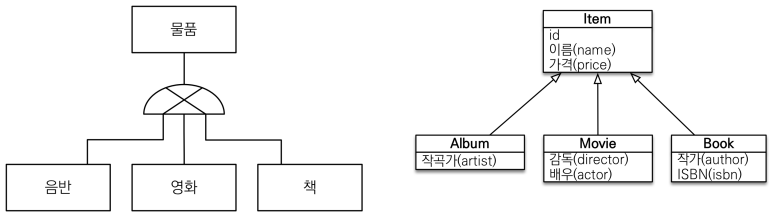
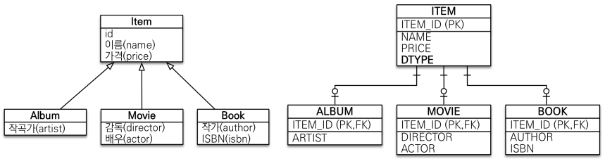
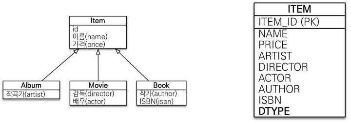
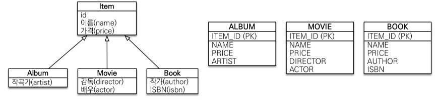

# 고급 매핑

 - 상속관계 매핑
 - @MappedSuperclass

<br/>

## 1. 상속관계 매핑

관계형 데이터베이스는 상속 관계가 존재하지 않는다.  
슈퍼타입 서브타입 관계라는 모델링 기법이 객체 상속과 유사하다.  

상속관계 매핑은 객체의 상속과 DB의 슈퍼타입 서브타입 관계를 매핑하는 것이다.  

<div align="center">
    
</div>
<br/>

슈퍼타입 서브타입 논리 모델을 실제 물리 모델로 구현하는 방법은 3가지가 있다.  
 - 각각 테이블로 변환 -> 조인 전략
 - 통합 테이블로 변환 -> 단일 테이블 전략
 - 서브타입 테이블로 변환 -> 구현 클래스마다 테이블 전략

<br/>

### 1-1. 주요 어노테이션

 - @Inheritance(strategy=InheritanceType.XXX) 
    - JOINED: 조인 전략
    - SINGLE_TABLE: 단일 테이블 전략
    - TABLE_PER_CLASS: 구현 클래스마다 테이블 전략
 - @DiscriminatorColumn(name=“DTYPE”) 
 - @DiscriminatorValue(“XXX”)

<br/>

### 1-2. 조인 전략

슈퍼타입 테이블의 서브타입을 구분할 수 있는 컬럼을 주어 사용한다.  
 - 테이블이 정규화되어 있고, 외래 키 참조 무결성 제약조건을 활용 가능하다. 또한, 저장 공간이 효율화가 되어있따.
 - 조회시 조인을 많이 사용하여 성능이 저하될 수 있고, 조회 쿼리가 복잡해질 수 있다.

<div align="center">
    
</div>
<br/>

 - `엔티티 클래스`
```java
@Entity
@Inheritance(strategy = InheritanceType.JOINED)
@DiscriminatorColumn(name = "DTYPE")
public class Item {
    @Id @GeneratedValue
    private Long id;

    private String name;
    private int price;
}

@Entity
@DiscriminatorValue("Album")
public class Album extends Item {
    private String artist;
}

@Entity
@DiscriminatorValue("Movie")
public class Movie extends Item {
    private String director;
    private String actor;
}

@Entity
@DiscriminatorValue("Book")
public class Book extends Item {
    private String author;
    private String isbn;
}
```
<br/>

 - `예제`
```java
Movie movie = new Movie();
movie.setDirector("감독");
movie.setActor("배우");
movie.setName("영화명");
movie.setPrice(10000);
em.persist(movie); // Item INSERT, movie INSERT
```
<br/>

### 1-3. 단일 테이블 전략

테이블 하나의 모든 컬럼을 정의하여 사용한다.  
 - 조인이 필요 없으므로 일반적으로 조회 성능이 빠르고, 조회 쿼리가 단순하다.
 - 자식 엔티티가 매핑한 컬럼은 모두 NULL 허용
 - 단일 테이블에 모든 것을 저장하므로 테이블이 커질 수 있다. 상황에 따라서 조회 성능이 오히려 느려질 수 있다.

<div align="center">
    
</div>
<br/>

 - `엔티티 클래스`
    - 단순히 @Inheritance의 옵션을 SINGLE_TABLE 전략으로 명시하면 된다.
```java
@Entity
@Inheritance(strategy = InheritanceType.SINGLE_TABLE)
@DiscriminatorColumn(name = "DTYPE")
public class Item {
    @Id @GeneratedValue
    private Long id;

    private String name;
    private int price;
}
```
<br/>

### 1-4. 구현 클래스마다 테이블 전략

서브타입 테이블에서 모든 컬럼을 중복해서 사용한다.  

 - 서브 타입을 명확하게 구분해서 처리할 때 효과적이며, NOT NULL 제약 조건을 사용 가능하다.
 - 여러 자식 테이블을 함께 조회할 때 성능이 느리다.
 - 자식 테이블을 통합해서 쿼리하기가 어렵다.

<div align="center">
    
</div>
<br/>

 - `엔티티 클래스`
    - 슈퍼타입 클래스를 abstract class로 만들고, @Inheritance의 옵션을 TABLE_PER_CLASS 전략으로 명시하면 된다.
```java
@Entity
@Inheritance(strategy = InheritanceType.TABLE_PER_CLASS)
public abstract class Item {
    @Id @GeneratedValue
    private Long id;

    private String name;
    private int price;
}
```
<br/>

## 2. @MappedSuperclass

@MappedSuperclass 어노테이션은 공통 매핑 정보가 필요할 떄 사용할 수 있다.  
상속 관계가 아니라, 중복되는 필드에 대해서 부모 클래스에 정의하고 상속받아 사용할 수 있다.  
 - 상속관계 매핑 X
 - 엔티티 X, 테이블과 매핑 X
 - 부모 클래스를 상속 받는 자식 클래스에 매핑 정보만 제공
 - 조회, 검색 불가
 - 직접 생성해서 사용할 일이 없으므로 추상 클래스 권장

<br/>

해당 클래스는 테이블과 관계없고, 단순히 엔티티가 공통으로 사용하는 매핑 정보를 모으는 역할을 한다.  
 - 주로 등록일, 수정일, 등록자, 수정자 같은 전체 엔티티에서 공통으로 적용하는 정보를 모을 때 사용한다.

<br/>

### 예제 코드

 - ``
```java
@MappedSuperclass
public class BaseEntity {
    private String createdBy;
    private LocalDateTime createdDate;
    private String lastModifiedBy;
    private LocalDateTime lastModifiedDate;
}

@Entity
public class Member extends BaseEntity {
    ..
}

@Entity
public class Team extends BaseEntity {
    ..
}
```

