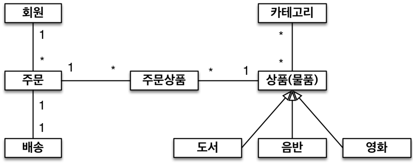
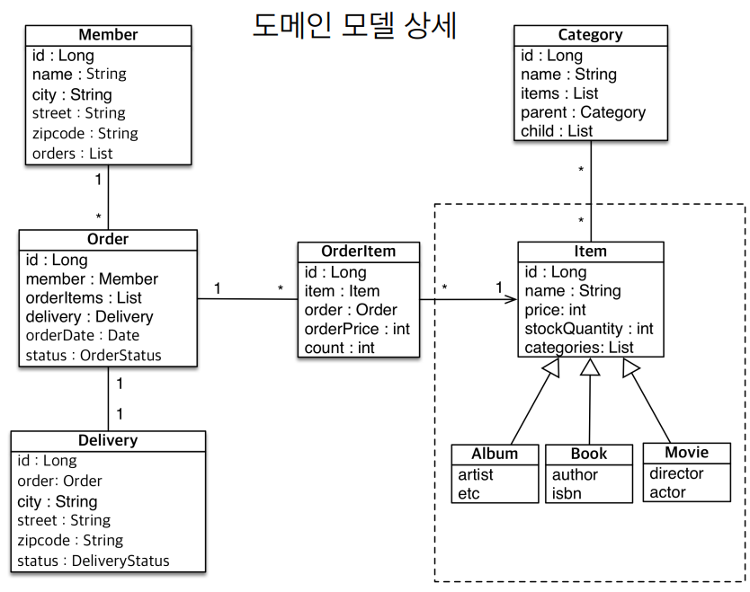
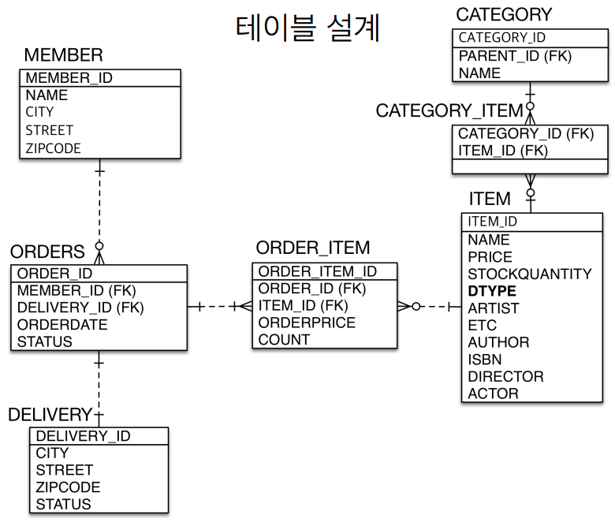

# 실전 예제 - 상속관계 매핑

 - 상품의 종류는 음반, 도서, 영화가 있고 더 확장될 수 있다.
 - 모든 데이터는 등록일과 수정일이 필수다.

<br/>

## 도메인 모델

<div align="center">
    <br/>
    
</div>
<br/>

## 테이블 설계

<div align="center">
    
</div>
<br/>

## 예제 코드

```java
@MappedSuperclass
public class BaseEntity {
    private String createdBy;
    private LocalDateTime createdDate;
    private String lastModifiedBy;
    private LocalDateTime lastModifiedDate;
}

@Entity
@Inheritance(strategy = InheritanceType.SINGLE_TABLE)
@DiscriminatorColumn(name = "DTYPE")
public abstract class Item extends BaseEntity {
    @Id @GeneratedValue
    @Column(name = "ITEM_ID")
    private Long id;

    private String name;
    private int price
    private int stockQuantity;
}

@Entity
public class Album extends Item {
    private String artist;
    private String etc;
}

@Entity
public class Book extends Item {
    private String author;
    private String isbn;
}

@Entity
public class Movie extends Item {
    private String director;
    private String actor;
}
```
