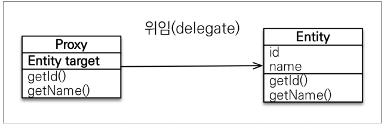
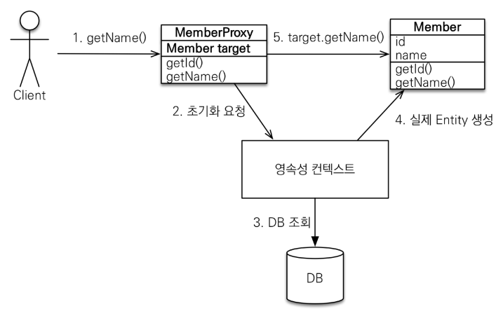
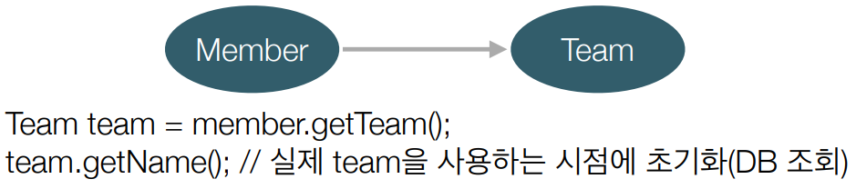

# 프록시와 연관관계 관리

 - 프록시
 - 즉시 로딩과 지연 로딩
 - 지연 로딩 활용
 - 영속성 전이: CASCADE
 - 고아 객체

<br/>

## 1. 프록시

JPA에서는 em.find()와 em.getReference() 메서드가 제공된다.  
em.find()는 데이터베이스를 통해서 실제 엔티티 객체를 조회하고, em.getReference()는 데이터베이스 조회를 미루는 가짜(프록시) 엔티티 객체를 조회한다.  

프록시는 실제 클래스를 상속받아서 만들어진다. 때문에, 실제 클래스와 모양이 같으며 사용하는 입장에서는 진짜 객체인지 프록시 객체인지 구분하지 않고 사용할 수 있다.  
 - 프록시 객체는 실제 객체의 참조(target)를 보관한다.
 - 프록시 객체를 호출하면 프록시 객체는 실제 객체의 메소드를 호출한다.

<div align="center">
    
</div>
<br/>

### 1-1. 프록시 초기화 시점

em.getReference() 메서드를 호출하면, 실제 DB에 SQL을 호출해 엔티티를 조회하지 않고 프록시(가짜) 객체를 반환한다.  
이후, 프록시 객체를 사용할 때 실제 DB에 SQL을 수행하여 데이터를 조회하고 프록시를 통한 원본 객체의 메서드를 호출하게 된다.  

```java
Member member = em.getReference(Member.class, “id1”);

// 프록시 객체를 사용할 때 DB 조회가 수행된다.
member.getName();
```

<div align="center">
    
</div>
<br/>

### 1-2. 프록시 특징

 - 프록시 객체는 처음 사용할 때 한 번만 초기화
 - 프록시 객체를 초기화할 때, 프록시 객체가 실제 엔티티로 바뀌는 것은 아니다. 초기화되면 프록시 객체를 통해서 실제 엔티티에 접근을 한다.
 - 프록시 객체는 원본 엔티티를 상속받는다. 따라서, 타입 체크시 주의해야한다. (== 비교 실패, instance of를 사용 권장)
 - 영속성 컨텍스트에 찾는 엔티티가 있으면 em.getReference()를 호출해도 실제 엔티티 반환
 - 영속성 컨텍스트의 도움을 받을 수 없는 준영속 상태일 때, 프록시를 초기화하면 문제가 발생한다. (Hibernate는 org.hibernate.LazyInitalizationException 예외 발생)

```java
Member m1 = em.find(Member.class, 1L);
Member m2 = em.find(Member.class, 2L);
Member m3 = em.getReference(Member.class, 3L);

System.out.println(m1.getClass() == m2.getClass()); // true
System.out.println(m1.getClass() == m3.getClass()); // false

System.out.println(m1 instanceof Member); // true
System.out.println(m3 instanceof Member); // true
```
<br/>

### 1-3. 프록시 확인

```java
// 프록시 인스턴스의 초기화 여부 확인
PersistenceUnitUtil.isLoaded(Object entity);
emf.getPersistenceUnitUtil().isLoaded(refMember);

// 프록시 클래스 확인 방법
// 출력(..javasist.. or HibernateProxy…)
entity.getClass().getName();

// 프록시 강제 초기화
org.hibernate.Hibernate.initialize(entity);

// JPA 표준 스팩에는 프록시 객체 초기화가 없다.
// 때문에, 초기화를 원하는 경우 프록시 객체를 사용해야 한다.
member.getName();
```
<br/>

## 2. 즉시 로딩과 지연 로딩

JPA는 연관관계가 있는 모든 데이터를 한 번에 조회하지 않고, 사용할 떄가 되서야 DB에 조회하는 지연 로딩을 제공한다.  

<br/>

### 2-1. 지연 로딩 예시

 - `회원 엔티티`
    - Fetch 전략을 FetchType.LAZY로 지정한다.
```java
@Entity
public class Member {
    @Id GeneratedValue
    private Long id;
    private String name;

    @ManyToOne(fetch = FetchType.LAZY)
    @JoinColumn(name = "TEAM_ID")
    private Team team;
}
```
<br/>

 - `회원과 팀을 사용`
    - em.find() 메서드 수행시 Member 테이블만 조회한다.
        - 이떄, Team 필드는 Proxy 객체가 된다.
    - member.getTeam() 수행시 Proxy 객체가 반환된다.
    - Proxy 객체인 team의 team.getName() 수행시 실제 DB에 Team 정보를 조회한다.
```java
Member member = em.find(Member.class, memberId);
Team team = member.getTeam();
System.out.println("회원 이름: " + member.getUsername());
System.out.println("소속팀: " + team.getName()); 
```
<br/>

 - `회원만 사용`
    - Member 테이블을 조회하고, Team 테이블은 조회하지 않는다.
```java
Member member = em.find(Member.class, memberId);
Team team = member.getTeam();
System.out.println("회원 이름: " + member.getUsername());
```
<br/>

<div align="center">
    
</div>
<br/>

### 2-2. 즉시 로딩

만약, 연관관계 정보를 모두 사용하는 경우가 많을 때는 즉시 로딩을 이용할 수 있다. 모두 사용하는 경우에 DB 조회를 여러번 하는 것보다는 한 번에 정보를 조회하여 사용하는 것이 좋다.  
 - JPA 구현체는 가능하면 조인을 사용해서 SQL 한 번에 함께 조회한다.
 - Member와 Team 정보를 Join 문법을 이용하여 한 번에 조회한다. (네트워크 1번)

```java
@Entity
public class Member {
    @Id GeneratedValue
    private Long id;
    private String name;

    @ManyToOne(fetch = FetchType.EAGER)
    @JoinColumn(name = "TEAM_ID")
    private Team team;
}
```
<br/>

### 2-3. 프록시와 즉시로딩 Tip

 - 가급적 지연 로딩만 사용(특히 실무에서) 
 - 즉시 로딩을 적용하면 예상하지 못한 SQL이 발생
 - 즉시 로딩은 JPQL에서 N+1 문제를 일으킨다.
    - SELECT m FROM Member m 수행시
        - Member와 Team이 즉시 로딩이다.
        - JPQL -> SQL로 변환되어 수행된다. Member만을 조회하였다. 즉시 로딩으로 Team을 한 번더 조회하게 된다.
        - JOIN FETCH 문법을 사용하여 해결 가능
 - @ManyToOne, @OneToOne은 기본이 즉시 로딩
 - @OneToMany, @ManyToMany는 기본이 지연 로딩

<br/>

### 2-4. 지연 로딩 활용

Member와 Team은 자주 함께 사용된다. -> __즉시 로딩__  
Member와 Order는 가끔 사용된다. -> __지연 로딩__  
Order와 Product는 자주 함께 사용된다. -> __즉시 로딩__

<br/>

### 2-5. 지연 로딩 실무 활용

__모든 연관관계에 지연 로딩을 사용한다.__  
실무에서는 즉시 로딩을 사용하지 않는다.  
 - JPQL fetch 조인이나, 엔티티 그래프 기능을 사용한다.

<br/>

## 3. 영속성 전이(CASCADE)와 고아 객체

### 3-1. 영속성 전이(CASCADE)

특정 엔티티를 영속 상태로 만들 때 연관된 엔티티도 함께 영속 상태로 만들고 싶을 때 사용한다.  
즉, 부모 엔티티를 저장할 때 자식 엔티티도 함께 저장되는 것을 원할 때 사용한다.  
 - 영속성 전이(Cascade)는 연관관계 매핑과는 아무 관련이 없다.
 - 단순히 엔티티를 영속화할 때 연관된 엔티티도 함께 영속화하는 편리함만 제공한다.
 - __자식 엔티티를 부모 엔티티 하나에서만 관리할 때 사용할 수 있다.__
    - 게시글과 첨부파일: 해당 게시글만이 해당 첨부파일을 관리한다.
    - 만약, 자식 엔티티가 하나의 부모 엔티티가 아니라 여러 부모 엔티티를 가질 수 있다면 사용하면 안 된다.
    - 단일 엔티티에 종속적일 때(라이프 사이클이 같을 떄) 사용한다.

#### 영속성 전이 예제

 - `엔티티 클래스`
```java
@Entity
public class Parent {
    @Id @GeneratedValue
    private Long id;

    private String name;

    @OneToMany(mappedBy = "parent")
    private List<Child> childList = new ArrayList<>();

    // 연관관계 편의 메서드
    public void addChild(Child child) {
        childList.add(child);
        child.setParent(this);
    }
}

@Entity
public class Child {
    @Id @GeneratedValue
    private Long id;

    private String name;

    @ManyToOne
    @JoinColumn(name = "parent_id")
    private Parent parent;
}
```
<br/>

 - `DB 저장`
    - DB에 저장하기 위해서는 child1, child2, parent 전부 em.persist()를 호출해주어야 한다.
```java
Child child1 = new Child();
Child child2 = new Child();

Parent parent = new Parent();
parent.addChild(child1);
parent.addChild(child2);

em.persist(parent);
em.persist(child1);
em.persist(child2);
```
<br/>

#### Cascade 지정

```java
@Entity
public class Parent {
    @Id @GeneratedValue
    private Long id;

    private String name;

    @OneToMany(mappedBy = "parent", cascade = CascadeType.ALL)
    private List<Child> childList = new ArrayList<>();

    ..
}

// DB 저장: Parent 저장시 child1과 child2 모두 저장된다.
Child child1 = new Child();
Child child2 = new Child();

Parent parent = new Parent();
parent.addChild(child1);
parent.addChild(child2);

em.persist(parent);
```
<br/>

#### 영속성 전이(CASCADE) 종류

 - ALL: 모두 적용
 - PERSIST: 영속 (저장할 때만)
 - REMOVE: 삭제 (삭제할 때만)
 - MERGE: 병합
 - REFRESH: REFRESH
 - DETACH: DETACH

<br/>

### 3-2. 고아 객체

고아 객체는 부모 엔티티와 연관 관계가 끊어진 자식 엔티티를 말한다.  
orphanRemoval 옵션을 통해 객체내에서 연관관계가 끊어질 때 자동으로 DELETE SQL이 수행되도록 할 수 있다.  

<br/>

 - `엔티티 클래스`
```java
@Entity
public class Parent {
    @Id @GeneratedValue
    private Long id;

    private String name;

    @OneToMany(mappedBy = "parent", cascade = CascadeType.ALL, opphanRemoval = true)
    private List<Child> childList = new ArrayList<>();

    ..
}

// 사용 예시
Child child1 = new Child();
Child child2 = new Child();

Parent parent = new Parent();
parent.addChild(child1);
parent.addChild(child2);

em.persist(parent);
em.flush();
em.clear();

Parent findParent = em.find(Parent.class, parent.getId());
findParent.getChildList().remove(0); // opphanRemoval 옵션이 설정되어 DELETE 쿼리가 수행된다.
```
<br/>

#### 고아 객체 주의사항

고아 객체 기능은 참조가 제거된 엔티티를 다른 곳에서 참조하지 않는 고아 객체로 보고 삭제하는 기능이다.  
 - __참조하는 곳이 하나일 때 사용해야 한다.__
 - __특정 엔티티가 개인 소유할 떄 사용한다.__
 - __@OneToOne, @OneToMany만 사용 가능하다.__
 - 개념적으로 부모를 제거하면 자식은 고아가 된다. 따라서, 고아 객체 제거 기능을 활성화하면, 부모를 제거할 떄 자식도 함께 제거된다. (CascadeType.REMOVE 처럼 동작)

<br/>

### 3-3. 영속성 전이와 고아 객체 동시 사용

CascadeType.ALL, orphanRemoval=true 옵션을 모두 설정한다.  
 - 두 옵션을 모두 활성화하면 부모 엔티티를 통해서 자식의 생명 주기를 관리할 수 있다.
    - 부모 엔티티에서 persist() 호출할 때 자식도 함께 저장된다.
    - 부모 엔티티가 삭제되면 자식도 함께 삭제된다.
    - 부모 엔티티에서 자식 객체에 접근하여 삭제할 수 있다.
 - 도메인 주도 설계(DDD)의 Aggregate Root 개념을 구현할 때 유용하다.

