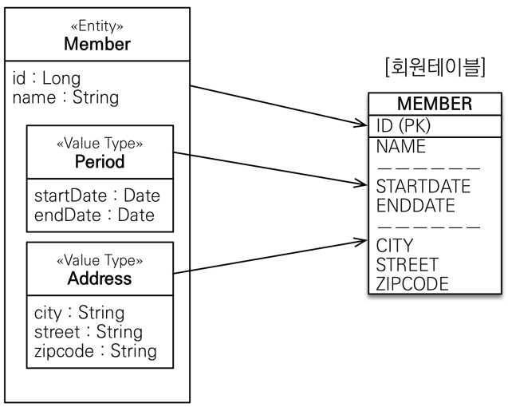
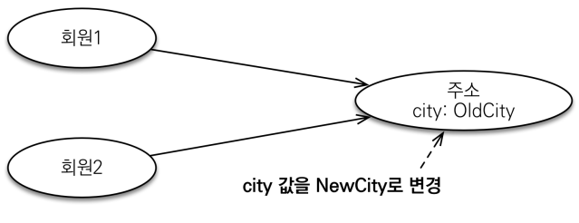
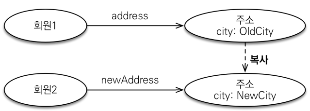
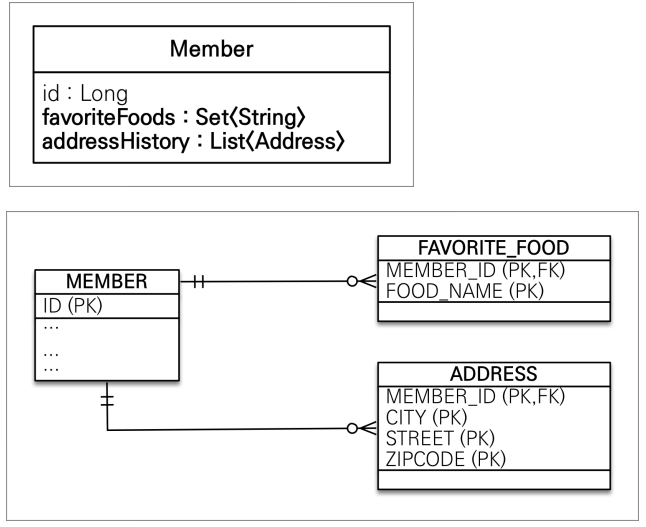

# 값 타입

 - 기본값 타입
 - 임베디드 타입(복합 값 타입) 
 - 값 타입과 불변 객체
 - 값 타입의 비교
 - 값 타입 컬렉션

<br/>

## 1. 기본값 타입

### 1-1. JPA의 데이터 타입 분류

 - __엔티티 타입__
    - @Entity로 정의하는 객체
    - 데이터가 변해도 식별자로 지속해서 추적 가능
    - ex) 회원 엔티티의 키나 나이 값을 변경해도 식별자로 인식 가능
 - __값 타입__
    - int, Integer, String 처럼 단순히 값으로 사용하는 자바 기본 타입이나 객체
    - 식별자가 없고 값만 있으므로 변경시 추적 불가
    - ex) 숫자 100을 200으로 변경하면 완전히 다른 값으로 대체

<br/>

### 1-2. 값 타입 분류

 - __기본값 타입__
    - 자바 기본 타입(int, double)
    - 래퍼 클래스(Integer, Long)
    - String
 - __임베디드 타입(복합 값 타입)__
 - __컬렉션 값 타입__

<br/>

### 1-3. 기본값 타입

생명주기를 엔티티에 의존한다. 예를 들어, 회원 엔티티를 삭제하면 이름, 나이 필드도 함께 삭제된다.  
 - 값 타입은 공유하면 안 된다.
 - Java에서 기본 타입은 항상 값을 복사한다.
 - Integer나 Long 같은 래퍼 클래스, String 같은 특수한 클래스는 공유 가능한 객체이지만 값을 변경할 수 없다. (사이드 이팩트가 없다.)
```java
// 기본 타입
int a = 10;
int b = a; // b에 a의 값 할당
a = 20; // a에 10 할당

System.out.println(a); // a는 20
System.out.println(b); // b는 10

// 래퍼 클래스
Integer c = new Integer(10);
Integer d = c;
```
<br/>

## 2. 임베디드 타입

JPA는 임베디드 타입이라고 하는 새로운 값 타입을 직접 정의할 수 있다. 주로 기본 값 타입을 모아서 만들어서 복합 값 타입이라고 한다.  

<br/>

### 2-1. 임베디드 타입 사용법

임베디드 타입을 사용하기 위해서는 @Embeddable, @Embedded 어노테이션을 이용한다.  
 - @Embeddable: 값 타입을 정의하는 곳에 표시
 - @Embedded: 값 타입을 사용하는 곳에 표시
 - 기본 생성자가 필수로 있어야 한다.

<br/>

### 2-2. 임베디드 타입의 장점

 - 재사용
 - 높은 응집도
 - Period.isWork()처럼 해당 값 타입만 사용하는 의미 있는 메소드를 만들 수 있음
 - 임베디드 타입을 포함한 모든 값 타입은, 값 타입을 소유한 엔티티에 생명주기를 의존함

<br/>

### 2-3. 임베디드 타입 예시

<div align="center">
    
</div>
<br/>

 - `엔티티 클래스`
```java
@Entity
public class Member extends BaseEntity {
    @Id @GeneratedValue
    private Long id;
    private String name;

    @Embedded
    private Period period;

    @Embedded
    private Address address;
}

@Embeddable
public class Period {
    private LocalDateTime startDate;
    private LocalDateTime endDate;
}

@Embeddable
public class Address {
    private String city;
    private String street;
    private String zipcode;
}
```
<br/>

 - `사용 예시`
```java
Member member = new Member();
member.setName("김철수");
member.setAddress(new Address("city", "street", "zipcode"));
member.setPeriod(new Period());
em.persist(member);
```
<br/>

### 2-4. 한 엔티티에서 같은 값 타입을 사용하는 경우

하나의 엔티티에 동일한 임베디드 타입을 2번 이상 사용하는 경우 컬럼명이 중복되게 된다.  
이러한 경우 @AttributeOverrides, @AttributeOverride를 사용해서 컬럼 명 속성을 재정의할 수 있다.  

```java
@Entity
public class Member extends BaseEntity {
    @Id @GeneratedValue
    private Long id;
    private String name;

    @Embedded
    private Period period;

    @Embedded
    private Address homeAddress;

    @Embedded
    @AttributeOverrides({
        @AttributeOverride(name="city", column=@Column(name = "WORK_CITY")),
        @AttributeOverride(name="street", column=@Column(name = "WORK_STREET")),
        @AttributeOverride(name="zipcode", column=@Column(name = "WORK_ZIPCODE"))
    })
    private Address workAddress;
    
}
```
<br/>

## 3. 값 타입과 불변 객체

값 타입은 복잡한 객체 세상을 조금이라도 단순화하려고 만든 개념이다. 따라서 값 타입은 단순하고 안전하게 다룰 수 있어야 한다.  

 - __값 타입 공유 참조__
    - 임베디드 타입 같은 값 타입을 여러 엔티티에서 공유하면 위험하다.
    - 부작용(Side Effect) 발생

<div align="center">
    
</div>
<br/>

 - __값 타입 복사__
    - 값 타입의 실제 인스턴스인 값을 공유하는 것은 위험하다.
    - 대신 값(인스턴스)를 복사해서 사용한다.

<div align="center">
    
</div>
<br/>

### 3-1. 객체 타입의 한계

항상 값을 복사해서 사용하면 공유 참조로 인해 발생하는 부작용을 피할 수 있다. 하지만, 임베디드 타입처럼 직접 정의한 값 타입은 객체 타입으로, 컴파일 레벨에서 참조 값을 직접 대입한 것을 막을 수 없다.  

```java
// 기본 타입
int a = 10;
int b = a; // 기본 타입은 값을 복사
b = 4;

// 객체 타입
Address c = new Address("city");
Address d = c; // 객체 타입은 참조를 전달
c.setCity("newCity");
```
<br/>

### 3-2. 불변 객체

불변 객체는 생성시점에만 값을 설정하고, 이후에 값을 변경할 수 없도록 만든다.  

 - 객체 타입을 수정할 수 없게 만들면 부작용을 원천 차단
 - 값 타입은 불변 객체(immutable object)로 설계해야함
 - 불변 객체: 생성 시점 이후 절대 값을 변경할 수 없는 객체
 - 생성자로만 값을 설정하고 수정자(Setter)를 만들지 않으면 됨
 - 참고: Integer, String은 자바가 제공하는 대표적인 불변 객체

<br/>

## 4. 값 타입 비교

값 타입은 인스턴스가 달라도 그 안에 값이 같으면 같은 것으로 보아야 한다.  

```java
int a = 10;
int b = 10;
System.out.println(a == b); // true

Address address1 = new Address("서울시");
Address address2 = new Address("서울시");
System.out.println(address1 == address2); // false
```
<br/>

### 4-1. 값 타입의 비교

 - 동일성(identity) 비교: 인스턴스의 참조 값을 비교, == 사용
 - 동등성(equivalence) 비교: 인스턴스의 값을 비교, equals() 사용
 - 값 타입은 a.equals(b)를 사용해서 동등성 비교를 해야 함
 - 값 타입의 equals() 메소드를 적절하게 재정의(주로 모든 필드 사용)

equals()의 기본 구현은 == 비교를 사용하게 되어있다.  
떄문에, 임베디드 타입처럼 새로 만들어진 값 타입은 equals()와 hashCode() 메서드를 Override 해야 한다.  

<br/>

## 5. 값 타입 컬렉션

값 타입을 하나 이상 저장할 때 사용한다.  
 - @ElementCollection, @CollectionTable 어노테이션을 사용
 - 데이터베이스는 컬렉션을 같은 테이블에 저장할 수 없다.
 - 컬렉션을 저장하기 위한 별도의 테이블이 필요하다.

<div align="center">
    
</div>
<br/>

### 5-1. 값 타입 컬렉션 예시

값 타입 컬렉션은 지연 로딩 전략이 사용된다.  
또한, 값 타입 컬렉션은 영속성 전이(Cascade)와 고아 객체 제거 기능이 필수적으로 사용된다.  
 - 값 타입 컬렉션의 라이프 사이클은 사용되는 엔티티에 의해 관리된다.

```java
@Entity
public class Member {
    @Id @GeneratedValue
    @Column(name = "MEMBER_ID")
    private Long id;

    private String name;

    @Embedded
    private Address homeAddress;

    @ElementCollection
    @CollectionTable(
        name = "FAVORITE_FOOD", 
        joinColumns = @JoinColumn(name = "MEMBER_ID")
    )
    @Column(name = "FOOD_NAME")
    private Set<String> favoriteFoods = new HashSet<>();

    @ElementCollection
    @CollectionTable(
        name = "ADDRESS",
        joinColumns = @JoinColumn(name = "MEMBER_ID")
    )
    private List<Address> addressHistory = new ArrayList<>();
}

// 사용 예시
Member member = new Member();
member.setName("member1");
member.setHomeAddress(new Address("homeCity", "street", "12345"));

member.getFavoriteFoodes().add("치킨");
member.getFavoriteFoodes().add("피자");
member.getFavoriteFoodes().add("족발");

member.getAddressHistory.add(new Address("old1", "street", "12345"));
member.getAddressHistory.add(new Address("old2", "street", "12345"));

em.persist(member);
// MEMBER Insert
// ADDRESS Insert * 2
// FAVORITE_FOOD Insert * 3

em.flush();
em.clear();
// 값 타입 컬렉션 수정
Member findMember = em.find(Member.class, member.getId());

// homeCity -> newCity
Address a = findMember.getHomeAddress();
findMember.setHomeAddress(new Address("newCity", a.getStreet(), a.getZipcode()));

// 치킨 -> 한식
findMember.getFavoriteFoods().remove("치킨");
findMember.getFavoriteFoods().add("한식");

// old1 -> newCity1
// 콜렉션 타입은 기본적으로 equals()를 통해 해당 객체를 제거한다. 떄문에, equals()와 hash() 코드를 구현하고 동일한 값을 가진 객체를 제거해주도록 한다.
    // INSERT SQL이 List의 갯수만큼 등록된다.
findMember.getAddressHistory().remove(new Address("old1", "street", "12345"));
findMember.getAddressHistory().add(new Address("newCity1", "street", "12345"));
```
<br/>

### 5-2. 값 타입 컬렉션 제약사항

값 타입은 엔티티와 다르게 식별자 개념이 없다. 또한, 값을 변경하면 추적이 어렵다.  
 - 값 타입 컬렉션에 변경 사항이 발생하면, 주인 엔티티와 연관된 데이터를 모두 삭제하고, 값 타입 컬렉션에 있는 현재 값을 모두 다시 저장한다.
 - 값 타입 컬렉션을 매핑하는 테이블은 모두 컬럼을 묶어서 기본 키를 구성해야 한다. (NULL 불허용, 중복 저장 X)

<br/>

### 5-3. 값 타입 컬렉션 대안

 - 실무에서는 상황에 따라 값 타입 컬렉션 대신에 일대다 관계를 고려
 - 일대다 관계를 위한 엔티티를 만들고, 여기에서 값 타입을 사용
 - 영속성 전이(Cascade) + 고아 객체 제거를 사용해서 값 타입 컬렉션 처럼 사용

```java
@Entity
@Table(name = "ADDRESS")
public class AddressEntity {
    @Id @GeneratedValue
    private Long id;

    private Address address;
}

@Entity
public class Member {
    @Id @GeneratedValue
    private Long id;

    ..

    @OneToMany(cascade = CascadeType.ALL, orphanRemoval = true)
    @JoinColumn(name = "MEMBER_ID")
    private List<AddressEntity> addressHistory = new ArrayList<>();
}
```
<br/>

## 6. 정리

값 타입은 정말 값 타입이라 판단될 때만 사용한다.  
엔티티와 값 타입을 혼동해서 엔티티를 값 타입으로 만들면 안 된다.  
식별자가 필요하고, 지속해서 값을 추적, 변경해야 한다면 그것은 값 타입이 아닌 엔티티로 사용한다.  

 - __엔티티 타입의 특징__
    - 식별자O 
    - 생명 주기 관리
    - 공유
 - __값 타입의 특징__
    - 식별자X 
    - 생명 주기를 엔티티에 의존
    - 공유하지 않는 것이 안전(복사해서 사용) 
    - 불변 객체로 만드는 것이 안전
