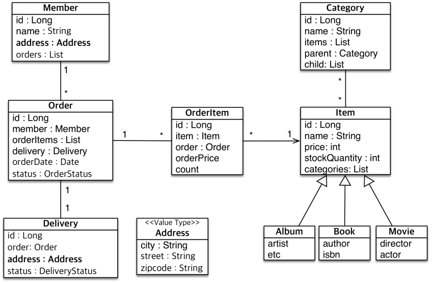

# 실전 예제 - 값 타입 매핑

<div align="center">
    
</div>
<br/>

## 예제 코드


```java
@Embeddable
public class Address {
    private String city;
    private String street;
    private String zipcode;

    // Getter, equals, hashCode
}

@Entity
public class Member extends BaseEntity {
    @Id GeneratedValue
    @Column(name = "MEMBER_ID")
    private Long id;

    @Embedded
    private Address address;

    @OneToMany(mappedBy = "member")
    private List<Order> orders = new ArrayList<>();

    // Getter, Setter, equals, hashCode
}

@Entity
public class Delivery extends BaseEntity {
    @Id GeneratedValue
    private Long id;

    @Embedded
    private Address address;

    @OneToOne(mappedBy = "delivery", fetch = FetchType.LAZY)
    private Order order;

    // Getter, Setter, equals, hashCode
}
```
