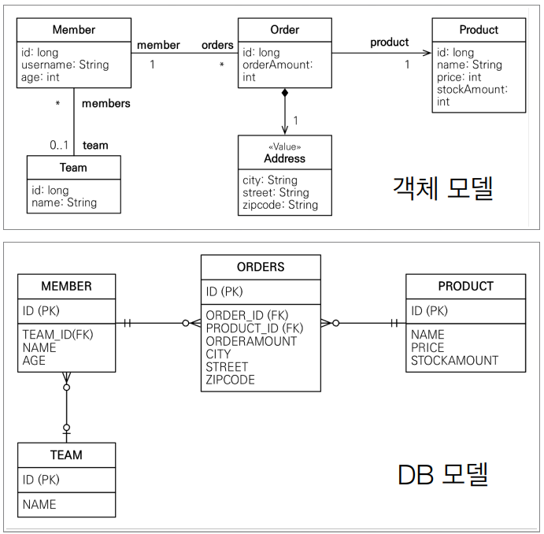

# 예제 모델

<div align="center">
    
</div>
<br/>

```java
@Entity
public class Member {
    @Id @GeneratedValue
    private Long id;
    private String username;
    private int age;

    @ManyToOne
    @JoinColumn(name = "TEAM_ID")
    private Team team;

    // Getter, Setter
}

@Entity
public class Team {
    @Id @GeneratedValue
    private Long id;
    private String name;

    @OneToMany(mappedBy = "team")
    private List<Member> members = new ArrayList<>();

    // Getter, Setter
}

@Entity
@Table(name = "ORDERS")
public class Order {
    @Id @GeneratedValue
    private Long id;
    private int orderAmount;

    @Embedded
    private Address address;

    @ManyToOne
    @JoinColumn(name = "PRODUCT_ID")
    private Product product;

    // Getter, Setter
}

@Entity
public class Product {
    @Id @GeneratedValue
    private Long id;
    private String name;
    private int price;
    private int stockAmount;

    // Getter, Setter
}
```

 - `값 타입`
```java
@Embeddable
public class Address {
    private String city;
    private String street;
    private String zipcode;

    // Getter, Setter
}
```
