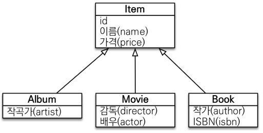

# 객체지향 쿼리 언어 - 중급 문법

## 1. 경로 표현식

경로 표현식은 .(점)을 찍어 객체 그래프를 탐색하는 것을 말한다.  
 - 상태 필드(state field): 단순히 값을 저장하기 위한 필드
    - ex: m.username
 - 연관 필드(association field): 연관관계를 위한 필드
    - 단일 값 연관 필드:
        - @ManyToOne, @OneToOne, 대상이 엔티티
        - ex: m.team
    - 컬렉션 값 연관 필드:
        - @OneToMany, @ManyToMany, 대상이 컬렉션
        - ex: m.orders
```
select m.username -> 상태 필드
 from Member m 
 join m.team t -> 단일 값 연관 필드
 join m.orders o -> 컬렉션 값 연관 필드
where t.name = '팀A'
```
<br/>

### 1-1. 경로 표현식 특징

 - __상태 필드(state field): 경로 탐색의 끝, 탐색X__
```sql
-- JPQL
select m.username, m.age from Member m

-- SQL
select m.username, m.age from Member m
```
<br/>

 - __단일 값 연관 경로: 묵시적 내부 조인(inner join) 발생, 탐색O__
    - 명시적 조인은 JOIN 키워드를 직접 사용한 경우를 말한다.
    - 묵시적 조인은 경로 표현식에 의해 묵시적으로 SQL 조인이 발생한 경우를 말한다.
    - 묵시적 조인은 내부 조인만 가능하다.
```sql
-- JPQL
select o.member from Order o -- 묵시적 조인
select m from Member m join m.team t -- 명시적 조인

-- SQL
select m.* 
 from Orders o 
 inner join Member m on o.member_id = m.id
```
<br/>

 - __컬렉션 값 연관 경로: 묵시적 내부 조인 발생, 탐색X__
    - 컬렉션으로 조회되기 때문에, 어떤 요소의 필드를 접근하는 지 알 수 없다. 떄문에 탐색이 불가능하다.
    - FROM 절에서 명시적 조인을 통해 별칭을 얻으면 별칭을 통해 탐색 가능
```sql
-- JPQL
select t.members from Team t

-- SQL
select m.*
 from Team t
 inner join Member m on t.id = m.team_id
```
<br/>

### 1-2. 경로 표현식 예제

```sql
select o.member.team from Order o -- ✔
select t.members from Team -- ✔
select t.members.username from Team t -- ❌
select m.username from Team t join t.members m -- ✔
```
<br/>

### 1-3. 경로 탐색 묵시적 조인 주의사항

 - 항상 내부 조인이 발생한다.
 - 컬렉션은 경로 탐색의 끝, 명시적 조인을 통해 별칭을 얻어야 한다.
 - 경로 탐색은 주로 SELECT, WHERE 절에서 사용하지만 묵시적 조인으로 인해 SQL의 FROM(JOIN) 절에 영향을 준다.

<br/>

### 1-4. 실무 Tip

__가급적 묵시적 조인 대신에 명시적 조인을 사용한다.__
 - 조인은 SQL 튜닝에 중요 포인트
 - 묵시적 조인은 조인이 일어나는 상황을 한 눈에 파악하기 어렵다.

<br/>

## 2. JPQL 패치 조인(Fetch Join)

패치 조인은 JPQL에서 성능 최적화를 위해 제공하는 기능으로 연관된 엔티티나 컬렉션을 SQL 한 번에 함께 조회하는 기능이다.  
 - JOIN FETCH 명령어 사용
 - 페치 조인 ::= [ LEFT [OUTER] | INNER ] JOIN FETCH 조인경로

<br/>

### 2-1. 엔티티 패치 조인

 - 회원을 조회하면서 연관된 팀도 함께 조회(SQL 한번에)
```sql
-- JPQL
SELECT m 
FROM Member m 
    JOIN FETCH m.team

-- SQL
SELECT M.*, T.* 
FROM MEMBER M
    INNER JOIN TEAM T ON M.TEAM_ID=T.ID
```
<br/>

 - 패치 조인 사용 코드
```java
// 패치 조인 JPQL 적용
String jpql = "select m from Member m join fetch m.team";
List<Member> members = em.createQuery(jpql, Member.class)
        .getResultList();

for (Member member : members) {
    //페치 조인으로 회원과 팀을 함께 조회해서 지연 로딩X
    System.out.println("username = " + member.getUsername() + ", " +
                        "teamName = " + member.getTeam().name()); 
}
```
<br/>

### 2-2. 컬렉션 패치 조인

 - 일대다 관계, 컬렉션 패치 조인
```sql
-- JPQL
select t
from Team t join fetch t.members
where t.name = '팀A'

-- SQL
SELECT T.*, M.*
FROM TEAM T
    INNER JOIN MEMBER M ON T.ID = M.TEAM_ID
WHERE T.NAME = '팀A'
```
<br/>

 - 컬렉션 패치 조인 사용 코드
```java
String jpql = "select t from Team t join fetch t.members where t.name = '팀A'"
List<Team> teams = em.createQuery(jpql, Team.class).getResultList();

for(Team team : teams) {
    System.out.println("teamname = " + team.getName() + ", team = " + team);
    for (Member member : team.getMembers()) {
        //페치 조인으로 팀과 회원을 함께 조회해서 지연 로딩 발생 안함
        System.out.println("-> username = " + member.getUsername()+ ", member = " + member);
    }
}
```
<br/>

### 2-3. 패치 조인과 DISTINCT

SQL의 DISTINCT는 중복된 결과를 제거하는 명령이다.  
JPQL의 DISTINCT는 2가지 기능을 제공한다.  
 - SQL에 DISTINCT를 추가
 - 애플리케이션에서 엔티티 중복 제거

<br/>

```sql
-- 일반 조인시 연관 엔티티를 사용하기 전까지는 기준 엔티티만을 조회한다.
-- Team의 갯수만큼 조회된다.
SELECT t
FROM Team t
    JOIN t.members

-- Team이 있는 Member의 갯수만큼 조회된다.
SELECT t
FROM Team t
    JOIN FETCH t.members

-- SQL 결과로는 조회된 데이터가 완전히 같은 값만 제거된다.
-- 애플리케이션에서 엔티티 중복까지 제거해서 반환해준다.
SELECT distinct t
FROM Team t
    JOIN FETCH t.members
```
<br/>

### 2-4. Hibernate6 변경 사항

Hibernate6 부터는 DISTINCT 명령어를 사용하지 않아도 애플리케이션에서 중복 제거가 자동으로 적용됩니다.  
 - 참고 링크: https://www.inflearn.com/questions/717679

<br/>

### 2-5. 패치 조인과 일반 조인의 차이

일반 조인을 실행할 때는 연관된 엔티티를 함께 조회하지 않는다.  
JOIN 키워드를 통해서 조회하지만, 기준 테이블 정보만을 조회한다.  
 - JPQL은 결과를 반환할 때 연관관계를 고려하지 않고, 단지 SELECT 절에 지정한 엔티티만 조회한다. (예제에서는 팀만을 조회하였다.)
 - 패치 조인을 사용할 때는 연관된 엔티티도 함께 조회(즉시 로딩)한다. 즉, 패치 조인은 객체 그래프를 SQL 한 번에 조회하는 개념이다.
```sql
-- [JPQL] 일반 조인
select t
from Team t join t.members m
where t.name = '팀A'

-- [SQL]
SELECT T.*
FROM TEAM T
INNER JOIN MEMBER M ON T.ID=M.TEAM_ID 
WHERE T.NAME = '팀A'

-- [JPQL] 패치 조인
select t 
from Team t join fetch t.members
where t.name = '팀A'

-- [SQL]
SELECT T.*, M.*
FROM TEAM T
INNER JOIN MEMBER M ON T.ID=M.TEAM_ID 
WHERE T.NAME = '팀A'
```
<br/>

## 3. JPQL 패치 조인 특징과 한계

 - __한계__
    - 패치 조인 대상에는 별칭을 줄 수 없다. (하이버네이트는 가능하지만, 별칭을 주지 않는 것이 관례이다.)
    - 둘 이상의 컬렉션은 패치 조인 할 수 없다.
    - 컬렉션을 패치 조인하면 페이징 API를 사용할 수 없다.
    - 일대일 혹은 다대일(N:1) 같은 단일 값 연관 필드들은 패치 조인 해도 페이징이 가능하다.
 - __특징__
    - 연관된 엔티티들을 SQL 한 번으로 조회한다. (성능 최적화)
    - 엔티티에 직접 적용하는 글로벌 로딩 전략보다 우선한다. (@OneToMany Fetch 전략보다 패치 조인 JPQL이 우선시된다.)
    - 실무에서 글로벌 로딩 전략은 모두 지연 로딩 사용을 권장한다.
    - 최적화가 필요한 곳은 패치 조인을 적용한다.

<br/>

### 3-1. 패치 조인 정리

 - 모든 것을 페치 조인으로 해결할 수 는 없다.
 - 페치 조인은 객체 그래프를 유지할 때 사용하면 효과적이다.
 - 여러 테이블을 조인해서 엔티티가 가진 모양이 아닌 전혀 다른 결과를 내야 하면, 페치 조인 보다는 일반 조인을 사용하고 필요한 데이터들만 조회해서 DTO로 반환하는 것이 효과적이다.

<br/>

## 4. 다형성 쿼리

<div align="center">
    
</div>

 - 조회 대상을 특정 자식으로 한정
    - ex) Item 중에 Book, Movie를 조회
```sql
-- JPQL
select i from Item i
where type(i) IN (Book, Movie)

-- SQL
select i from i
where i.DTYPE in (‘B’, ‘M’)
```
<br/>

### 4-1. TREAT(JPA2.1)

TREAT는 자바의 타입 캐스팅과 유사하며, 상속 구조에서 부모 타입을 특정 자식 타입으로 다룰 때 사용한다.  
FROM, WHERE, SELECT 사용  

 - ex) 부모인 Item과 자식 Book이 있다.
```sql
-- [JPQL]
select i from Item i
where treat(i as Book).author = 'kim'

-- [SQL]
select i.* from Item i
where i.DTYPE = 'B' and i.author = 'kim'
```
<br/>

## 5. 엔티티 직접 사용

JPQL에서 엔티티를 직접 사용하면 SQL에서 해당 엔티티의 기본 키 값을 사용한다.  

```sql
-- JPQL
select count(m.id) from Member m -- 엔티티의 아이디를 사용
select count(m) from Member m -- 엔티티를 직접 사용

-- SQL
select count(m.id) as cnt from Member m
```
<br/>

 - `엔티티 직접 사용 - 기본 키 값`
```java
// 엔티티를 파라미터로 전달
String jpql = “select m from Member m where m = :member”;
List resultList = em.createQuery(jpql) 
    .setParameter("member", member)
    .getResultList();

// 식별자를 직접 전달
String jpql = “select m from Member m where m.id = :memberId”;
List resultList = em.createQuery(jpql) 
    .setParameter("memberId", memberId)
    .getResultList();

// 실행된 SQL
// select m.* from Member m where m.id=?
```
<br/>

 - `엔티티 직접 사용 - 외래 키 값`
```java
Team team = em.find(Team.class, 1L);
String qlString = "select m from Member m where m.team = :team";
List resultList = em.createQuery(qlString)
    .setParameter("team", team)
    .getResultList();

String qlString = "select m from Member m where m.team.id = :teamId";
List resultList = em.createQuery(qlString)
    .setParameter("teamId", teamId)
    .getResultList(); 

// 실행된 SQL
// select m.* from Member m where m.team_id=?
```
<br/>

## 6. Named 쿼리

Named 쿼리는 미리 정의해서 이름을 부여해두고 사용할 수 있는 JPQL로 어노테이션 혹은 XML에 정의할 수 있다.  
 - 정적 쿼리
 - 애플리케이션 로딩 시점에 초기화 후 재사용
 - 애플리케이션 로딩 시점에 쿼리 검증
<br/>

```java
// 엔티티 클래스
@Entity
@NamedQuery(
    name = "Member.findByUsername",
    query = "select m from Member m where m.username = :username"
)
public class Member {
    @Id @GeneratedValue
    private Long id;

    ..
}

// 사용 예시
List<Member> resultsList = em.createNamedQuery("Member.findByUsername", Member.class)
            .setParameter("username", "홍길동")
            .getResultList();
```
<br/>

### 6-1. XML에 정의

엔티티 위에 어노테이션보다 XML에 설정한 값이 우선권을 가진다.  

 - `META-INF/persistence.xml`
```xml
<?xml version="1.0" encoding="UTF-8"?>
<persistence version="2.2" xmlns="http://xmlns.jcp.org/xml/ns/persistence"
             xmlns:xsi="http://www.w3.org/2001/XMLSchema-instance"
             xsi:schemaLocation="http://xmlns.jcp.org/xml/ns/persistence http://xmlns.jcp.org/xml/ns/persistence/persistence_2_2.xsd">
    <persistence-unit name="hello">
        <properties>
            ..

            <mapping-file>META-INF/ormMember.xml</mapping-file>
        </properties>
    </persistence-unit>

</persistence>

```
<br/>

 - `META-INF/ormMember.xml`
```xml
<?xml version="1.0" encoding="UTF-8"?>
<entity-mappings xmlns="http://xmlns.jcp.org/xml/ns/persistence/orm" version="2.1">
    <named-query name="Member.findByUsername">
        <query><![CDATA[
            select m
            from Member m
            where m.username = :username
        ]]></query>
    </named-query>

    <named-query name="Member.count">
        <query>select count(m) from Member m</query>
    </named-query>

</entity-mappings>
```
<br/>

## 7. 벌크 연산

벌크 연산은 쿼리 한 번으로 여러 테이블 로우를 변경한다.  
executeUpdate() 메서드의 결과는 영향 받은 엔티티 수를 반환한다.  
 - UPDATE, DELETE 문을 지원한다.
 - 하이버네이트는 INSERT INTO .. SELECT 문을 지원한다.
 - __벌크 연산 주의점__
    - 벌크 연산은 영속성 컨텍스트를 무시하고 데이터베이스 직접 쿼리한다. 즉, DB에 값이 반영되는데 영속성 컨텍스트에 있는 값은 반영이 안 된다.
    - 떄문에, 비즈니스 로직을 수행하는 중에 벌크 연산이 필요한 경우 벌크 연산을 먼저 수행하거나, 벌크 연산 수행 후 영속성 컨텍스트 초기화를 진행한다.
```java
int resultCount = em.createQuery("update Member m set m.age = 20")
        .executeUpdate();
em.clear();
```
