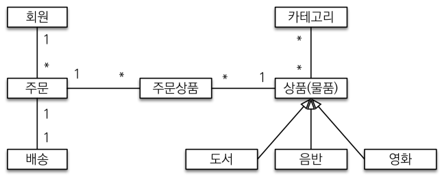
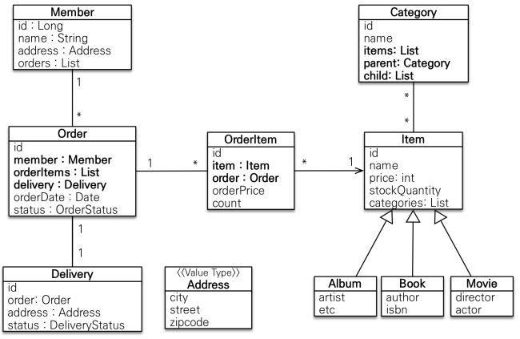
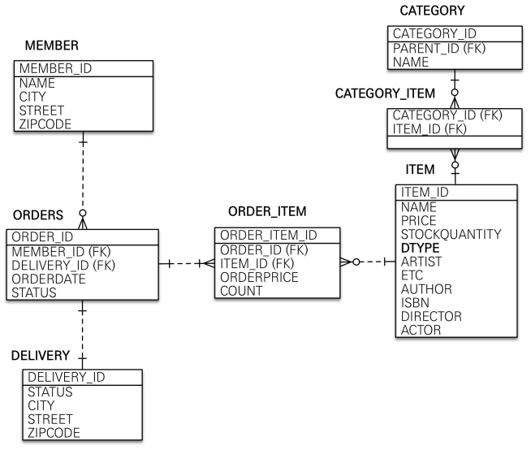

# 도메인 분석 설계

 - 요구사항 분석
 - 도메인 모델과 테이블 설계
 - 엔티티 클래스 개발
 - 엔티티 설계시 주의점

<br/>

## 1. 요구사항 분석

### 1-1. 기능 목록

 - 회원 기능
    - 회원 등록, 회원 조회
 - 상품 기능
    - 상품 등록, 상품 수정, 상품 조회
 - 주문 기능
    - 상품 주문, 상품 내역 조회, 주문 취소
 - 기타 요구사항
    - 상품은 재고 관리가 필요
    - 상품의 종류는 도서, 음반, 영화
    - 상품을 카테고리로 구분
    - 상품 주문시 배송 정보를 입력 가능

<br/>

## 2. 도메인 모델과 테이블 설계

__회원, 주문, 상품 관계__: 회원은 여러 상품을 주문할 수 있다. 한 번 주문할 때 여러 상품을 선택할 수 있으므로 주문과 상품은 다대다 관계이다. 다대다 관계인 경우 주문상품이라는 엔티티를 추가해서 다대다 관계를 일대다, 다대일 관계로 풀어낸다.  

__상품 분류__: 상품은 도서, 음반, 영화로 구분하며 상품이라는 공통 속성을 사용하므로 상속 구조로 표현한다.  

<div align="center">
    
</div>
<br/>

### 2-1. 회원 엔티티 분석

__회원(Member)__: 이름과 임베디드 타입인 주소(Address), 주문(orders) 리스트를 가진다.  

__주문(Order)__: 한 번 주문시 여러 상품을 주문할 수 있으므로 주문과 주문상품(OrderItem)은 일대다 관계다. 주문은 상품을 주문한 회원과 배송 정보, 주문 날짜, 주문 상태(status)를 가지고 있다. 주문 상태는 열거형을 사용하며 주문(ORDER), 취소(CANCEL)가 있다.  

__주문상품(OrderItem)__: 주문한 상품 정보와 주문 금액(orderPrice), 주문 수량(count) 정보를 가지고 있다.  

__상품(Item)__: 이름, 가격, 재고수량(stockQuantity)을 가지고 있다. 상품을 주문하면 재고 수량이 줄어든다. 상품의 종류로는 도서, 음반, 영화가 있다.  

__배송(Delivery)__: 주문시 하나의 배송 정보를 생성한다. 주문과 배송은 일대일 관계이다.  

__카테고리(Category)__: 상품과 다대다 관계를 맺는다. parent, child로 부모, 자식 카테고리를 연결한다.  

__주소(Address)__: 값 타입이다. 회원과 배송에서 사용한다.  

 - 참고: 사실 회원이 주문을 참조할 필요는 없다. 주문을 할 때 회원이 필요하여 주문 엔티티에만 회원에 대한 참조를 걸어두면 된다. 예제에서는 일대다, 다대일 양방향 연관 관계를 위해 추가한다.

<div align="center">
    
</div>
<br/>

### 2-2. 회원 테이블 분석

__회원과 주문__: 일대다 , 다대일의 양방향 관계다. 따라서 연관관계의 주인을 정해야 하는데, 외래 키가 있는 주문을 연관 관계의 주인으로 정하는 것이 좋다. 그러므로 Order.member 를 ORDERS.MEMBER_ID 외래 키와 매핑한다.  

__주문상품과 주문__: 다대일 양방향 관계다. 외래 키가 주문상품에 있으므로 주문상품이 연관관계의 주인이다. 그러므로 OrderItem.order 를 ORDER_ITEM.ORDER_ID 외래 키와 매핑한다.  

__주문상품과 상품__: 다대일 단방향 관계다. OrderItem.item 을 ORDER_ITEM.ITEM_ID 외래 키와 매핑한다.  

__주문과 배송__: 일대일 양방향 관계다. Order.delivery 를 ORDERS.DELIVERY_ID 외래 키와 매핑한다.  

__카테고리와 상품__: @ManyToMany 를 사용해서 매핑한다.(실무에서 @ManyToMany는 사용하지 말자. 여기서는 다대다 관계를 예제로 보여주기 위해 추가한다.)

<div align="center">
    
</div>
<br/>

## 3. 엔티티 클래스 개발

 - `회원(Member)`
    - 값 타입(ex: Address)은 변경 불가능하게 설계해야 한다. @Setter를 제거하고, 생성자에서 값을 모두 초기화해서 변경 불간으한 클래스를 만든다. JPA 스팩상 엔티티나 임베디드 타입은 자바 기본 생성자를 public또는 protected로 설정해야 한다.
```java
@Entity
@Getter @Setter
public class Member {

    @Id @GeneratedValue
    @Column(name = "member_id")
    private Long id;

    private String name;

    @Embedded
    private Address address;

    @JsonIgnore
    @OneToMany(mappedBy = "member")
    private List<Order> orders = new ArrayList<>();

}

@Getter
@NoArgsConstructor(access = AccessLevel.PROTECTED)
@AllAgrsConstructor
@Embeddable
public class Address {

    private String city;
    private String street;
    private String zipcode;

}
```
<br/>

 - `주문(Order)`
```java
@Entity
@Table(name = "orders")
@Getter @Setter
@NoArgsConstructor(access = AccessLevel.PROTECTED)
public class Order {

    @Id @GeneratedValue
    @Column(name = "order_id")
    private Long id;

    @ManyToOne(fetch = LAZY)
    @JoinColumn(name = "member_id")
    private Member member;

    @JsonIgnore
    @OneToMany(mappedBy = "order", cascade = CascadeType.ALL)
    private List<OrderItem> orderItems = new ArrayList<>();
 
    @JsonIgnore
    @OneToOne(fetch = LAZY, cascade = CascadeType.ALL)
    @JoinColumn(name = "delivery_id")
    private Delivery delivery;

    private LocalDateTime orderDate; //주문시간

    @Enumerated(EnumType.STRING)
    private OrderStatus status; //주문상태 [ORDER, CANCEL]

}

// 주문 상태
public enum OrderStatus {
    ORDER, CANCEL
}
```
<br/>

 - `주문상품(OrderItem)`
    - 주문 상품과 주문은 다대일 관계이다. (@ManyToOne)
    - 주문 상품과 상품은 다대일 관계이다. (@ManyToOne)
```java
@Entity
@Getter @Setter
@NoArgsConstructor(access = AccessLevel.PROTECTED)
public class OrderItem {

    @Id @GeneratedValue
    @Column(name = "order_item_id")
    private Long id;

    @ManyToOne(fetch = LAZY)
    @JoinColumn(name = "item_id")
    private Item item;

    @JsonIgnore
    @ManyToOne(fetch = LAZY)
    @JoinColumn(name = "order_id")
    private Order order;

    private int orderPrice; //주문 가격
    private int count; //주문 수량
}
```
<br/>

 - `상품(Item)`
    - 상속 관계 전략을 부모 클래스인 Item에 정의한다. SINGLE_TABLE 전략으로 하나의 테이블에 컬럼 값으로 구분하도록 한다.
    - @DiscriminatorValue 어노테이션으로 구분 값을 정의할 수 있다. (B: Book, A: Album, M: Movie)
```java
@Entity
@Inheritance(strategy = InheritanceType.SINGLE_TABLE)
@DiscriminatorColumn(name = "dtype")
@Getter @Setter
public abstract class Item {

    @Id
    @GeneratedValue
    @Column(name = "item_id")
    private Long id;

    private String name;
    private int price;
    private int stockQuantity;

    @ManyToMany(mappedBy = "items")
    private List<Category> categories = new ArrayList<>();

}

// Book
@Entity
@DiscriminatorValue("B")
@Getter
@Setter
public class Book extends Item {
    private String author;
    private String isbn;
}

// Album
@Entity
@DiscriminatorValue("A")
@Getter
@Setter
public class Album extends Item {
    private String artist;
    private String etc;
}

// Movie
@Entity
@DiscriminatorValue("M")
@Getter
@Setter
public class Movie extends Item {
    private String director;
    private String actor;
}
```

 - `배송(Delivery)`
```java
@Entity
@Getter @Setter
public class Delivery {

    @Id @GeneratedValue
    @Column(name = "delivery_id")
    private Long id;

    @JsonIgnore
    @OneToOne(mappedBy = "delivery", fetch = LAZY)
    private Order order;

    @Embedded
    private Address address;

    @Enumerated(EnumType.STRING)
    private DeliveryStatus status; //READY, COMP
}

public enum DeliveryStatus {
    READY, COMP
}
```
<br/>

 - `카테고리(Category)`
```java
@Entity
@Getter @Setter
public class Category {

    @Id @GeneratedValue
    @Column(name = "category_id")
    private Long id;

    private String name;

    @ManyToMany
    @JoinTable(
        name = "category_item",
        joinColumns = @JoinColumn(name = "category_id"),
        inverseJoinColumns = @JoinColumn(name = "item_id")
    )
    private List<Item> items = new ArrayList<>();

    @ManyToOne(fetch = LAZY)
    @JoinColumn(name = "parent_id")
    private Category parent;

    @OneToMany(mappedBy = "parent")
    private List<Category> child = new ArrayList<>();

}
```
<br/>

## 4. 엔티티 설계시 주의점

### 4-1. 엔티티에는 가급적이면 Setter를 사용하지 않는다.

 - Setter가 모두 열려있다면, 변경 포인트가 너무 많아져 유지보수가 어렵다.

<br/>

### 4-2. 모든 연관관계는 지연로딩으로 설정한다.

 - 즉시로딩( EAGER )은 예측이 어렵고, 어떤 SQL이 실행될지 추적하기 어렵다. 특히 JPQL을 실행할 때 N+1 문제가 자주 발생한다.
 - 실무에서 모든 연관관계는 지연로딩( LAZY )으로 설정해야 한다.
 - 연관된 엔티티를 함께 DB에서 조회해야 하면, fetch join 또는 엔티티 그래프 기능을 사용한다.
 - @XToOne(OneToOne, ManyToOne) 관계는 기본이 즉시로딩이므로 직접 지연로딩으로 설정해야 한다.

<br/>

### 4-3. 컬렉션은 필드에서 초기화한다.

 - 컬렉션은 필드에서 바로 초기화하는 것이 null 문제에서 안전하다.
 - 하이버네이트는 엔티티를 영속화 할 때, 컬랙션을 감싸서 하이버네이트가 제공하는 내장 컬렉션으로 변경한다. 만약 getOrders() 처럼 임의의 메서드에서 컬력션을 잘못 생성하면 하이버네이트 내부 메커니즘에 문제가 발생 할 수 있다. 따라서 필드레벨에서 생성하는 것이 가장 안전하고, 코드도 간결하다.

```java
Member member = new Member();
System.out.println(member.getOrders().getClass());
em.persist(member);
System.out.println(member.getOrders().getClass());

//출력 결과
class java.util.ArrayList
class org.hibernate.collection.internal.PersistentBag
```
<br/>

### 4-4. 테이블, 컬럼명 생성 전략

 - 문서: https://docs.spring.io/spring-boot/docs/2.1.3.RELEASE/reference/htmlsingle/#howto-configure-hibernate-naming-strategy
 - 문서: https://docs.jboss.org/hibernate/orm/5.4/userguide/html_single/Hibernate_User_Guide.html#naming
 - 하이버네이트 기존 구현: 엔티티의 필드명을 그대로 테이블의 컬럼명으로 사용(SpringPhysicalNamingStrategy)

```
스프링 부트 신규 설정 (엔티티(필드) 테이블(컬럼))
1. 카멜 케이스 언더스코어(memberPoint member_point)
2. .(점) _(언더스코어)
3. 대문자 소문자

변경 적용
적용 2 단계
1. 논리명 생성:
명시적으로 컬럼, 테이블명을 직접 적지 않으면 ImplicitNamingStrategy 사용
spring.jpa.hibernate.naming.implicit-strategy : 테이블이나, 컬럼명을 명시하지 않을 때 논리명 적용 

2. 물리명 적용:
spring.jpa.hibernate.naming.physical-strategy : 모든 논리명에 적용됨, 실제 테이블에 적용
(username usernm 등으로 회사 룰로 바꿀 수 있음)

```
