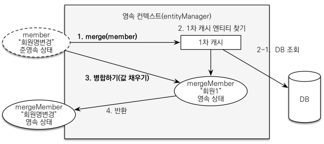

# 웹 계층 개발

## Include Style 레이아웃

 - `bodyHeader.html`
```html
<!DOCTYPE html>
<html xmlns:th="http://www.thymeleaf.org">
<div class="header" th:fragment="bodyHeader">
    <ul class="nav nav-pills pull-right">
        <li><a href="/">Home</a></li>
    </ul>
    <a href="/"><h3 class="text-muted">HELLO SHOP</h3></a>
</div>
```
<br/>

 - `footer.html`
```html
<!DOCTYPE html>
<html xmlns:th="http://www.thymeleaf.org">
<div class="footer" th:fragment="footer">
    <p>&copy; Hello Shop V2</p>
</div>
```
<br/>

 - `header.html`
```html
<!DOCTYPE html>
<html xmlns:th="http://www.thymeleaf.org">
<head th:fragment="header">
    <!-- Required meta tags -->
    <meta charset="utf-8">
    <meta name="viewport" content="width=device-width, initial-scale=1, shrink-to-fit=no">

    <!-- Bootstrap CSS -->
    <link rel="stylesheet" href="/css/bootstrap.min.css" integrity="sha384-ggOyR0iXCbMQv3Xipma34MD+dH/1fQ784/j6cY/iJTQUOhcWr7x9JvoRxT2MZw1T" crossorigin="anonymous">
    <!-- Custom styles for this template -->
    <link href="/css/jumbotron-narrow.css" rel="stylesheet">

    <title>Hello, world!</title>
</head>
```
<br/>

## 홈 화면과 레이아웃

 - `HomeController`
```java
@Controller
@Slf4j
public class HomeController {

    @RequestMapping("/")
    public String home() {
        log.info("home controller");
        return "home";
    }
}
```
<br/>

 - `home.html`
```html
<!DOCTYPE HTML>
<html xmlns:th="http://www.thymeleaf.org">
<head th:replace="fragments/header :: header">
    <title>Hello</title>
    <meta http-equiv="Content-Type" content="text/html; charset=UTF-8" />
</head>

<body>

<div class="container">

    <div th:replace="fragments/bodyHeader :: bodyHeader" />

    <div class="jumbotron">
        <h1>HELLO SHOP</h1>
        <p class="lead">회원 기능</p>
        <p>
            <a class="btn btn-lg btn-secondary" href="/members/new">회원 가입</a>
            <a class="btn btn-lg btn-secondary" href="/members">회원 목록</a>
        </p>
        <p class="lead">상품 기능</p>
        <p>
            <a class="btn btn-lg btn-dark" href="/items/new">상품 등록</a>
            <a class="btn btn-lg btn-dark" href="/items">상품 목록</a>
        </p>
        <p class="lead">주문 기능</p>
        <p>
            <a class="btn btn-lg btn-info" href="/order">상품 주문</a>
            <a class="btn btn-lg btn-info" href="/orders">주문 내역</a>
        </p>
    </div>

    <div th:replace="fragments/footer :: footer" />

</div> <!-- /container -->

</body>
</html>
```
<br/>

## 회원 가입

 - `MemberForm`
```java
@Getter @Setter
public class MemberForm {

    @NotEmpty(message = "회원 이름은 필수 입니다")
    private String name;

    private String city;
    private String street;
    private String zipcode;
}
```
<br/>

 - `MemberController`
```java
@Controller
@RequiredArgsConstructor
public class MemberController {

    private final MemberService memberService;

    @GetMapping("/members/new")
    public String createForm(Model model) {
        model.addAttribute("memberForm", new MemberForm());
        return "members/createMemberForm";
    }

    @PostMapping("/members/new")
    public String create(@Valid MemberForm form, BindingResult result) {

        if (result.hasErrors()) {
            return "members/createMemberForm";
        }

        Address address = new Address(form.getCity(), form.getStreet(), form.getZipcode());

        Member member = new Member();
        member.setName(form.getName());
        member.setAddress(address);

        memberService.join(member);
        return "redirect:/";
    }
}
```
<br/>

 - `createMemberForm.html`
```html
<!DOCTYPE HTML>
<html xmlns:th="http://www.thymeleaf.org">
<head th:replace="fragments/header :: header" />
<style>
    .fieldError {
        border-color: #bd2130;
    }
</style>
<body>

<div class="container">
    <div th:replace="fragments/bodyHeader :: bodyHeader"/>

    <form role="form" action="/members/new" th:object="${memberForm}" method="post">
        <div class="form-group">
            <label th:for="name">이름</label>

            <input type="text" th:field="*{name}" class="form-control" placeholder="이름을 입력하세요"
                   th:class="${#fields.hasErrors('name')}? 'form-control fieldError' : 'form-control'">
            <p th:if="${#fields.hasErrors('name')}" th:errors="*{name}">Incorrect date</p>

        </div>
        <div class="form-group">
            <label th:for="city">도시</label>
            <input type="text" th:field="*{city}" class="form-control" placeholder="도시를 입력하세요">
        </div>
        <div class="form-group">
            <label th:for="street">거리</label>
            <input type="text" th:field="*{street}" class="form-control" placeholder="거리를 입력하세요">
        </div>
        <div class="form-group">
            <label th:for="zipcode">우편번호</label>
            <input type="text" th:field="*{zipcode}" class="form-control" placeholder="우편번호를 입력하세요">
        </div>
        <button type="submit" class="btn btn-primary">Submit</button>
    </form>
    <br/>
    <div th:replace="fragments/footer :: footer" />
</div> <!-- /container -->

</body>
</html>
```
<br/>

## 회원 목록 조회

 - `MemberController`
```java
@Controller
@RequiredArgsConstructor
public class MemberController {

    ..

    @GetMapping("/members")
    public String list(Model model) {
        List<Member> members = memberService.findMembers();
        model.addAttribute("members", members);
        return "members/memberList";
    }

}
```
<br/>

 - `memberList.html`
```html
<!DOCTYPE HTML>
<html xmlns:th="http://www.thymeleaf.org">
<head th:replace="fragments/header :: header" />
<body>

<div class="container">
    <div th:replace="fragments/bodyHeader :: bodyHeader" />
    <div>
        <table class="table table-striped">
            <thead>
            <tr>
                <th>#</th>
                <th>이름</th>
                <th>도시</th>
                <th>주소</th>
                <th>우편번호</th>
            </tr>
            </thead>
            <tbody>
            <tr th:each="member : ${members}">
                <td th:text="${member.id}"></td>
                <td th:text="${member.name}"></td>
                <td th:text="${member.address?.city}"></td>
                <td th:text="${member.address?.street}"></td>
                <td th:text="${member.address?.zipcode}"></td>
            </tr>
            </tbody>
        </table>
    </div>

    <div th:replace="fragments/footer :: footer" />

</div> <!-- /container -->

</body>
</html>
```
<br/>

## 상품 등록, 목록, 수정

 - `BookForm`
```java
@Getter @Setter
public class BookForm {

    private Long id;

    private String name;
    private int price;
    private int stockQuantity;

    private String author;
    private String isbn;
}
```
<br/>

 - `ItemController`
```java
@Controller
@RequiredArgsConstructor
public class ItemController {

    private final ItemService itemService;

    @GetMapping("/items/new")
    public String createForm(Model model) {
        model.addAttribute("form", new BookForm());
        return "items/createItemForm";
    }

    @PostMapping("/items/new")
    public String create(BookForm form) {

        Book book = new Book();
        book.setName(form.getName());
        book.setPrice(form.getPrice());
        book.setStockQuantity(form.getStockQuantity());
        book.setAuthor(form.getAuthor());
        book.setIsbn(form.getIsbn());

        itemService.saveItem(book);
        return "redirect:/";
    }

    @GetMapping("/items")
    public String list(Model model) {
        List<Item> items = itemService.findItems();
        model.addAttribute("items", items);
        return "items/itemList";
    }

    @GetMapping("items/{itemId}/edit")
    public String updateItemForm(@PathVariable("itemId") Long itemId, Model model) {
        Book item = (Book) itemService.findOne(itemId);

        BookForm form = new BookForm();
        form.setId(item.getId());
        form.setName(item.getName());
        form.setPrice(item.getPrice());
        form.setStockQuantity(item.getStockQuantity());
        form.setAuthor(item.getAuthor());
        form.setIsbn(item.getIsbn());

        model.addAttribute("form", form);
        return "items/updateItemForm";
    }

    @PostMapping("items/{itemId}/edit")
    public String updateItem(@PathVariable Long itemId, @ModelAttribute("form") BookForm form) {

        itemService.updateItem(itemId, form.getName(), form.getPrice(), form.getStockQuantity());

        return "redirect:/items";
    }
}
```
<br/>

 - `상품 등록(createItemForm.html)`
```html
<!DOCTYPE HTML>
<html xmlns:th="http://www.thymeleaf.org">
<head th:replace="fragments/header :: header" />
<body>

<div class="container">
    <div th:replace="fragments/bodyHeader :: bodyHeader"/>

    <form th:action="@{/items/new}" th:object="${form}" method="post">
        <div class="form-group">
            <label th:for="name">상품명</label>
            <input type="text" th:field="*{name}" class="form-control" placeholder="이름을 입력하세요">
        </div>
        <div class="form-group">
            <label th:for="price">가격</label>
            <input type="number" th:field="*{price}" class="form-control" placeholder="가격을 입력하세요">
        </div>
        <div class="form-group">
            <label th:for="stockQuantity">수량</label>
            <input type="number" th:field="*{stockQuantity}" class="form-control" placeholder="수량을 입력하세요">
        </div>
        <div class="form-group">
            <label th:for="author">저자</label>
            <input type="text" th:field="*{author}" class="form-control" placeholder="저자를 입력하세요">
        </div>
        <div class="form-group">
            <label th:for="isbn">ISBN</label>
            <input type="text" th:field="*{isbn}" class="form-control" placeholder="ISBN을 입력하세요">
        </div>
        <button type="submit" class="btn btn-primary">Submit</button>
    </form>
    <br/>
    <div th:replace="fragments/footer :: footer" />

</div> <!-- /container -->


</body>
</html>
```
<br/>

 - `상품 목록(itemList.html)`
```html
<!DOCTYPE HTML>
<html xmlns:th="http://www.thymeleaf.org">
<head th:replace="fragments/header :: header" />
<body>

<div class="container">
    <div th:replace="fragments/bodyHeader :: bodyHeader"/>

    <div>
        <table class="table table-striped">
            <thead>
            <tr>
                <th>#</th>
                <th>상품명</th>
                <th>가격</th>
                <th>재고수량</th>
                <th></th>
            </tr>
            </thead>
            <tbody>
            <tr th:each="item : ${items}">
                <td th:text="${item.id}"></td>
                <td th:text="${item.name}"></td>
                <td th:text="${item.price}"></td>
                <td th:text="${item.stockQuantity}"></td>
                <td>
                    <a href="#" th:href="@{/items/{id}/edit (id=${item.id})}" class="btn btn-primary" role="button">수정</a>
                </td>
            </tr>
            </tbody>
        </table>
    </div>

    <div th:replace="fragments/footer :: footer"/>

</div> <!-- /container -->

</body>
</html>
```
<br/>

 - `상품 수정(updateItemForm.html)`
```html
<!DOCTYPE HTML>
<html xmlns:th="http://www.thymeleaf.org">
<head th:replace="fragments/header :: header" />
<body>

<div class="container">
    <div th:replace="fragments/bodyHeader :: bodyHeader"/>

    <form th:object="${form}" method="post">
        <!-- id -->
        <input type="hidden" th:field="*{id}" />

        <div class="form-group">
            <label th:for="name">상품명</label>
            <input type="text" th:field="*{name}" class="form-control" placeholder="이름을 입력하세요" />
        </div>
        <div class="form-group">
            <label th:for="price">가격</label>
            <input type="number" th:field="*{price}" class="form-control" placeholder="가격을 입력하세요" />
        </div>
        <div class="form-group">
            <label th:for="stockQuantity">수량</label>
            <input type="number" th:field="*{stockQuantity}" class="form-control" placeholder="수량을 입력하세요" />
        </div>
        <div class="form-group">
            <label th:for="author">저자</label>
            <input type="text" th:field="*{author}" class="form-control"  placeholder="저자를 입력하세요" />
        </div>
        <div class="form-group">
            <label th:for="isbn">ISBN</label>
            <input type="text" th:field="*{isbn}" class="form-control"  placeholder="ISBN을 입력하세요" />
        </div>
        <button type="submit" class="btn btn-primary">Submit</button>
    </form>

    <div th:replace="fragments/footer :: footer" />

</div> <!-- /container -->

</body>
</html>
```
<br/>

## 변경 감지와 병합(MERGE)

준영속 엔티티란 영속성 컨텍스트가 더는 관리하지 않는 엔티티를 말한다.  
이러한 준영속 엔티티를 수정하는 방법으로는 2가지가 있다.  

 - __변경 감지 기능 사용__
    - 영속성 컨텍스트에서 엔티티를 조회한 후에 엔티티의 상태를 변경한다.
    - 트랜잭션 커밋 시점에 변경 감지가 동작해서 데이터베이스에 UPDATE SQL을 실행하게 된다.
```java
@Transactional
void update(Item itemParam) { //itemParam: 파리미터로 넘어온 준영속 상태의 엔티티
    Item findItem = em.find(Item.class, itemParam.getId()); //같은 엔티티를 조회한다.
    findItem.setPrice(itemParam.getPrice()); //데이터를 수정한다.
}
```
<br/>

 - __병합(Merge) 사용__
    - 병합은 준영속 상태의 엔티티를 영속 상태로 변경할 때 사용하는 기능이다.
```java
@Transactional
void update(Item itemParam) { //itemParam: 파리미터로 넘어온 준영속 상태의 엔티티
    Item mergeItem = em.merge(itemParam);
}
```
<br/>

### 병합 동작 방식

<div align="center">
    
</div>
<br/>

```
1. merge() 를 실행한다.

2. 파라미터로 넘어온 준영속 엔티티의 식별자 값으로 1차 캐시에서 엔티티를 조회한다.


2-1. 만약 1차 캐시에 엔티티가 없으면 데이터베이스에서 엔티티를 조회하고, 1차 캐시에 저장한다.

3. 조회한 영속 엔티티( mergeMember )에 member 엔티티의 값을 채워 넣는다.
member 엔티티의 모든 값을 mergeMember에 밀어 넣는다.
이때 mergeMember의 “회원1”이라는 이름이 “회원명변경”으로 바뀐다.

4. 영속 상태인 mergeMember를 반환한다.
```
<br/>

### 변경 감지와 병합 정리

변경 감지 기능을 사용하면 원하는 속성만 선택해서 변경할 수 있지만, 병합을 사용하면 모든 속성이 변경된다.  
즉, 병합시 값이 없으면 null로 업데이트 된다. (병ㅎ바은 모든 필드를 교체한다.)  

__엔티티를 변경할 떄는 항상 변경 감지를 사용한다.__  

 - 컨트롤러에서 엔티티를 생성하지 않는다.
 - 트랜잭션이 있는 서비스 계층에 식별자(id)와 변경할 데이터를 명확하게 전달한다.
 - 트랜잭션이 있는 서비스 계층에서 영속 상태의 엔티티를 조회하고, 엔티티의 데이터를 직접 변경한다.
 - 트랜잭션 커밋 시점에 변경 감지가 실행된다.

```java
@Controller
@RequiredArgsConstructor
public class ItemController {
    private final ItemService itemService;

    /**
     * 상품 수정, 권장 코드
     */
    @PostMapping(value = "/items/{itemId}/edit")
    public String updateItem(@PathVariable Long itemId, @ModelAttribute("form") BookForm form) {
        itemService.updateItem(itemId, form.getName(), form.getPrice(), 
        form.getStockQuantity());
        return "redirect:/items";
    }
}

@Service
@RequiredArgsConstructor
public class ItemService {
    private final ItemRepository itemRepository;
    /**
     * 영속성 컨텍스트가 자동 변경
     */
    @Transactional
    public void updateItem(Long id, String name, int price, int stockQuantity) {
        Item item = itemRepository.findOne(id);
        item.setName(name);
        item.setPrice(price);
        item.setStockQuantity(stockQuantity);
    }
}
```

<br/>

## 상품 주문, 주문 목록 검색, 취소

 - `OrderController`
```java
@Controller
@RequiredArgsConstructor
public class OrderController {

    private final OrderService orderService;
    private final MemberService memberService;
    private final ItemService itemService;

    // 상품 주문 Form
    @GetMapping("/order")
    public String createForm(Model model) {

        List<Member> members = memberService.findMembers();
        List<Item> items = itemService.findItems();

        model.addAttribute("members", members);
        model.addAttribute("items", items);

        return "order/orderForm";
    }

    // 상품 주문 처리
    @PostMapping("/order")
    public String order(@RequestParam("memberId") Long memberId,
                        @RequestParam("itemId") Long itemId,
                        @RequestParam("count") int count) {

        orderService.order(memberId, itemId, count);
        return "redirect:/orders";
    }

    // 주문 목록
    @GetMapping("/orders")
    public String orderList(@ModelAttribute("orderSearch") OrderSearch orderSearch, Model model) {
        List<Order> orders = orderService.findOrders(orderSearch);
        model.addAttribute("orders", orders);

        return "order/orderList";
    }

    // 주문 취소
    @PostMapping("/orders/{orderId}/cancel")
    public String cancelOrder(@PathVariable("orderId") Long orderId) {
        orderService.cancelOrder(orderId);
        return "redirect:/orders";
    }
}
```

