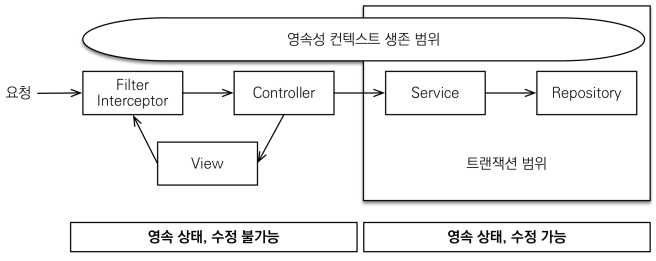
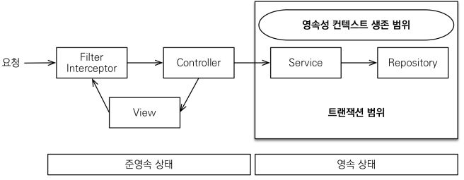

# 실무 필수 최적화

## OSIV와 성능 최적화

JPA의 EntityManager가 기존 Hibernate에서는 Session으로 사용되었다.  
OSIV는 Open Session In View의 약자로 JPA에서 Open EntityManager In View와 같다. 관례쌍 OSIV라고 불린다.  

    

 

OSIV 전략은 트랜잭션 시작처럼 최초 데이터베이스 커넥션 시작 시점부터 API 응답이 끝날 때 까지 영속성 컨텍스트와 데이터베이스 커넥션을 유지한다. 그래서, View Template나 API 컨트롤러에서 지연 로딩이 가능하다.  
지연 로딩은 영속성 컨텍스트가 살아있어야 가능하고, 영속성 컨텍스트는 기본적으로 데이터베이스 커넥션을 유지한다.  

하지만, 이러한 전략은 너무 오랜시간 동안 데이터베이스 커넥션 리소스를 사용한다. 떄문에, 실시간 트래픽이 중요한 애플리케이션에서는 커넥션이 모자를 수 있다. (외부 API 호출시 외부 API 대기 시간만큼 커넥션 리소스가 반환하지 못하고, 유지된다.)  

 

### OSIV OFF

OSIV를 끄면 트랜잭션을 종료할 떄 영속성 컨텍스트를 닫고, 데이터베이스 커넥션도 반환한다. 따라서, 커넥션 리소스를 낭비하지 않는다.  

OSIV를 끄면 모든 지연로딩을 트랜잭션 안에서 처리해야 한다. 따라서, View Template에서 지연 로딩이 동작하지 않는다. (트랜잭션이 끝나기 전에 지연 로딩을 강제로 호출해야 한다.)  

 - spring.jpa.open-in-view: false 옵션을 설정하면 OSIV 기능이 OFF가 된다.

    

 

### 커맨드와 쿼리 분리

실무에서 OSIV를 끈 상태로 복잡성을 관리하는 좋은 방법으로는 Command와 Query를 분리하는 것이다.  
 - https://en.wikipedia.org/wiki/Command%E2%80%93query_separation
 - 고객 서비스의 실시간 API는 OSIV를 끄고, 어드민 사이트처럼 커넥션을 많이 사용하지 않는 곳에서는 OSIV를 켠다.

