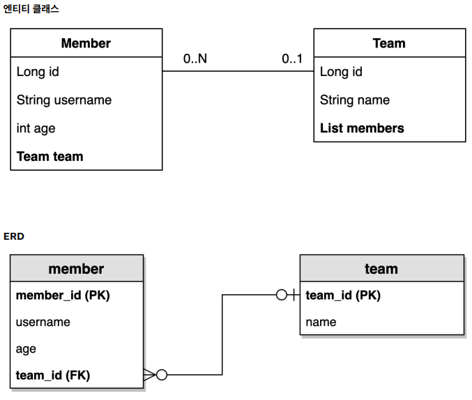

# 예제 도메인 모델

<div align="center">
    
</div>
<br/>

 - `Member 엔티티`
    - @ToString은 가급적 내부 필드만 사용한다. 연관 관계 필드를 사용하면 무한루프를 돌 위험이 있다.
```java
@ToString(of = {"id", "username", "age"})
@Getter @Setter
@NoArgsConstructor(access = AccessLevel.PROTECTED)
@Entity
public class Member {

    @Id
    @GeneratedValue
    @Column(name = "member_id")
    private Long id;

    private String username;

    private int age;

    @ManyToOne(fetch = FetchType.LAZY)
    @JoinColumn(name = "team_id")
    private Team team;

    public Member(String username) {
        this(username, 0);
    }

    public Member(String username, int age) {
        this(username, age, null);
    }

    public Member(String username, int age, Team team) {
        this.username = username;
        this.age = age;
        if (team != null) {
            changeTea m(team);
        }
    }

    public void changeTeam(Team team) {
        this.team = team;
        team.getMembers().add(this);
    }
}
```
<br/>

 - `Team 엔티티`
```java

@ToString(of = {"id", "name"})
@Getter @Setter
@NoArgsConstructor(access = AccessLevel.PROTECTED)
@Entity
public class Team {

    @Id @GeneratedValue
    @Column(name = "team_id")
    private Long id;

    private String name;

    @OneToMany(mappedBy = "team")
    List<Member> members = new ArrayList<>();

    public Team(String name) {
        this.name = name;
    }
}
```
<br/>

 - `데이터 확인 테스트`
```java
@SpringBootTest
public class MemberTest {

    @PersistenceContext
    EntityManager em;

    @Test
    @Transactional
    @Rollback(false)
    public void testEntity() {
        Team teamA = new Team("teamA");
        Team teamB = new Team("teamB");
        em.persist(teamA);
        em.persist(teamB);

        Member member1 = new Member("member1", 10, teamA);
        Member member2 = new Member("member2", 20, teamA);
        Member member3 = new Member("member3", 30, teamB);
        Member member4 = new Member("member4", 40, teamB);
        em.persist(member1);
        em.persist(member2);
        em.persist(member3);
        em.persist(member4);

        //초기화
        em.flush();
        em.clear();

        //확인
        List<Member> members = em.createQuery("select m from Member m", 
        Member.class).getResultList();

        for (Member member : members) {
            System.out.println("member=" + member);
            System.out.println("-> member.team=" + member.getTeam());
        }
    }
}
```

