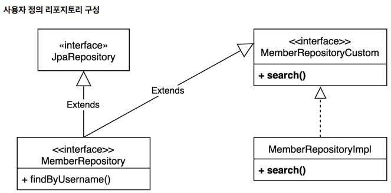

# 스프링 데이터 JPA와 QueryDSL

## 1. 스프링 데이터 JPA 레포지토리로 변경

 - `MemberRepository`
```java
public interface MemberRepository extends JpaRepository<Member, Long> {
    List<Member> findByUsername(String username);
}

// 테스트 코드
@SpringBootTest
@Transactional
class MemberRepositoryTest {

    @Autowired
    EntityManager em;

    @Autowired
    MemberRepository memberRepository;

    @Test
    public void basicTest() {
        Member member = new Member("member1", 10);
        memberRepository.save(member);

        Member findMember = memberRepository.findById(member.getId()).get();
        assertThat(findMember).isEqualTo(member);

        List<Member> result1 = memberRepository.findAll();
        assertThat(result1).containsExactly(member);

        List<Member> result2 = memberRepository.findByUsername("member1");
        assertThat(result2).containsExactly(member);
    }
}
```
<br/>

## 2. 사용자 정의 레포지토리

사용자 정의 레포지토리를 만들기 위해서는 3가지 과정을 거쳐야 한다.  
 - 1. 사용자 정의 인터페이스 작성 (MemberRepositoryCustom)
 - 2. 사용자 정의 인터페이스 구현 (MemberRepositoryImpl)
 - 3. 스프링 데이터 레포지토리에 사용자 정의 인터페이스 상속 (MemberRepository -> JpaRepository, MemberRepositoryCustom)

<div align="center">
    
</div>
<br/>

```java
// 1. 사용자 정의 인터페이스 작성
public interface MemberRepositoryCustom {
    List<MemberTeamDto> search(MemberSearchCondition condition);
}

// 2. 사용자 정의 인터페이스 구현
// 구현체 이름은 XxxRepositoryImpl로 지정되어야 한다. (스프링 데이터 JPA가 자동으로 구현체를 찾아준다.)
public class MemberRepositoryImpl implements MemberRepositoryCustom {

    private final JPAQueryFactory queryFactory;

    public MemberRepositoryImpl(EntityManager em) {
        this.queryFactory = new JPAQueryFactory(em);
    }

    @Override
    public List<MemberTeamDto> search(MemberSearchCondition condition) {
        return queryFactory
                .select(
                    new QMemberTeamDto(
                        member.id,
                        member.username,
                        member.age,
                        team.id,
                        team.name
                    )
                )
                .from(member)
                .leftJoin(member.team, team)
                .where(
                    usernameEq(condition.getUsername()),
                    teamNameEq(condition.getTeamName()),
                    ageGoe(condition.getAgeGoe()),
                    ageLoe(condition.getAgeLoe())
                )
                .fetch();
    }

    private BooleanExpression usernameEq(String username) {
        return isEmpty(username) ? null : member.username.eq(username);
    }
    private BooleanExpression teamNameEq(String teamName) {
        return isEmpty(teamName) ? null : team.name.eq(teamName);
    }
    private BooleanExpression ageGoe(Integer ageGoe) {
        return ageGoe == null ? null : member.age.goe(ageGoe);
    }
    private BooleanExpression ageLoe(Integer ageLoe) {
        return ageLoe == null ? null : member.age.loe(ageLoe);
    }
}

// 3. 스프링 데이터 레포지토리에 사용자 정의 인터페이스 상속
public interface MemberRepository extends JpaRepository<Member, Long>, 
MemberRepositoryCustom {
    List<Member> findByUsername(String username);
}
```
<br/>

 - `커스텀 레포지토리 동작 테스트`
```java
@Test
public void searchTest() {
    Team teamA = new Team("teamA");
    Team teamB = new Team("teamB");
    em.persist(teamA);
    em.persist(teamB);

    Member member1 = new Member("member1", 10, teamA);
    Member member2 = new Member("member2", 20, teamA);
    Member member3 = new Member("member3", 30, teamB);
    Member member4 = new Member("member4", 40, teamB);
    em.persist(member1);
    em.persist(member2);
    em.persist(member3);
    em.persist(member4);

    MemberSearchCondition condition = new MemberSearchCondition();
    condition.setAgeGoe(35);
    condition.setAgeLoe(40);
    condition.setTeamName("teamB");

    List<MemberTeamDto> result = memberRepository.search(condition);
    assertThat(result).extracting("username").containsExactly("member4");
}
```
<br/>

### 클래스로 바로 사용

만약, 특정 화면에만 특화된 기능인 경우 단순히 구현체로만 만들어서 사용할 수도 있다.  
사용하는 곳에서는 Interface가 아니라, Class 자체를 의존성 주입받아서 사용하면 된다.  

```java
// QueryDSL용 클래스
@Repository
public class MemberQueryRepository {
    // ..
}
```
<br/>

## 3. 스프링 데이터 페이징 활용1 - QueryDSL 페이징 연동

스프링 데이터 JPA의 페이징과 연동하여 QueryDSL에서 사용 방법을 익힌다.  

 - `사용자 정의 인터페이스 작성`
```java
public interface MemberRepositoryCustom {
    List<MemberTeamDto> search(MemberSearchCondition condition);
    Page<MemberTeamDto> searchPageSimple(MemberSearchCondition condition,  Pageable pageable);
    Page<MemberTeamDto> searchPageComplex(MemberSearchCondition condition,  Pageable pageable);
}
```
<br/>

 - `사용자 정의 인터페이스 구현`
    - fetchResults()를 사용하면, QueryDSL이 DB조회 쿼리와 COUNT용 쿼리를 수행하게 된다.
    - 전체 카운트를 조회하는 방법을 최적화하기 위해서는 fetch()로 조회하고, COUNT용 쿼리를 따로 만든다.
```java
public class MemberRepositoryImpl implements MemberRepositoryCustom {

    // ..

    /**
     * 단순한 페이징, fetchResults() 사용
     */
    @Override
    public Page<MemberTeamDto> searchPageSimple(MemberSearchCondition condition, Pageable pageable) {
        QueryResults<MemberTeamDto> results = queryFactory
                .select(
                    new QMemberTeamDto(
                        member.id,
                        member.username,
                        member.age,
                        team.id,
                        team.name
                    )
                )
                .from(member)
                .leftJoin(member.team, team)
                .where(
                    usernameEq(condition.getUsername()),
                    teamNameEq(condition.getTeamName()),
                    ageGoe(condition.getAgeGoe()),
                    ageLoe(condition.getAgeLoe())
                )
                .offset(pageable.getOffset())
                .limit(pageable.getPageSize())
                .fetchResults();

        List<MemberTeamDto> content = results.getResults();
        long total = results.getTotal();

        return new PageImpl<>(content, pageable, total);
    }

    /**
     * 복잡한 페이징
     * 데이터 조회 쿼리와, 전체 카운트 쿼리를 분리
     */
    @Override
    public Page<MemberTeamDto> searchPageComplex(MemberSearchCondition condition, Pageable pageable) {
        List<MemberTeamDto> content = queryFactory
                .select(
                    new QMemberTeamDto(
                        member.id,
                        member.username,
                        member.age,
                        team.id,
                        team.name
                    )
                )
                .from(member)
                .leftJoin(member.team, team)
                .where(
                    usernameEq(condition.getUsername()),
                    teamNameEq(condition.getTeamName()),
                    ageGoe(condition.getAgeGoe()),
                    ageLoe(condition.getAgeLoe())
                )
                .offset(pageable.getOffset())
                .limit(pageable.getPageSize())
                .fetch();

        long total = queryFactory
                .select(member)
                .from(member)
                .leftJoin(member.team, team)
                .where(
                    usernameEq(condition.getUsername()),
                    teamNameEq(condition.getTeamName()),
                    ageGoe(condition.getAgeGoe()),
                    ageLoe(condition.getAgeLoe())
                )
                .fetchCount();

        return new PageImpl<>(content, pageable, total);
    }
}
```
<br/>

 - `페이징 동작 테스트`
```java
@Test
public void searchTest() {
    Team teamA = new Team("teamA");
    Team teamB = new Team("teamB");
    em.persist(teamA);
    em.persist(teamB);

    Member member1 = new Member("member1", 10, teamA);
    Member member2 = new Member("member2", 20, teamA);
    Member member3 = new Member("member3", 30, teamB);
    Member member4 = new Member("member4", 40, teamB);
    em.persist(member1);
    em.persist(member2);
    em.persist(member3);
    em.persist(member4);

    MemberSearchCondition condition = new MemberSearchCondition();
    PageRequest pageRequest = PageRequest.of(0, 3);

    Page<MemberTeamDto> result = memberRepository.searchPageSimple(condition, pageRequest);

    assertThat(result.getSize()).isEqualTo(3);
    assertThat(result.getContent()).extracting("username").containsExactly("member1", "member2", "member3");
}
```
<br/>

## 4. 스프링 데이터 페이징 활용2 - CountQuery 최적화

COUNT 쿼리는 떄에 따라서 생략이 가능하다.  
 - 페이지 시작이면서 컨텐츠 사이즈가 페이지 사이즈보다 작은 경우
 - 마지막 페이지인 경우

<br/>

### PageableExecutionUtils.getPage()로 최적화

COUNT Query를 fetchCount()를 호출하지 않고, JPAQuery로 반환받는다.  
이후, 스프링 데이터에서 제공하는 PageableExecutionUtils.getPage()의 3번째 파라미터로 Supplier Function으로 fetchCount()를 호출하도록 한다.  
getpage() 함수 내부적으로 content와 pageable을 통해 COUNT 쿼리를 생략하거나 실행한다.  

```java

    /**
     * 복잡한 페이징
     * 데이터 조회 쿼리와, 전체 카운트 쿼리를 분리
     */
    @Override
    public Page<MemberTeamDto> searchPageComplex(MemberSearchCondition condition, Pageable pageable) {
        List<MemberTeamDto> content = queryFactory
                .select(
                    new QMemberTeamDto(
                        member.id,
                        member.username,
                        member.age,
                        team.id,
                        team.name
                    )
                )
                .from(member)
                .leftJoin(member.team, team)
                .where(
                    usernameEq(condition.getUsername()),
                    teamNameEq(condition.getTeamName()),
                    ageGoe(condition.getAgeGoe()),
                    ageLoe(condition.getAgeLoe())
                )
                .offset(pageable.getOffset())
                .limit(pageable.getPageSize())
                .fetch();

        JPAQuery<Member> countQuery = queryFactory
                .select(member)
                .from(member)
                .leftJoin(member.team, team)
                .where(
                    usernameEq(condition.getUsername()),
                    teamNameEq(condition.getTeamName()),
                    ageGoe(condition.getAgeGoe()),
                    ageLoe(condition.getAgeLoe())
                )
                .fetchCount();

        return PageableExecutionUtils.getPage(content, pageable, countQuery::fetchCount);
    }
```
<br/>

## 5. 스프링 데이터 페이징 활용 3- 컨트롤러 개발

 - 요청 URL: http://localhost:8080/v2/members?size=5&page=2
```java
@RestController
@RequiredArgsConstructor
public class MemberController {

    private final MemberJpaRepository memberJpaRepository;
    private final MemberRepository memberRepository;

    @GetMapping("/v1/members")
    public List<MemberTeamDto> searchMemberV1(MemberSearchCondition condition) {
        return memberJpaRepository.search(condition);
    }

    @GetMapping("/v2/members")
    public Page<MemberTeamDto> searchMemberV2(MemberSearchCondition condition, Pageable pageable) {
        return memberRepository.searchPageSimple(condition, pageable);
    }

    @GetMapping("/v3/members")
    public Page<MemberTeamDto> searchMemberV3(MemberSearchCondition condition, Pageable pageable) {
        return memberRepository.searchPageComplex(condition, pageable);
    }
}
```
<br/>

### 스프링 데이터 정렬(Sort)

스프링 데이터 JPA는 정렬(Sort)을 QueryDSL의 정렬(OrderSpecifier)로 편리하게 변경하는 기능을 제공한다.  

 - 스프링 데이터 Sort를 QueryDSL의 OrderSpecifier로 변환
 -  정렬( Sort )은 조건이 조금만 복잡해져도 Pageable 의 Sort 기능을 사용하기 어렵다. 루트 엔티티 범위를 넘어가는 동적 정렬 기능이 필요하면 스프링 데이터 페이징이 제공하는 Sort 를 사용하기 보다는 파라미터를 받아서 직접 처리하는 것을 권장한다.
```java
JPAQuery<Member> query = queryFactory
        .selectFrom(member);

for (Sort.Order o : pageable.getSort()) {
    PathBuilder pathBuilder = new PathBuilder(member.getType(), member.getMetadata());
    query.orderBy(
        new OrderSpecifier(
            o.isAscending() ? Order.ASC : Order.DESC,
            pathBuilder.get(o.getProperty())
        )
    );
}

List<Member> result = query.fetch();
```

