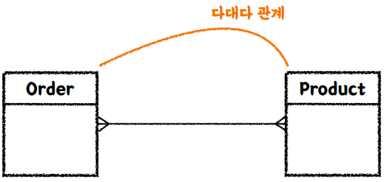
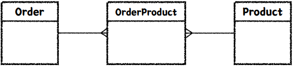

# Spring & JPA 기반 테스트

## 레이어드 아키텍처

레이어드 아키텍처는 소프트웨어 시스템을 여러 개의 논리적인 레이어로 구성하여 각 레이어 간의 의존성을 관리하고 시스템을 모듈화하는 아키텍처 패턴입니다. 각 레이어는 특정한 역할과 책임을 가지며, 레이어 간의 상호작용은 정해진 방식에 따라 이루어집니다. 이 패턴은 시스템의 유지보수성, 확장성 및 변경 용이성을 향상시키는데 도움이 됩니다.  
 - 프레젠테이션 레이어 (Presentation Layer):
    - 이 레이어는 사용자 인터페이스를 다루는 부분으로, 사용자와 시스템 간의 상호작용을 관리합니다. 주로 사용자 입력을 받아들이고 출력을 표시하는 역할을 담당합니다. 웹 애플리케이션의 경우 UI 컴포넌트, 뷰 템플릿, 컨트롤러 등이 이 레이어에 속합니다.
 - 비즈니스 레이어 (Business Layer):
    - 이 레이어는 시스템의 비즈니스 로직과 데이터 처리를 다루는 부분입니다. 비즈니스 레이어는 사용자의 요구 사항을 실제로 처리하고 비즈니스 규칙을 구현합니다. 데이터의 유효성 검사, 계산, 데이터베이스 접근 등이 이 레이어에서 이루어집니다.
 - 데이터 액세스 레이어 (Data Access Layer):
    - 이 레이어는 데이터베이스나 외부 데이터 저장소와의 상호작용을 담당합니다. 데이터 액세스 레이어는 데이터를 저장, 검색, 업데이트, 삭제하는 작업을 수행하며, 데이터베이스와 직접적으로 연결됩니다. 데이터베이스 쿼리, ORM(Object-Relational Mapping) 등이 이 레이어에 속합니다.
 - __레이어드 아키텍처는 각 레이어 사이의 의존성을 최소화하고, 변경이 한 레이어에서 다른 레이어로 영향을 미치지 않도록 하는 장점을 가지고 있습니다. 이로 인해 특정 레이어의 변경이 다른 레이어에 미치는 영향을 최소화하고, 시스템의 유지보수 및 확장이 용이해집니다. (관심사의 분리)__

<br/>

### 통합 테스트(Integration Test)

통합 테스트(Integration Testing)는 소프트웨어 개발에서 다양한 컴포넌트, 모듈 또는 시스템의 부분들이 함께 작동하는 상태에서의 테스트를 의미합니다. 이 테스트는 개별 컴포넌트들이 서로 상호작용할 때 발생하는 문제나 오류를 찾아내고 해결하기 위해 수행됩니다.  
 - 여러 모듈이 협력하는 기능을 통합적으로 검증하는 테스트
 - 일반적으로 작은 범위의 단위 테스트만으로는 기능 전체의 신뢰성을 보장할 수 없다.
 - 풍부한 단위 테스트 & 큰 기능 단위를 검증하는 통합 테스트

<br/>

## Spring / JPA 훑어보기 & 기본 엔티티 설계

### 라이브러이와 프레임워크

라이브러리는 개발자가 필요한 기능을 선택적으로 사용하며, 제어 흐름은 개발자가 가지고 있습니다.  
프레임워크는 애플리케이션의 구조와 흐름을 제어하는 데 사용되며, 개발자는 프레임워크의 구조와 규칙을 따라 개발합니다.  
 - 라이브러리 (Library)
    - 라이브러리는 재사용 가능한 코드의 집합이며, 특정 기능을 수행하기 위한 함수, 클래스, 메서드 등을 포함합니다. 프로그래머가 필요한 기능을 간편하게 사용할 수 있도록 API로 제공됩니다. 라이브러리는 개발자가 원하는 대로 사용하고 통합할 수 있으며, 라이브러리를 사용할 때 개발자가 제어의 흐름을 가지고 있습니다.
    - 선택적 사용: 개발자가 필요한 기능만 선택적으로 사용할 수 있습니다.
    - 개발자 중심 흐름: 개발자가 코드의 흐름과 제어를 직접 조작합니다.
    - 라이브러리를 사용하는 코드에서 호출될 때만 실행됩니다.
 - 프레임워크 (Framework)
    - 프레임워크는 어플리케이션 개발을 위한 기본 구조를 제공하는 틀입니다. 프레임워크는 애플리케이션의 구조와 흐름을 제어하며, 개발자는 프레임워크가 정의한 규칙과 구조 안에서 작업을 수행합니다. 프레임워크는 개발자가 필요한 기능을 프레임워크에 "끼워 맞추는" 방식으로 개발이 이루어집니다.
    - 구조적 틀 제공: 프레임워크는 개발자에게 애플리케이션의 기본 구조와 틀을 제공합니다.
    - 프레임워크의 규칙 따르기: 개발자는 프레임워크가 정의한 규칙과 패턴을 따라야 합니다.
    - 프레임워크가 개발 흐름을 제어하고 호출합니다.

<br/>

### Spring

Spring은 프레임워크로서 이미 갖춰져 제공하는 환경들이 있고, 그것에 맞춰서 개발자가 코드를 작성하여 기능을 구현한다.  
 - IoC (Inversion of Control)
 - DI (Dependency Injection)
 - AOP (Aspect Oriented Programming)

<br/>

JPA는 Java 진영의 ORM 기술 표준이다.  
기술 표준으로 인터페이스 명세만 제공되고, 실제 구현은 여러 밴더사에 구현체를 사용한다.  
보통 Hibernate를 많이 사용한다.  
 - JPA(Java Persistence API)
    - Java 진영의 ORM 기술 표준으로 인터페이스이다.
    - 반복적인 CRUD SQL을 생성 및 실행해주고, 여러 부가 기능들을 제공한다.
    - 편리하지만 쿼리를 직접 작성하지 않기 때문에, 어떤 식으로 쿼리가 만들어지고 실행되는지 명확하게 이해하고 있어야 한다.
 - ORM(Object-Relational Mapping)
    - 객체 지향 패러다임과 관계형 DB 패러다임의 불일치
    - 이전에는 개발자가 객체의 데이터를 한땀한땀 매핑하여 DB에 저장 및 조회 (CRUD)
    - ORM을 사용함으로써 개발자는 단순 작업을 줄이고, 비즈니스 로직에 집중할 수 있다.
 - Spring Data JPA
    - Spring 진영에서는 JPA를 한번 더 추상화한 Spring Data JPA를 제공한다.
    - QueryDSL과 조합하여 많이 사용한다. (타입체크, 동적쿼리)

<br/>

### JPA 주요 어노테이션

 - @Entity, @Id, @Column
 - @ManyToOne, @OneToMayn, @OneToOne, @ManyToMany
 - @ManyToMayn의 경우 보통 일대다 - 다대일 관계로 풀어서 사용한다.

<br/>

### 엔티티 설계

주문(Order)과 상품(Product)은 다대다 관계이다.  
이러한 경우 일대다, 다대일 관계로 풀어서 접근하는 것이 좋다.  
 - Order - OrderProduct - Product
<div align="center">
    
</div>
<div align="center">
    
</div>

<br/>

## 프로젝트 소스코드 만들기

### 요구사항
 - 키오스크 주문을 위한 상품 후보 리스트 조회하기
 - 상품의 판매 상태: 판매중, 판매보류, 판매중지
    - 판매중, 판매보류인 상태의 상품을 화면에 보여준다.
 - id, 상품 번호, 상품 타입, 판매 상태, 상품 이름, 가격

### Persistence Layer 작업

 - Product 엔티티 클래스
```Java
@Getter
@NoArgsConstructor(access = AccessLevel.PROTECTED)
@Entity
public class Product extends BaseEntity {

    @Id
    @GeneratedValue(strategy = GenerationType.IDENTITY)
    private Long id;

    private String productNumber;

    @Enumerated(EnumType.STRING)
    private ProductType type;

    @Enumerated(EnumType.STRING)
    private ProductSellingStatus sellingStatus;

    private String name;

    private int price;

    @Builder
    public Product(String productNumber, ProductType type, ProductSellingStatus sellingStatus, String name, int price) {
        this.productNumber = productNumber;
        this.type = type;
        this.sellingStatus = sellingStatus;
        this.name = name;
        this.price = price;
    }
}
```
 - ProductSellingStatus, ProductType Enum 클래스
```Java
// ProductSellingStatus Enum
@Getter
@RequiredArgsConstructor
public enum ProductSellingStatus {

    SELLING("판매중"),
    HOLD("판매보류"),
    STOP_SELLING("판매중지");

    private final String text;

    public static List<ProductSellingStatus> forDisplay() {
        return List.of(SELLING, HOLD);
    }
}

// ProductType Enum
@Getter
@RequiredArgsConstructor
public enum ProductType {

    HANDMADE("제조 음료"),
    BOTTLE("병 음료"),
    BAKERY("베이커리");

    private final String text;
}
```
 - BaseEntity
    - 생성 시간과 변경 시간에 대해서 자동으로 설정되도록 BaseEntity를 만든다.
```Java
@Getter
@MappedSuperclass
@EntityListeners(AuditingEntityListener.class)
public abstract class BaseEntity {

    @CreatedDate
    private LocalDateTime createdDateTime;

    @LastModifiedDate
    private LocalDateTime modifiedDateTime;
}
```
 - ProductRepository
    - Spring Data JPA를 이용하여 CRUD를 쉽게 만든다.
```Java
@Repository
public interface ProductRepository extends JpaRepository<Product, Long> {

    /**
     * select *
     * from product
     * where selling_status in ('SELLING', 'HOLD');
     * @param sellingStatuses
     * @return
     */
    List<Product> findAllBySellingStatusIn(List<ProductSellingStatus> sellingStatuses);
}
```

<br/>

### Business Layer 작업

 - ProductService 클래스
    - ProductRepository를 통해 DB에 데이터를 조회하고, 반환값은 DTO 클래스로 변환하여 반환한다.
```Java
@RequiredArgsConstructor
@Service
public class ProductService {

    private final ProductRepository productRepository;

    public List<ProductResponse> getSellingProducts() {
        List<Product> products = productRepository.findAllBySellingStatusIn(ProductSellingStatus.forDisplay());

        return products.stream()
                .map(ProductResponse::of)
                .collect(Collectors.toList());
    }
}
```
 - ProductResponse
    - Repository를 통해 Product 엔티티를 조회하고, Presentation Layer에 전달할 DTO 클래스인 ProductResponse 클래스를 생성한다.
    - of(Product) 메서드로 엔티티를 받아 해당 DTO 객체로 변환한다.
```Java
@Getter
public class ProductResponse {

    private Long id;
    private String productNumber;
    private ProductType type;
    private ProductSellingStatus sellingStatus;
    private String name;
    private int price;

    @Builder
    private ProductResponse(Long id, String productNumber, ProductType type, ProductSellingStatus sellingStatus, String name, int price) {
        this.id = id;
        this.productNumber = productNumber;
        this.type = type;
        this.sellingStatus = sellingStatus;
        this.name = name;
        this.price = price;
    }

    public static ProductResponse of(Product product) {
        return ProductResponse.builder()
                .id(product.getId())
                .productNumber(product.getProductNumber())
                .type(product.getType())
                .sellingStatus(product.getSellingStatus())
                .name(product.getName())
                .price(product.getPrice())
                .build();
    }
}
```

<br/>

### Presentation Layer 작업

 - ProductController
```Java
@RequiredArgsConstructor
@RestController
public class ProductController {

    private final ProductService productService;

    @GetMapping("/api/v1/products/selling")
    public List<ProductResponse> getSellingProducts() {
        return productService.getSellingProducts();
    }
}
```

<br/>

### Spring 설정

 - application.yml
    - 기본 프로필은 "local"을 사용하도록 한다. (프로필이 지정안될 경우)
    - 기본적으로 h2 데이터베이스를 사용하며, ddl-auto는 "none"으로 한다.
    - 프로필이 "local"인 경우 ddl-auto는 "create"이고, 
```YML
spring:
  profiles:
    default: local

  datasource:
    url: jdbc:h2:mem:~/cafeKioskApplication
    driver-class-name: org.h2.Driver
    username: sa
    password:

  jpa:
    hibernate:
      ddl-auto: none

---
spring:
  config:
    activate:
      on-profile: local

  jpa:
    hibernate:
      ddl-auto: create
    show-sql: true
    properties:
      hibernate:
        format_sql: true
    defer-datasource-initialization: true # (2.5~) Hibernate 초기화 이후 data.sql 실행

  h2:
    console:
      enabled: true

---
spring:
  config:
    activate:
      on-profile: test

  jpa:
    hibernate:
      ddl-auto: create
    show-sql: true
    properties:
      hibernate:
        format_sql: true

  sql:
    init:
      mode: never
```
 - data.sql
```SQL
insert into product(product_number, type, selling_status, name, price)
values ('001', 'HANDMADE', 'SELLING', '아메리카노', 4000),
       ('002', 'HANDMADE', 'HOLD', '카페라떼', 4500),
       ('003', 'BAKERY', 'STOP_SELLING', '크루아상', 3500);
```

<br/>

---

## 키워드 정리

 - Layered Architecture
 - Hexagonal Architecture
 - 단위 테스트 VS 통합 테스트
 - IoC, DI, AOP
 - ORM, 패러다임의 불일치, Hibernate
 - Spring Data JPA
 - QueryDSL - 타입체크, 동적쿼리
 - @SpringBootTest VS @DataJpaTest
 - @SpringBootTest VS @WebMvcTest
 - @Transactional(readOnly = true)
 - Optimistic Lock, Pessimistic Lock - 동시성 이슈
 - CQRS - Command와 Query 책임 분리
 - @RestControllerAdvice, @ExceptionHandler
 - Spring bean validation
    - @NotNull, @NotEmpty, @NotBlank, @Positive 등
 - ObjectMapper
    - JSON 문자열을 Java Object로 변환할 때 @NoArgsConstructor와 @Getter가 필요하다.
 - Mock, Mockito, @MockBean

<br/>

## @NoArgsConstructor, @Getter

 - Object Mapper
   - 직렬화(Serialize)
      - Java Object를 JSON으로 변환
   - 역직렬화(Deserialize)
      - JSON을 Java Object로 변환
 - @NoArgsConstructor를 붙여야 하는 이유
   - 역 직렬화를 할 때 대상 클래스의 기본 생성자로 객체를 생성한다.
   - 해당 객체의 Setter 메서드를 활용하여 JSON 값을 객체에 설정한다.
   - 만약, Setter 메서드가 없다면 Java Reflection 패키지를 활용하여 객체에 값을 설정한다.
 - 주의점
   - IntelliJ를 사용하는 경우 Gradle Build면 기본 생성자 없이 Object Mapper의 변환이 성공하고, IntelliJ Build인 경우 에러가 발생한다.
   - 결론적으로 @NoArgsConstructor를 사용하여 기본 생성자를 만들어주어 바인딩이 무조건적으로 되도록 만들어주어야 한다.
 - 블로그 참고
   - https://chordplaylist.tistory.com/180
   - https://velog.io/@kimdy0915/NoArgsConstructor-Getter-%EC%96%B8%EC%A0%9C-%EC%99%9C-%EC%82%AC%EC%9A%A9%ED%95%A0%EA%B9%8C