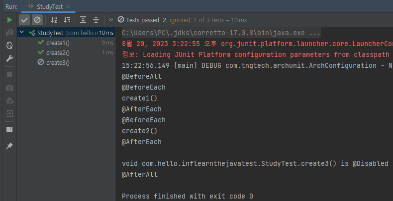
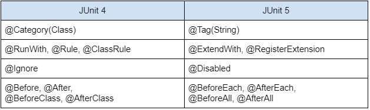

# JUnit

## `JUnit 소개`

JUnit은 자바 프로그래밍 언어를 위한 단위 테스트 프레임워크입니다. 단위 테스트는 프로그램의 작은 부분들이 예상대로 작동하는지를 확인하는 과정을 말합니다. JUnit은 이러한 단위 테스트를 효율적으로 작성하고 실행하도록 도와줍니다.  
 - Java 8 이상을 필요로 함
 - 그 외 테스트 라이브러리: TestNG, Spock 등
 - JUnit 5는 3가지 주요 모듈로 나뉜다.
    - Platform
        - 테스트를 실행해주는 런처 제공. TestEngine API 제공.
        - 해당 모듈은 테스트를 실행하는 데 필요한 기반을 제공한다. JUnit 5 테스트 엔진을 실행하고 테스트를 실행하기 위한 인프라를 제공한다.
    - Jupiter
        - TestEngine API 구현체로 JUnit 5를 제공.
        - 해당 모듈은 JUnit 5에서 새롭게 추가된 테스트 엔진으로 테스트 작성 및 실행을 지원하는 다양한 기능과 확장 포인트를 제공한다. '@Test'와 같은 주석을 사용하여 테스트 메서드를 정의하고, 매개변수화된 테스트, 중첩된 테스트 클래스, 조건부 실행과 같은 고급 테스트 기능도 포함된다.
    - Vintage
        - JUnit 4와 3을 지원하는 TestEngine 구현체.
        - 모듈은 JUnit 4 및 JUnit 3 스타일의 테스트를 JUnit 5 플랫폼에서 실행할 수 있도록 지원한다. 이를 통해 기존의 JUnit 4 테스트 코드를 새로운 JUnit 5 플랫폼에서도 계속 사용할 수 있다.
    - ※ Java는 Main 메소드만 실행이 가능하지만, JUnit Platform을 통해 @Test가 정의된 메소드가 실행이 가능하다. IDE가 테스트 코드인 경우 자체적으로 JUnit Platform을 통해 실행하도록 지원하여야 한다.

<br/>

## `JUnit 5 시작하기`

 - 프로젝트 만들기
    - Spring Boot 2.2 버전부터는 spring-boot-starter-test 의존성으로 JUnit 5 라이브러리를 사용하게 된다.
```
Project Metadata
 - Group: com.hello
 - Artifact: inflearn-the-java-test
 - Type: Maven Project
 - Language: Java
 - Packaging: Jar
 - Java Version: 11
 - Version: 0.0.1-SNAPSHOT
 - Name: inflearn-the-java-test
 - Description: Demo Project for Spring Boot
 - Package: com.hello.inflearnthejavatest
```

 - 테스트 코드 만들기
    - 'src/main' 폴더 하위에 클래스를 만들고, 해당 클래스에 테스트 코드를 만들고 싶은 경우 IntelliJ IDE인 경우 'Ctrl + Shift + T' 단축키를 사용할 수 있다.
    - JUnit 5 부터는 class와 method가 public일 필요가 없어졌다.
    - @Test: 테스트 메서드 정의
    - @Disabled: 해당 테스트는 실행하지 않음
    - @BeforeAll: 테스트 실행 전 딱 1번만 수행(초기화 작업)
    - @AfterAll: 모든 테스트 종료 후 딱 1번만 수행(정리 작업)
    - @BeforeEach: 각각 테스트 실행 전 한번씩 수행
    - @AfterEach: 각각 테스트 실행 후 한번씩 수행
```Java
// 'src/main/../Study.java'
public class Study {
}

// 'src/test/../StudyTest.java'
class StudyTest {

    @Test
    void create1() {
        Study study = new Study();
        assertNotNull(study);
        System.out.println("create1()");
    }

    @Test
    void create2() {
        Study study = new Study();
        assertNotNull(study);
        System.out.println("create2()");
    }

    @Disabled
    @Test
    void create3() {
        Study study = new Study();
        assertNotNull(study);
        System.out.println("create3()");
    }

    @BeforeAll
    static void beforeAll() {
        System.out.println("@BeforeAll");
    }


    @AfterAll
    static void afterAll() {
        System.out.println("@AfterAll");
    }

    @BeforeEach
    void beforeEach() {
        System.out.println("@BeforeEach");
    }

    @AfterEach
    void afterEach() {
        System.out.println("@AfterEach");
    }
}
```

<p style="text-align: center;">
     
</p>

<br/>

## `JUnit 5 테스트 이름 표시하기`

수행하는 테스트의 이름은 기본적으로 메서드명을 따른다.  
테스트명을 지정하고 싶은 경우에 @DisplayNameGeneration, @DisplayName 어노테이션을 사용할 수 있다.  

 - 참고: https://junit.org/junit5/docs/current/user-guide/#writing-tests-display-names
 - @DisplayNameGeneration
    - Method와 Class 레퍼런스를 사용해서 테스트 이름을 표기하는 방법 설정
    - 기본 구현체로 ReplaceUnderscores 제공
 - @DisplayName
    - 어떤 테스트인지 테스트 이름을 보다 쉽게 표현할 수 있는 방법을 제공하는 어노테이션
    - @DisplayNameGeneration 보다 우선 순위가 높다.
```Java
class StudyTest {

    @Test
    @DisplayName("스터디 만들기 😊")
    void create1() {
        Study study = new Study();
        assertNotNull(study);
        System.out.println("create1()");
    }

    @Test
    @DisplayName("스터디 만들기2 😎")
    void create2() {
        Study study = new Study();
        assertNotNull(study);
        System.out.println("create2()");
    }

    ..
}
```

<p style="text-align: center;">
     
</p>

<br/>

## `JUnit 5 Assertion`

Assertion(어설션)은 프로그램에서 특정 조건이 참(true)임을 명시적으로 검사하고, 조건이 참이 아닐 경우 프로그램 실행을 중단하거나 예외를 발생시키는 것을 말합니다. 어설션은 코드의 특정 지점에서 프로그램의 상태나 값이 올바른지를 검증하는 도구로 사용됩니다. 주로 디버깅, 테스트, 오류 발견 등에 활용됩니다.  

<br/>

JUnit 5는 다양한 종류의 테스트 어설션(assertion) 메서드를 제공하여 테스트 중에 예상 결과와 실제 결과를 비교하고 테스트를 판별하는 데 사용됩니다.  
 - assertEquals(expected, actual): 예상 결과와 실제 결과가 같은지 비교합니다. 이때 값의 타입과 내용이 같아야 합니다.
 - assertTrue(condition): 주어진 조건이 true인지 확인합니다.
 - assertFalse(condition): 주어진 조건이 false인지 확인합니다.
 - assertNull(object): 주어진 객체가 null인지 확인합니다.
 - assertNotNull(object): 주어진 객체가 null이 아닌지 확인합니다.
 - assertSame(expected, actual): 예상 결과와 실제 결과가 같은 객체를 참조하는지 확인합니다.
 - assertNotSame(expected, actual): 예상 결과와 실제 결과가 다른 객체를 참조하는지 확인합니다.
 - assertThrows(exceptionType, executable): 특정 종류의 예외가 발생하는지 확인합니다. executable에 실행 가능한 코드 블록을 전달합니다.
 - assertDoesNotThrow(executable): 어떠한 예외도 발생하지 않는지 확인합니다. executable에 실행 가능한 코드 블록을 전달합니다.
 - assertArrayEquals(expectedArray, actualArray): 예상 배열과 실제 배열이 같은지 비교합니다. 배열의 크기와 내용이 일치해야 합니다.
 - assertIterableEquals(expectedIterable, actualIterable): 예상 Iterable과 실제 Iterable이 같은지 비교합니다. 순서와 원소들이 일치해야 합니다.
 - assertLinesMatch(expectedLines, actualLines): 예상 라인 목록과 실제 라인 목록이 일치하는지 확인합니다. 정규 표현식과 함께 사용할 수 있습니다.
 - assertTimeout(duration, executable): 주어진 시간 내에 코드 블록이 완료되는지 확인합니다. 시간 초과가 발생하면 테스트 실패로 처리됩니다.
 - assertTimeoutPreemptively(duration, executable): assertTimeout과 비슷하지만, 코드 블록이 시간 초과 되더라도 중단하지 않고 계속 실행합니다.

```Java
// StudyStatus
public enum StudyStatus {
    DRAFT, OPENED, STARTED, ENDED
}

// Study
public class Study {

    private StudyStatus status = StudyStatus.DRAFT;
    private int limit;

    public Study(int limit) {
        this.limit = limit;
    }

    public StudyStatus getStatus() {
        return this.status;
    }
    public int getLimit() {
        return this.limit;
    }
}

// StudyTest
class StudyTest {

    @Test
    @DisplayName("스터디 만들기 😊")
    void create1() {
        Study study = new Study(10);
        assertNotNull(study);
        assertEquals(StudyStatus.DRAFT, study.getStatus(), "스터디를 처음 만들면 상태값이 DRAFT여야 한다.");
        assertTrue(study.getLimit() > 0, "스터디 최대 참석 가능 인원은 0보다 커야 한다.");
    }

    @Test
    @DisplayName("assertAll Assertion")
    void assertAllTest() {
        Study study = new Study(10);
        assertAll(
            () -> assertNotNull(study),
            () -> assertEquals(StudyStatus.DRAFT, study.getStatus(), "스터디를 처음 만들면 상태값이 DRAFT여야 한다."),
            () -> assertTrue(study.getLimit() > 0, "스터디 최대 참석 가능 인원은 0보다 커야 한다.")
        );
    }

    @Test
    @DisplayName("예외 발생 Assertion")
    void assertThrowsTest() {
        Executable exec = () -> {
            throw new IllegalArgumentException("IllegalArgumentException 예외 발생");
        };

        // assertThrows(Class<T> expectedType, Executable executable)
        // assertThrows(기대하는 예외, () -> 코드 실행);
        IllegalArgumentException exception = assertThrows(IllegalArgumentException.class, () -> exec.execute());
        assertEquals("IllegalArgumentException 예외 발생", exception.getMessage());
    }

    @Test
    @DisplayName("실행 시간 Assertion")
    void assertTimeoutTest() {
        // Thread.sleep(4000)으로 해당 메서드 수행이 4초가 걸리도록 한다.
        Executable exec = () -> {
            Thread.sleep(4000);
        };

        // assertTimeout(Duration timeout, Executable executable)
        // assertTimeout(제한시간, () -> 코드실행);
        // 3초를 예상했지만, 4초가 걸려 테스트 실패하게 된다.
        assertTimeout(Duration.ofSeconds(3), () -> exec.execute());
    }
}
```

<br/>

## `JUnit 5 조건에 따라 테스트 실행`

Assumptions은 테스트의 선행 조건을 확인하고, 조건을 만족하지 않으면 테스트를 건너뛰는 데 사용되는 클래스입니다. 테스트 메서드 실행 전에 특정 조건이 참인지 검사하고, 조건이 만족되지 않으면 해당 테스트를 실행하지 않습니다. 이를 통해 특정 환경 또는 조건에서만 실행되어야 하는 테스트를 관리할 수 있습니다.  
 - Assumptions 클래스는 정적 메서드로 이루어져 있으며, 주로 assumeTrue()과 assumeFalse() 메서드가 사용된다.
 - 그 외에도 @Enabled, @Disabled 어노테이션을 통해서도 실행될 테스트를 제어할 수 있다.

```Java
class MyClassTest {

    @Test
    void test1() {
        boolean condition = false;
        Assumptions.assumeTrue(condition, "Skipping test due to condition");

        // 테스트 로직 수행
        ..
    }

    @Test
    void test2() {
        String test_env = System.getenv("TEST_ENV");
        Assumptions.assumeTrue("LOCAL".equalsIgnoreCase(test_env), "해당 테스트는 스킵됩니다. 로컬인 경우에만 테스트를 진행합니다.");

        // 테스트 로직 수행
        ..
    }

    @Test
    void test3() {
        String test_env = System.getenv("TEST_ENV");
        Assumptions.assumingThat("LOCAL".equalsIgnoreCase(test_env), () -> {
            // 로컬 환경 테스트 로직 수행
            ..
        });

        Assumptions.assumingThat("PRODUCT".equalsIgnoreCase(test_env), () -> {
            // 운영 환경 테스트 로직 수행
            ..
        });
    }

    @Test
    @DisabledOnOs(OS.WINDOWS) // Widnows 운영체제가 아닌 경우에만 테스트 실행
    @EnabledOnJre({JRE.JAVA_8, JRE.JAVA_11}) // JRE 8, 11 버전에서만 테스트 실행
    void test4() {
        // 테스트 로직
    }
}
```

<br/>

## `JUnit 5 태깅과 필터링`


JUnit 5에서의 태깅과 필터링은 특정 테스트를 논리적으로 그룹화하거나 특정 조건에 따라 테스트를 선택적으로 실행하는 데 사용되는 기능입니다.  
 - 태깅(Tagging): 테스트 클래스 또는 메서드에 태그를 부여하여 관련된 테스트를 그룹화하고 식별하는 기능입니다. 테스트 클래스나 메서드에 @Tag 어노테이션을 사용하여 태그를 지정할 수 있습니다. 이를 활용하여 테스트들을 의미 있는 그룹으로 분류하거나, 기능별, 성능별, 통합 테스트 등의 다양한 관점으로 테스트를 구성할 수 있습니다.
 - 필터링(Filtering): 실행할 테스트를 선택적으로 결정하는 기능입니다. JUnit 5에서는 Gradle과 Maven과 같은 빌드 도구나 테스트 실행 명령어에 필터링 옵션을 추가하여 특정 태그가 포함된 테스트만 실행하거나, 특정 패턴과 일치하는 테스트만 실행할 수 있습니다. 이를 통해 테스트 스위트 내에서 특정 테스트를 선택적으로 실행할 수 있습니다.
    - IntelliJ IDEA인 경우 [Edit Configurations.. -> Build and run 항목 -> Tags -> 태그명 입력] 으로 태그를 통한 테스트 실행 옵션을 만들고 해당 테스트를 실행할 수 있다.
```Java
class MyClassTest {
    
    @Test
    @Tag("slow")
    void test_slow_operation() {
        // 테스트 로직
    }

    @Test
    @Tag("fast")
    void test_fast_operation() {
        // 테스트 로직
    }
}
```
 - Maven
    - Maven Goal 명령어로 테스트할 때 태깅과 필터링
    - 로컬에서 "./mvnw test" 수행시 fast 그룹만 테스트를 실행한다.
    - "./mvnw test -P ci"로 수행시 모든 테스트를 실행한다.
```XML
<profiles>
    <profile>
        <id>default</id>
        <activation>
            <activeByDefault>true</activeByDefault>
        </activation>
        <build>
            <plugins>
                <plugin>
                    <artifactId>maven-surefire-plugin</artifactId>
                    <configuration>
                        <groups>fast</groups>
                    </configuration>
                </plugin>
            </plugins>
        </build>
    </profile>
    <profile>
        <id>ci</id>
        <build>
            <plugins>
                <plugin>
                    <artifactId>maven-surefire-plugin</artifactId>
                </plugin>
            </plugins>
        </build>
    </profile>
</profiles>
```

<br/>

## `JUnit 5 커스텀 태그`

JUnit 5에서 제공하는 어노테이션을 메타 어노테이션으로 사용할 수 있다.  
즉, JUnit 5 어노테이션들을 조합하여 커스텀 태그를 만들 수 있다.  

 - @Tag("fast")의 경우 @Tag안에 "fast"라는 문자열을 정의하였다. 하지만, 이러한 경우 오타가 날 수 있다. 때문에, 미리 @FastTest라는 커스텀 태그를 만들어놓고 관리할 수 있다.
```Java
// FastTest 어노테이션 정의: @Test와 @Tag("fast")
@Target(ElementType.METHOD)
@Retention(RetentionPolicy.RUNTIME)
@Tag("fast")
@Test
public @interface FastTest {
}

// 사용 예시
class MyClassTest {

    @FastTest
    @DisplayName("빠른 테스트")
    void fast_test() {
        // 테스트 로직
    }

    @SlowTest
    @DisplayName("느린 테스트")
    void slow_test() {
        // 테스트 로직
    }
}
```

<br/>

## `JUnit 5 테스트 반복하기`

JUnit 5에서는 어노테이션을 통해 테스트를 쉽게 여러 번 반복할 수 있다.  
 - @RepeatedTest
    - 반복 횟수와 반복 테스트 이름을 설정할 수 있다.
        - {displayName}
        - {currentRepetition}
        - {totalRepetitions}
    - RepetitionInfo 타입의 인자를 받을 수 있다.
 - @ParameterizedTest
    - 테스트에 여러 다른 매개변수를 대입해가며 반복 실행한다.
         - {displayName}
         - {index}
         - {arguments}
         - {0}, {1}, ...
    - 인자 값들의 소스
        - @ValueSource
        - @NullSource, @EmptySource, @NullAndEmptySource
        - @EnumSource
        - @MethodSource
        - @CsvSource
        - @CvsFileSource
        - @ArgumentSource
        - 인자 값 타입 변환
            - 암묵적인 타입 변환: https://junit.org/junit5/docs/current/user-guide/#writing-tests-parameterized-tests-argument-conversion-implicit
            - 명시적인 타입 변환: SimpleArgumentConverter 구현체, @ConvertWith
        - 인자 값 조합
            - ArgumentsAccessor
            - 커스텀 Accessor
                - ArgumentsAggregator 인터페이스 구현, @AggregateWith
```Java
class MyClassTest {

    @DisplayName("반복 테스트")
    @RepeatedTest(value = 5, name = "{displayName}, {currentRepetition}/{totalRepetitions}")
    void repeatTest(RepetitionInfo repetitionInfo) {
        System.out.println(
            "현재 반복 횟수: " + repetitionInfo.getCurrentRepetition()
            ", 전체 반복 횟수: " + repetitionInfo.getTotalRepetitions()
            );
    }

    @DisplayName("파라미터 반복 테스트")
    @ParameterizedTest(name = "{index} {displayName} message={0}")
    @ValueSource(strings = {"Hello", "World"})
    void parameterizedTest(String message) {
        System.out.println(message);
    }

    // 단일 값 객체로 받기: SimpleArgumentConverter 구현
    @ParameterizedTest
    @ValueSource(ints = {10, 20, 40})
    void argumentConrvertTest(@ConvertWith(StudyConverter.class) Study study) {
        System.out.println(study.getLimit());
    }
    static class StudyConverter extends SimpleArgumentConverter {
        @Override
        protected Object convert(Object source, Class<?> targetType) throws ArgumentConversionException {
            assertEquals(Study.class, targetType, "Can only convert to Study")
            return new Study(Integer.parseInt(source.toString()));
        }
    }

    // 여러 값 받기: ArgumentsAccessor
    @ParameterizedTest
    @CsvSource({"10, '자바 스터디'", "20, '스프링 스터디'"})
    void argumentsAccessorTest(ArgumentsAccessor argumentsAccessor) {
        Study study = new Study(argumentsAccessor.getInteger(0), argumentsAccessor.getString(1));
    }

    // 여러 값 객체로 받기: ArgumentsAggregator 구현
    @ParameterizedTest
    @CsvSource({"10, '자바 스터디'", "20, '스프링 스터디'"})
    void argumentsAggregatorTest(@AggregateWith(StudyAggregator.class) Study study) {
        // 테스트 로직
    }
    static class StudyAggregator implements ArgumentsAggregator {
        @Override
        public Object aggregateArguments(ArgumentsAccessor argumentsAccessor, ParameterContext parameterContext) throws ArgumentsAggregationException {
            return new Study(argumentsAccessor.getInteger(0), argumentsAccessor.getString(1));
        }
    }
}
```

<br/>

## `JUnit 5 테스트 인스턴스`

테스트 인스턴스(test instance)란, 각 테스트 메서드마다 테스트 클래스의 새로운 인스턴스를 생성할지 여부를 지정하는 것을 말합니다.  
기본적으로 JUnit 5는 테스트 메서드마다 새로운 테스트 인스턴스를 생성합니다. 이는 테스트 메서드 간에 상호 영향을 주지 않기 위함입니다.  
 - @TestInstance 어노테이션을 사용하여 테스트 클래스의 테스트 인스턴스 모드를 지정할 수 있습니다.
    - Per Method (기본값): 각 테스트 메서드마다 새로운 테스트 인스턴스를 생성합니다. 테스트 메서드 간에 상호 독립적으로 실행되므로 서로 영향을 주지 않습니다.
    - Per Class: 테스트 클래스당 하나의 테스트 인스턴스를 생성합니다. 같은 테스트 클래스의 모든 테스트 메서드는 같은 테스트 인스턴스를 공유하게 됩니다. 이 모드에서는 테스트 간의 데이터 공유나 상태 공유가 가능합니다.
 - 기본 값은 테스트 메서드마다 새로운 테스트 클래스 인스턴스가 생성되어 전역 변수 값이 공유되지 않는다. 하지만, @TestInstance 어노테이션을 통해 PER_CLASS 설정으로 지정하면 테스트 인스턴스 하나만 생성되어 데이터 공유나 상태 공유가 가능해진다.
```Java
@TestInstance(TestInstance.Lifecycle.PER_CLASS)
public class MyTestClass {

    private int sharedValue = 0;

    @Test
    void test_method_1() {
        // Use 'sharedValue'
    }

    @Test
    void test_method_2() {
        // Use 'sharedValue'
    }
}
```

<br/>

## `JUnit 5 테스트 순서`

JUnit 5에서는 기본적으로 테스트 메서드의 실행 순서는 보장되지 않습니다. 이는 테스트 간의 독립성과 동시성을 유지하기 위한 것입니다.  
그러나 때로는 특정 테스트 메서드의 실행 순서를 제어하고 싶을 수 있습니다. 이런 경우 @TestMethodOrder 어노테이션을 사용하여 테스트 메서드의 실행 순서를 설정할 수 있습니다.  
 - MethodOrderer 구현체를 설정하여야 한다.
 - 기본 구현체
    - Alphanumeric, OrderAnnoation, Random
 - 추가적으로 @TestInstance의 PER_CLASS로 지정하여 같이 사용하면 자원 공유가 가능하여 Usecase 테스트를 작성하기에 용이하게 사용할 수 있다.
```Java
@TestMethodOrder(MethodOrderer.OrderAnnotation.class)
public class MyClassTest {

    @Test
    @Order(1)
    void test_method_1() {
        // Test logic here
    }

    @Test
    @Order(2)
    void test_method_2() {
        // Test logic here
    }

    @Test
    @Order(3)
    void test_method_3() {
        // Test logic here
    }
}
```

<br/>

## `JUnit 5 junit-platform.properties`

junit-platform.properties 파일은 JUnit 5 플랫폼에서 사용되는 구성 파일입니다. 이 파일은 클래스 패스의 루트 디렉토리에 위치하며, JUnit 5 플랫폼의 동작을 변경하고 구성하는 데 사용됩니다.  
 - JUnit 설정 파일로 클래스패스 루트(src/test/resources/)에 위치하면 된다.
 - 기본 포맷 지정: 테스트 리포트의 출력 형식, 레포터의 사용 여부 등을 설정할 수 있습니다.
 - 테스트 디스커버리와 실행 설정: 테스트 클래스와 메서드를 검색하는 방식, 실행 순서, 병렬 실행 등의 설정을 조정할 수 있습니다.
 - 테스트 실행 환경 설정: 시스템 프로퍼티, 환경 변수, 테스트 인스턴스 모드 등의 설정을 변경할 수 있습니다.
 - 확장 기능 활성화: 플러그인, 확장 기능 등을 활성화하거나 비활성화할 수 있습니다.
    - 테스트 인스턴스 라이프 사이클 설정
        - junit.jupiter.testinstance.lifecycle.default = per_class
    - 확장팩 자동 감지 기능
        - junit.jupiter.extensions.autodetection.enabled = true
    - @Disabled 무시하고 실행하기
        - junit.jupiter.conditions.deactivate = org.junit.*DisabledCondition
    - 테스트 이름 표기 전략 설정
        - junit.jupiter.displayname.generator.default = org.junit.jupiter.api.DisplayNameGenerator$ReplaceUnderscores

<br/>

## `JUnit 5 확장 모델`

확장 모델은 JUnit 5 플랫폼을 확장하고 사용자 정의 기능을 추가할 수 있는 기능을 말합니다. 확장 모델을 통해 JUnit 5의 기능을 확장하거나 커스터마이징하여 테스트 환경을 더욱 효과적으로 구축할 수 있습니다.  

 - 참고: https://junit.org/junit5/docs/current/user-guide/#extensions
 - JUnit 4의 확장 모델: @RunWith(Runner), TestRule, MethodRule.
 - JUnit 5의 확장 모델: Extension.
 - 확장팩 등록 방법
    - 선언적인 등록 @ExtendWith
    - 프로그래밍 등록 @RegisterExtension
    - 자동 등록 자바 ServiceLoader 이용
 - 확장팩 만드는 방법
    - 테스트 실행 조건
    - 테스트 인스턴스 팩토리
    - 테스트 인스턴스 후-처리기
    - 테스트 매개변수 리졸버
    - 테스트 라이프사이클 콜백
    - 예외 처리
    - ...

<br/>

```Java
// 1초 이상 수행되는 테스트에 대해서 @SlowTest 어노테이션 정의에 대해서 고려하라는 메시지 출력하는 Extension
public class FindSlowTestExtension implements BeforeTestExecutionCallback, AfterTestExecutionCallback {

    private static final long THRESHOLD = 1000L;

    @Override
    public void beforeTestExecution(ExtensionContext context) throws Exception {
        ExtensionContext.Store store = getStore(context);
        store.put("START_TIME", System.currentTimeMillis());
    }

    @Override
    public void afterTestExecution(ExtensionContext context) throws Exception {
        String testMethodName = context.getRequiredTestMethod().getName();
        ExtensionContext.Store store = getStore(context);
        long start_time = store.remove("START_TIME", long.class);
        long duration = System.currentTimeMillis() - start_time;
        if(duration > THRESHOLD) {
            System.out.printf("Please consider mark method [%s] with @SlowTest.\n", testMethodName);
        }
    }

    private ExtensionContext.Store getStore(ExtensionContext context) {
        String testClassName = context.getRequiredTestClass().getName();
        String testMethodName = context.getRequiredTestMethod().getName();
        ExtensionContext.Store store = context.getStore(ExtensionContext.Namespace.create(testClassName, testMethodName));
        return store;
    }
}

// 2초, 0.5초 동안 수행되는 테스트를 실행한다.
@ExtendWith(FindSlowTestExtension.class)
class MyClassTest {

    @Test
    @DisplayName("2초동안 수행되는 테스트")
    void test1() {
        Executable exec = () -> {
            Thread.sleep(2000);
        };

        assertTimeout(Duration.ofSeconds(3), () -> exec.execute());
    }

    @Test
    @DisplayName("0.5초동안 수행되는 테스트")
    void test2() {
        Executable exec = () -> {
            Thread.sleep(500);
        };

        assertTimeout(Duration.ofSeconds(3), () -> exec.execute());
    }
}
```
 - @RegisterExtension
    - @ExtendWith는 해당 확장 모델을 그대로 사용하여야 한다.
    - @RegisterExtension을 이용하면 확장 모델 인스턴스를 만드는데 직접 만들 수 있다. 즉, 생성자에 의존 객체를 넘겨준다거나, 매개변수가 존재하는 생성자에 매개변수를 직접 지정할 수 있다.
```Java
// FindSlowTestExtension
public class FindSlowTestExtension implements .. {
    private long  THRESHOLD;

    public FindSlowTestExtension(long THRESHOLD) {
        this.THRESHOLD = THRESHOLD;
    }

    ..
}

// MyClassTest
class MyClassTest {

    @RegisterExtension
    static FindSlowTestExtension findSlowTestExtension = new FindSlowTestExtension(1000L);

    ..
}
```

<br/>

## JUnit 5 마이그레이션

junit-vintage-engine을 의존성으로 추가하면, JUnit 5의 junit-platform으로 JUnit 3과 4로 작성된 테스트를 실행할 수 있다.  
 - @Rule은 기본적으로 지원하지 않지만, junit-jupiter-migrationsupport 모듈이 제공하는 @EnableRuleMigrationSupport를 사용하면 다음 타입의 Rule을 지원한다.
    - ExternalResource
    - Verifier
    - ExpectedException

<p style="text-align: center;">
     
</p>