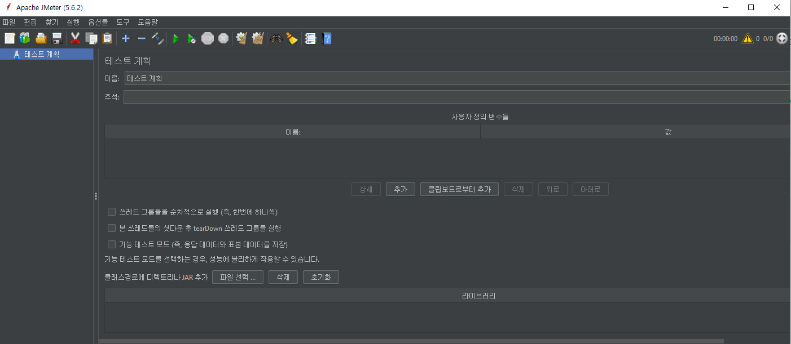
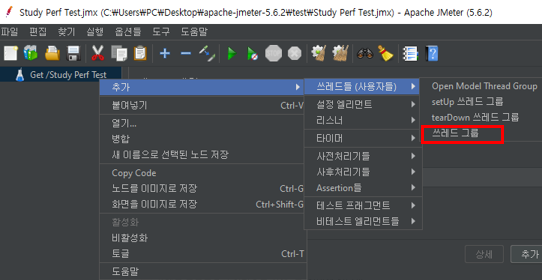
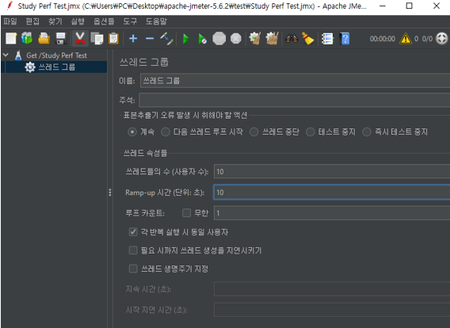
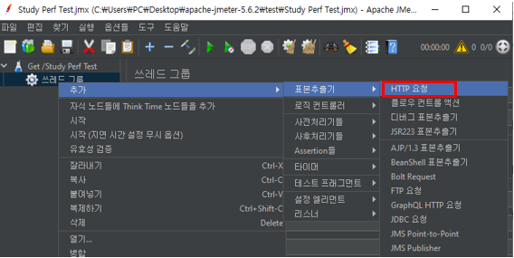
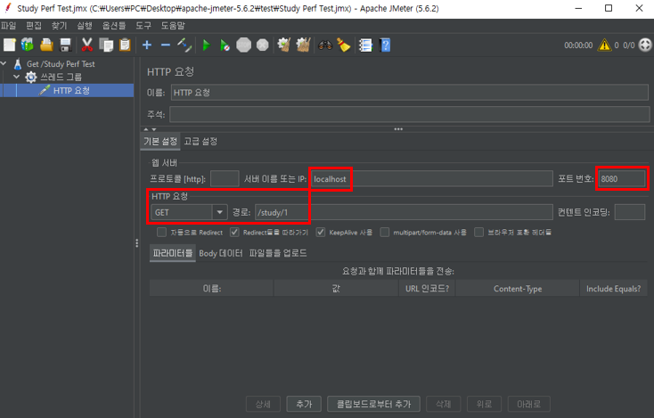
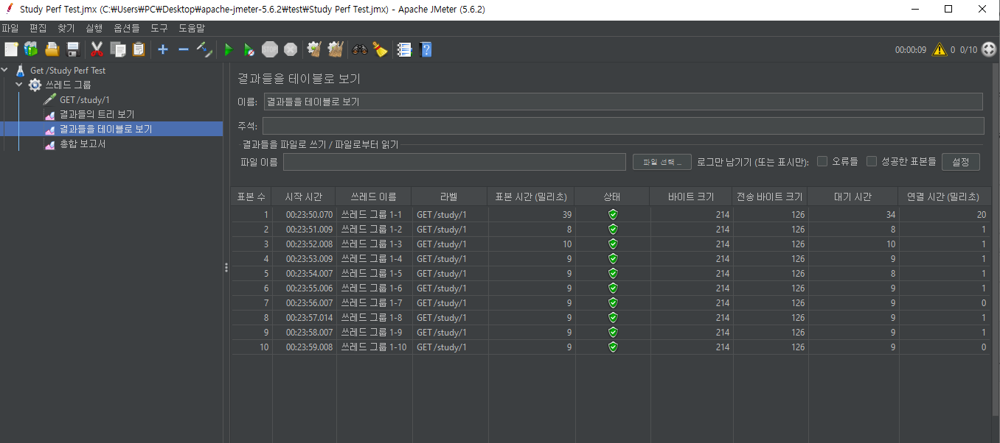
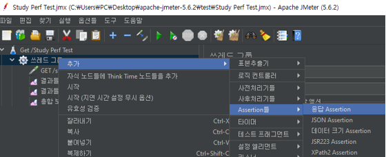
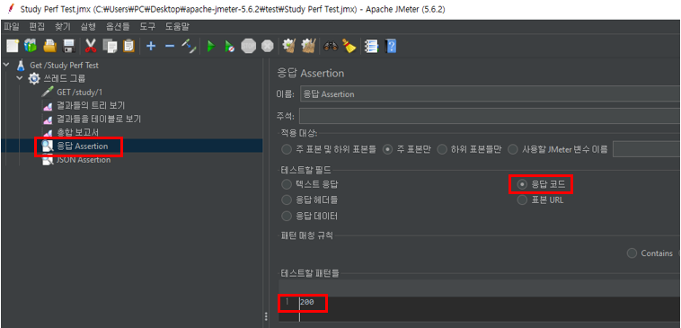
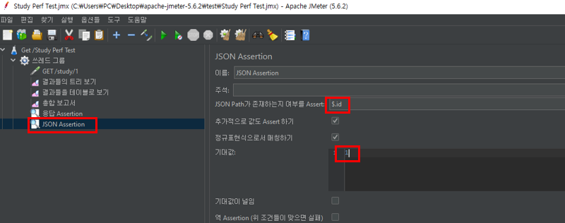

# 성능 테스트

## JMeter 소개

Apache JMeter는 자바 기반의 오픈 소스로 개발된 성능 테스트 및 부하 테스트 도구입니다. JMeter를 사용하면 다양한 유형의 소프트웨어, 웹 응용 프로그램, 웹 서비스 등에 대한 성능 및 부하 테스트를 수행할 수 있습니다. 주로 웹 응용 프로그램의 성능을 측정하고 테스트하는 데 사용되지만, 다른 프로토콜과 시스템에도 확장해서 사용할 수 있습니다.  
 - https://jmeter.apache.org/
 - 다양한 프로토콜 지원: JMeter는 HTTP, HTTPS, FTP, JDBC, SOAP, REST, JMS 등 다양한 프로토콜을 지원합니다. 이를 통해 다양한 유형의 응용 프로그램 및 서비스에 대한 성능 테스트를 수행할 수 있습니다.
 - 사용자 시뮬레이션: JMeter는 가상 사용자를 생성하여 웹 응용 프로그램에 부하를 가할 수 있습니다. 이를 통해 여러 사용자가 동시에 웹 사이트나 애플리케이션을 사용하는 상황을 시뮬레이션하며 성능을 테스트할 수 있습니다.
 - 테스트 계획 및 시나리오: JMeter는 다양한 테스트 계획 및 시나리오를 생성하고 구성할 수 있습니다. 테스트 계획은 테스트 대상, 사용자 수, 스레드 그룹, 루프, 지연 시간 등을 포함할 수 있습니다.
 - 그래픽 사용자 인터페이스: JMeter는 GUI(Graphical User Interface)를 제공하여 사용자가 테스트 계획을 시각적으로 구성하고 테스트 결과를 모니터링할 수 있습니다.
 - 플러그인 확장성: JMeter는 플러그인을 통해 기능을 확장할 수 있습니다. 다양한 플러그인을 사용하여 추가적인 프로토콜 지원 및 리포팅 기능을 추가할 수 있습니다.
 - 다양한 리포트 제공: JMeter는 테스트 결과를 다양한 형식의 리포트로 제공합니다. 그래프, 테이블, 트리 등을 사용하여 테스트 결과를 분석하고 시각화할 수 있습니다.
 - 스크립트 레코딩: JMeter는 웹 브라우저의 동작을 녹화하여 테스트 스크립트를 생성하는 기능을 제공합니다. 이를 통해 스크립트 작성을 더 간편하게 할 수 있습니다.

```
★ 다양한 형태의 애플리케이션 테스트 지원
 - 웹 - HTTP, HTTPS
 - SOAP / REST 웹 서비스
 - FTP
 - 데이터베이스 (JDBC 사용)
 - Mail (SMTP, POP3, IMAP)

★ CLI 지원
 - CI 또는 CD 툴과 연동할 때 편리함.
 - UI 사용하는 것보다 메모리 등 시스템 리소스를 적게 사용.

★ 주요 개념
 - Thread Group: 한 쓰레드 당 유저 한명
 - Sampler: 어떤 유저가 해야 하는 액션
 - Listener: 응답을 받았을 할 일 (리포팅, 검증, 그래프 그리기 등)
 - Configuration: Sampler 또는 Listener가 사용할 설정 값 (쿠키, JDBC 커넥션 등)
- Assertion: 응답이 성공적인지 확인하는 방법 (응답 코드, 본문 내용 등)

★ 대체 라이브러리
 - Gatling
 - nGrinder
```

<br/>

## JMeter 설치

Apache JMeter 홈페이지에 접속하고, [Binaries - apache-jmeter-버전.zip] 파일을 다운로드 받는다.  
이후 /bin 디렉토리 하위로 이동하여 JMeter를 실행할 수 있다.  
Windows인 경우 jmeter.bat 혹은 ApacheJMeter.jar, Mac인 경우 jmeter.sh  
 - https://jmeter.apache.org/download_jmeter.cgi

<p style="text-align: center;">
     
</p>

<br/>

## JMeter 사용하기

성능 테스트할 애플리케이션을 실행하고, JMeter를 실행한다.  
제대로된 성능 테스트를 하기 위해서는 애플리케이션 서버와 JMeter를 사용하는 서버가 달라야한다.  

<br/>

### Thread Group 만들기

Thread Group은 테스트 실행을 제어하는 기본적인 요소로 테스트 시나리오의 스레드 그룹, 사용자 수, 루프 횟수 등을 설정할 수 있다.  
각 쓰레드는 사용자를 나타내며, 쓰레드 그룹 내에서 지정한 수만큼의 동시 사용자가 웹 애플리케이션 등을 사용하는 행동을 시뮬레이션한다.  

 - Action to be taken after a Sampler error
    - 샘플러가 에러가 났을 때 취할 행동
 - Thread Properties
    - Number of Threads (users): 쓰레드 개수
    - Ramp-up period (seconds): 쓰레드 개수를 만드는데 소요할 시간
    - Loop Count: infinite를 체크하면 위에서 정한 쓰레드 개수로 계속 요청을 보냄. 값을 입력하면 해당 쓰레드 개수 X 루프 개수 만큼 요청을 보냄.
<p style="text-align: center;">
     
</p>
<p style="text-align: center;">
     
</p>

<br/>

### Sampler 만들기

Sampler는 실제 테스트 작업을 수행하는 역할을 한다.  
다양한 프로토콜과 방식을 지원하는 Sampler가 있으며, 각각의 Sampler는 특정 작업(HTTP 요청, 데이터베이스 쿼리 실행 등)을 실행한다.  
Sampler를 사용하여 테스트 대상 시스템과의 상호 작용을 모델링하고 시뮬레이션한다.  

 - HTTP Request 샘플러
    - 요청을 보낼 호스트, 포트, URI, 요청 본문 등을 설정
    - 여러 샘플러를 순차적으로 등록하는 것도 가능하다.

<p style="text-align: center;">
     
</p>
<p style="text-align: center;">
     
</p>

<br/>

### Listener 만들기

Listener는 테스트 결과 및 통계 정보를 수집하고 표시하는 데 사용된다.  
각각의 Sampler가 생성하는 결과 및 리포트를 Listener를 통해 볼 수 있다.  
다양한 리포팅 형식을 지원하며, 그래프, 테이블, 트리 등을 사용하여 테스트 결과를 분석하고 시각화할 수 있다.  

 - View Results Tree (결과들의 트리 보기)
 - View Results in Table (결과들을 테이블로 보기)
 - Summary Report (총합 보고서)
 - Aggregate Report
 - Response Time Graph
 - Graph Results

<div align="center">
     
</div>
<div align="center">
     
</div>
<div align="center">
    View Results in Table 결과 화면
</div>

<br/>

### Assertion 만들기

Assertion은 테스트 결과의 유효성을 검증하는 데 사용된다.  
특정 Sampler의 응답을 확인하고 예상한 결과와 일치하는지를 확인하거나, 특정 조건을 만족하는지를 확인할 수 있다.  
Assertion을 통해 테스트 결과가 예상한 대로 동작하는지를 검증할 수 있다.  
 - 기본적으로 200번대 요청에 대해서 JMeter 결과 보고서로 성공으로 표시가 된다.
 - 하지만, 특정한 경우에만 성공으로 간주하고 싶은 경우 Assertion을 추가하면 된다.
<div align="center">
     
</div>
<div align="center">
     
</div>
<div align="center">
    HTTP 응답 코드가 200인 경우에만 성공
</div>
<div align="center">
     
</div>
<div align="center">
    HTTP Message Body에 JSON 형태로 id 필드가 "1"인 경우에만 성공
</div>

<br/>

### CLI로 사용하기

JMeter를 실행하고 테스트를 지정하면 파일로 저장된다.  
결론적으로 GUI 툴로 테스트 설정의 내용을 담은 XML 파일이 만들어진다.  
해당 XML 파일을 읽어 CLI로 실행할 수 있다.  
 - jmeter -n -t 설정 파일 -l 리포트 파일
 - ex) jmeter -n -t Test.jmx

