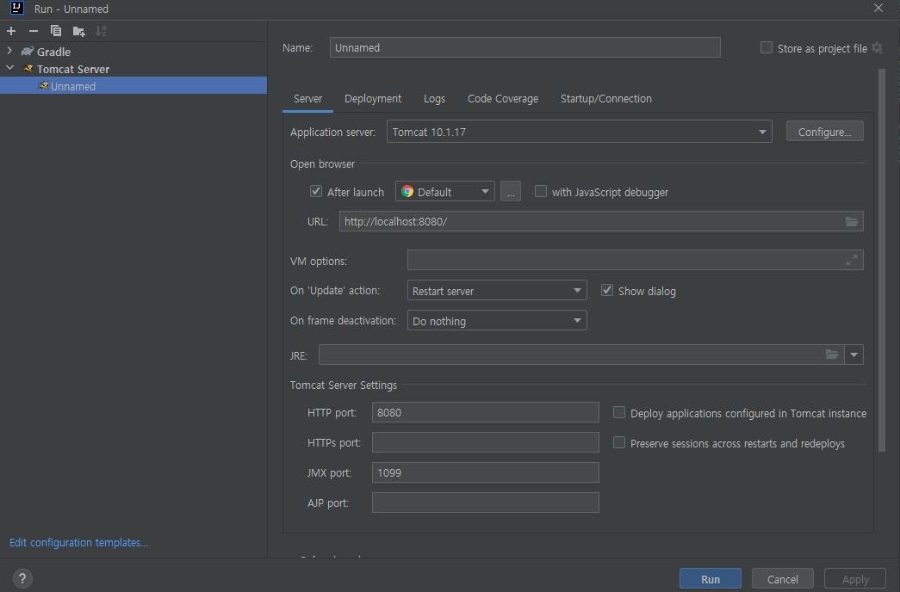

# 톰캣 설정 - IntelliJ

## 인텔리J 유료 버전 설정

인텔리J 유료 버전에는 톰캣 지원이 포함되어 있다.  

```
1. Run 설정 이동
 - Run > Run... > Edit Configurations...

2. 톰캣 서버 추가
 - + 버튼 클릭 > Tomcat Server > Local
    - Server 옵션
        - Application server: 설치한 톰캣 경로 지정
    - Deployment 옵션
        - + 버튼 > Artifact.. > war(exploded)
        - Application context: 지우기
```

<div align="center">
    
</div>

<br/>

## 인텔리J 무료 버전 설정

 - `gradle 설정`
    - 'build.build'에 내용을 추가한다.
    - ./gradlew explodeWar
```gradle
task explodeWar(type: Copy) {
    into "$buildDir/exploded"
    with war
}
```

<br/>

 - `플러그인 설치`
```
 - File > Settings.. > Plugins
    - Tomcat 검색 후 Tomcat runner 플러그인 설치
```

 - `톰캣 설정`
```
1. Run 설정 이동
 - Run > Run... > Edit Configurations...

2. 톰캣 러너 추가
 - + 버튼 클릭 > Tomcat Runner
    - Tomcat installation: 설치한 톰캣 경로 지정
    - Modules: 
        - Context: /
        - Doc. base: build/exploded/
    - Before launch
        - Build
        - Run Gradle Task
            - explodedWar
```
