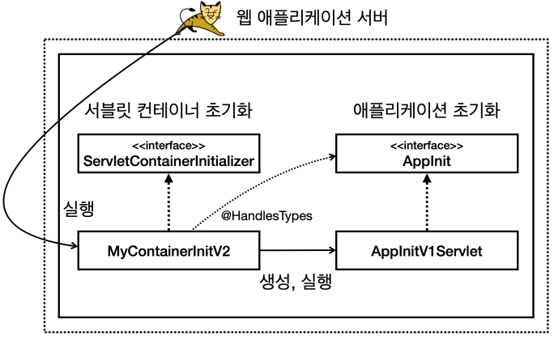

# 서블릿 컨테이너 초기화

WAS를 실행하는 시점에 필요한 초기화 작업들이 있다. 서비스에 필요한 필터와 서블릿을 등록하고, 만약 스프링을 사용한다면 스프링 컨테이너를 만들고, 서블릿과 스프링을 연결하는 디스패처 서블릿을 등록하여야 한다.  

WAS가 제공하는 초기화 기능을 사용하면, WAS 실행 시점에 이러한 초기화 과정을 진행할 수 있다. 과거에는 'web.xml'을 사용하여 초기화를 했지만, 지금은 서블릿 스팩에서 자바 코드를 사용한 초기화도 지원한다.  

<br/>

### 서블릿 컨테이너 초기화 개발

 - `ServletContainerInitializer`
    - 서블릿은 'ServletContainerInitializer'라는 초기화 인터페이스를 제공한다. 서블릿 컨테이너는 실행 시점에 초기화 메서드인 onStartup()을 호출해준다. 여기서 애플리케이션에 필요한 기능들을 초기화 하거나 등록할 수 있다.
    - 'Set<Class<?>>': @HandlesTypes 어노테이션과 함께 사용하며, 조금 더 유연한 초기화 기능을 제공한다.
    - 'ServletContext': 서블릿 컨테이너 자체 기능을 제공한다. 해당 객체로 필터나 서블릿을 등록할 수 있다.
```java
public interface ServletContainerInitializer {
    public void onStartup(Set<Class<?>> c, ServletContext ctx) throws ServletException;
}
```

<br/>

 - `MyContainerInitV1`
    - ServletContainerInitializer을 구현한 클래스를 생성한다.
```java
package hello.container;

import jakarta.servlet.ServletContainerInitializer;
import jakarta.servlet.ServletContext;
import jakarta.servlet.ServletException;

import java.util.Set;

public class MyContainerInitV1 implements ServletContainerInitializer {
    @Override
    public void onStartup(Set<Class<?>> c, ServletContext ctx) throws ServletException {
        System.out.println("MyContainerInitV1.onStartup");
        System.out.println("MyContainerInitV1 c = " + c);
        System.out.println("MyContainerInitV1 ctx = " + ctx);
    }
}
```

<br/>

 - `ServletContainerInitializer`
    - 'resources' 폴더 아래에 'META-INF/services/jakarta.servlet/ServletContainerInitializer' 파일을 만든다.
    - 해당 파일안에 초기화 클래스를 정의해준다.
```
hello.container.MyContainerInitV1
```

<br/>

### 서블릿 컨테이너 초기화2

서블릿을 등록하는 방법으로는 @WebServlet 어노테이션을 이용하는 방식과 코드로 직접 등록하는 프로그래밍 방식 2가지가 존재한다.  

@WebServlet 어노테이션을 사용하면 편리하게 서블릿을 등록할 수 있다. 하지만, 어노테이션 방식을 사용하면 유연하게 변경하는 것이 어렵다.  

프로그래밍 방식은 코드를 더 많이 작성해야 하고 불편하지만 무한한 유연성을 제공한다. 상황에 따라서 경로를 외부 설정을 읽어서 등록할 수 있고, 서블릿 자체를 특정 조건에 따라서 조건문으로 분기하여 등록하거나 뺼 수 있다. 또한, 서블릿을 생성할 떄 생성자에 필요한 정보를 넘길 수도 있다.  

 - `HelloServlet`
```java
package hello.servlet;

import jakarta.servlet.ServletException;
import jakarta.servlet.http.HttpServlet;
import jakarta.servlet.http.HttpServletRequest;
import jakarta.servlet.http.HttpServletResponse;

import java.io.IOException;

public class HelloServlet extends HttpServlet {
    @Override
    protected void service(HttpServletRequest req, HttpServletResponse resp) throws ServletException, IOException {
        System.out.println("HelloServlet.service");
        resp.getWriter().println("hello servlet!");
    }
}
```

<br/>

 - `AppInit 인터페이스`
```java
package hello.container;

import jakarta.servlet.ServletContext;

public interface AppInit {
    void onStartup(ServletContext servletContext);
}
```

<br/>

 - `AppInitV1Servlet`
```java
package hello.container;

import hello.servlet.HelloServlet;
import jakarta.servlet.ServletContext;
import jakarta.servlet.ServletRegistration;

public class AppInitV1Servlet implements AppInit {
    @Override
    public void onStartup(ServletContext servletContext) {
        System.out.println("AppInitV1Servlet.onStartup");

        // 순수 서블릿 코드 등록
        ServletRegistration.Dynamic helloServlet =
                servletContext.addServlet("helloServlet", new HelloServlet());
        helloServlet.addMapping("/hello-servlet");
    }
}
```

<br/>

---

 - `MyContainerInitV2`
    - @HandlesTypes 으로 인터페이스를 지정하면, 인터페이스의 구현체들을 onStartup() 메서드의 c 매개변수에 넘겨준다.
    - 넘겨받은 인터페이스 구현체를 이용하여 유연하게 서블릿을 등록할 수 있다.
```java
package hello.container;

import jakarta.servlet.ServletContainerInitializer;
import jakarta.servlet.ServletContext;
import jakarta.servlet.ServletException;
import jakarta.servlet.annotation.HandlesTypes;

import java.util.Set;

@HandlesTypes(AppInit.class)
public class MyContainerInitV2 implements ServletContainerInitializer {
    @Override
    public void onStartup(Set<Class<?>> c, ServletContext ctx) throws ServletException {
        System.out.println("MyContainerInitV2.onStartup");
        System.out.println("MyContainerInitV2 c = " + c);
        System.out.println("MyContainerInitV2 ctx = " + ctx);

        for (Class<?> appInitClass : c) {
            try {
                AppInit appInit = (AppInit) appInitClass.getDeclaredConstructor().newInstance();
                appInit.onStartup(ctx);
            } catch (Exception e) {
                throw new RuntimeException(e);
            }

        }
    }
}
```

<br/>

 - `META-INF/services/ServletContainerInitializer`
```
hello.container.MyContainerInitV1
hello.container.MyContainerInitV2`
```

<br/>

---

### 애플리케이션 초기화 과정

 -  @HandlesTypes 애노테이션에 애플리케이션 초기화 인터페이스를 지정한다.
    - 여기서는 앞서 만든 AppInit.class 인터페이스를 지정했다.
 - 서블릿 컨테이너 초기화( ServletContainerInitializer )는 파라미터로 넘어오는 Set<Class<?>> c 에 애플리케이션 초기화 인터페이스의 구현체들을 모두 찾아서 클래스 정보로 전달한다.
    - 여기서는 @HandlesTypes(AppInit.class) 를 지정했으므로 AppInit.class 의 구현체인 AppInitV1Servlet.class 정보가 전달된다.
    - 참고로 객체 인스턴스가 아니라 클래스 정보를 전달하기 때문에 실행하려면 객체를 생성해서 사용해야 한다.
 - appInitClass.getDeclaredConstructor().newInstance()
    - 리플렉션을 사용해서 객체를 생성한다. 참고로 이 코드는 new AppInitV1Servlet() 과 같다 생각하면 된다.
 - appInit.onStartup(ctx)
    - 애플리케이션 초기화 코드를 직접 실행하면서 서블릿 컨테이너 정보가 담긴 ctx 도 함께 전달한다.

<div align="center">
    <br/>
    1. 서블릿 컨테이너 초기화 실행 <br/>
    2. 애플리케이션 초기화 실행(@HandlesTypes)
</div>

