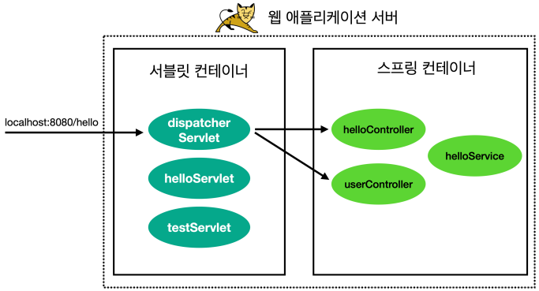

# 스프링 컨테이너 등록

 - 스프링 컨테이너 만들기
 - 스프링 MVC 컨트롤러를 스프링 컨테이너 빈으로 등록하기
 - 스프링 MVC를 사용하는데 필요한 디스패처 서블릿을 서블릿 컨테이너에 등록하기

<div align="center">
    
</div>

<br/>

 - `build.gradle`
    - Spring MVC 관련 라이브러리 의존성을 추가한다.
    - spring-webmvc 라이브러리를 추가하면 스프링 MVC 뿐만 아니라 spring-core 를 포함한 스프링 핵심 라이브러리들도 함께 포함된다.
```
dependencies {
    //서블릿
    implementation 'jakarta.servlet:jakarta.servlet-api:6.0.0'

    //스프링 MVC 추가
    implementation 'org.springframework:spring-webmvc:6.0.4'
}
```

<br/>

 - `HelloController`
```java
package hello.spring;

import org.springframework.web.bind.annotation.GetMapping;
import org.springframework.web.bind.annotation.RestController;

@RestController
public class HelloController {

    @GetMapping("/hello-spring")
    public String hello() {
        System.out.println("HelloController.hello");
        return "Hello Spring!";
    }
}
```

<br/>

 - `HelloConfig`
```java
package hello.spring;

import org.springframework.context.annotation.Bean;
import org.springframework.context.annotation.Configuration;

@Configuration
public class HelloConfig {

    @Bean
    public HelloController helloController() {
        return new HelloController();
    }
}
```

<br/>

 - `AppInitV2Spring`
    - AppInit 인터페이스를 구현하여 자동으로 onStartup() 메서드가 호출되도록 한다.
    - 여기서, 스프링 컨테이너 생성과 디스패처 서블릿을 만들어 서블릿 컨테이너에 등록하는 과정을 정의한다.
```java
package hello.container;

import hello.spring.HelloConfig;
import jakarta.servlet.ServletContext;
import jakarta.servlet.ServletRegistration;
import org.springframework.web.context.support.AnnotationConfigWebApplicationContext;
import org.springframework.web.servlet.DispatcherServlet;

public class AppInitV2Spring implements AppInit {
    @Override
    public void onStartup(ServletContext servletContext) {
        System.out.println("AppInitV2Spring.onStartup");

        // 스프링 컨테이너 생성
        AnnotationConfigWebApplicationContext appContext = new AnnotationConfigWebApplicationContext();
        appContext.register(HelloConfig.class);

        // 스프링 MVC 디스패처 서블릿 생성, 스프링 컨테이너 연결
        DispatcherServlet dispatcher = new DispatcherServlet(appContext);
        
        // 디스패처 서블릿을 서블릿 컨테이너에 등록
        ServletRegistration.Dynamic servlet = servletContext.addServlet("dispatcherV2", dispatcher);

        // '/spring/*' 요청이 디스패처 서블릿을 통하도록 설정
        servlet.addMapping("/spring/*");
    }
}
```

