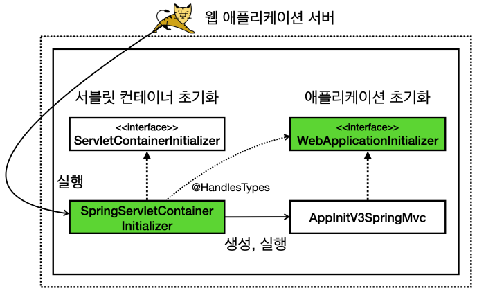

# 스프링 MVC 서블릿컨테이너 초기화 지원

서블릿 컨테이너를 초기화하기 위해서 ServletContainerInitializer 인터페이스를 구현해서 서블릿 컨테이너 초기화 코드를 만들었다. 여기에 애플리케이션 초기화를 만들기 위해 @HandlesTypes 애노테이션을 적용하였고, /META-INF/services/jakarta.servlet.ServletContainerInitializer 파일에 서블릿 컨테이너 초기화 클래스 경로를 등록했다.  

서블릿 컨테이너 초기화 과정은 상당히 번거롭고 반복되는 작업이다. 스프링 MVC는 이러한 서블릿 컨테이너 초기화 작업을 이미 만들어두어, 개발자가 서블릿 컨테이너 초기화 과정을 생략하고, 애플리케이션 초기화 코드만 작성하면 된다.  
즉, 스프링이 지원하는 애플리케이션 초기화를 사용하기 위해 인터페이스만 구현하면 된다.  

 - `WebApplicationInitalizer`
```java
package org.springframework.web;

public interface WebApplicationInitializer {
	void onStartup(ServletContext servletContext) throws ServletException;

}
```

<br/>

---

 - `AppInitV3SpringMvc`
    - WebApplicationInitializer 구현체를 만든다.
```java
package hello.container;

import hello.spring.HelloConfig;
import jakarta.servlet.ServletContext;
import jakarta.servlet.ServletException;
import jakarta.servlet.ServletRegistration;
import org.springframework.web.WebApplicationInitializer;
import org.springframework.web.context.support.AnnotationConfigWebApplicationContext;
import org.springframework.web.servlet.DispatcherServlet;

public class AppInitV3SpringMvc implements WebApplicationInitializer {
    @Override
    public void onStartup(ServletContext servletContext) throws ServletException {
        System.out.println("AppInitV3SpringMvc.onStartup");

        // 스프링 컨테이너 생성
        AnnotationConfigWebApplicationContext appContext = new AnnotationConfigWebApplicationContext();
        appContext.register(HelloConfig.class);

        // 스프링 MVC 디스패처 서블릿 생성, 스프링 컨테이너 연결
        DispatcherServlet dispatcher = new DispatcherServlet(appContext);

        // 디스패처 서블릿을 서블릿 컨테이너에 등록
        ServletRegistration.Dynamic servlet = servletContext.addServlet("dispatcherV3", dispatcher);

        // 모든 요청이 디스패처 서블릿을 통하도록 설정
        servlet.addMapping("/");
    }
}
```

<br/>

## 스프링 MVC가 제공하는 서블릿 컨테이너 초기화 분석

스프링은 어떻게 WebApplicationInitializer 인터페이스 하나로 애플리케이션 초기화가 가능하게 할까? 스프링도 결국 서블릿 컨테이너에서 요구하는 부분을 모두 구현해야 한다.  

spring-web 라이브러리를 열어보면 서블릿 컨테이너 초기화를 위한 등록 파일을 확인할 수 있다. 그리고 이곳에 서블릿 컨테이너 초기화 클래스가 등록되어 있다.  

 - `spring-web-*.jar/META-INF/services/jakarta.servlet.ServletContainerInitializer`
```
org.springframework.web.SpringServletContainerInitializer
```

<br/>

 - `SpringServletContainerInitializer`
    - @HandlesTypes 의 대상이 WebApplicationInitializer이다.
    - WebApplicationInitializer 인터페이스 구현체를 생성하고, 실행한다.
```java
@HandlesTypes(WebApplicationInitializer.class)
public class SpringServletContainerInitializer implements
ServletContainerInitializer {}
```

<div align="center">
    
</div>

