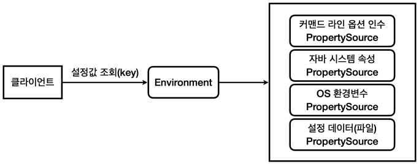

# 외부 설정

## 외부 설정 - OS 환경 변수

OS 환경 변수는 해당 OS를 사용하는 모든 프로그램에서 읽을 수 있는 설정값이다. OS 환경 변수는 해당 프로그램 뿐만 아니라 OS 내에 다른 모든 프로그램에서도 사용할 수 있다.  

 - `환경 변수 확인`
    - Windows: set 명령어
    - Mac, Linux: printenv 명령어
```bash
$ printenv
```

<br/>

 - `OsEnv`
    - System.getenv() 메서드로 OS 환경 변수를 조회할 수 있다.
    - getenv()는 Map으로 반환하고, getenv(key)는 String을 반환한다.
```java
import lombok.extern.slf4j.Slf4j;

import java.util.Map;

@Slf4j
public class OsEnv {

    public static void main(String[] args) {
        Map<String, String> envMap = System.getenv();
        for (String key : envMap.keySet()) {
            log.info("env {}={}", key, System.getenv(key));
        }
    }
}
```

<br/>

## 외부 설정 - 자바 시스템 속성

자바 시스템 속성(Java System properties)은 실행한 JVM 안에서 접근 가능한 외부 설정이다.  

 - `자바 시스템 속성 실행 예시`
    - '-D' VM 옵션을 통해서 key=value 형식으로 자바 시스템 속성을 추가할 수 있다.
```bash
$ java -Durl=dev -jar app.jar
```

<br/>

 - `JavaSystemProperties`
    - System.getProperties() 를 사용하면 Map 과 유사한( Map 의 자식 타입) key=value 형식의 Properties 를 받을 수 있다. 이것을 통해서 모든 자바 시스템 속성을 조회할 수 있다.
    - System.getProperty(key) 메서드로 속성값을 조회할 수 있다.
    - __IntelliJ VM 옵션 추가__
        - Edit Configurations... > Modify options > Add VM options
        - '-Durl=devdb -Dusername=dev_user -Dpassword=dev_pw' 입력
    - __Jar 실행시 VM 옵션 추가__
        - 'java -Durl=devdb -Dusername=dev_user -Dpassword=dev_pw -jar app.jar'
```java
import lombok.extern.slf4j.Slf4j;

import java.util.Properties;

@Slf4j
public class JavaSystemProperties {

    public static void main(String[] args) {

        Properties properties = System.getProperties();
        for (Object key : properties.keySet()) {
            log.info("prop {}={}", key, System.getProperty(String.valueOf(key)));
        }

        // -Durl=devdb -Dusername=dev_user -Dpassword=dev_pw
        String url = System.getProperty("url");
        String username = System.getProperty("username");
        String password = System.getProperty("password");

        log.info("url={}", url);
        log.info("username={}", username);
        log.info("password={}", password);
    }
}
```

<br/>

 - `자바 시스템 속성을 자바 코드로 설정하기`
    - 자바 시스템 속성은 Jar 실행시 -D 옵션을 통해 실행 시점에 전달하는 것도 가능하고, 자바 코드 내부에서 추가하는 것도 가능하다.
```JAVA
// 설정
System.setProperty(propertyName, "propertyValue")

// 조회
System.getProperty(propertyName)
```

<br/>

## 외부 설정 - 커맨드 라인 인수

커맨드 라인 인수(Command line arguments)는 애플리케이션 실행 시점에 외부 설정값을 main(args) 메서드의 args 파라미터로 전달하는 방법이다.  

만약, 커맨드 라인 인수에 key=value 형식으로 전달하는 경우에도 파싱되지 않은 통 문자가 전달이 된다. 이 경우 개발자가 직접 '='을 기준으로 직접 데이터를 파싱해서 key=value 형식에 맞도록 분리해야 한다. 이 경우 형식이 배열이기 떄문에 루프를 돌면서 원하는 데이터를 찾아야 하는 번거로움이 있다.  

 - `커맨드 라인 인수 전달 방법`
    - 커맨드 라인 인수는 필요한 데이터를 마지막 위치에 공백문자로 구분해서 전달한다.
    - 아래 예시 코드는 dataA, dataB 2개의 문자가 args[] 에 전달된다.
```bash
$ java -jar app.jar dataA dataB
```

<br/>

 - `CommandLineV1`
```java
import lombok.extern.slf4j.Slf4j;

@Slf4j
public class CommandLineV1 {

    public static void main(String[] args) {
        for (String arg : args) {
            log.info("arg {}", arg);
        }
    }
}
```

<br/>

## 외부 설정 - 커맨드 라인 옵션 인수

일반적으로 커맨드 라인에 전달하는 값은 형식이 없고 단순히 공백문자로 구분하여 전달된다. 즉, key=value 형식으로 값이 전달되지 않는다.  

스프링에서는 커맨드 라인 인수를 key=value 형식으로 편리하게 사용할 수 있도록 스프링만의 표준 방식을 제공한다. 스프링은 커맨드 라인에 '-' 문자 2개를 연결해서 시작하면 key=value 형식으로 정하고 이것을 커맨드 라인 옵션 인수라고 한다. 해당 방식은 하나의 키에 여러 값도 지정할 수 있다.  


<br/>

 - `CommandLineV2`
    - '--url=devdb --username=dev_user --password=dev_pw mode=on' 옵션으로 실행한다. 기본적으로 args[] 에는 통문자가 전달된다.
    - 스프링이 제공하는 ApplicationArguments 인터페이스와 DefaultApplicationArguments 구현체를 사용하면 커맨드 라인 옵션 인수를 규격대로 파싱해서 편리하게 사용할 수 있다.
    - 참고로 옵션 인수는 --username=userA --username=userB 처럼 하나의 키에 여러 값을 포함할 수 있기 때문에 appArgs.getOptionValues(key) 의 결과는 리스트( List )를 반환한다.
```java
import lombok.extern.slf4j.Slf4j;
import org.springframework.boot.ApplicationArguments;
import org.springframework.boot.DefaultApplicationArguments;

import java.util.List;
import java.util.Set;

@Slf4j
public class CommandLineV2 {

    //--url=devdb --username=dev_user --password=dev_pw mode=on
    public static void main(String[] args) {
        for (String arg : args)gs = new DefaultApplicationArguments {
            log.info("arg {}", arg);
        }

        ApplicationArguments appAr(args);
        log.info("SourceArgs = {}", List.of(appArgs.getSourceArgs()));
        log.info("NonOptionsArgs = {}", appArgs.getNonOptionArgs()); // [mode=on]
        log.info("OptionsNames = {}", appArgs.getOptionNames()); // [password, url, username]

        Set<String> optionNames = appArgs.getOptionNames();
        for (String optionName : optionNames) {
            log.info("option arg {}={}", optionName, appArgs.getOptionValues(optionName));
        }

        List<String> url = appArgs.getOptionValues("url");
        List<String> username = appArgs.getOptionValues("username");
        List<String> password = appArgs.getOptionValues("password");
        List<String> mode = appArgs.getOptionValues("mode");
        log.info("url={}", url);
        log.info("username={}", username);
        log.info("password={}", password);
        log.info("mode={}", mode);

    }
}
```

<br/>

## 외부 설정 - 커맨드 라인 옵션 인수와 스프링 부트

스프링 부트는 커맨드 라인을 포함해서 커맨드 라인 옵션 인수를 활용할 수 있는 ApplicationArguments 를 스프링 빈으로 등록해둔다. 그리고 그 안에 입력한 커맨드 라인을 저장해둔다. 그래서 해당 빈을 주입 받으면 커맨드 라인으로 입력한 값을 어디서든 사용할 수 있다.  

 - `CommandLineBean`
```java
import jakarta.annotation.PostConstruct;
import lombok.extern.slf4j.Slf4j;
import org.springframework.boot.ApplicationArguments;
import org.springframework.stereotype.Component;

import java.util.List;
import java.util.Set;

@Slf4j
@Component
public class CommandLineBean {

    private final ApplicationArguments arguments;

    public CommandLineBean(ApplicationArguments arguments) {
        this.arguments = arguments;
    }

    @PostConstruct
    public void init() {
        log.info("source {}", List.of(arguments.getSourceArgs()));
        log.info("optionNames {}", arguments.getOptionNames());
        Set<String> optionNames = arguments.getOptionNames();
        for (String optionName : optionNames) {
            log.info("option args {}={}", optionName, arguments.getOptionValues(optionName));
        }
    }
}
```

<br/>

## 외부 설정 - 스프링 통합

커맨드 라인 옵션 인수, 자바 시스템 속성, OS 환경 변수 모두 외부 설정을 key=value 형식으로 사용할 수 있는 방법이다. 하지만, 이 외부 설정값을 읽어서 사용하기 위해서는 각각 외부 설정마다 읽는 방법이 다르다.  

예를 들어, OS 환경 변수는 System.getenv(key) 메서드를 사용하고, 자바 시스템 속성은 System.getProperty(key) 메서드를 사용해야 한다.  

만약, 외부 설정값이 어디에 위치하든 상관없이 일관성 있고 편리하게 key=value 형식의 외부 설정 값을 읽을 수 있으면 개발자 입장에서 편리하게 사용할 수 있고 외부 설정값을 설정하는 방법도 유연해질 수 있다.  

스프링은 이 문제를 Environment와 PropertySource라는 추상화를 통해서 해결한다.  

<div align="center">
    
</div>

<br/>

 - `PropertySource 추상 클래스`
    - 스프링은 PropertySource 라는 추상 클래스를 제공하고, 각각의 외부 설정를 조회하는 XxxPropertySource 구현체를 만들어두었다.
        - CommandLinePropertySource
        - SystemEnvironmentPropertySource
    - 스프링은 로딩 시점에 필요한 PropertySource들을 생성하고, Environment에서 사용할 수 있게 연결해준다.
```java
package org.springframework.core.env;

public abstract class PropertySource<T> {

	protected final Log logger = LogFactory.getLog(getClass());

	protected final String name;

	protected final T source;

    public String getName() {
		return this.name;
	}

    public T getSource() {
		return this.source;
	}

    // ..
}
```

<br/>

 - `Environment 인터페이스`
    - Environment 를 통해서 특정 외부 설정에 종속되지 않고, 일관성 있게 key=value 형식의 외부 설정에 접근할 수 있다.
        - environment.getProperty(key) 를 통해서 값을 조회할 수 있다.
        - Environment 는 내부에서 여러 과정을 거쳐서 PropertySource 들에 접근한다.
        - 같은 값이 있을 경우를 대비해서 스프링은 미리 우선순위를 정해두었다.
```java
package org.springframework.core.env;

public interface Environment extends PropertyResolver {

	String[] getActiveProfiles();
	String[] getDefaultProfiles();
    // ..
}
```

<br/>

 - `EnvironmentCheck`
    - __커맨드 라인 옵션 인수 실행__: '--url=devdb --username=dev_user --password=dev_pw'
    - __자바 시스템 속성 실행__: '-Durl=devdb -Dusername=dev_user -Dpassword=dev_pw'
```java
import jakarta.annotation.PostConstruct;
import lombok.extern.slf4j.Slf4j;
import org.springframework.core.env.Environment;
import org.springframework.stereotype.Component;

@Slf4j
@Component
public class EnvironmentCheck {

    private final Environment env;

    public EnvironmentCheck(Environment env) {
        this.env = env;
    }

    @PostConstruct
    public void init() {
        String url = env.getProperty("url");
        String username = env.getProperty("username");
        String password = env.getProperty("password");
        log.info("env url={}", url);
        log.info("env username url={}", username);
        log.info("env password url={}", password);
    }
}
```

<br/>

### 우선순위

스프링에서 제공하는 Environment를 통해서 커맨드 라인 옵션 인수와 자바 시스템 속성 모두를 동일한 방법으로 읽을 수 있게 되었다. 만약, 커맨드 라인 옵션 인수와 자바 시스템 속성으로 동일한 키 값이 들어오게 되면 어떤 값이 적용해야 되는지 알아야 한다.  

결과를 말하면, 범위가 넓은 것보다 좁은 것이 우선권을 가진다. 자바 시스템 속성은 해당 JVM 안에서 모두 접근할 수 있다. 반면에, 커맨드 라인 옵션 인수는 main() 메서드의 args 매개변수로 들어오기 때문에 접근 범위가 더 좁다. 즉, 커맨드 라인 옵션 인수가 우선권을 갖게 된다.  

