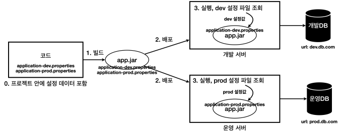
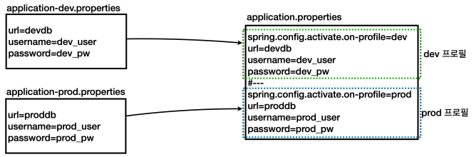

# 설정 데이터

OS 환경 변수, 자바 시스템 속성, 커맨드 라인 옵션 인수는 사용하는 값이 늘어날수록 사용하기가 불편해진다. 실무에서는 수십개의 설정값을 사용하기도 하므로 이런 값들을 프로그램을 실행할 때 마다 입력하게 되면 번거롭고, 관리도 어렵다.  

그래서 등장한 대안으로 설정값을 파일에 넣어서 관리하는 방법이 있다. 그리고 애플리케이션 로딩 시점에 해당 파일을 읽어들인다.  

<br/>

## 설정 데이터 - 외부 파일

개발자가 파일을 읽어서 설정값으로 사용할 수 있도록 개발을 해야겠지만, 스프링 부트는 이미 이런 부분을 다 구현해두었다. 개발자는 application.properties 라는 이름의 파일을 자바를 실행하는 위치에 만들어 두기만 하면 스프링이 해당 파일을 읽어서 사용할 수 있는 PropertySource의 구현체를 제공한다.  

실행하는 Jar 파일과 동일한 폴더에 application.properties 파일이 존재하면 해당 파일의 설정 값을 읽어들이게 된다.  

```
 ├─ app.jar
 └─ application.properties
```

<br/>

## 설정 데이터 - 내부 파일 분리

설정 파일을 외부에 관리하는 것은 상당히 번거로운 일이다. 이 문제를 해결하는 간단한 방법은 설정 파일을 프로젝트 내부에 포함해서 관리하고, 프로젝트 빌드 시점에 함꼐 빌드되게 하는 것이다.  

이렇게 하면 애플리케이션을 배포할 때 설정 파일의 변경 사항도 함께 배포할 수 있다. 쉽게 이야기해서 jar 하나로 설정 데이터까지 포함해서 관리하는 것이다.  

스프링은 이미 외부 설정으로 넘어온 프로필 값이 dev 라면 application-dev.properties 를 읽고 prod 라면 application-prod.properties 를 읽어서 사용하면 된다. 스프링은 이미 설정 데이터를 내부에 파일로 분리해두고 외부 설정값(프로필)에 따라 각각 다른 파일을 읽는 방법을 다 구현해두었다.  

<div align="center">
    
</div>

<br/>

 - `application-dev.properties`
```properties
url=dev.db.com
username=dev_user
password=dev_pw
```

<br/>

 - `application-prod.properties`
```properties
url=prod.db.com
username=prod_user
password=prod_pw
```

<br/>

 - `프로필`
    - 스프링은 프로필 개념을 지원한다. spring.profiles.active 외부 설정에 값을 넣으면 해당 프로필을 사용한다고 판단한다. 그리고 프로필에 따라서 해당 프로필에 맞는 내부 파일을 조회한다. (application-{profile}.properties)
    - '--spring.profiles.active=dev'를 커맨드 라인 옵션 인수로 실행한다.
    - '-Dspring.profiles.active=dev'를 자바 시스템 속성으로 실행한다.
```
 - spring.profiles.active=dev
    - dev 프로필이 활성화 되었다.
    - application-dev.properties 를 설정 데이터로 사용한다.
 - spring.profiles.active=prod
    - prod 프로필이 활성화 되었다.
    - application-prod.properties 를 설정 데이터로 사용한다.
```

<br/>

## 설정 데이터 - 내부 파일 합체

설정 파일을 각각 분리해서 관리하면 한눈에 전체가 들어오지 않는 단점이 있다. 스프링은 이런 단점을 보완하기 위해 물리적인 하나의 파일 안에서 논리적으로 영역을 구분하는 방법을 제공한다.  

기존에는 dev 환경은 application-dev.properties 파일을 사용하고, prod 환경은 application-prod.properties 파일을 사용했다. 스프링은 하나의 application.properties 파일 안에서 논리적으로 영역을 구분하는 방법을 제공한다.  

논리적 영역을 나누기 위해서는 properties 확장자에서는 '#---' 또는 '!---'을 사용하고, yml 확장자에서는 '---'를 사용한다. 또한, 프로필에 따라 논리적을 구분된 설정 데이터를 활성화하기 위해서는 'spring.config.activate.on-profile'에 프로필 값을 지정한다.  

<div align="center">
    
</div>

<br/>


 - `application.properties`
    - __주의사항__
        - 속성 파일 구분 기호에는 선행 공백이 없어야 하며 정확히 3개의 하이픈 문자가 있어야 한다.
        - 구분 기호 바로 앞과 뒤의 줄은 같은 주석 접두사가 아니어야 한다.
        - 파일을 분할하는 #--- 주석 위 아래는 주석을 적으면 안된다.
    - __실행__
        - 커맨드 라인 옵션 인수 실행: '--spring.profiles.active=dev'
        - 자바 시스템 속성 실행: '-Dspring.profiles.active=dev'
        - Jar 실행
            - java -Dspring.profiles.active=dev -jar app.jar
            - java -jar app.jar --spring.profiles.active=dev
```properties
url=local.db.com
username=local_user
password=local_pw
#---
spring.config.activate.on-profile=dev
url=dev.db.com
username=dev_user
password=dev_pw
#---
spring.config.activate.on-profile=prod
url=prod.db.com
username=prod_user
password=prod_pw
```

