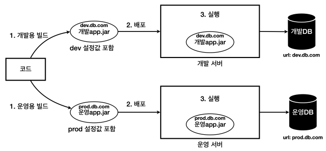
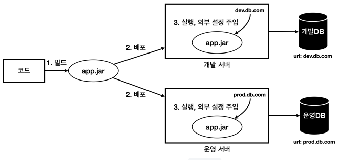
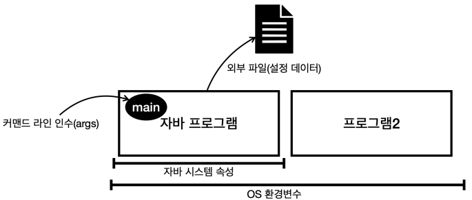

# 외부설정과 프로필

 - `build.gradle`
```gradle
plugins {
    id 'java'
    id 'org.springframework.boot' version '3.0.2'
    id 'io.spring.dependency-management' version '1.1.0'
}

group = 'hello'
version = '0.0.1-SNAPSHOT'
sourceCompatibility = '17'

configurations {
    compileOnly {
        extendsFrom annotationProcessor
    }
}

repositories {
    mavenCentral()
}

dependencies {
    implementation 'org.springframework.boot:spring-boot-starter'
    compileOnly 'org.projectlombok:lombok'
    annotationProcessor 'org.projectlombok:lombok'
    testImplementation 'org.springframework.boot:spring-boot-starter-test'

    //test lombok 사용
    testCompileOnly 'org.projectlombok:lombok'
    testAnnotationProcessor 'org.projectlombok:lombok'
}

tasks.named('test') {
    useJUnitPlatform()
}
```

<br/>

## 외부 설정이란?

하나의 애플리케이션을 여러 다른 환경에서 사용해야 할 때가 있다. 대표적으로 로컬 개발 환경과 실제 고객에세 서비스하는 운영 환경이다. 각각의 환경에 따라서 서로 다른 설정값이 존재하는데, 예를 들어 개발 환경에서는 개발 DB에 접근하고, 운영 환경에서는 운영 DB에 접근해야 한다.  

각각 환경에 맞게 애플리케이션을 빌드하는 방법이 있지만, 환경에 따라서 빌드를 여러번 해야하고, 각 환경에 맞추어 최종 빌드가 되어 나온 결과물은 다른 환경에서 사용할 수 없어서 유연성이 떨어진다.  

<div align="center">
    
</div>

<br/>

이러한 문제를 해결하기 위해 실행 시점에 외부 설정값을 주입하는 방법이 있다. 환경에 따라 변하는 설정값을 실행 시점에 주입하는 것이다. 즉, 배포 환경과 무관하게 하나의 빌드 결과물을 만들고 실행 시점에 해당 환경에 필요한 외부 설정 값을 주입한다.  
이렇게 하면 빌드를 한 번만 하면 되고, 새로운 환경이 추가되어도 별도의 빌드 과정없이 기존 빌드 결과물에 새로운 환경을 추가할 수 있다.  
__유지보수하기 좋은 애플리케이션 개발의 가장 기본 원칙은 변하는 것과 변하지 않는 것을 분리하는 것이다.__ 각 환경에 따라 변하는 외부 설정값은 분리하고, 변하지 않는 코드와 빌드 결과물은 유지했다. 덕분에 빌드 과정을 줄이고, 환경에 따른 유연성을 확보할 수 있다.  

<div align="center">
    
</div>

<br/>

## 외부 설정 전달 방법

외부 설정은 일반적으로 4가지 방법이 있다.  

 - OS 환경 변수: OS에서 지원하는 외부 설정, 해당 OS를 사용하는 모든 프로세스에서 사용
 - 자바 시스템 속성: 자바에서 지원하는 외부 설정, 해당 JVM안에서 사용
 - 자바 커맨드 라인 인수: 커맨드 라인에서 전달하는 외부 설정, 실행시 main(args) 메서드에서 사용
 - 외부 파일(설정 데이터): 프로그램에서 외부 파일을 직접 읽어서 사용
    - 애플리케이션에서 특정 위치의 파일을 읽도록 해둔다. 예) data/hello.txt
    - 그리고 각 서버마다 해당 파일안에 다른 설정 정보를 남겨둔다.
        - 개발 서버 hello.txt : url=dev.db.com
        - 운영 서버 hello.txt : url=prod.db.com

<div align="center">
    
</div>
