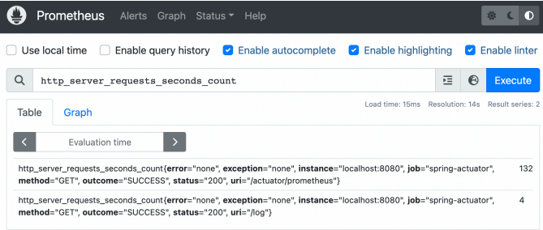
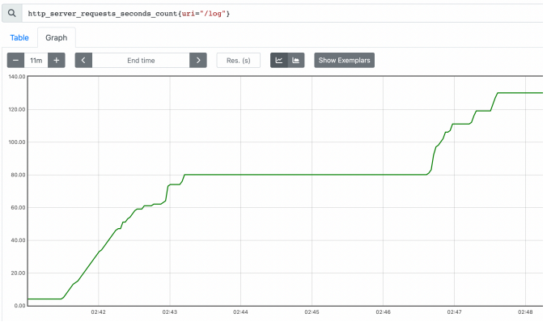
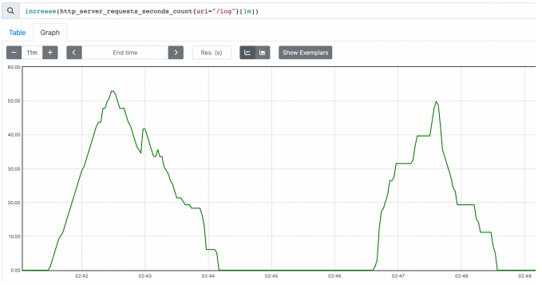
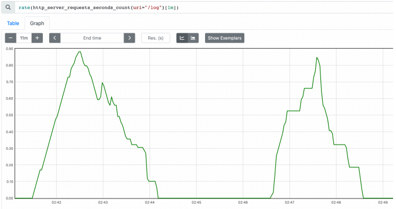
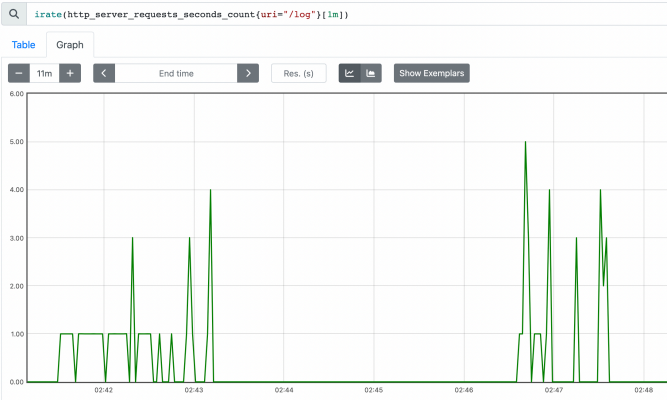

# 프로메테우스

## 프로메테우스 - 설치

 - 다운로드 경로: https://prometheus.io/download/
    - 윈도우: https://github.com/prometheus/prometheus/releases/download/v2.42.0/prometheus-2.42.0.windows-amd64.zip
    - MAC: https://github.com/prometheus/prometheus/releases/download/v2.42.0/prometheus-2.42.0.darwin-amd64.tar.gz

<br/>

## 프로메테우스 - 애플리케이션 설정

프로메테우스는 메트릭을 수집하고 보관하는 DB이다. 프로메테우스가 애플리케이션의 메트릭을 수집하도록 연동하기 위해서는 2가지 작업이 필요하다.  
 - 애플리케이션 설정: 프로메테우스가 애플리케이션의 메트릭을 가져갈 수 있도록 애플리케이션에서 프로메테우스 포맷에 맞추어 메트릭 만들기
 - 프로메테우스 설정: 프로메테우스가 특정 애플리케이션의 메트릭을 주기적으로 수집하도록 설정

<br/>

### 애플리케이션 설정

프로메테우스가 애플리케이션의 메트릭을 가져가려면 프로메테우스가 사용하는 포멧에 맞추어 메트릭을 만들어야 한다. 참고로 프로메테우스는 JSON 포맷을 이해하지 못한다.  

하지만, 프로메테우스 포멧에 대한 부분은 걱정할 필요없다. 각각의 메트릭들은 내부에서 마이크로미터 표준 방식으로 측정되고, 구현체를 지정해주기만 하면 마이크로미터가 해당 구현체에 대한 포맷으로 만들어준다.  

 - `build.gradle`
    - 프로메테우스 의존성 추가
    - 마이크코미터 프로메테우스 구현 라이브러리를 추가하면 스프링부트와 액추에이터가 자동으로 마이크로미터 프로메테우스 구현체를 등록해서 동작하도록 설정해준다.
    - 액추에이터에 프로메테우스 메트릭 수집 엔드포인트가 자동으로 추가된다. ('/actuator/prometheus')
```gradle
dependencies {
    implementation 'org.springframework.boot:spring-boot-starter-data-jpa'
    implementation 'org.springframework.boot:spring-boot-starter-web'
    implementation 'org.springframework.boot:spring-boot-starter-actuator' //actuator 추가
    implementation 'io.micrometer:micrometer-registry-prometheus' //추가

    compileOnly 'org.projectlombok:lombok'
    runtimeOnly 'com.h2database:h2'
    annotationProcessor 'org.projectlombok:lombok'
    testImplementation 'org.springframework.boot:spring-boot-starter-test'

    //test lombok 사용
    testCompileOnly 'org.projectlombok:lombok'
    testAnnotationProcessor 'org.projectlombok:lombok'
}
```

<br/>

 - `프로메테우스 포멧`
    - 'jvm.info' > 'jvm_info': 프로메테우스는 '.' 대신에 '_' 포멧을 사용한다. '.' 대신에 '_' 포멧으로 변환된 것을 확인할 수 있다.
    - 'logback.events' > 'logback_events_total': 로그수 처럼 지속해서 숫자가 증가하는 메트릭을 카운터라 한다. 프로메테우스는 카운터 메트릭의 마지막에는 관례상 _total 을 붙인다.
    - http.server.requests 이 메트릭은 내부에 요청수, 시간 합, 최대 시간 정보를 가지고 있었다. 프로메테우스에서는 다음 3가지로 분리된다.
        - http_server_requests_seconds_count : 요청 수
        - http_server_requests_seconds_sum : 시간 합(요청수의 시간을 합함)
        - http_server_requests_seconds_max : 최대 시간(가장 오래걸린 요청 수)

<br/>

## 프로메테우스 - 수집 설정

프로메테우스가 애플리케이션의 '/actuator/prometheus'를 호출해서 메트릭을 주기적으로 수집하도록 설정한다.  

 - `prometheus.yml`
    - 프로메테우스 폴더에 있는 prometheus.yml 파일을 수정한다.
    - 아래처럼 설정하면, 프로메테우스가 해당 경로를 1초에 한 번씩 호출해서 애플리케이션의 메트릭들을 수집한다.
        - job_name : 수집하는 이름이다. 임의의 이름을 사용하면 된다.
        - metrics_path : 수집할 경로를 지정한다.
        - scrape_interval : 수집할 주기를 설정한다.
        - targets : 수집할 서버의 IP, PORT를 지정한다.
    - ※ 예제에서는 수집 주기를 1s로 했지만, 수집 주기의 기본값은 1m이다. 수집 주기가 너무 짧으면 애플리케이션 성능에 영향을 줄 수 있으므로 운영에서는 10s ~ 1m 정도를 권장한다.
```yml
global:
  scrape_interval: 15s
  evaluation_interval: 15s
alerting:
  alertmanagers:
    - static_configs:
        - targets:

rule_files:
scrape_configs:
  - job_name: "prometheus"
    static_configs:
      - targets: ["localhost:9090"]
  #추가
  - job_name: "spring-actuator"
    metrics_path: '/actuator/prometheus'
    scrape_interval: 1s
    static_configs:
      - targets: ['localhost:8080']
```

<br/>

 - `프로메테우스 연동 확인`
    - 설정이 끝났으면 프로메테우스 서버를 종료하고 다시 실행한다.
    - '프로메테우스' > 'Status' > 'Configuration' 화면에서 추가한 설정이 있는지 확인한다.
    - '프로메테우스' > 'Status' > 'Targets' 화면에서 연동을 확인한다.

<br/>

## 프로메테우스 - 기본 기능

검색창에 http_server_requests_seconds_count를 입력한다.  
 - 태그, 레이블: error , exception , instance , job , method , outcome , status , uri 는 각각의 메트릭 정보를 구분해서 사용하기 위한 태그이다. 마이크로미터에서는 이것을 태그(Tag)라 하고, 프로메테우스에서는 레이블(Label)이라 한다. 여기서는 둘을 구분하지 않고 사용하겠다.
 - 숫자: 끝에 마지막에 보면 132 , 4 와 같은 숫자가 보인다. 이 숫자가 바로 해당 메트릭의 값이다

<div align="center">
    
</div>

<br/>

### 필터

레이블을 기준으로 필터를 사용할 수 있다. 필터는 중괄호 '{}' 문법을 사용한다.  

 - `레이블 일치 연산자`
    - '=' 제공된 문자열과 정확히 동일한 레이블 선택
    - '!=' 제공된 문자열과 같지 않은 레이블 선택
    - '=~' 제공된 문자열과 정규식 일치하는 레이블 선택
    - '!~' 제공된 문자열과 정규식 일치하지 않는 레이블 선택
```
 - uri=/log , method=GET 조건으로 필터
    - http_server_requests_seconds_count{uri="/log", method="GET"}

 - /actuator/prometheus 는 제외한 조건으로 필터
    - http_server_requests_seconds_count{uri!="/actuator/prometheus"}

 - method 가 GET , POST 인 경우를 포함해서 필터
    - http_server_requests_seconds_count{method=~"GET|POST"}

 - /actuator 로 시작하는 uri 는 제외한 조건으로 필터
    - http_server_requests_seconds_count{uri!~"/actuator.*"}
```

<br/>

### 연산자 쿼리와 함수

```
★ 연산자
 - '+' (덧셈)
 - '-' (빼기)
 - '*' (곱셈)
 - '/' (분할)
 - '%' (모듈로)
 - '^' (승수/지수)

★ 함수
 - sum: 값의 합계를 구한다.
    - sum(http_server_requests_seconds_count)

 - sum by: SQL의 group by 기능과 유사하다.
    - sum by(method, status)(http_server_requests_seconds_count)

 - count: 메트릭 자체의 수 카운트
    - count(http_server_requests_seconds_count)

 - topk: 상위 3개 메트릭 조회
    - topk(3, http_server_requests_seconds_count)

 - 오프셋 수정자: offset 10m 과 같이 나타낸다. 현재를 기준으로 특정 과거 시점의 데이터를 반환한다.
    - http_server_requests_seconds_count offset 10m

 - 범위 벡터 선택기: 마지막에 [1m] , [60s] 와 같이 표현한다. 지난 1분간의 모든 기록값을 선택한다.
    - http_server_requests_seconds_count[1m]
```

<br/>

## 프로메테우스 - 게이지와 카운터

메트릭은 크게 게이지와 카운터 2가지로 분류할 수 있다.  

 - `게이지`
    - 임의로 오르내릴 수 있는 값
    - CPU 사용량, 메모리 사용량, 사용중인 커넥션 등
 - `카운터`
    - 단순하게 증가하는 단일 누적 값
    - HTTP 요청 수, 로그 발생 수 등

<br/>

### 게이지

게이지는 오르고 내리고 하는 값이다. 즉, 게이지는 현재 상태를 그대로 출력하면 된다.  

예를들어 CPU 사용량을 생각하면, CPU 사용량의 현재 상태를 계속 측정하고 그 값을 그대로 그래프에 출력하면 과거부터 지금까지의 CPU 사용량을 확인할 수 있다.  
게이지는 가장 단순하고 사용하기 쉬운 메트릭으로 크게 고민없이 있는 그대로 사용하면 된다.  

<br/>

### 카운터

카운터는 단순하게 증가하는 단일 누적 값이다.  

<br/>

 - `계속 증가하는 그래프`
    - 아래 예제는 HTTP 요청 메트릭을 그래프로 표현하며, 카운터는 계속 누적해서 증가하는 값이다.
    - 따라서, 계속 증가하는 그래프만 보게 되는데 요청이 쌓이게 되면 나중에는 동일한 증가에도 어느정도 요청이 온지 제대로 확인하기 어렵다.
    - 운영에서 알고 싶은 것은 특정 시간에 얼마나 고객의 요청이 들어왔는지 한 눈에 확인하는 것이다.
```
http_server_requests_seconds_count{uri="/log"}
```

<div align="center">
    
</div>

<br/>

 - `increase()`
    - increase() 를 사용하면 이런 문제를 해결할 수 있다. 지정한 시간 단위별로 증가를 확인할 수 있다.
    - 마지막에 [시간] 을 사용해서 범위 벡터를 선택해야 한다. 
    - 예) increase(http_server_requests_seconds_count{uri="/log"}[1m]

<div align="center">
    
</div>

<br/>

 - `rate()`
    - 범위 백터에서 초당 평균 증가율을 계산한다.
    - increase() 가 숫자를 직접 카운트 한다면, rate() 는 여기에 초당 평균을 나누어서 계산한다.
    - rate(data[1m]) 에서 [1m] 이라고 하면 60초가 기준이 되므로 60을 나눈 수이다.
    - rate(data[2m]) 에서 [2m] 이라고 하면 120초가 기준이 되므로 120을 나눈 수이다.

<div align="center">
    
</div>

<br/>

 - `irate()`
    - rate와 유사하며, 범위 벡터에서 초당 순간 증가율을 계산한다. 급격하게 증가한 내용을 확인하기 좋다.

<div align="center">
    
</div>

<br/>

 - `참고`
    - 기본기능: https://prometheus.io/docs/prometheus/latest/querying/basics/
    - 연산자: https://prometheus.io/docs/prometheus/latest/querying/operators/
    - 함수: https://prometheus.io/docs/prometheus/latest/querying/functions/

