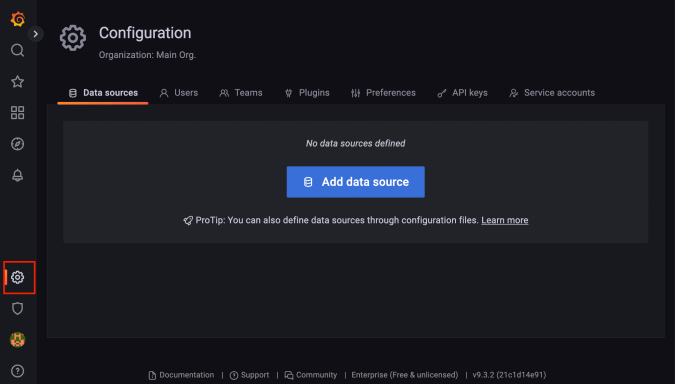

# 그라파나

## 그라파나 - 설치

 - 다운로드 경로: https://grafana.com/grafana/download
    - 윈도우: https://dl.grafana.com/enterprise/release/grafana-enterprise-9.3.6.windows-amd64.zip
    - MAC: https://dl.grafana.com/enterprise/release/grafana-enterprise-9.3.6.darwin-amd64.tar.gz
 - 실행: 'http://localhost:3000'
    - username: admin
    - password: admin

<br/>

## 그라파나 - 연동

그라파나는 프로메테우스를 통해서 데이터를 조회하고 보여주는 역할을 한다.  

```
1. 그라파나 데이터소스 추가
 - Configuration > Data Source > Add data source > Prometheus

2. Prometheus 데이터 소스 설정
 - URL: http://localhost:9090
 - 나머지는 특별히 고칠 부분이 없다면 그대로 두고 Save & test를 선택
```

<div align="center">
    
</div>

<br/>

## 그라파나 - 대시보드 만들기

그라파나를 사용해서 주요 메트릭 대시보드를 만든다.  
기본적으로 애플리케이션, 프로메테우스, 그라파나가 실행되어야 한다.  


 - `대시보드 만들기`
```
1. 대시보드 저장
 - 그라파나 > Dashboards
    - New > New Dashboard > Save dashboard
        - name: hello
        - Folder: General
```

<br/>

 - `패널 만들기`
    - 대시보드가 큰 틀이라면 패널은 그 안에 모듈처럼 들어가는 실제 그래프를 보여주는 컴포넌트이다.
```
1. 패널 만들기
 - Dashboard > Add panel > Add a new panel
    - Panel options
        - Title: CPU 사용량
    - Query
        - Code
            - system_cpu_usage
            - process_cpu_usage
        - Options
            - Legend: system cpu
            - Legend: process cpu

2. 패널 만들기
 - Panel options
    - Title: 디스크 사용량
 - Standard options
    - Unit: bytes(SI)
    - Min: 0
 - Query
    - Code
        - disk_total_bytes
    - Options
        - Legend: 전체 용량
 - Query
    - Code
        - disk_total_bytes - disk_free_bytes
    - Options
        - Legend: 사용 용량
```

<br/>

 - `정리`
    - CPU 사용량, 디스크 사용량 메트릭을 대시보드에 추가했다.
    - 추가적으로 JVM, 시스템, 애플리케이션 시작, 스프링, 톰캣, 데이터 소스, 로그, 기타 메트릭 정보를 추가하면 된다.

<br/>

## 그라파나 - 공유 대시보드 활용

하나하나 직접 대시보드를 입력하는 것은 번거롭다. 그라파나는 이미 만들어둔 대시보드를 가져다가 사용할 수 있는 기능을 제공한다.  
이미 누군가 만들어둔 수 많은 대시보드가 공개되어 있다. 스프링부트와 마이크로미터를 사용해서 만든 대시보드를 가져다가 사용한다.  
 - 공식 사이트: https://grafana.com/grafana/dashboards/

<br/>

### 스프링부트 시스템 모니터 대시보드 불러오기

 - `대시보드 불러오기`
    - 링크 URL: https://grafana.com/grafana/dashboards/11378-justai-system-monitor/
    - 사이트에 접속한 다음 Copy Id to clipboard로 복사한다.
```
1. 대시보드 불러오기
 - Dashbards > New > Import > ID 입력 후 Load
```

<br/>

 - `불러온 대시보드 수정`
    - 대시보드에 거의 배부분의 메트릭 정보를 확인할 수 있다. 참고로, 일부 데이터의 경우 스프링 부트나 기타 라이브러리의 버전이 변함에 따라서 동작하지 않을 수도 있다. 이런 부분을 수정해서 사용한다.
```
1. 불러온 대시보드 수정하기
 - 대시보드를 수정하려면 수정모드로 변경해야 한다.
 - Settings(톱니모양 버튼) > Make editable

2. 대시보드 수정 (톰캣)
 - Jetty 통계 정보를 Tomcat 통계 정보로 변경한다.
    - Title: Jetty Statistics > Tomcat Statistics
    - Query:
        - jetty_threads_config_max > tomcat_threads_config_max

3. Thread 패널 설정 변경
 - Query
    - jetty_threads_current tomcat_threads_current_threads
    - jetty_threads_busy tomcat_threads_busy_threads
    - jetty_threads_idle 제거
    - jetty_threads_jobs 제거
```

<br/>

## 그라파나 - 메트릭을 통한 문제 확인

실무에서 주로 많이 발생하는 'CPU 사용량 초과', 'JVM 메모리 사용량 초과', '커넥션 풀 고갈', '에러 로그 급증'을 확인해본다.  

 - `CPU 사용량 초과`
    - CPU에 간단히 부하를 주는 코드를 작성한다.
```java
    @GetMapping("cpu")
    public String cpu() {
        log.i nfo("cpu");
        long value = 0;
        for (long i = 0; i < 1000000000000L; i++) {
            value++;
        }
        return "ok value=" + value;
    }
```

<br/>

 - `JVM 메모리 사용량 초과`
    - 메모리 사용을 누적하는 코드를 작성한다.
```java
    private List<String> list = new ArrayList<>();

    @GetMapping("/jvm")
    public String jvm() {
        log.info("jvm");
        for (int i = 0; i < 1000000; i++) {
            list.add("hello jvm!" + i);
        }
        return "ok";
    }
```

<br/>

 - `커넥션 풀 고갈`
```java
    @Autowired
    DataSource dataSource;

    @GetMapping("/jdbc")
    public String jdbc() throws SQLException {
        log.info("jdbc");
        Connection conn = dataSource.getConnection();
        log.info("connection info={}", conn);
        //conn.close(); //커넥션을 닫지 않는다.
        return "ok";
    }
```

<br/>

 - `에러 로그 급증`
    - 애플리케이션에서 ERROR 레벨의 로그가 급증한다면 심각한 문제가 발생한 것으로 이해할 수 있다.
```java
    @GetMapping("/error-log")
    public String errorLog() {
        log.error("error log");
        return "error";
    }
```

