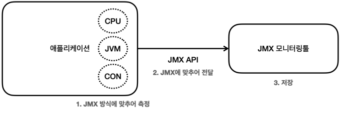
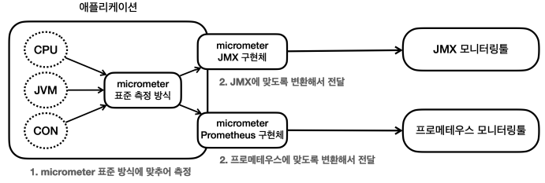
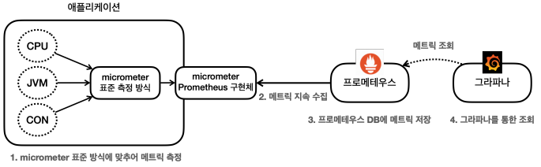

# 마이크로미터, 프로메테우스, 그라파나

서비스를 운여할 때는 애플리케이션의 CPU, 메모리, 커넥션 사용, 고객 요청수 같은 수 많은 지푣르을 확인하는 것이 필요하다. 그래야 어디에 어떤 문제가 발생했는지 사전에 대응할 수 있고, 실제 문제가 발생해도 원인을 빠르게 파악하여 대처할 수 있다.  

## 모니터링 툴에 지표 전달

모니터링 툴이 작동하기 위해서는 시스템의 다양한 지표들을 각각의 모니터링 툴에 맞도록 만들어서 보내주어야 한다.  
예를 들어, CPU, 커넥션 정보 등을 JMX 툴에 전달한다고 가정하는 경우 각각의 정보를 JMX 모니터링 툴이 정한 포맷에 맞추어 측정하고 전달해야 한다.  
하지만, 중간에 사용하는 모니터링 툴이 변경되면 기존에 측정했던 코드를 모두 변경한 툴에 맞도록 변경해야 하는 불편함이 생긴다.  

<div align="center">
    
</div>

<br/>

## 마이크로미터

마이크로미터는 애플리케이션의 메트릭을 마이크로미터가 정한 표준 방법으로 모아서 제공해준다. 즉, 마이크로미터가 추상화를 통해서 모니터링 툴 구현체를 쉽게 변경할 수 있도록 제공해준다.  

 - 공식 문서: https://micrometer.io/docs/
 - 마이크로미터는 잘 만들어진 추상화를 제공하여, 스프링 부트 액추에이터는 마이크로미터를 기본으로 내장해서 사용한다.
 - 개발자는 마이크로미터가 정한 표준 방법으로 메트릭(측정 지표)를 전달하면 된다. 그리고 사용하는 모니터링 툴에 맞는 구현체를 선택하면 된다. 이후에 모니터링 툴이 변경되어도 해당 구현체만 변경하면 된다. 애플리케이션 코드는 모니터링 툴이 변경되어도 그대로 유지할 수 있다.
 - 마이크로미터 지원 모니터링 툴: AppOOptics, Atlas, CloudWatch, Datadog, Dynatrace, Elastic, Ganglia, Graphite, Humio, Influx, Instana, JMX, KariosDB, New Relic, Prometheus, SignalFx, Stackdriver, StatsD, Wavefront 등

<div align="center">
    
</div>

<br/>

## 메트릭 확인하기

CPU, JVM, 커넥션 사용 등 수 많은 지표들을 수집하기 위해서는 개발자는 각각의 지표를 직접 수집해서 그것을 마이크로미터가 제공하는 표준 방법에 따라 등록하면 된다.  
마이크로미터는 다양한 지표 수집 기능을 이미 만들어서 제공한다. 또, 스프링 부트 액츄에이터는 마이크로미터가 제공하는 지표 수집을 @AutoConfiguration을 통해 자동으로 등록해준다.  

<br/>

### metrics 엔드포인트

metrics 엔드포인트를 사용하면 기본으로 제공되는 메트릭들을 확인할 수 있다. (/actuator/metrics)  
metrics 정보를 자세히 확인하기 위해서는 '/actuator/metrics/{name}' 같이 특정 메트릭을 자세히 확인할 수 있다.  

 - `Tag 필터`
    - 'availableTags' 항목을 확인하면, tag와 values 를 확인할 수 있다.
    - Tag는 해당 Tag를 기반으로 정보를 필터링해서 확인할 수 있다. tag=KEY:VALUE와 같은 형식을 사용해야 한다.
```
http://localhost:8080/actuator/metrics/jvm.memory.used?tag=area:heap
http://localhost:8080/actuator/metrics/jvm.memory.used?tag=area:nonheap

# HTTP 요청 수 확인
http://localhost:8080/actuator/metrics/http.server.requests

# HTTP 요청 수에서 일부 내용 필터링 ('/log' 요청만 필터)
http://localhost:8080/actuator/metrics/http.server.requests?tag=uri:/log

# '/log' 요청에서 상태가 200인 요청 필터
http://localhost:8080/actuator/metrics/http.server.requests?tag=uri:/log&tag=status:200
```

<br/>

## 다양한 메트릭

마이크로미터와 액츄에이터는 기본적으로 다양한 메트릭 정보를 제공한다. JVM, 시스템, 애플리케이션 시작, 스프링 MVC, 톰캣, 데이터 소스, 로그, 기타 수 많은 메트릭이 있다.  

 - __다양한 메트릭 공식 문서__
    - https://docs.spring.io/spring-boot/docs/current/reference/html/actuator.html#actuator.metrics.supported
 - __JVM 메트릭__
    - JVM 관련 메트릭을 제공하며, 'jvm.'으로 시작한다.
    - 메모리 및 버퍼 풀 세부 정보, 가비지 수집 관련 통계, 스레드 활용, 로드 및 언로드된 클래스 수, JVM 버전 정보, JIT 컴파일 시간
 - __시스템 메트릭__
    - 시스템 관련 메트릭을 제공하며, 'system.', 'process.', 'disk.' 으로 시작한다.
    - CPU 지표, 파일 디스크립터 메트릭, 가동 시간 메트릭, 사용 가능한 디스크 공간
 - __애플리케이션 시작 메트릭__
    - 애플리케이션 시작 시간 메트릭을 제공한다.
    - application.started.time : 애플리케이션을 시작하는데 걸리는 시간 (ApplicationStartedEvent로 측정)
    - application.ready.time : 애플리케이션이 요청을 처리할 준비가 되는데 걸리는 시간(ApplicationReadyEvent 로 측정)
 - __스프링 MVC 메트릭__
    - 스프링 MVC 컨트롤러가 처리하는 모든 요청을 다룬다. (http.server.requests)
    - TAG 를 사용해서 다음 정보를 분류해서 확인할 수 있다.
        - uri: 요청 URI
        - method : GET , POST 같은 HTTP 메서드
        - status : 200 , 400 , 500 같은 HTTP Status 코드
        - exception : 예외
        - outcome : 상태코드를 그룹으로 모아서 확인 1xx:INFORMATIONAL,2xx:SUCCESS, 3xx:REDIRECTION, 4xx:CLIENT_ERROR, 5xx:SERVER_ERROR
 - __데이터소스 메트릭__
    - DataSource, 커넥션 풀에 관한 메트릭을 제공하며, 'jdbc.connections'로 시작한다.
    - 최대 커넥션, 최소 커넥션, 활성 커넥션, 대기 커넥션 수 등을 확인할 수 있다.
 - __로그 메트릭__
    - logback.events : logback 로그에 대한 메트릭을 확인할 수 있다.
    - trace, debug, info, warn, error 각각의 로그 레벨에 따른 로그 수를 확인할 수 있다. 예를 들어서 error 로그 수가 급격히 높아진다면 위험한 신호로 받아드릴 수 있다.
 - __톰캣 메트릭__
    - 톰캣 관련 메트릭을 제공하며, 'tomcat.'으로 시작한다.
    - 톰캣 메트릭은 기본적으로 'tomcat.session.' 관련 정보만 노출된다.
    - 그 외에 최대 쓰레드, 사용 쓰레드 수 등 모든 정보를 확인하기 위해서는 'server.tomcat.mbeanregistry.enabled' 옵션을 true로 주어야 한다.
 - __기타__
    - HTTP 클라이언트 메트릭(RestTemplate , WebClient), 캐시 메트릭, 작업 실행과 스케줄 메트릭, 스프링 데이터 리포지토리 메트릭, 몽고DB 메트릭, 레디스 메트릭
 - __사용자 정의 메트릭__
    - 사용자가 직접 메트릭을 정의할 수도 있다.
    - 사용자 정의 메트릭을 만들기 위해서는 마이크로미터의 사용법을 먼저 이해해야 한다.

<br/>

## 프로메테우스와 그라파나 소개

액츄에이터를 통해 수 많은 메트릭이 자동으로 만들어지는 것을 확인할 수 있다. 이러한 메트릭들을 어딘가에 지속해서 보관해야 과거의 데이터들도 확인할 수 있다. 따라서, 메트릭을 지속적으로 수집하고 보관할 데이터베이스가 필요하며, 이러한 메트릭들을 그래프를 통해서 한 눈에 쉽게 확인할 수 있는 대시보드가 필요하다.  

<br/>

프로메테우스가 DB라고 하면, 이 DB에 있는 데이터를 불러서 사용자가 보기 편하게 보여주는 대시보드가 필요하다. 그라파나는 매우 유연하고, 데이터를 그래프로 보여주는 툴이다. 수 많은 그래프를 제공하고, 프로메테우스를 포함한 다양한 데이터소스를 지원한다.  

 - 스프링부트 액추에이터와 마이크로미터를 사용하면 수 많은 메트릭을 자동으로 생성한다.
   - 마이크로미터 프로메테우스 구현체는 프로메테우스가 읽을 수 있는 포맷으로 메트릭을 생성한다.
 - 프로메테우스는 이렇게 만들어진 메트릭을 지속해서 수집한다.
 - 프로메테우스는 수집한 메트릭을 내부 DB에 저장한다.
 - 사용자는 그라파나 대시보드 툴을 통해 그래프로 편리하게 메트릭을 조회한다. 이때 필요한 데이터는 프로메테우스를 통해서 조회한다.

<div align="center">
    
</div>

