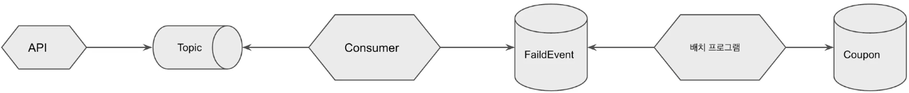

# 시스템 개선하기

쿠폰을 발급하다가 에러가 발생하면 어떻게 하는가?  
즉, 컨슈머에서 에러가 발생했을 때 어떻게 처리하는가?  
컨슈머에서 에러 발생시 쿠폰을 발급되지 않았는데, 발급된 쿠폰 갯수만 올라가는 문제가 발생하게 된다.  

<br/>

## 프로젝트 소스 코드

 - FailedEvent 엔티티 클래스 & 레포지토리
```Java
// FailedEvent
@Entity
public class FailedEvent {

    @Id @GeneratedValue(strategy = GenerationType.IDENTITY)
    private Long id;

    private Long userId;

    public FailedEvent() {
    }

    public FailedEvent(Long id) {
        this.id = id;
    }
}

// FailedEventRepository
public interface FailedEventRepository extends JpaRepository<FailedEvent, Long> {
}
```

 - CouponCreatedConsumer
    - 컨슈머에서 쿠폰 발급이 실패한 경우 로그를 출력하고, FailedEvent에 데이터를 저장한다.
    - 따로, 배치 프로그램을 만들어 FailedEvent에 쌓인 데이터를 주기적으로 읽어서 쿠폰을 발급해주는 것으로 문제를 해결할 수 있다.
```Java
@Component
public class CouponCreatedConsumer {

    private final CouponRepository couponRepository;
    private final FailedEventRepository failedEventRepository;
    private final Logger logger = LoggerFactory.getLogger(CouponCreatedConsumer.class);

    public CouponCreatedConsumer(CouponRepository couponRepository, FailedEventRepository failedEventRepository) {
        this.couponRepository = couponRepository;
        this.failedEventRepository = failedEventRepository;
    }

    @KafkaListener(topics = "coupon_create", groupId = "group_1")
    public void listener(Long userId) {
        try {
            couponRepository.save(new Coupon(userId));
        } catch (Exception e) {
            logger.error("failed to create coupon::" + userId);
            failedEventRepository.save(new FailedEvent(userId));
        }
    }
}
```

<br/>

<p style="text-align: center;">
     
</p>