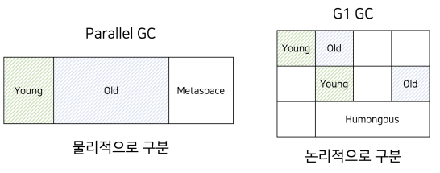

# JDK 9 추가된 기능

## 1. 자바 9에서 추가된 언어 기능

 - __확장된 try-with-resources__
    - try-with-resources 구문은 JDK 7에서 등장하여 개발자가 직접 닫아줘야 하는 자원을 try() 안에 선언하여, try 로직이 모두 끝나면 자동으로 해당 자원을 닫아준다. 해당 구문으로 자원을 다는 것에 대한 실수가 줄어들고, 여러 자원을 닫는 경우 코드가 깔끔해졌다.
        - 다만, 문법적인 아쉬움이 있는데 try() 밖에서 만든 자원을 닫을 수 없다는 것이다.
    - JDK 9+ 에서는 try 바깥의 final 변수나 사실상 final 변수도 닫아지는게 가능해졌다.
```java
// JDK 7 이전 코드
Resource resource = new Resource();
try {
    // TODO: 작업
} finally {
    resource.close();
}

// JDK 7+: try-with-resources
try (Resource resource = new Resource()) {
    // TODO: 작업
}

// JDK 9+: 확장된 try-with-resources
Resource r1 = new Resource("r1"); // r1은 선언되고 변경되지 않아 사실상 fianl 변수이다.
final Resource r2 = new Resource("r2"); // r2는 fianl 변수로 선언되었다.
try (r1; r2) { 
    // TODO: 작업
}
```
<br/>

 - __@SafeVarargs 어노테이션__
    - 가변인자: 메소드를 호출할 때 매개변수의 개수를 자유롭게 넣고, 해당 값들이 담겨 있는 배열이 생성된다.
    - @SafeVarargs 어노테이션의 의미는 제네릭과 가변인자를 함께쓴 메서드이지만, 내부 코드가 안전하다는 것을 명시하는 용도로 사용된다. (실행시 런타임 경고를 제거하는 용도로 사용)
    - JDK 9부터는 @SafeVarargs 어노테이션과 private 메서드를 함께 사용할 수 있게 되었다.
```java
// 가변인자
public static int sum(int... nums) {
    return Arrays.stream(nums).sum();
}

// 제네릭 함수에 가변인자 사용
    // 해당 함수 사용시 안전하지 않은 코드 실행 경고가 발생한다.
    // List<T>는 상위 타입인 Object[] 배열로 형변환이 된다.
    // 여기서, Object는 모든 타입을 받을 수 있다. Integer를 받기를 원했지만, 내부에서 String으로 변환할 수도 있다.
    // 즉, 제네릭 함수에서 가변인자를 사용하면 안전하지 않은 코드가 있을 수도 있다.
public static <T> List<T> flatten(List<T>... lists) {
    List<T> result = new ArrayList<>();
    for (List<T> list: lists) {
        result.addAll(list);
    }
    return result;
}

List<Integer> list1 = Arrays.asList(1, 2, 3);
List<Integer> list2 = Arrays.asList(4, 5);
List<Integer> result = flatten(list1, list2);

// @SafeVarargs 어노테이션
@SafeVarargs
public static <T> List<T> asList(T... a) {
    return new ArrayList<>(a);
}
```
<br/>

 - __익명 inner class와 diamond syntax__
    - diamond syntax: 제네릭 클래스를 인스턴스화 할 때 우항의 타입을 생략할 수 있다.
    - JDK 9에서는 내부 클래스를 익명 클래스로 만들 떄 diamond syntax 사용이 가능해졌다.
```java
// diamond syntax
List<Integer> numbers1 = new ArrayList<Integer>();
List<Integer> number2 = new ArrayList<>(); // 타입 생략

// inner class
// 외부 참조가 있으면 메모리 관리가 어렵고 직렬화 표준도 없다.
// 따라서, 외부 참조가 없는 내부 클래스가 권장된다.
public class Main {
    // 외부 (Main) 참조를 할 수 있는 내부 클래스
    public class ReferenceClass {}

    // 외부 (Main) 참조를 할 수 없는 내부 클래스
    public static class  NoReferenceClass {}
}

// JDK 9
public class Main {
    public static void main(String[] args) {
        // InnerClass<Integer> ic = new InnerClass<Integer>(3) {};
        InnerClass<Integer> ic = new InnerClass<>(3) {};
    }

    public static class InnerClass<T> {
        private final T t;

        public InnerClass(T t) {
            this.t = t;
        }
    }
}
```
<br/>

 - __인터페이스에서 private method 사용__
    - JDK 9에서는 인터페이스에서 private method를 사용할 수 있게 되었다.
    - 이러한 인터페이스 규칙 개선은 자바 언어의 큰 변화이다.
        - 인터페이스라고 하면, 명세서의 역할로 구현부가 없이 추상 메서드만 있는 코드를 말한다.
        - 인터페이스와 추상 클래스의 중요한 차이 중 하나가 메서드의 구현을 할 수 있는가로 볼 수 있었다. 하지만, 인터페이스의 구현부를 넣을 수 없는 제약은 라이브러리나 프레임워크의 유지보수성을 낮추게 되었다.
        - 그 예로, List 인터페이스에 새로운 기능을 넣고 싶다면 List를 구현한 모든 구현체에 새로운 메서드가 추가되어야 했다. 즉, 모든 호환성이 깨지게 된다.
            - 이러한 문제를 우회하기 위해 List 대신 Lists 라는 클래스를 만들어 기능을 추가하는 방법이 있다. Lists는 내부적으로 List 인터페이스를 받아서 추가 메서드를 만든다.
            - List 인터페이스 자체는 변하지 않았기 때문에 하위호환성이 유지된다. 하지만, 시간이 지나면서 List와 Lists가 어떻게 다른지 기존 이력을 모르는 사람들이 등장하게 될 수 있다.
            - 자바의 Collection과 Collections는 이러한 방식으로 탄생하게 되었다.
    - JDK 9에서는 인터페이스에 구현부를 넣을 수 있게 함으로써, 새로운 기능을 인터페이스에 구현하고, 필요한 경우에 Override 할 수 있게 하였다.
```java
public interface List<E> {
    int size();

    void add(E element);

    E get(int index);

    default boolean contains(E element) {
        // contains 로직 구현..
        return false;
    }
}
```
<br/>

 - __언더스코어 네이밍 불가능___
```java
int _ = 3; // 컴파일 에러
```
<br/>

## 2. 자바 9의 추가적인 변경 내용

 - __Collection 기능 추가__
    - Collection 객체를 생성하는 간결한 방법이 추가되었다. Collection 객체 내부의 정적 팩토리 메서드인 of()가 생성되었다.
    - __of로 만들어진 컬렉션은 불변이다. 따라서, 원소를 추가, 삭제, 업데이트하려 하면 에러가 발생한다.__
    - of로 만들어진 컬렉션은 Collections.unmodifableXxx()와 구현체가 다르다. 즉, 구현체가 달라 몇몇 경우 메모리 효율적인 구조를 갖고 있다.
```java
// JDK 8
List<Integer> oldList = Arrays.asList(1, 2);
Set<Integer> oldSet = new HashSet<>(Arrays.asList(1, 2));
Map<String, Integer> oldMap = new HashMap<>();
oldMap.put("A", 1);
oldMap.put("B", 2);

// JDK 9
List<Integer> newList = List.of(1, 2);
Set<Integer> newSet = Set.of(1, 2);
Map<String, Integer> newMap = Map.of(
    "A", 1, 
    "B", 2
);
Map<String, Integer> newMap2 = Map.ofEntries(
    entry("A", 1), 
    entry("B", 2)
);
```
<br/>

 - __Optional, Stream 기능 추가__
    - Optional에는 ifPresentOrElse, or, stream 기능이 추가되었다.
        - ifPresentOrElse(): 매개변수로 값이 있을 수행할 함수와 값이 없을 때 수행할 함수를 넘길 수 있다.
        - or(): Optional에 값이 비어있는 경우 다른 Optional을 반환할 수 있도록 해준다. 즉, 체이닝을 통해 값이 없을 경우 다른 Optional로 변환
        - stream(): Optional 객체를 Stream 타입으로 변환해서 반환한다. 만약, Optional 안에 값이 있으면 원소 1개의 Stream으로 변환하고, 값이 없으면 비어있는 Stream을 반환한다.
    - Stream에는 takeWhile, 기능이 추가되었다.
        - takeWhile(): filter()와 유사하지만, false가 나오는 순간 뒤에 데이터는 모두 버린다.
        - dropWhile(): takeWhile()과 유사하지만 반대로 동작한다. 조건이 true인 경우 데이터를 버리다가, false를 만나면 모두 남긴다.
        - ofNullable(): null이면 비어 있는 Stream, 값이 있으면 원소가 하나인 Stream 반환
        - 개선된 iterate(): for문과 유사하게 iterate 할 수 있다.
```java
// Optional - ifPresentOrElse
public static void optional(Optional<String> str) {
    str.ifPresentOrElse(
        s -> System.out.println("값이 있으면 출력: " + s),
        () -> {
            // 값이 없으면 출력하지 않는다.
        }
    )
}

// Optional - or
public static void optional(Optional<Integer> optionalNum) {
    Optional<Integer> num = optionalNum
            .or(
                () -> Optional.of(3)
            );
}

// Optional - stream
public static void optional(Optional<Integer> str) {
    Stream<Integer> stream = str.stream();
}

// Stream - takeWhile
Stream.of(10, 5, 15, 3, 20)
    .takeWhile(num -> num <= 10) // 10 이하의 값들만 True
    .collect(Collectors.toList()); // 15가 나오는 경우 끝나게 된다. 즉, 10과 5만 필터링

// Stream - dropWhile
Stream.of(10, 5, 15, 3, 20)
    .dropWhile(num -> num <= 10) // 10보다 작은 값들을 버린다.
    collect(Collectors.toList()); // 10보다 큰 15가 들어왔을 때 모두 남긴다.

// Stream - ofNullable
Stream.ofNullable("ABC");// 매개변수에 값이 있으면 원소가 하나인 Stream 반환

// Stream - 기존 iterate
// 실수로 limit을 빠뜨리면 무한 스트림이 될 수 있다.
Stream.iterate(0, i -> i + 2) // 0부터 시작해서 2씩 증가
    .limit(5) // 유한 스트림을 만들기 위해 제한
    .forEach(System.out::println);

// Stream - 개선된 iterate
// 전통적인 for문과 굉장히 유사하다.
Stream.iterate(0, i -> i < 10, i -> i + 2) // 0부터 시작해 2씩 증가하며, 10 미만까지만 만든다.
    .forEach(System.out::println);
```
<br/>

 - __CompletableFuture API 기능 추가__
    - CompletableFuture 복사 기능
    - default Executor를 가져오는 기능
    - 타임아웃 실행 기능 추가
        - orTimeout(): 정해진 시간 안에 작업이 완료되지 않으면 예외 발생
        - completeOnTimeout(): 정해진 시간 안에 작업이 완료되지 않으면 정해진 값 반환
    - 지연 기능 추가
        - 새로운 함수가 생긴 것은 아니고, DelayedExecutor를 사용하면 된다.
```java
// 타임아웃 기능
public class Main {
    public static void main(String[] args) {
        // 10초간 기다렸다 '작업 완료'를 출력하는 Runnable
        Runnable sleep = () -> {
            try {
                System.out.println(System.currentTimeMills() + " - 작업 완료");
            } catch (InterruptedException e) {

            }
        };

        System.out.println(System.currentTimeMillis() + " - 작업 실행");
        CompletableFuture<Void> future = CompletableFuture.runAsync(sleep)
                .orTimeout(1, TimeUnit.SECONDS);
                // .completeOnTimeout(null, 1, TimeUnit.SECONDS);

        // 우리가 실행시킨 비동기 작업이 완료될 때까지 현재 쓰레드를 멈춘다.
        future.get();
    }
}

// 지연 기능
public class Main {
    public static void main(String[] args) {
        Executor executor = CompletableFuture.delayedExecutor(5, TimeUnit.SECONDS); // 5초 후에 작업이 실행된다.
        Runnable sleep = () -> {
            System.out.println(System.currentTimeMills() + " - 작업 완료");
        }

        System.out.println(System.currentTimeMillis() + " - 작업 실행");
        CompletableFuture<Void> future = CompletableFuture.runAsync(sleep, executor);

        future.get();
    }
}
```
<br/>

 - __Process API 추가__
    - ProcessHandle 인터페이스를 활용하면 Native 프로세스를 제어할 수 있다.
    - Process: JDK 1부터 존재하던 추상 클래스로 프로세스 자체를 표현
    - ProcessHandle: 프로세스를 제어하는 기능
    - ProcessHandle.Info: 프로세스 관련 다양한 정보 조회
```java
// 현재 실행된 pid 확인
System.out.println(ProcessHandle.current().pid());
```
<br/>

### 그 외 추가적인 변화

 - __Stack-Walking API 추가__
    - 스택을 훑는 기능(현재 함수, 이전 함수, .. 등)
```java
// main -> callA() -> callB() -> callC()
public class Main {
    public static void main(String[] args) {
        callA();
    }

    private static void callA() {
        callB();
    }

    private static void callB() {
        callC();
    }

    private static void callC() {
        List<String> walk = StackWalker.getInstance()
                .walk(
                    s -> s.map(StackWalker.StackFrame::getMethodName)
                        .collect(Collectors.toList())
                );
        
        for (String s: walk) {
            System.out.println("Stack: " + s);
        }
    }
}
```
<br/>

 - __내부 문자열 처리 방식 개선__
    - Java 9 이전에는 문자열을 처리할 때 단순히 UTF-16 char[]을 사용하여 문자 하나당 2Byte가 사용되었다.
    - Java 9부터는 문자열 저장에 필요한 Byte에 따라 다르게 문자열이 관리된다.
```java
// String 내부 함수
public char charAt(int index) {
    if (isLatin()) {
        return StringLatin1.charAt(value, index);
    } else {
        return StringUTF16.charAt(value, index);
    }
}
```
<br/>

 - __JDK 버전 스키마 방식 변경__
    - Java 9이전에는 Java 버전 표기 방식이 직관적이지 않았다.
    - 메이저.마이너.보안패치와 같이 3개의 숫자를 사용하는 방식으로 변경되었다.
    - 마이너 버전이 올라간 경우 보안 패치는 유지된다.
```
9.0.1 버전에서 마이너 패치 -> 9.1.1
```
<br/>

 - __메모리 및 GC 관련 변경 사항__
    - JDK 9부터는 기본 GC가 G1 GC로 변경되었다.
    - JDK 9이전에는 Parallel GC가 기본값이였다.
    - Parallel GC는 영역을 통채로 관리했고, G1 GC는 바둑판처럼 관리한다.
    - 기존 GC 튜닝에 사용되던 CMS GC는 deprecated 되었다.
    - OutOfMemoryError가 발생했을 때 사용할 수 있는 옵션이 두 가지 추가되었다.
        - ExitOnOutOfMemoryError 는 OOM이 처음 발생했을 때 JVM 자체를 종료하는 옵션으로, OOM을 처리하기 보다 JVM을 재시작하는 것이 나을 때 유용하게 쓸 수 있는 옵션이다.
        - CrashOnOutOfMemoryError 는 OOM이 발생했을 때 JVM 크래시를 일으키고, 가능하다면 크래시 파일을 만들어 두게 하는 옵션이다.

<div align="center">
    
</div>
<br/>

## 3. 자바 9의 Flow API

JDK 9 에서는 리액티브 프로그래밍 지원을 위한 주요 API들이 추가되었다.  
리액티브 프로그래밍에서 데이터를 받는 주체를 Subscriber, 데이터를 주는 주체를 Publisher 라고 한다.  
리액티브 프로그래밍이란 응답이 빠르고, 타련성과 회복성이 좋으며, 메시지 기반으로 통신하는 비동기 non-blocking 방식의 프로그래밍이다.  
Reactive Manifesto라는 핵심 철학을 기반으로 자바에서 Reactive Streams 라는 인터페이스를 제공한다. 이러한 인터페이스에는 Publisher, Subscription, Subscriber, Processor 등이 있다.  
 - 구독자(Subscriber)가 구독할 수 있어야 한다.
 - 데이터를 요청할 수도 있고, 구독을 취소할 수도 있다.
 - 구독자(Subscriber)는 에러 메시지도 받을 수 있어야 하고, 더 이상 데이터가 없다는 메시지도 받을 수 있어야 한다.
```java
public interface Publisher<T> {
    void subscribe(Subscriber<T> subscriber);
}

public interface Subscription {
    void request(long n);
    void cancel();
}

public interface Subscriber<T> {
    public void onSubscribe(Subscription subscription);
    public void onNext(T item);
    public void onError(Throwable throwable);
    public void onComplete();
}
```
<br/>

### Flow API를 이용해 간단한 Pub/Sub 만들기

```java
public class CoffeePublisher implements Flow.Publisher<String> {
  @Override
  public void subscribe(Flow.Subscriber<? super String> subscriber) {
    subscriber.onSubscribe(new CoffeeSubscription(subscriber));
  }

  public static class CoffeeSubscription implements Flow.Subscription {
    private final Flow.Subscriber<? super String> subscriber;
    private Future<?> future;

    public CoffeeSubscription(Flow.Subscriber<? super String> subscriber) {
      this.subscriber = subscriber;
    }

    @Override
    public void request(long n) {
      if (n < 0) {
        subscriber.onError(new IllegalArgumentException());
      } else {
        future = CompletableFuture.runAsync(() -> {
          // 커피 제작에 1초가 걸린다
          try {
            Thread.sleep(1_000);
            subscriber.onNext("아메리카노");
          } catch (InterruptedException e) {

          }
        });
      }
    }

    @Override
    public void cancel() {
      if (future != null) {
        future.cancel(false);
      }
    }
  }
}
```

<br/>

### RxJava, Reactor, Flow API 차이점

기존 JDK 8까지 자바 진영에서 자체적으로 제공하는 리액티브 API가 없었다.  
Flow API가 추가되면서 이후 다양한 리액티브 라이브러리간의 호환성이 좋아지고, 자바 내부에서도 리액티브 프로그래밍이 가능해졌다.  

 - RxJava
    - JDK: 8 미만에서 사용 가능
    - 활용: 클라이언트(안드로이드)
    - 리액티브 스트림즈: 약간 다르다.
 - Reactor
    - JDK: 8 이상에서만 사용 가능
    - 활용: Spring Webflux
    - 리액티브 스트림즈: 완전히 동일
 - Flow API
    - JDK: 9 이상에서만 사용 가능
    - 활용: 호환성 표준 라이브러리
    - 리액티브 스트림즈: 완전히 동일

