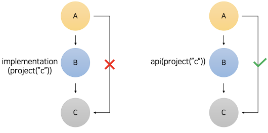
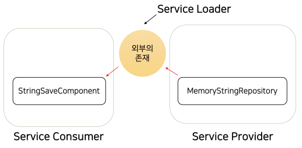
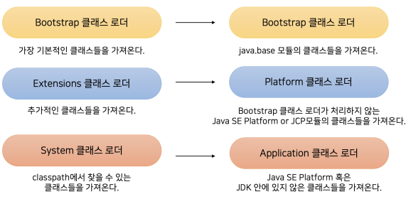

# JDK 9 ~ 11

## 자바 9와 자바 플랫폼 모듈 시스템

모듈이란 여러 코드가 모인 독립적인 구성 요소로, JDK 9 이전부터 빌드 툴(Gradle, Maven)을 이용하여 모듈 개념이 사용되었다.  
빌드 툴을 사용하면, 한 프로젝트 안에서 여러 모듈을 만들어 각 모듈 간의 의존성을 관리할 수 있다. 의존성을 관리할 수 있게 되면, 프로젝트의 코드를 여러 모듈로 나누고, 각 모듈끼리 연관관계를 설정해줄 수 있다.  

<br/>

### Gradle 모듈 실습

 - 최상위 프로젝트의 subprojects 지시어로 apply, repositories, dependencies 등 하위 모듈에 공통적인 설정을 적용할 수 있다.  
 - 그 외에 allprojects 지시어로 최상위 프로젝트와 하위 모듈 모두 공통적인 설정을 적용할 수 있다.
```
1. Gradle 프로젝트 만들기 (최상위 프로젝트)
2. 최상위 프로젝트 내부에 Module 만들기
 - xxx-admin, xxx-api, xxx-domain
 - 각 모듈별로 src 폴더와 build.gradle 파일이 생성된다.
    - 각 모듈별로 필요한 의존성은 build.gradle에 각각 정의한다.
 - 공통 설정이 필요한 경우 최상위 프로젝트의 build.gradle을 설정한다.
    - subprojects, allprojects 지시어 이용
```
<br/>

#### 하위 모듈별 설정

Gradle에서 의존성 주입으로 implementation와 api를 사용할 수 있다.  
A가 B를 의존하고, B가 C를 의존하는 경우 B에서 C를 implementation을 하는 경우 B에서만 C를 사용할 수 있다. B에서 C를 api을 하는 경우 B를 의존하는 A도 C를 사용할 수 있게 된다.  

<div align="center">
    
</div>
<br/>

 - `xxx-admin`
```kts
plugins {
    id("java")
}

group = "org.example"
version = "1.0-SNAPSHOT"

repositories {
    mavenCentral()
}

dependencies {
    implementation(project(":xxx-domain"))

    testImplementation(platform("org.junit:junit-bom:5.9.1"))
    testImplementation("org.junit.jupiter:junit-jupiter")
}

tasks.test {
    useJUnitPlatform()
}
```
<br/>

 - `xxx-api`
```kts
plugins {
    id("java")
}

group = "org.example"
version = "1.0-SNAPSHOT"

repositories {
    mavenCentral()
}

dependencies {
    implementation(project(":xxx-domain"))

    testImplementation(platform("org.junit:junit-bom:5.9.1"))
    testImplementation("org.junit.jupiter:junit-jupiter")
}

tasks.test {
    useJUnitPlatform()
}
```
<br/>

 - `xxx-domain`
```kts
plugins {
    id("java")
}

group = "org.example"
version = "1.0-SNAPSHOT"

repositories {
    mavenCentral()
}

dependencies {
    testImplementation(platform("org.junit:junit-bom:5.9.1"))
    testImplementation("org.junit.jupiter:junit-jupiter")
}

tasks.test {
    useJUnitPlatform()
}
```
<br/>

### 자바 9에서 추가된 모듈(JPMS)

JPMS를 사용하면 빌드 툴(Gradle, Maven) 없이 모듈을 구성할 수 있다. 또한, JPMS를 사용하면 조금 더 세미한 접근성 제어가 가능한데, 특정 모듈안에 여러 패키지 중에 특정 패키지만 외부에 노출하고 싶은 경우 JDK 9에서 추가된 기능으로 설정할 수 있다.  

<br/>

#### JPMS 실습

JPMS를 적용하기 위해서는 모듈 프로젝트 안에 'src/main/java' 폴더 경로에 module-info.java 라는 파일을 만들어주어야 한다. 'src/main/java/module-info.java' 파일이 존재하면 해당 프로젝트는 JDK 모듈 시스템을 사용하는 모듈로 간주된다.  

 - 모듈의 이름에는 패키지명과 동일하게 '.'을 이용할 수 있다.
 - 모듈을 불러오기 위해서는 requires 지시어롤 사용한다. (Gradle에서 implementation과 동일)
    - requires, requires static, requires transitive 지시어 제공
    - requires: Gradle implementation
    - requires transitive: Gradle api
    - requires static: requires는 컴파일 타임 의존성과 런타임 의존성을 모두 가져온다. 컴파일 타임 의존성을 코드 작성시 특정 클래스에 접근할 수 있고, 런타임 의존성을 리플렉션 기술을 활용하여 런타임에 접근할 수 있다. require static 을 사용하면 컴파일 타임만 접근할 수 있다.
 - 모듈은 기본적으로 다른 모듈에 API를 노출하지 않는다.
    - 사용되는 모듈(xxx-domain)에서 특정 패키지를 외부에 노출을 정의해주어야 한다. 이때, exports 지시어를 사용한다.
    - ex) exports org.domain to com.admin로 사용하면 org.domain 패키지를 com.admin 모듈에만 노출하도록 한다.
```java
// xxx-admin/src/main/module-info.java
module com.admin {
  requires com.domain;
}

// xxx-api/src/main/module-info.java
module com.api {
   requires com.domain;
   uses org.domain.service.StringRepository;
}

// xxx-domain/src/main/module-info.java
module com.domain {
  exports org.domain;
}
```
<br/>

### JPMS의 추가적인 기능들

#### 리플렉션

자바에서 private 멤버는 외부에서 접근할 수 없다. 하지만, 리플렉션 기술을 사용하면 private 멤버에 접근이 가능하다.  

```java
// xxx-api/src/main/java/lec02/Lec02Person.java
public class Lec02Person {
  private int weight;

  public String name;

  public int getWeight() {
    return weight;
  }

  public String getName() {
    return name;
  }

  @Override
  public String toString() {
    return "weight: " + weight;
  }
}

// xxx-api/src/main/java/lec02/Main.java
public class Main {
  public static void main(String[] args) throws Exception {
    Lec02Person p = new Lec02Person();

    Class<Lec02Person> clazz = Lec02Person.class;
    Field weight = clazz.getDeclaredField("weight");
    weight.setAccessible(true); // private 멤버에 대한 접근 허용

    // 몸무게를 100으로 변경
    weight.set(p, 100);
    System.out.println(p.getWeight());
  }
}
```
<br/>

#### JPMS private 멤버 접근

JPMS 등장 이후 private 멤버에 자유롭게 접근할 수 없도록 변경되었다.  
private 멤버 접근이 필요한 경우 open, opens, opens .. to 와 같은 지시어를 이용하여 추가적인 설정이 필요하다.  
 - open: 전체 코드에 대한 Deep Reflection 허가
 - opens: 특정 패키지에 대한 Deep Relection 허가
 - opens .. to : 특정 패키지만 특정 모듈에 Deep Relection 허가

```java
// 전체 코드 허가
open module com.domain {
    exports org.domain;
}

// 특정 패키지만 허가
module com.domain {
    exports org.domain;
    open org.domain;
}
```
<br/>

#### JPMS 서비스 기능

JPMS에서는 서비스 등록, 사용 기능이 제공된다.  
서비스란 코드의 변경 없이 원하는 기능을 갈아 끼우는 메커니즘을 의미한다. 즉, Spring DI와 비슷한 원리이다. 특정 구현체를 직접 코드에 작성하는 대신, 서비스 로더를 사용해 특정 구현체를 검색해서 가져와 코드를 전혀 변경하지 않고도 기능을 쉽게 갈아끼울 수 있게 된다.  
 - Service Consumer: 서비스 구현체를 사용하는 컴포넌트
 - Service Provider: 특정 서비스 구현체를 제공하는 컴포넌트
 - Service Loader: 특정 서비스 구현체를 선택해서 가져오는 컴포넌트

<div align="center">
    
</div>
<br/>

 - 서비스를 사용할 Consumer는 API 모듈에 있다.
 - 실제 구현체를 제공해줄 Provider는 DOMAIN 모듈에 있다.
```java
// StringRepository: 문자열 저장 기능 인터페이스
public interface StringRepository {
  void save(String newStr);
}

// MemoryStringRepository: 메모리에 문자열 저장 구현체
public class MemoryStringRepository implements StringRepository {
  private final List<String> strings = new ArrayList<>();

  @Override
  public void save(String newStr) {
    strings.add(newStr);
    System.out.println("문자열 메모리 저장");
  }
}

// DatabaseStringRepository: DB에 문자열 저장 구현체
public class DatabaseStringRepository implements StringRepository {
  @Override
  public void save(String newStr) {
    System.out.println("데이터베이스에 저장");
  }
}
```
<br/>

 - __서비스 구현체 등록__
    - 서비스 구현체를 등록하기 위해서는 providers with 구문을 사용한다.
```java
// xxx-domain/src/main/java/module-info.java
module com.domain {
  exports org.domain;
  exports org.domain.service;

  provides org.domain.service.StringRepository with
      org.domain.service.MemoryStringRepository,
      org.domain.service.DatabaseStringRepository;
}
```
<br/>

 - __서비스 로더 및 구현체 사용__
    - StringRepositoryLoader
        - 특정 서비스 구현체를 선택해서 가져오는 컴포넌트이다.
        - ServiceLoader.load(인터페이스) 메서드를 호출하면 구현체를 Iterable 형식으로 반환한다. for문을 통해 하나씩 접근하여 클래스명과 동일한 구현체를 반환하도록 한다.
    - StringSaveComponent
        - 서비스 구현체를 사용하는 컴포넌트이다.
        - 서비스 로더의 getDefault()를 호출하여 구현체를 가져와 사용한다.
        - 해당 컴포넌트에서는 사용할 서비스를 정의해줄 필요가 없다. 구현체가 변경되어도 해당 코드는 변경되지 않는다. 
```java
// xxx-api/src/main/java/module-info.java
module com.api {
   requires com.domain;
   uses org.domain.service.StringRepository;
}

// xxx-api/src/main/java/lec02/service/StringRepositoryLoader.java
public class StringRepositoryLoader {
  private static final String DEFAULT = "org.domain.service.MemoryStringRepository";

  public static StringRepository getDefault() {
    return getRepository(DEFAULT);
  }

  private static StringRepository getRepository(String name) {
    for (StringRepository repository : ServiceLoader.load(StringRepository.class)) {
      if (repository.getClass().getName().equals(name)) {
        return repository;
      }
    }
    throw new IllegalArgumentException("원하는 서비스를 찾을 수 없습니다!");
  }
}

// xxx-api/src/main/java/lec02/service/StringSaveComponent.java
public class StringSaveComponent {

  private final StringRepository stringRepository = StringRepositoryLoader.getDefault();

  public void mainLogic() {
    stringRepository.save("문자열");
  }

  public static void main(String[] args) {
    StringSaveComponent component = new StringSaveComponent();
    component.mainLogic();
  }

}
```
<br/>

### JPMS 키워드 정리

 - requires : 특정 모듈을 가져온다.
 - requires compile : 특정 모듈의 컴파일 의존성만 가져온다.
 - requires transitive : 특정 모듈을 추이적으로 가져온다.
 - exports : 특정 패키지를 외부에 노출한다.
 - exports … to : 특정 패키지를 특정 모듈에만 노출한다.
 - open : 모듈 전체에 대한 deep reflection을 허가한다.
 - opens : 특정 패키지에 대한 deep reflection을 허가한다.
 - opens … to : 특정 모듈에만 특정 패키지의 deep reflection을  허가한다.
 - provides … with … : 서비스 구현체들을 등록한다.
 - uses : 특정 서비스 인터페이스를 사용한다.

<br/>

### JPMS 적용 이후 보이지 않는 주요 변경점

#### 1. 클래스 로더의 구성 변경

Java는 기본적으로 *.java 파일을 컴파일하여 *.class 파일로 만들고, JVM이 이러한 *.class 파일을 가져와 실행한다. 이떄, 클래스 파일을 가져오는 기능을 제공하는 객체가 클래스 로더이다.  

<br/>

Java 8까지는 클래스로더가 Bootstrap 클래스 로더, Extensions 클래스로더, System 클래스 로더 세 단계 클래스 로더가 있었다.  
 - __Bootstrap 클래스 로더__
    - 최상위 클래스 로더로 가장 기본적인 클래스들을 가져온다.
 - __Extensions 클래스 로더__
    - 추가적인 클래스들을 가져온다.
    - “기본적인” 클래스와 “추가적인” 클래스는 클래스가 위치한 경로를 통해 구분한다.
    - “기본적인” 클래스는 '$JAVA_HOME/jre/lib' 디렉토리에 위치한 클래스를 의미하고, “추가적인” 클래스는 '$JAVA_HOME/jre/lib/ext' 디렉토리 혹은 java.ext.dirs 시스템 프로퍼티에 지정된 디렉토리에 있는 클래스를 의미한다.
 - __System 클래스 로더__
    - 클래스패스에서 찾을 수 있는 클래스들을 가져온다.

<br/>

Java 9+ 부터는 클래스 로더 구성이 변경되었다.  

 - __Bootstrap 클래스 로더__
    - 동일하게 최상위 클래스 로더이지만, java.base 와 같은 중요한 모듈에 있는 클래스들을 가져온다.
    - 자바 9 이전의 bootstrap 클래스 로더보다 처리하는 클래스 수가 줄어들었다.
 - __Platform 클래스 로더__
    - 자바 9 클래스 로더 시스템에서 가장 큰 변경점으로, Extensions 클래스 로더가 갖고 있는 메커니즘은 완전히 제거되었다.
    - 제거된 java extension 매커니즘을 한 줄로 요약하면, 개발자들이 Java 플랫폼에 커스텀 API를 집어넣을 수 있는 기능이다.
    - Bootstrap 클래스 로더가 처리하지 않는 Java SE Platform 모듈 내의 클래스들을 가져온다.
    - JCP 표준으로 관리되는 클래스들도 가져오는 역할을 갖는다.
 - __Application 클래스 로더__
    - Java SE Platform 혹은 JDK 모듈에 있지 않은 클래스를 가져오는 로더이다.

<div align="center">
    
</div>
<br/>

#### 2. JRE, JDK의 구성 변경

두 번째 변경점은 JRE, JDK의 구성이 변경되었다는 것이다.  
JRE, JDK 내부에는 rt.jar tools.jar 등 몇 가지 jar이 포함되어 있었는데, 이들은 제거되고, JRE, JDK의 디렉토리 구성에도 약간의 변경이 있었다. 또한, 모듈 시스템이 등장했기 때문에 필요한 모듈들만 갖고 있는 JRE / JDK를 구성할 수도 있고, 이런 개념을 “modular image”라고 부른다. 여기서 image가 바로 JRE 혹은 JDK를 가리키는 용어이다.  

