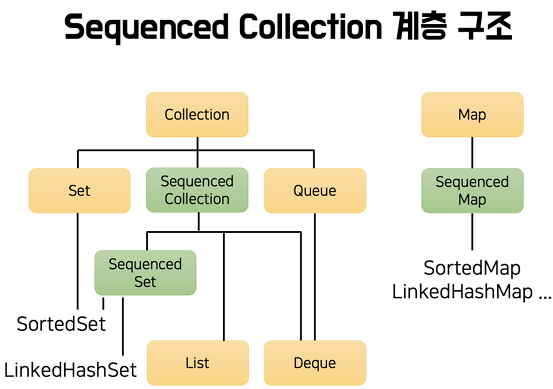
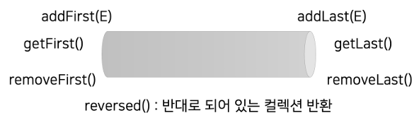

# 자바 18부터 자바 21까지

## 1. record pattern과 switch pattern matching

### record pattern

 - 자바 19 미리보기, 자바 21 정식 기능
 - record class를 instanceof pattern matching과 함께 사용할 떄 내부 필드에 바로 접근할 수 있는 기능
 - record pattern은 중첩된 record class 에서도 사용할 수 있다.
```java
// record class 예시
// DTO를 쉽게 만들어주는 문법으로 필드, 접근자, equals(), hashCode(), toString()이 자동으로 생성된다.
public record Fruit(
    String name,
    int price,
    LocalDate date
) {

}

// instanceof pattern matching 예시
// 기존 instanceof 사용시 특정 타입인지 검증하고, 블록 내부에서 직접 명시적으로 형변환 해야했다.
// instanceof pattern matching을 사용하면 타입 검증과 형변환을 한 번에 할 수 있다.
if (animal instanceof Dog dog) {
    return dog.bark();
} else if (animal instanceof Cat cat) {
    return cat.purr();
}

// record pattern
public class Main {
    // record class 정의
    record Point(double x, double y) {
    }

    // 중첩된 record class 정의
    record Line(Point p1, Point p2) {
    }

    // instanceof pattern matching 사용
    // Point 타입 검증과 변수 p로 할당받고, Point의 접근 메서드로 내부 필드를 사용
    public static void findDistanceIfPoint1(Object object) {
        if (object instanceof Point p) {
            double distance = Math.hypot(p.x(), p.y());
            System.out.printf("원점으로부터의 거리는 %.3f입니다.\n", distance);
        }
    }

    // record pattern 사용
    // record class를 구조분해 할당하여, 내부 필드 변수를 바로 사용할 수 있다.
    // 이떄, 타입 명시를 직접할 수 있지만 var를 이용해 타입 추론을 할 수 있다.
    public static void findDistanceIfPoint1(Object object) {
        if (object instanceof Point(double x, double y)) {
            double distance = Math.hypot(x, y);
            System.out.printf("원점으로부터의 거리는 %.3f입니다.\n", distance);
        }
    }

    // record pattern 사용
    // 중첩된 record class에 적용
    public static void findDistanceIfPoint1(Object object) {
        if (object instanceof Point(double x, double y)) {
            double distance = Math.hypot(x, y);
            System.out.printf("원점으로부터의 거리는 %.3f입니다.\n", distance);
        }

        if (object instanceof Line(Point(var x1, var x2), Point(var x2, var y2))) {
            double distance = Math.hypot(x2 - x1, y2 - y1);
            System.out.printf("두 점 사이의 거리는 %.3f입니다.\n", distance);
        }
    }
}
```
<br/>

### switch pattern matching

 - 자바 17 미리보기, 자바 21 정식 기능
 - switch 선택자 안에 char, byte, short, int와 더불어 그 어떤 reference type도 들어갈 수 있다.
 - case 뒤에 패턴 매칭이 올 수 있다.
    - if - else if 를 사용했던 instanceof 분기 처리를 switch expression으로도 사용할 수 있다.
 - when 절을 사용해 추가 조건을 확인할 수 있다.
 - switch의 NPE 조건 변경
    - 기존에는 switch 선택자에 null이 들어오면 바로 NPE가 발생하였다. 
    - 지금은 switch 선택자에 null이 들어오고, case null이 없을 경우 NPE가 발생한다.
```java
// switch expression 예시
// Switch문 전체를 하나의 값으로 사용할 수 있게 되었다.
// Switch 문의 셀렉터에는 char/byte/short/int/문자열/ENUM만 들어갈 수 있었다.
// 때문에, case 뒤에는 반드시 상수만 들어갈 수 있었다.
private String calculateTestGrade(int score) {
    return switch (score) {
        case 5 -> "A";
        case 4, 3 -> "B";
        case 2, 1 -> "C";
        default -> "F";
    }
}

// switch pattern matching
public String sound(Animal animal) {
    if (animal instanceof Dog dog) {
        return dog.bark();
    } else if (animal instanceof Cat cat) {
        return cat.purr();
    }
    throw new IllegalArgumentException("다른 경우의 수는 존재하지 않습니다.");
}

public String sound(Animal animal) {
    // Animal 클래스가 sealed class면, default 라벨을 제거할 수 있다.
    return switch (animal) {
        case Dog dog -> dog.bark();
        case Cat cat -> cat.purr();
        default -> throw new IllegalArgumentException("다른 경우의 수는 존재하지 않습니다.");
    }
}

// when 절 사용
// DOg인데, 짖지 않는 강아지 case
public String sound(Animal animal) {
    return switch (animal) {
        case Dog dog when dog.isQuite() -> "";
        case Dog dog -> dog.bark();
        case Cat cat -> cat.purr();
        default -> throw new IllegalArgumentException("다른 경우의 수는 존재하지 않습니다.");
    }
}

// case null 사용
public String sound(Animal animal) {
    return switch (animal) {
        case Dog dog when dog.isQuite() -> "";
        case Dog dog -> dog.bark();
        case Cat cat -> cat.purr();
        case null, default -> "";
    }
}
```
<br/>

 - `sealed class와 switch pattern matching 활용`
```java
public enum AnimalType {
    DOG,
    CAT
    ;
}

public sealed class AnimalDto {

    public static AnimalDto of(Animal animal) {
        // 방안 1
        return switch (animal) {
            case Dog dog -> DogDto.of(dog);
            case Cat cat -> CatDto.of(cat);
        }

        // 방안 2
        return switch (animal.getType()) {
            case DOG -> DogDto.of((Dog) animal);
            case CAT -> CatDto.of((CAT) animal);
        }
    }

    public record DogDto(
        String ownerName
    ) implements AnimalDto {
        public static DogDto of(Dog dog) {
            return new DogDto(dog.getOwnerName());
        }
    }

    public record CatDto(
        String name,
        int age
    ) implements AnimalDto {
        public static CatDto of(Cat dog) {
            return new CatDto(cat.getName(), cat.getAge());
        }
    }
}

public class AnimalService {

    public AnimalDto getInformation(AnimalType type, long id) {
        // Animal animal = animalRepository.findByTypeAndId(type, id);
        Animal animal = new Dog();
        return AnimalDto.of(animal);
    }
}
```
<br/>

## 2. 자바 21에서 preview로 등장한 세 가지 문법

preview feature를 사용하기 위해서는 설정이 필요하다.  

```
Project Structure
 - Language Level: 21(Preview)

build.gradle 태스크 추가

tasks.compileJava {
    options.compilerArgs.add("--enable-preview")
}

만약, preview 기능이 동작하지 않는다면 CLI로 진행한다.
$ javac -source 21 --enable-preview Main.java
$ java --enable-preview org.api.Main
```
<br/>


### unnamed class

 - main 메서드가 간단해지는 기능
 - 패키지 정보도 없고, 클래스 정보도 없다.
 - unnamed package
    - 패키지 정보가 없는 코드는 unnamed package에 있는 것으로 간주된다.
    - 패키지 정보가 있는 코드는 unnamed package 안의 코드를 가져올 수 없다.
 - unnamed class
    - 클래스 선언이 없는 코드
    - 패키지 선언도 함꼐 없어야 하고, 다른 클래스에서 unnamed class에 접근할 수 없다.
    - 사실상 애플리케이션의 시작 지점만 될 수 있다.
```java
// 변수와 함수 작성 가능
String greeting = "Hello, World";
String greeting2() {
    return "Hello World";
}

void main() {
    System.out.println("Hello World");
}

void main(String[] args) {
    System.out.println("Hello World");
}

// main 함수 결정 순서
// 1. static void main(String[] args)
// 2. static void main()
// 3. void main(String[] args)
// 4. void main()
```
<br/>

### unnamed patterns, unnamed variable

 - 사용하지 않은 패턴 매칭, 변수를 언더스코어(_)로 바꿀 수 있다.
 - 전체를 언더스코어(_)로 생략하거나, 변수명만을 언더스코어(_)로 생략할 수 있다.
```java
public static void findDistance(Object object) {
    if (object instanceof Line(Point(var x1, var _), Point(var x2, _))) {

    }
}
```
<br/>

### String Template

 - 어떠한 문자열을 변수와 함께 쉽게 사용할 수 있다. (JS의 백틱)
 - String.format()이나 formatted() 함수를 대체한다. 
 - String Template을 사용하기 위해서는 STR 객체를 이용한다.
    - STR은 template processor를 의미한다.
    - 실제로는 StringTemplate 인터페이스의 interpolate() 함수를 호출한다.
 - 변수는 역슬래시와 중괄호를 사용한다.
    - 변수에는 모든 expression을 넣을 수 있다.
    - expression은 하나의 값으로 도출되는 식을 말한다.
        - 3 + 4 혹은 method() 결과 등
```java
String name = "홍길동";
int age = 50;

String str = STR."이름: \{name} 나이: \{age}";
```
<br/>

 - __FMT 템플릿 프로세서__
    - '%.2f'나 '%8s' 같은 포맷팅 사용 가능
```java
double num = 1.333;
String str = FMT."숫자: %.2f\{num}";
```
<br/>

 - __RAW__
    - 문자열을 바로 가공하지 안혹, StringTemplate 클래스 자체를 반환
    - fragments() 메서드로 순수 문자열 부분을 얻을 수 있다.
    - values() 메서드로 넣으려는 변수들을 얻을 수 있다.
    - interpolate() 메서드로 String Template을 가공한 문자열을 얻을 수 있다.
```java
String name = "홍길동";
int age = 50;

StringTemplate template = RAW."이름: \{name} 나이: \{age}";
System.out.println(template.fragments()); // [이름: , 나이: , ]
System.out.println(template.values()); // [홍길동, 50]
System.out.println(template.interpolate()); // 이름: 홍길동 나이: 50
```
<br/>

## 3. 자바 18부터 자바 21까지의 라이브러리 주요 업데이트

### Math API 추가

 - clamp()
    - value가 min과 max 사이에 있는지 확인
    - 사이에 있으면 value, 더 작으면 min, 더 크면 max를 반환한다.
```java
public static int clamp(long value, int min, int max) {
    if (min > max) {
        throw new IllegalArgumentException(min + " > " + max);
    }
    return (int) Math.min(max, Math.max(value, min));
}

int result = Math.clamp(10, 5, 15); // 사이에 있으므로 10 반환
int result = Math.clamp(2, 5, 15); // min 보다 작으므로 5 반환
int result = Math.clamp(20, 5, 15); // max 보다 크므로 15 반환
```
<br/>

### String / StringBuilder / Character API 추가

 - String 클래스 - indexOf()
    - 기존에도 indexOf() 함수가 존재했지만, 특정 문자의 위치를 처음부터 찾거나 특정 지점부터 찾을 수 있었다.
    - 신규로 생긴 indexOf()는 특정 범위 안에 있는 문자나 문자열의 위치를 찾을 수 있다.
```java
public int indexOf(String str, int beginIndex, int endIndex){ .. }
public int indexOf(int ch, int beginIndex, int endIndex){ .. }
```
<br/>

 - String 클래스 - splitWithDelimiters()
    - Delimiter를 포함해서 문자열을 나누는 기능이다.
    - 기존 split() 함수는 Delimiter를 결과에서 제외하고, 배열을 반환한다.
```java
String str = "A;B;C";
String[] result = str.split(";"); // [A, B, C]

// [A, ;, B, ;, C]
String[] result2 = str.splitWithDelimiters(";", -1);
```
<br/>

 - StringBuffer/Builder 클래스 - repeat()
    - 특정 문자열이 반복해 쌓이는 함수
```java
StringBuilder sb = new StringBuilder();
sb.repeat("ABC ", 3);
System.out.println(sb); // "ABC ABC ABC "
```
<br/>

 - Character 클래스 - emoji 관련 함수 추가
```java
// 특정 문자가 이모지인지 검증
// codePoint는 유니코드이다.
isEmoji(int codePoint);
isEmojiPresentation(int codePoint);
isEmojiModifier(int codePoint);
isEmojiModifierBase(int codePoint);
isEmojiComponent(iont codePoint);
isExtendedPictographic(int codePoint);
```
<br/>

### Sequenced Collection API 추가

순서가 관리되는 컬렉션이 추가되었다.  
 - Collection 계층 구조가 변경되었다.
 - 순서를 기반으로 가장 앞에 값 추가, 조회, 삭제 기능과 가장 마지막에 값 추가, 조회, 삭제 메서드가 추가되었다.
<div align="center">
    <br/>
    
</div>
<br/>

 - `Sequenced Collection 인터페이스`
```java
interface SequencedCollection<E> extends Collection<E> {
    SequencedCollection<E> reversed();
    void addFirst(E);
    void addLast(E);
    E getFirst();
    E getLast();
    E removeFirst();
    E removeLast();
}
```
<br/>

#### Sequenced Collection 사용 예제

 - reversed() 는 Collection의 View 역할을 한다.
 - 즉, 원본의 데이터가 바뀌면 reversed도 변경되어 보이고, reversed의 데이터가 바뀌면 원본도 바뀐다.
```java
List<Integer> numbers = List.of(1, 2, 3, 4);
numbers.get(numbers.size() - 1); // 가장 마지막 값 조회
numbers.getLast(); // 가장 마지막 값 조회

List<Integer> reversed = numbers.reversed();
numbers.add(5); // 원본에 값 추가
System.out.println(reversed); // [5, 4, 3, 2, 1]
reversed.addFirst(6); // reversed의 값 추가
System.out.println(numbers); // [1, 2, 3, 4, 5, 6]
```
<br/>

#### 집합은 조금 다르게 동작한다.

 - LinkedHashSet에서 addFirst()와 addLast()의 경우 원래 있던 원소를 추가하려 하면, 위치가 재조정된다.
 - SortedSet에서 addFirst()와 addLast()를 호출하면 UnsupportedOperationException이 발생한다.

<br/>

#### Map도 조금 다르게 동작한다.

 - 값을 반환하는 메서드들은 immutable을 반환한다.
```java
interface SequencedMap<K,V> extends Map<K,V> {
    SequencedMap<K,V> reversed();
    SequencedSet<K> sequencedKeySet(); 
    SequencedCollection<V> sequencedValues();
    SequencedSet<Entry<K,V>> sequencedEntrySet();

    V putFirst(K, V);
    V putLast(K, V);
    Entry<K, V> firstEntry();
    Entry<K, V> lastEntry();
    Entry<K, V> pollFirstEntry(); // poll = remove와 동일하다. (원소 제거)
    Entry<K, V> pollLastEntry();
}
```

