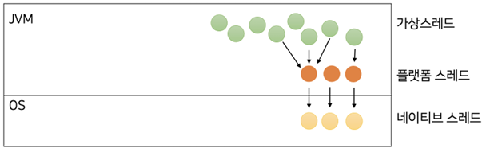

# 가상 스레드

## 스레드 기본 개념

 - 프로세스: 컴퓨터에서 실행되고 있는 프로그램
 - 스레드: 프로세스보다 작은 개념으로 프로세스에 소속되어 여러 코드를 동시에 실행할 수 있게 해주는 단위
 - 스레드는 프로세스보다 훨씬 효율적으로 H/W 자원을 쓸 수 있다.
    - 프로세스는 독립된 메모리를 가진다. 프로세스 Context Switching는 모든 메모리가 교체되므로 비용이 크다.
    - 스레드는 하나의 프로세스에 여러 개 존재하기 떄문에, 여러 스레드는 해당 프로세스의 Heap 영역을 공유하며, 각각 독립된 Stack 영역만을 가지고 있다.
    - 즉, 스레드 Context Switching이 발생하면 Heap 메모리는 공유하고, Stack만 교체되므로 Process보다 비용이 적게 든다.
 - JVM의 Thread는 OS가 관리하는 Thread와 1:1 매핑된다.
    - Thread를 생성하면, JVM 메모리 위에 쓰레드가 먼저 생성되고, 해당 쓰레드는 OS의 쓰레드와 1:1 매핑이 된다.
    - JVM의 Thread와 OS의 Thread를 구분하기 위해 OS의 Thread를 Native Thread 라고 부른다.
```java
public class Main {
    public static void main(String[] args) throws Exception {
        // 3개의 쓰레드를 만들어 실행
        for (int i = 0; i < 3; i++) {
            int threadNum = i + 1;
            Thread t = new Thread() {
                @Override
                public void run() {
                    printlnWithThread(String.format("스레드 %s번 실행", threadNum));
                }
            };
            t.start();
        }

        // 현재 쓰레드 5초 대기
        Thread.sleep(5_000L);
    }

    private static void printlnWithThread(Object obj) {
        System.out.printf("[%s] %s\n", Thread.currentThread().getName(), obj);
    }
}
```
<br/>

<div align="center">
    
</div>
<br/>

### 스레드 자체를 만드는 것도 비용이 든다.

스레드를 만들면, JVM 위에 스레드가 생기고 OS 상에도 스레드가 생성된다. 때문에, 이러한 스레드 생성 과정도 비용이 어느정도 소모된다.  
이것을 해결하기 위해 미리 스레드를 만들어 놓고 사용하는 폴링 방식이 등장한다.  

```java
public class Main {
    public static void main(String[] args) throws Exception {
        // 3개의 쓰레드를 만들어 실행
        try (ExecutorService executorService = Executors.newFixedThreadPool(2)) {
            for (int i = 0; i < 3; i++) {
                int threadNum = i + 1;
                executorService.submit(() -> printlnWithThread(String.format("스레드 %s번 실행", threadNum)));
            }
        }
        

        // 현재 쓰레드 5초 대기
        Thread.sleep(5_000L);
    }

    private static void printlnWithThread(Object obj) {
        System.out.printf("[%s] %s\n", Thread.currentThread().getName(), obj);
    }
}
```
<br/>

## 가상 스레드

가상 스레드는 높은 처리량의 동시성 애플리케이션을 개발하고 유지보수하기 위한 경량 스레드이다.  
기존에 플랫폼 쓰레드는 JVM 쓰레드와 1:1로 매핑이 되었지만, 2개 이상의 가상 쓰레드를 만들어도 하나의 Native 쓰레드에 매핑될 수 있다. 이때, Java Runtime 내부의 스케줄러에서 어떤 가상 쓰레드가 어떤 Native 쓰레드에 매핑될지 결정해준다. 실행되고 있던 가상 쓰레드가 Blocking 되면 다른 가상 쓰레드로 바꾼다.  
 - 가상 쓰레드가 플랫폼 쓰레드와 N:1로 매핑된다.
 - 플랫폼 쓰레드는 Natvie 쓰레드와 1:1로 매핑된다.

<div align="center">
    
</div>
<br/>

### 가상 스레드 주요 특징

 - 가상 스레드도 자바의 Thread이다.
 - 가상 스레드는 원래 존재했던 플랫폼 스레드보다 가볍다.
 - 가상 스레드의 코드가 실행되려면 플랫폼 스레드에 매핑되어야 한다.
 - 가상 스레드의 코드가 실행되다 Blocking I/O가 발생하면 다른 가상 스레드의 코드가 실행된다.

<br/>

### 가상 스레드 예시

 - 가상 스레드가 플랫폼 스레드보다 코드를 더 빠르게 실행시키는 것은 아니다.
 - 가상 스레드를 사용하면 여러 요청을 동시에 처리해 전체 처리량을 늘리는 것이지 단일 요청을 놓고 보면 플랫폼 스레드보다 느릴 수 있다. (여러 요청을 동시에 처리하는 과정에서 Native 스레드 생성 비용과 Context Switch 비용을 낮춰 전체 처리량을 늘릴 수 있다.)
```java
// ofVirtual: builder 패턴으로 생성 후 실행
Thread t = Thread.ofVirtual()
        .start(() -> printlnWithThread("Hello, Virtual Thread"));
t.join();

// startVirtualThread: 즉시 가상 스레드로 실행
Thread t2 = Thread.startVirtualThread(() -> printlnWithThread("Hello, Virtual Thread"));

// ExecutorService 이용
try (ExecutorService executorSerivce = Executors.newVirtualThreadPerTaskExecutor()) {
    Future<?> future = myExecutor.submit(() -> printlnWithThread("Hello, Virtual Thread"));
    future.get();
}
```
<br/>

### 가상 스레드와 스프링 MVC

스프링 부트 3.2부터는 가상 스레드를 지원한다.  

 - JDK 21 버전 이상
 - 톰캣, 스케줄러, @Async 처리, RabbitMQ/Kafka 리스너 등에서도 가상 스레드가 동작하게 된다.
```yml
spring:
  threads:
    virtual:
      enabled: true
```

톰캣에 가상 스레드가 적용되면, 요청이 들어올 떄 기존의 폴링된 스레드가 요청을 처리하는 대신 요청마다 새로운 가상 스레드가 요청을 처리하게 되며, 따라서 전체 처리량이 이전보다 좋아질 수 있다.  

다만, 애플리케이션 특성에 따라서는 오히려 가상 스레드를 사용해 문제가 생길 수도 있다. 예를 들어, 데이터베이스에 접근을 해야 하는 스프링 애플리케이션의 경우, 보통 DB 커넥션 풀을 갖고 있고, DB 접근시 미리 만들어진 커넥션을 사용하는 방식을 쓴다. 그런데, 이때 기존과 달리 가상 스레드가 적용되어 요청을 받을 때마다 데이터베이스에 접근하려 한다면 결국 커넥션 풀은 소진되고 몇몇 요청은 DB 자체에 접근하지 못할 것이다.  
 - 폴링을 사용하지 않기 떄문에 DBCP가 소진되어 요청이 거절될 수 있다.

<br/>

또한, 가상 스레드의 Pinning 현상도 문제가 될 수 있다.  
Pinning 현상이란 가상 스레드가 매핑되어야 하는 플랫폼 스레드가 고정되어 버린 현상으로, Blocking I/O를 호출해도 다른 가상 스레드가 실행되지 않게 된다. Pinning 현상은 가상 스레드가 synchronized 코드를 실행하거나, C/C++로 작성된 네이티브 메서드를 실행한 경우 나타난다.  
 - synchronized 코드를 실행하거나, Native 코드(C/C++)를 실행한 경우 발생

<br/>

### 가상 스레드와 스프링 WebFlux

스프링 WebFlux는 thread-per-request 스타일에서 벗어나 적은 수의 스레드와 함께 Non-Blocking API로 동시성을 극대화한다.  
스프링 WebFlux의 핵심은 적은 수의 스레드가 폴링되고 있다는 것이다. 떄문에, 가상 스레드를 적용하기에는 애매하다.  

<br/>

### 가상 스레드 정리

결론적으로 아직 가상 스레드가 출시된 지 얼마 되지 않아, 여러 라이브러리와 프레임워크의 추가적인 지원이 필요한 상황이다.  
물론, 가상 스레드의 장단점을 잘 이해하고 사용하면, 더 많은 처리량을 확보할 수 있는 작업들도 있을 것이다.  

<br/>

## 가상 스레드 추가적인 개념

### ThreadLocal

ThreadLocal을 특정 스레드에 바인딩되어 동작한다.  
 - ThreadLocal의 단점
    - ThreadLocal은 언제나 손쉽게 변경할 수 있다. (불변 ThreadLocal을 만들 수 없다.)
    - 가상 스레드와 ThreadLocal을 같이 사용하면, 가상 스레드는 폴링을 사용하지 않아 동시에 더 많은 스레드 수가 생길 수 있고, ThreadLocal 변수가 갖는 메모리가 크다면 애플리케이션 메모리가 빠르게 소진될 수 있다.
```java
public class Constant {
    
    public static void main(String[] args) throws Exception {
        ExecutorService executor = Executors.newFixedThreadPool(2);
        final ThreadLocalRandom generator = ThreadLocalRandom.current();

        for (int i = 1; i <= 5; i++) {
            Future<?> future = executor.submit(() -> initNumber(generator));
            future.get();
        }

        for (int i = 1; i <= 5; i++) {
            executor.submit(Constant::printNumber);
        }

        executor.close();
    }
    
    private static final ThreadLocal<Integer> randomNumber = new ThreadLocal<>();

    public static void initNumber(RandomGenerator generator) {
        if (randomNumber.get() == null) {
            var num = generator.nextInt(10);
            printWithThread("값 설정 완료", num);
            randomNumber.set(num);
        }
    }

    public static void printNnumber() {
        printWithThread("값 확인", randomNumber.get());
    }

    private static void printWithThread(String str, Object obj) {
        System.out.println("[%s] - %s : %s\n", Thread.currentThread().getName(), str, obj);
    }
}
```
<br/>

### Scoped Value 

 - Java 21의 Preview 기능
 - ScopedValue의 run() 안에서 실행되는 영역에 바인딩되어 값이 설정된다.
```java
public class ConstantV2 {
    private static final ScopedValue<Integer> randomNumber = ScopedValue.newInstance();

    public static void main(String[] args) {
        final RandomGenerator generator = new Random();

        ScopedValue.where(ConstantV2.randomNumber, generator.nextInt(10))
            .run(() -> {
                test1();

                test2();
            })
    }

    private static void test1() {
        System.out.println("test1 : " + randomNumber.get());
    }

    private static void test2() {
        System.out.println("test2 : " + randomNumber.get());
    }

}
```
<br/>

### 가상 스레드와 코루틴

코루틴은 개념적으로 가상 스레드와 매우 유사하다.  
플랫폼 스레드에 매핑되는 코루틴이란 개념이 존재하고, 이러한 코루틴 안의 코드는 스레드에 할당되어 동작한다.  
하지만, 가상 스레드와 다르게, Blocking I/O를 만났다고 해서 자동으로 코루틴이 교체되지는 않는다. 오히려 Blocking I/O를 그냥 사용하면, 코루틴이 할당된 스레드가 Blocking 된다. 이때, 만약 코루틴의 실행을 멈추고 다른 코루틴을 실행시키고 싶으면, suspend 함수를 사용해야 한다.  

 - 비동기 코드는 코드가 특정 리액티브 라이브러리에 의존하게 된다. 또한, 데이터를 어떻게 처리해야 할지 지시하는 코드가 많아지며, 코드가 더 복잡해질 수 있다.
 - 코루틴은 이러한 문제를 해결하기 위해 리액티브 프로그래밍을 할 때 마치 동기 코드처럼 작성하게 해준다. 또한, 코루틴 자체가 코틀린 언어의 기능을 활용하고 있어, 특정 라이브러리에 의존하는 문제를 제거해준다.
```java
// 동기 코드
// DB 조회를 마치고, 외부 API 이미지를 조회한다.
User user = userRepository.findById(userId); // DB 에서 회원 정보 조회
Image image = imageApiCaller.findByImage(imageId); // 외부 API로 이미지 조회
return ImageResponse.of(user, image);

// 비동기 코드
// DB 조회와 외부 API 이미지 조회를 동시에 실행한다.
Mono<User> user = userRepository.findById(userId);
Mono<Image> image = imageApiCaller.findByImage(imageId);
return Mono.zip(user, image)
    .map(ImageResponse::new);

// 코루틴
val user = userRepository.findById(userId) // suspend 함수
val image = imageApiCaller.findByImage(imageId)
return ImageResponse.of(user, image)

// DB와 외부 API 동시 접근(코루틴 기능)
val user = async { userRepository.findById(userId) }
val image = async {imageApiCaller.findByImage(imageId) }
return ImageResponse.of(user.await(), image.await())
```
<br/>

