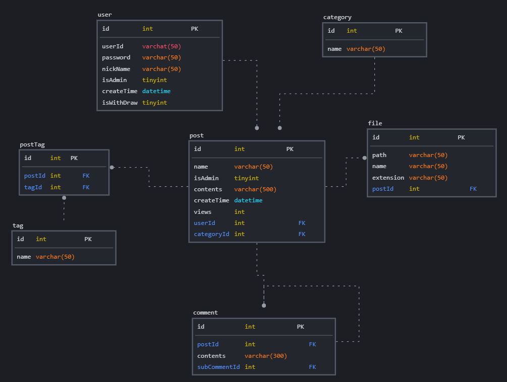

# 프로젝트 준비

## 1. 깃허브 연동

Git은 분산형 버전 관리 시스템으로, 소스 코드의 변경 내역을 추적하고 협업을 위해 사용되는 도구입니다. 리누스 토르발스가 개발한 Git은 빠르고 효율적인 협업과 소스 코드 관리를 가능하게 합니다. Git을 사용하면 효율적인 협업과 버전 관리가 가능해져서 여러 개발자가 동시에 프로젝트를 관리하고 개선할 수 있습니다.  

 - 버전 관리: Git은 파일의 변경 내역을 시간별로 기록하여 버전을 관리합니다. 이를 통해 이전 상태로 되돌리거나 변경 내역을 확인할 수 있습니다.
 - 분산형 버전 관리: Git은 저장소(Repository)를 로컬에 복제하여 작업할 수 있으며, 이로 인해 중앙 서버에 의존하지 않고도 독립적으로 작업할 수 있습니다.

<br/>

### Git 커밋 규칙

Git 커밋 규칙을 설정하는 이유는 주로 코드베이스의 가독성, 유지보수성, 협업 효유성을 향상시키기 위함입니다. 일관된 커밋 메시지 형식과 규칙을 따르면 프로젝트 관리 및 협업이 용이해집니다.  

```
★ 타입 종류
 - enh: 새로운 기능에 대한 커밋
 - fix: 버그 수정에 대한 커밋
 - build: 빌드 관련 파일 수정/모듈 설치 또는 삭제에 대한 커밋
 - chore: 그 외 자잘한 수정에 대한 커밋
 - ci: ci 관련 설정 수정에 대한 커밋
 - docs: 문서 수정에 대한 커밋
 - style: 코드 스타일 혹은 포맷 등에 관한 커밋
 - refactor: 코드 리팩토링에 대한 커밋
 - test: 테스트 코드 수정에 대한 커밋
 - perf: 성능 개선에 대한 커밋
```

<br/>

### 브랜치 전략

Git은 독립적인 작업 공간인 브랜치를 제공합니다. 작업이 완료되면 다른 브랜치에 변경 사항을 병합할 수 있습니다.  
 - 병합(Merge): 브랜치에서의 작업이 완료된 후, 변경된 내용을 다른 브랜치에 통합하는 작업을 말합니다.
 - 추적(Tracking): 파일의 상태 변경을 추적하여 어떤 파일이 수정되었는지, 어떤 파일이 추가/삭제 되었는지를 확인할 수 있습니다.

<br/>

#### 브랜치 전략 - Git Flow

 - __1. master 브랜치에서 시작__
    - 프로젝트의 초기 상태를 나타내는 master 브랜치에서 시작합니다.
    - 이 브랜치는 항상 배포 가능한 상태를 유지해야 합니다.
 - __2. develop 브랜치 생성__
    - master 브랜치에서 develop 브랜치를 생성합니다.
    - develop 브랜치는 개발을 위한 중심 브랜치로 개발 중인 기능들을 통합하고 테스트합니다.
 - __3. 기능 개발 (feature) 브랜치 생성__
    - 새로운 기능을 개발할 때 마다 develop 브랜치에서 feature 브랜치를 생성합니다.
    - feature 브랜치에서 해당 기능에 대한 작업을 진행합니다.
 - __4. 기능 통합 및 테스트__
    - 기능 개발이 완료되면 feature 브랜치를 develop 브랜치로 병합합니다.
    - 통합된 기능은 develop 브랜치에서 테스트를 진행합니다.
 - __5. 릴리스(release) 브랜치 생성__
    - 새로운 릴리스를 준비할 때 develop 브랜치에서 release 브랜치를 생성합니다.
    - release 브랜치에서 릴리스 관련 작업(버전 번호 업데이트, 문서 작성 등)을 수행합니다.
 - __6. 릴리스 테스트 및 완료__
    - release 브랜치에서 릴리스 후보를 테스트합니다.
    - 필요한 경우 버그를 수정하고 release 브랜치에 반영합니다.
    - 테스트가 완료되면 release 브랜치를 master 브랜치로 병합하고, 이에 따라 새로운 릴리스가 배포됩니다.
 - __7. 핫픽스(hotfix) 브랜치 생성 [Optional]__
    - 프로덕션 환경에서 발견된 긴급한 버그를 수정해야할 때 master 브랜치에서 hotfix 브랜치를 생성합니다.
    - hotfix 브랜치에서 버그를 수정하고 master 및 develop 브랜치에 병합하여 안정적인 상태로 유지합니다.

<br/>

## 2. 프로그램 설치

 - __IntelliJ IDE 설치__
    - IntelliJ는 JetBrains에서 개발한 강력한 통합 개발 환경(IDE)으로, 다양한 프로그래밍 언어에 대한 지원과 풍부한 기능을 제공하는 소프트웨어 개발 도구입니다. 주로 Java를 비롯한 다양한 프로그래밍 언어의 개발에 사용되며, 안드로이드 앱 개발, 웹 개발, 데이터베이스 관리, 테스팅 등 다양한 작업을 지원합니다.
    - https://www.jetbrains.com/ko-kr/idea/download/?section=windows
 - __MySQL DB 설치__
    - MySQL은 오픈 소스 관계형 데이터베이스 관리 시스템(RDBMS)으로, 가장 널리 사용되고 인기 있는 데이터베이스 관리 시스템 중 하나입니다. MySQL은 신뢰성, 성능, 유연성 및 사용이 간편하다는 특징으로 알려져 있으며, 다양한 애플리케이션과 웹 서버에서 데이터를 저장, 관리, 검색할 수 있도록 해줍니다.
    - MySQL 설치 경로: https://dev.mysql.com/downloads/installer/
    - MySQL WorkBench 설치 경로: https://dev.mysql.com/downloads/workbench/
 - __Java 및 Spring 프레임워크 설치__
    - 자바(Java)는 객체지향 프로그래밍 언어로, James Gosling과 Mike Sheridan이 개발한 언어로 시작되었습니다. 처음에는 웹 브라우저의 애니메이션 및 상호작용성을 위한 언어로 설계되었으나, 현재는 광범위한 분야에 걸쳐 사용되는 범용 프로그래밍 언어로 발전했습니다.
    - 스프링(Spring)은 자바(Java) 기반의 오픈 소스 프레임워크로, 엔터프라이즈급 애플리케이션을 개발하기 위한 다양한 기능과 라이브러리를 제공합니다. 스프링 프레임워크는 애플리케이션의 구조를 단순화하고 개발을 용이하게 만들며, 모듈성, 유연성, 확장성을 향상시킵니다.
    - Java 설치 경로: https://www.java.com/en/download/
    - Spring 설치 경로: https://start.spring.io/
 - __코드 컨벤션 설정__
    - 코드 컨벤션은 프로그래밍에서 일관성을 유지하고 가독성을 향상시키기 위한 코드를 작성할 때의 규칙과 가이드라인입니다. 코드컨벤션은 개발자간의 코드 작성 방식을 표준화하고 일관되게 유지함으로써 코드를 이해하기 쉽고, 유지보수하기 쉽게 만들어줍니다.
    - Google사의 Java StyleGuide: https://google.github.io/styleguide/javaguide.html

<br/>

## 3. 시퀀스 다이어그램 작성

시퀀스 다이어그램은 객체지향 소프트웨어 개발에서 사용되는 UML 다이어그램 중 하나로, 시스템 또는 시스템의 일부 컴포넌트 간의 상호 작용을 시간 순서에 따라 보여주는 도구입니다. 시퀀스 다이어그램은 시스템의 동적인 행위를 시각적으로 표현하는 시스템의 동작을 이해하고 설계하는 데 도움을 줍니다.  

 - 시퀀스 다이어그램 작성 사이트: https://www.websequencediagrams.com/

<br/>

### 게시글 등록 시퀀스 다이어그램 예시

```
title 게시글 등록 시퀀스

User->Controller: 게시글 등록 요청
note right of Controller: 
    예시 request Body
    POST {{url}}/posts
    {
    "name": "게시글 등록 테스트",
    "isAdmin": false,
    "contents": "게시글 내용 테스트",
    "createTime": "2024-02-25 00:00:00",
    "views": 1,
    "categoryId": 1,
    "userId": 1
    }
end note
Controller->Service: postDTO 매핑 및 로깅처리
Service->Validation: 유효성 검사(로그인유무체크, 필드유효성, 어드민 유무체크)
Validation-->Service:
Service->DAO: DB 요청을 위한 Mapper 매핑 및 예외처리
DAO->DB: MySQL 쿼리를 통한 DB 실행
DB-->DAO:
DAO-->Service:
Service-->Controller:
Controller-->User:
```

<div align="center">
    
</div>
<br/>

### 게시글 검색 시퀀스 다이어그램 예시

```
title 게시글 검색 시퀀스

User->Controller: 게시글 검색 요청
note right of Controller: 
    예시 request Body
    POST {{url}}/posts/search
    {
        "name": "검색 테스트",
        "categoryName": "자유 게시판",
        "contents": "내용 테스트",
        "tags": ["개발 블로그", "java", "spring"]
        "orderDir": "DESC",
        "orderType": "views"
    }
end note
Controller->Service: postDTO 매핑 및 로깅처리
Service->Validation: 유효성 검사(필드유효성, 필드존재 유무 체크)
Validation-->Service:
Service->DAO: DB 요청을 위한 Mapper 매핑 및 예외처리
DAO->DB: MySQL 쿼리를 통한 DB 실행

alt 레디스에 데이터가 있을 때
    DAO->Redis: 검색 key를 통한 데이터를 조회
    Redis-->DAO:
else 없다면
    DAO->Redis: 검색 key를 통한 데이터를 조회
    Redis-->DAO: 레디스에 데이터가 없을 시 MySQL 조회
    DAO->DB: MySQL 쿼리를 통한 DB 실행
    DB-->DAO:
end

DAO-->Service:
Service-->Controller:
Controller-->User:
```

<div align="center">
    
</div>
<br/>

## 4. DB ERD 작성

ERD는 엔티티와 엔티티 간의 관계를 시각적으로 나타내는 데이터베이스 설계 도구로, 데이터베이스의 구조와 관계를 이해하고 표현하는 데 사용됩니다.  
엔티티는 데이터베이스에서 정보를 나타내는 객체를 의미하며, 관계는 엔티티 간의 연관성을 표현합니다.  

 - SqlDBM 주소: https://sqldbm.com/Home/
 - ERDCloud 주소: https://www.erdcloud.com/

<br/>

### ERD 구성 요소

 - __엔티티(Entity)__
    - 현실 세계에서 독립적으로 존재하고 식별 가능한 객체나 사물을 나타냅니다.
    - ex) 사용자(User), 주문(Order), 제품(Product) 등
 - __속성(Attribute)__
    - 엔티티의 특성이나 속성을 나타냅니다.
    - ex) 사용자 엔티티의 속성으로 "이름", "나이", "이메일" 등이 있습니다.
 - __관계(Relationship)__
    - 엔티티 간의 연결이나 연관성을 표현합니다.
    - 관계에는 일대일(1:1), 일대다(1:N), 다대다(N:M) 등 다양한 유형이 있습니다.
 - __기본키(Primary Key)__
    - 엔티티의 고유 식별자로 사용되는 속성을 나타냅니다.
    - 각 엔티티는 기본 키를 가지고 있어야 합니다.
 - __외래키(Foreign Key)__
    - 다른 테이블의 기본 키를 참조하는 속성으로 관계를 나타내는 데 사용됩니다.

<br/>

### 게시판 ERD 예시

<div align="center">
    
</div>

