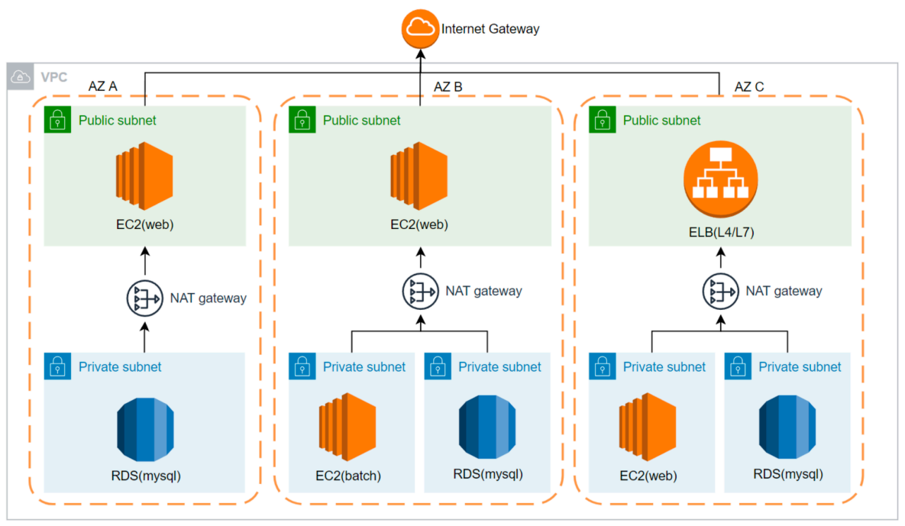

# AWS 개념 설명

## AWS 주요 개념 및 용어

### Cloud

 - 클라우드 컴퓨팅(Cloud Computing)의 준말
 - 사용자의 직접적인 활발한 관리 없이 특히, 데이터 스토리지와 컴퓨팅 파워와 같은 컴퓨터 시스템 리소스를 필요 시 바로 제공하는 것
 - 컴퓨터 통신망이 복잡한 네트워크 및 서버 구성 등을 알 필요 없이 구름과 같이 내부가 보이지 않고, 일반 사용자는 이 복잡한 내부를 굳이 알 필요도 없이 어디에서나 구름 속의 컴퓨터 자원으로 자기가 원하는 작업을 할 수 있다는 것

<br/>

### 리전

 - 개별 지리 영역
 - AWS의 서비스가 존재하는 물리적인 위치
 - 16년 1월 7일에 서울 리전 최초 오픈
 - 재해 발생 대비 및 빠른 속도를 제공을 위해서 지역별로 제공

<br/>

### 가용영역(Availability Zone - AZ)

 - 개별 지리 영역
 - 실제 데이터가 존재하는 데이터 센터
    - 19년 5월 AZ-B 확장
    - 20년 7월 AZ-D 확장
 - 자연 재해 및 테러 등에 의해 문제가 발생할 경우 다른 가용영역에서 서비스할 수 있도록 제공
 - 고가용성(high availability) 제공
 - 리전, 가용영역 = 물리적인 개념

<br/>

### VPC

 - VPC(Virtual Private Cloud): AWS 전용 가상 네트워크
 - 서브넷(subnet): VPC의 IP주소 범위
 - CIDR 블록(block): 클래스 없는 도메인 간 라우팅 기법
 - 라우팅 테이블(routing table): 트래픽을 전달할 위치를 결정하는 라우팅 규칙 집합
 - 인터넷 게이트웨이(internet gateway): VPC에서 인터넷 간의 통신을 활성화하기 위한 리소스
 - NAT 게이트웨이: Private 서브넷의 EC2가 인터넷, 다른 VPC에 연결되도록 허용하는 AWS 서비스
 - 보안 그룹(security group): AWS 리소스에 대해서in/outbound 트래픽을 제어하는 가상 방화벽
 - 네트워크 ACL(Network ACL): 서브넷에서 들어오고 나가는 트래픽을 제어하기 위해 방화벽 역할을 수행하는 VPC에 대한 가상 방화벽
 - EIP(Elastic IP): AWS에서 할당해주는 정적 IPv4주소. 인터넷에서 연결 가능
 - 리소스(resource): 사용할 수 있는 개체(EC2, Lambda, VPC…)

<div align="center">
    <br/>
    리전, 가용영역 = 물리적인 개념 <br/>
    VPC, Subnet = 논리적인 개념
</div>
<br/>

### IAM Role & Policy

 - 공식 문서: https://docs.aws.amazon.com/ko_kr/IAM/latest/UserGuide/intro-structure.html

AWS Identity and Access Management(IAM)은 AWS 리소스에 대한 액세스를 안전하게 제어할 수 있는 웹 서비스입니다. IAM을 사용하면 사용자가 액세스할 수 있는 AWS 리소스를 제어하는 권한을 중앙에서 관리할 수 있습니다. IAM을 사용하여 리소스를 사용하도록 인증(로그인) 및 권한 부여(권한 있음)된 대상을 제어합니다.  
 - AWS 계정에 대한 인증 및 권한 부여를 제어

<div align="center">
    
</div>
<br/>

#### IAM 리소스

 - 사용자(User)
 - 그룹(Group)
 - 역할(Role)
 - 정책(Policy)
 - ID 제공자 객체

<div align="center">
    
</div>
<br/>

## AWS 실습

### AWS 계정 및 IAM User 생성

 - __AWS 계정 생성__
    - https://portal.aws.amazon.com/billing/signup#/start/email
 - __IAM User 생성 및 2차인증(2FA) 설정__
    - 2차인증: https://docs.aws.amazon.com/ko_kr/IAM/latest/UserGuide/enable-virt-mfa-for-root.html
        - Root User / IAM User 모두 설정 필요
        - OTP App 추천: 1password, Authy, Google Authenticator, Microsoft Authenticator
        - 2차인증 설정 후 로그아웃 한 뒤 다시 로그인해야 정상적인 콘솔 사용 가능
    - IAM User 생성: : https://docs.aws.amazon.com/ko_kr/IAM/latest/UserGuide/id_users_create.html
        - Root User : AWS계정 최초 생성 후 접속한 권한(유저)
        - IAM User : 관리자 권한 부여 후 사용
        - https://docs.aws.amazon.com/ko_kr/streams/latest/dev/setting-up.html#setting-up-iam

<br/>

### IAM User 액세스 키발급

 - CLI에 사용할 수 있는 액세스 키를 발급한다.
```
보안 자격 증명 > 액세스 키 > 액세스 키 만들기 
```
<br/>

### AWS CLI 설치 및 액세스키 설정

 - AWS CLI 설치
    - https://docs.aws.amazon.com/ko_kr/cli/latest/userguide/getting-started-install.html
```bash
# 액세스 키 설정
aws configure —profile default-long-term
AWS Access Key ID [******]
AWS Secret Access Key [*****]
Default region name [None]: ap-northeast-2
Default output format [None]: json
```
<br/>

### aws-mfa 설치 및 AWS STS 임시 보안 자격 증명 생성

```bash
# aws-mfa 설치
pip install aws-mfa

# 임시 보안 자격 증명 생성
aws-mfa --device [사용할 MFA 식별자] --duration 86400 --profile default
```
<br/>

### aws sam-cli 설치

 - Serverless Application Model
 - 서버리스 애플리케이션을 빌드 / 배포 / 실행하는 Tool
    - sam init
    - sam build
    - sam deploy
    - https://docs.aws.amazon.com/ko_kr/serverless-application-model/latest/developerguide/what-is-sam.html
 - sam-cli 설치: https://docs.aws.amazon.com/ko_kr/serverless-application-model/latest/developerguide/install-sam-cli.html

