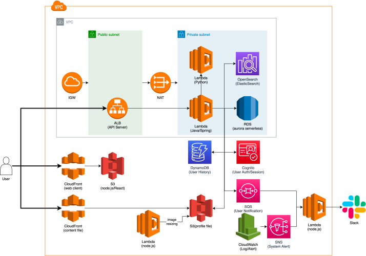

# 대용량 트래픽을 견딜 수 있는 서버리스 아키텍처의 쇼핑몰

 - 깃허브 주소: https://github.com/gnidoc327/fastcampus-23-serverless

 

## 개발 환경 구성

 - IDE: IntelliJ IDEA
    - Lombok, AWS Toolkit, Terraform and HCL 플러그인

 

## 프로젝트 구성

 - __주요 요건__
   - 회원가입, 로그인, 상품등록/조회/검색/구매 API 개발
   - 상품 등록시 검색 엔진 등록 후 메일 알림 발송 및 상품 대표 이미지의 썸네일 생성(비동기)
   - 히스토리 성격의 데이터는 MySQL에 적재X 하지만 조회는 실시간으로 제공
   - 이상 징후가 있을땐 Slack을 통해서 알림
 - __추가 요건__
   - API는 1초 이하의 빠른 응답 속도
   - Serverless + Auto-scaling을 통한 비용 최적화/효율화, 예산 비용 산출
   - Serverless로 Frontend/Backend(API, Model) 모두 구축
   - Event 기반 MSA 구축

   

 

