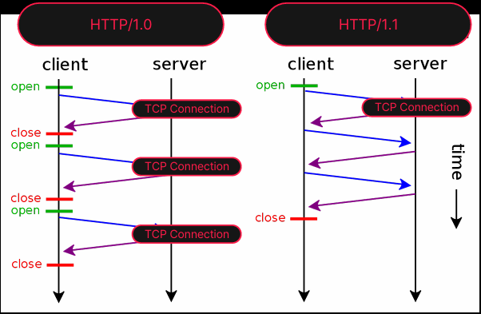
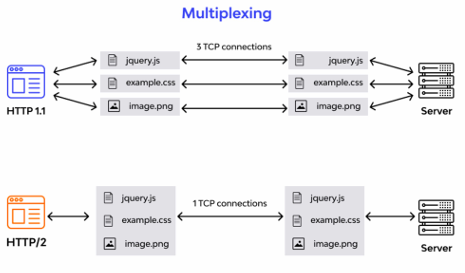
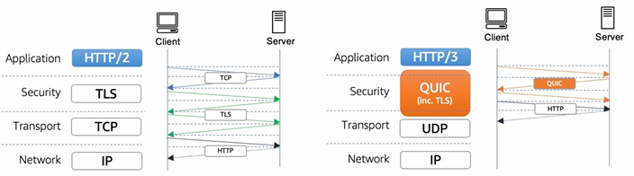

# HTTP 기본 개념

## 1. HTTP 프로토콜 소개

### HTTP 개념과 역사

 - __HTTP(Hypertext Transfer Protocol)__
    - 인터넷에서 데이터를 전송하는데 사용되는 프로토콜
    - 클라이언트-서버 모델의 프로토콜
    - 정보 공유와 검색을 위한 분산 시스템 아이디어를 개발했으며, 이를 위한 첫 번쨰 프로토콜이 HTTP
 - __HTTP 버전__
    - HTTP/0.9
        - 초기 버전
        - 단순한 텍스트 기반 프로토콜
        - HTML 문서만 전송 가능
    - HTTP/1.0
        - 1996년에 등장
        - 더 많은 기능과 확장성 제공
        - 여전히 단일 연결로 텍스트 기반
        - 이미지 및 다른 멀티미디어 형식 지원 기능 추가
    - HTTP/1.1
        - 1999년에 등장
        - 현재까지도 널리 사용되고 있음
        - Keep-Alive 연결로 다수의 요청과 응답을 단일 연결로 처리 가능
        - 헤더 압축 및 파이프라인 요청을 지원
        - 지속 연결, 요청 파이프라이닝, 가상호스팅, 캐시 제어, 청크 전송, 호스트 헤더
    - HTTP/2
        - 2015년에 등장
        - 성능 향상을 위한 여러 기술 도입
        - 다중 스트림 및 헤더 압축을 통해 페이지 로딩 속도 향상
        - TLS 사용 권장으로 변경 (HTTPS)
        - 이진 프레이밍, 다중화, 헤더 압축, 서버 푸시, 스트림 우선순위
    - HTTP/3
        - 2020년에 등장
        - UDP 프로토콜 기반
        - 멀티플렉싱, 헤더 압축 및 연결 설정 시간을 줄이는 기술 등 도입

<div align="center">
    <br/>
    HTTP/1.0과 HTTP/1.1<br/>
    <br/>
    HTTP/1.1과 HTTP/2<br/>
    <br/>
    HTTP/2와 HTTP/3
</div>
<br/>

## 2. HTTP 요청과 응답 구조

### 요청 구조(Request)

- HTTP 요청 라인(Request Line)
    - 클라이언트가 서버에게 어떤 동작을 수행할 것인지 나타냄
    - HTTP 메서드: 요청의 종류를 지정
    - 요청 URI: 요청 대상 리소스의 위치를 지정
    - HTTP 버전: 사용하는 HTTP 프로토콜 버전
- 요청 헤더(Request Header)
    - 클라이언트가 서버에게 추가 정보 전달
    - 키-값 쌍으로 이루어져 있음
- 요청 본문(Request Body)
    - 요청에 추가 데이터를 담고자 할 때 사용
    - 주로 POST, PUT 요청에서 데이터를 전송할 때 사용
```
GET /api/users/123 HTTP/1.1
Host: example.com
UserAgent: Mozilla/5.0 Macintosh; Intel 
Mac OS X 10157 AppleWebKit/537.36 
(KHTML, like Gecko) Chrome/120.0.0.0 Safari/537.36
Authorization: Basic ABCDE
Accept: application/json
```
<br/>

 - __주요 요청 헤더__
    - Host: 요청을 받을 서버의 호스트 이름과 포트 번호를 지정
    - UserAgent: 클라이언트 소프트웨어의 정보를 제공, 서버는 이 정보를 사용자 추적 및 호환성 확인 등에 활용할 수 있음
     - Autorization: 클라이언트의 인증 정보를 서버에 전달, 주로 사용자 이름과 비밀번호를 기반으로 인증에 사용
     - ContentType: 요청 본문의 데이터 형식을 지정, 주로 POST 요청과 함께 사용되며, JSON, XML, 폼 데이터 등을 나타냄.
    - Accept: 클라이언트가 받아들일 수 있는 응답 콘텐츠 형식 미디어 타입을 지정 (예: HTML, JSON, XML 등)

<br/>

### 응답 구조(Response)

 - HTTP 응답 라인(Response Line)
    - 응답의 상태와 HTTP 버전 포함
    - HTTP 버전: 사용하는 HTTP 프로토콜 버전
    - 상태 코드(Status Code): 서버의 처리 결과를 나타냄
    - 상태 텍스트(Status Text): 상태 코드에 대한 간단한 설명
 - 응답 헤더(Response Header)
    - 서버가 클라이언트에게 추가 정보 전달
    - 키-값 쌍으로 이루어져 있음
 - 응답 본문(Response Body)
    - 서버가 클라이언트에 제공하는 데이터를 포함
    - JSON 데이터, 이미지, 파일 다운로드 등
```
HTTP/1.1 200 OK
ContentType: application/json
ContentLength: 125

{
    "id": 123,
    "name": "John Doe",
    "email": "john.doe@example.com",
    "_links":[
        "rel": "self",
        "href": "/api/users/123"
    ]
    ..
}
```
<br/>

 - __주요 응답 헤더__
    Content-Type: 응답 본문의 데이터 형식을 지정, 클라이언트가 응답 본문을 올바르게 해석하고 처리하기 위한 헤더
    - Content-Length: 응답 본문의 크기 바이트, 클라이언트는 이 헤더를 통해 데이터를 수신하기 위한 공간을 할당
    - Cache-Control: 캐시 동작을 제어하기 위한 지시사항을 포함 (예: nocache는 캐시를 사용하지 않도록 할 수 있음)
    - Location: 리디렉션(Redirection)시 클라이언트에게 새로운 리소스의 위치를 알려줌, 주로3xx 상태코드와 함께 사용
    - Server: 서버 소프트웨어의 정보를 제공, 이 정보는 보안 및 호환성 확인 등에 사용될 수 있음


###

<br/>

## 3. HTTP 상태 코드

 - __HTTP 상태 코드__
    - 웹 서버가 클라이언트에게 보내는 응답 메시지의 일부
    - 세 자리 숫자로 이루어진 코드
    - 요청의 성공, 실패 또는 다양한 상황을 설명
 - __상태 코드의 분류__
    - 1XX: 정보 응답(Informational)
        - 100(Continue): 중간 응답, 현재까지 모든 것이 정상, 요청 계속 해도 됨
        - 101(Switching Protocol): 클라이언트의 업그레이드 요청 헤더에 응답하여 전송
        - 102(Processing): 서버가 요청 수신하여 처리 중 이지만, 아직 사용할 수 없음
    - 2XX: 성공(Successful)
        - 200(OK): 성공적인 요청 처리
        - 201(Created): 새 리소스 생성 완료
        - 204(No Content): 응답 본문 없음
    - 3XX: 리다이렉션(Redirection)
        - 301(Moved Permanently): 리소스가 영구적으로 이동되었음
        - 302(Found): 리소스가 일시적으로 이동되었음
        - 304(Not Modified): 변경사항이 없으니 캐시된 버전 사용
        - 307: 리소스가 일시적으로 이동되었음(HTTP 메서드 변경 불가)
        - 308: 리소스가 영구적으로 이동되었음(HTTP 메서드 변경 불가)
    - 4XX: 클라이언트 오류(Client Error)
        - 400(Bad Request): 잘못된 요청 구문
        - 401(Unauthorized): 인증 필요
        - 403(Forbidden): 접근 권한 없음
        - 404(Not Found): 리소스를 찾을 수 없음
    - 5XX: 서버 오류(Server Error)
        - 500(Internal Server Error): 서버 내뷰 오류
        - 502(Bad Gateway): 게이트웨이 문제
        - 503(Server Unavailable) 서비스 이용 불가

