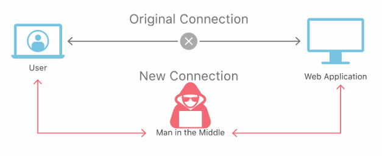
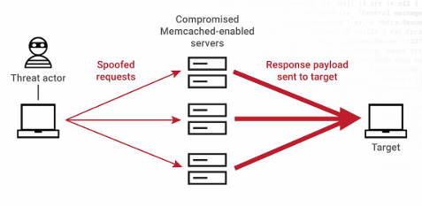
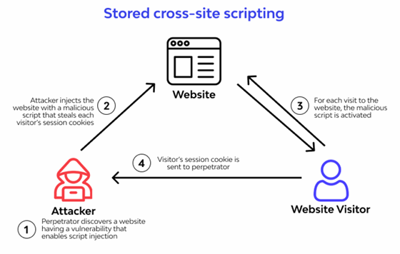
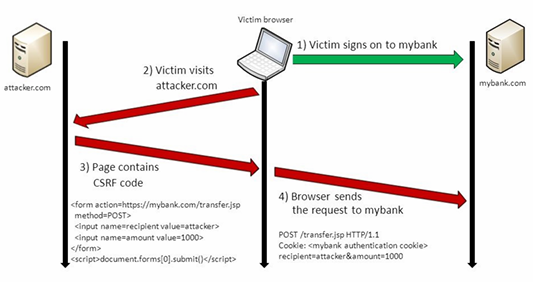
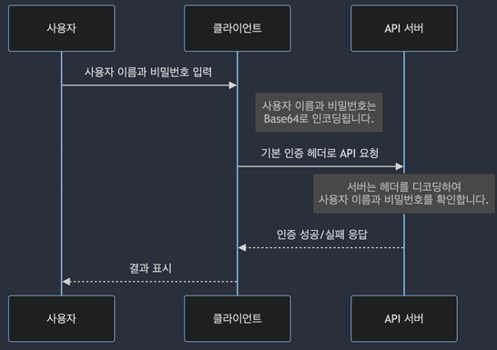
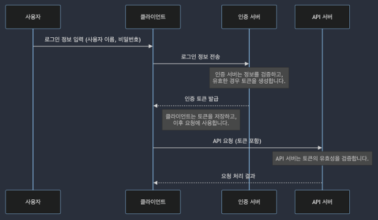
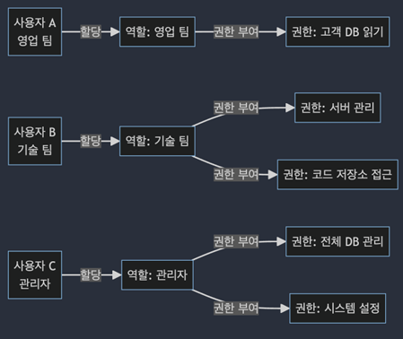

# REST API 보안

## 1. REST API 보안 이슈 소개

### 보안 취약점 종류

 - __인증 취약점__
    - HTTP 프로토콜에서 사용자 이름과 비밀번호를 Base64로 인코딩하여 전송할 때, 공격자가 로그인 정보를 탈취할 수 있다.
    - 방안: HTTPS, OAuth2, JWT
 - __권한 부여 취약점__
    - 부적절한 접근 제어로 인한 정보가 유출될 수 있다.
    - 방안: ABAC(속성기반 접근제어), RBAC(역할기반 접근제어)
 - __데이터 유출 취약점__
    - HTTP 프로토콜에서 민감한 정보 요청에 대해서 공격자가 가로채어 확인할 수 있다.
    - 방안: HTTPS, 데이터 암호화
 - __SQL 인젝션 취약점__
    - 서버에서 요청온 SQL 파라미터를 검증없이 실행할 떄 문제가 발생할 수 있다.
    - 방안: 사용자 입력 검증, Prepared Statement 사용, ORM 같은 DB 추상화 계층 사용
 - __미흡한 로깅, 모니터링__
    - 실제 공격이 발생했을 때 영향도 파악이 어렵다. 탐지, 분석, 대응이 어렵다.
    - 방안: API Access Logging, Query Logging

 

### 주요 공격 방법

 - __맨 인더 미들 공격__

    

 

 - __분산 서비스 거부(DDOS) 공격__

    

 

 - __크로스 사이팅 스크립트(XSS) 공격__

    

 

 - __크로스 사이트 리퀘스트 포저리(CSRF) 공격__

    

 

## 2. 인증과 권한 관리

### 인증과 권한

 - __인증(Authentication)__
    - 사용자 신원 확인
    - 사용자 이름과 비밀번호를 입력하는 것
    - 최근에는 토큰, 생체 인식, OTP 등 인증 방법이 복잡해지고 있음
 - __권한(Authorization)__
    - 권리 확인(무엇을 할 수 있는지)
    - 특정 메뉴에 접근할 수 있는 권리
    - 특정 파일에 접근, 수정할 수 있는 권리

 

### 인증의 종류

 - __기본 인증(Basic Authentication)__
    - 사용자 이름과 비밀번호를 Base64로 인코딩해서 전송하는 방식
    - 간단하지만 보안에 취약하므로 HTTPS와 함께 사용해야 한다.

    

 

 - __토큰 기반 인증(Token-based Authentication)__
    - 서버가 사용자의 정보를 검증한 후 사용자에 대한 토큰을 발급
    - 매 요청마다 토큰을 함께 전송하여 자신을 인증
    - 상태를 유지하지 않는 특성 때문에 RESTful 서비스에 적합

    

 

 - __OAuth2__
    - 타사 애플리케이션에서 사용자의 리소스에 접근할 수 있게 해주는 개방형 표준 인증 방식

    

 

### 권한 부여의 종류

 - __역할 기반 접근 제어(RBAC: Role-Based Access Control)__
    - 사용자가 속한 역할에 따라 리소스에 대한 접근 권한을 세분화하여 관리
    - 보안을 강화하고 리소스 접근을 체계적으로 관리할 수 있음

    

 

 - __속성 기반 접근 제어(ABAC: Attribute-Based Access Control)__
    - 사용자, 리소스, 환경 등 다양한 속성을 기반으로 접근 권한 결정
    - RBAC의 단점인 유연하고 세밀한 접근제어가 가능
    - 복잡한 접근 제어 정책도 구현 가능

    

 

## 3. API 보안 모범 사례

 - __안전한 인증 사용__
    - 기본 인증 대신 토큰 기반 인증(OAuth2, JWT) 사용
    - 인증 토큰이 노출되지 않도록 HTTPS 사용
    - 토큰 만료기간 설정과 재발급 과정 추가
 - __권한 부여와 접근제어__
    - 최소 권한 원칙
    - Role-Based Access Control(RBAC) 또는 Attribute-Based Access Control(ABAC)를 사용하여 세밀한 권한 제어
    - 엔드 포인트별 권한 설정과 API 게이트웨이를 통한 접근 제어 강화
 - __최소 권한 원칙__
    - 보안 강화: 권한을 최소화하여 잠재적 보안 위협을 줄이기
    - 내부 위협 감소: 내부 사용자나 직원에 대한 위험을 관리하기
    - 시스템 관리 용이성: 권한을 추가하거나 제거할 때 예측 가능한 방식으로 수행 가능
 - __RBAC, ABAC__
    - 역할 기반 권한 제어(RBAC)
        - 사용자 그룹을 정의하고 각 그룹에 역할을 할당
        - 역할은 특정 작업 또는 엔드 포인트에 대한 권한을 나타냄
    - 속성 기반 권한 제어(ABAC)
        - 사용자, 리소스, 환경 등의 속성을 고려하여 접근 권한 결정
        - 여러 속성을 고려하여 특정 엔드포인트에 대한 접근 여부 판단
 - __암호화와 데이터 보호__
    - 모든 데이터 전송은 SSL/TLS를 통해 HTTPS로 이루어져야 함
    - 민감한 데이터는 데이터베이스에 저장할 때 암호화
    - 데이터 무결성을 보장하기 위해 서명된 페이로드 사용 인증 및 권한 확인
 - __입력 데이터 검증과 보안 헤더 사용__
    - SQL 인젝션, XSS 같은 공격으로부터 보호하기 위해 사용자 입력을 엄격하게 검증
    - JSON, XML 입력에 대한 구문 분석과 검증 강화
    - 보안 헤더 설정을 통해 브라우저 수준에서 보호 강화
    - __보안 헤더 예시__
        - HTTP Strict Transport Security(HSTS): 웹 애플리케이션이 HTTPS로만 통신해야 함을 브라우저에게 알리는 헤더
        - X-Content-Type-Options: 브라우저에게 리소스의 MIME 유형을 무시하고 서버가 제공한 유형을 사용하도록 지시
        - Content Security Policy(CSP): CSP는 웹 페이지에서 실행 가능한 스크립트와 리소스를 제한하는 정책을 정의하는 헤더
 - __API 게이트웨이를 통한 접근 제어__
    - 인증 및 권한 확인: 특정 엔드 포인트에 대해 권한을 가지고 있는지 확인
    - API 트래픽 관리: 트래픽 관리 기능을 제공하여 DDOS 방어, 허용 가능한 요청 속도 관리
    - 로깅과 모니터링: API 트래픽에 대한 전체 로그를 생성하고 모니터링 기능 제공

    

 

### 로깅과 모니터링

 - 모든 API 요청과 응답은 로깅되어야 함
 - 로그는 정기적으로 분석 필요
 - 이상 징후 탐지를 위한 모니터링 시스템 구축의 중요성
 - 보안 사고 대응 계획 수립

 

#### APM(Application Performance Monitoring)

 - APM 도구는 애플리케이션의 성능과 상태를 실시간으로 모니터링하고 분석
 - API 성능, 응답 시간, 오류 발생률 등을 추적하고 시각화
 - 이는 API 의 신뢰성 및 사용자 경험을 APM 도구를 통해 각 API 요청의 트레이스를 추적하고 문제가 발생할 때 신속하게 대응할 수 있음

 

#### Grafana + Prometheus

 - 로그 데이터 모니터링 및 시각화
 - 실시간으로 API 활동 추적하여 잠재적인 문제 식별
 - 경고 및 트리거 설정을 통해 이상 징후 감지

