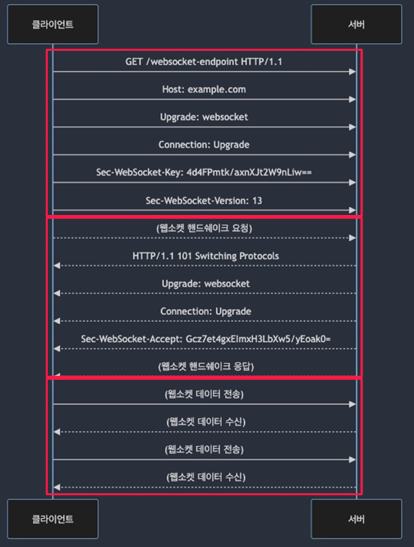

# REST API 고급주제

## 1. 웹 소켓과 실시간 통신

RESTful 모델은 실시간 정보 흐름에 한계가 있다.  
실시간 통신은 정보를 즉시 전송하고 업데이트하는 데 필요하다. (실시간 채팅, 주식 시장 업데이트, 게임 상태 동기화 등)  
 - RESTful로 실시간 모델을 구현하면 폴링 방식으로 구현되어 아래와 같은 문제가 있다.
    - 불필요한 서버 부하
    - 지연과 대기 시간
    - 대역폭 낭비
    - 실시간성 제한
    - 에러 처리 어려움
    - 리소스 낭비

<br/>

### 웹 소켓

실시간 통신을 지원하는 네트워크 프로토콜 중 하나로 초기 연결 후 지속적인 양방향 통신을 간으하게 한다.  
클라이언트와 서버 간의 상호작용을 실시간으로 처리 가능하다.  

 - 최초 연결은 HTTP 프로토콜을 통해서 진행 > 클라이언트와 서버 연결 설정 > 서버의 핸드 쉐이크 응답 > 이후 양방향 데이터 통신

<div align="center">
    
</div>
<br/>

## 2. GraphQL과 REST API 비교

GraphQL은 2012년 FQL로 시작하였고, Facebook에 의해 2015년에 개발된 쿼리 언어이다.  
데이터 중심의 API를 지향한다.  
 - 클라이언트 중심의 쿼리
 - 타입 시스템
 - 단일 엔드 포인트
 - Over Fetching 방지: 불필요한 데이터 응답을 방지
 - Under Fetching 방지: 부족한 데이터를 위해서 추가 호출 방지

<br/>

### GraphQL 한계점

 - 학습 곡선
 - 복잡성 관리
 - 보안 고려사항
 - 순환 참조와 N+1 쿼리 문제
 - 파일 업로드 지원의 한계
 - 네트워크 부하
 - 캐싱 어려움

<br/>

## 3. 모바일 애플리케이션 및 웹앱 최적화

### 캐싱

 - 동일한 API 요청에 대한 응답을 이전에 받은 응답을 다시 사용하여 제공
 - 서버에 대한 부하를 줄이고 사용자 경험을 향상
 - 캐시를 위한 헤더
    - Cache-Control 헤더
    - ETag 헤더
    - Last-Modified 헤더

<br/>

### 스로틀링과 요청 제한

 - 스로틀링
    - 일정한 속도로 또는 제한된 비율로 API 요청을 허용하는 제어 메커니즘
 - 요청 제한
    - 요청 제한은 특ㅈ어 기간 동안의 최대 허용 API 요청 수를 제한하는 메커니즘

<br/>

### 압축

 - 응답 데이터를 압축하여 대역폭을 줄이고 응답 시간을 단축
 - GZIP, Brotli

<br/>

### 페이징과 필터링

 - 페이징: 대량의 데이터를 작은 덩어리로 나누어 사용자에게 제공
 - 필터링: 데이터를 원하는 조건에 따라 검색하거나 필터링

<br/>

### 비동기 작업

 - 처리 시간이 오래 걸리거나, 외부 리소스에 대한 응답을 기다려야 하는 경우
 - 작업을 백그라운드에서 별도의 쓰레드 또는 프로세스에서 실행

<br/>

## 4. API 테스팅 및 품질보증

### 4-1. API 테스트 종류

 - __단위테스트(Unit Testing)__
 - __통합테스트(Integration Testing)__
 - __기능테스트(Functional Testing)__
 - __회귀테스트(Regression Testing)__
 - __성능테스트(Performance Testing)__
 - __보안테스트(Security Testing)__

<br/>

### 4-2. API 테스트 시나리오 구축

```
1. 요청의 유효성 검사
 - HTTP 메서드, 엔드포인트, 헤더 및 본문 데이터 유효성 확인

2. 요청 데이터 설정
 - 요청 파라미터 설정

3. API 요청 전송
 - 실제 API 서버로 요청 전송

4. 응답 데이터 검증
 - API 서버에서 받은 응답 검증

5. 오류 처리 테스트
 - 잘못된 요청 또는 예외 상황을 다루기 위해서 오류 처리 테스트

6. 보안 및 권한 검증
 - 인증 및 권한 관련 시나리오 확인
```
<br/>

### 4-3. GUI/CLI 기반 API 테스팅 도구

 - curl
 - Postman
 - Insomnia

<br/>

### 4-4. Java 환경 API 테스팅 도구

 - Junit: Java 언어용 테스트 프레임워크
 - TestNG: Junit과 유사하나 Spring과 통합하여 테스트를 작성하고 그룹화하는데 사용
 - Mockito: mock객체를 생성하고 사용하여 단위테스트에서 의존성을 대체하기 위해서 사용
 - SpringTest : Spring Application Context를 설정하고 테스트 할 수 있는 기능 제공
 - RestAssured: HTTP 요청을 보내고 응답을 검증하는데 사용
 - Cucumber: BDD 스타일의 테스트를 작성하는데 사용
 - WireMock: 외부 API와의 상호작용을 mocking 하는데 사용

<br/>

### 4-5. API 품질 보증을 위한 여러가지 방법

 - 코드리뷰(Code Review)
 - API 문서화(API Documentation)
 - API 보안(Security Measures)
 - 성능최적화(Performance Optimization)
 - 테스트및검증(Testing and Validation)
 - 문제추적및로깅(Issue Tracking and Logging)
 - 지속적통합및배포(CI/CD)
