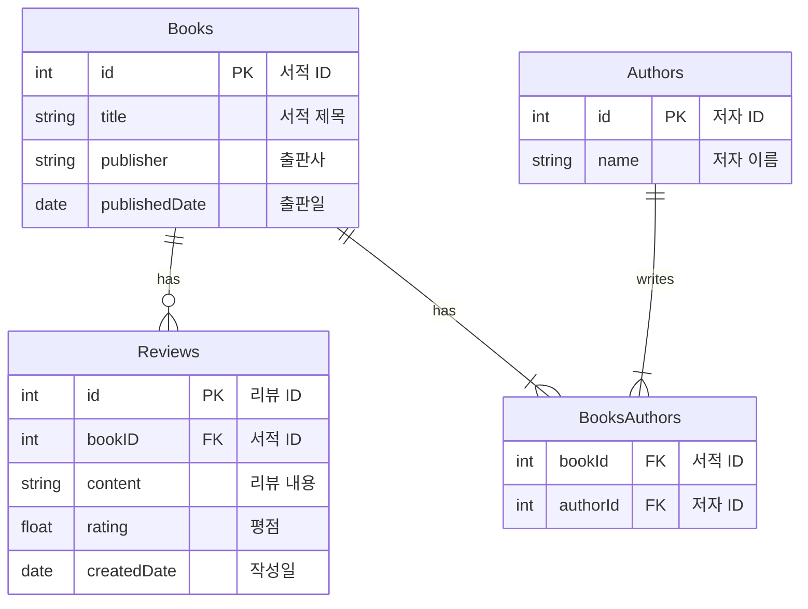

# REST API 실습

## 1. Spring 기반 개발 환경 세팅

 - __개발 환경__
    - IntelliJ IDEA
    - OpenJDK 17+
    - Spring Boot 3.x
 - __Spring Boot Starter__
    - org.springframework.boot:spring-boot-starter-web: 웹에 대한 기본 구성(Spring MVC, Tomcat 등)
    - org.springframework.boot:spring-boot-starter-data-jpa: 관계형 DB, ORM
    - org.springframework.boot:spring-boot-starter-hateoas: HATEOAS(추가 링크 제공)
    - org.springframework.boot:spring-boot-starter-actuator: 애플리케이션 모니터링
    - org.springframework.boot:spring-boot-starter-validation: 데이터 검증
    - org.springframework.restdocs:spring-restdocs-mockmvc: API 문서화
    - org.springdoc:springdoc-openapi-starter-webmvc-ui: Swagger API 문서화
    - org.projectlombok:lombok
    - com.h2database:h2

<br/>

## 2. 기본 REST API 구현 실습

### 2-1. ERD 작성

 - `docs/schema.mermaid`
    - mermaid 문법을 이용하여 ERD 작성

<br/>

### 2-2. 코드 구현

 - `엔티티`
```java
@Getter
@Setter
@NoArgsConstructor
@Entity
@Table(name = "authors")
public class Author {
    @Id
    @GeneratedValue(strategy = GenerationType.IDENTITY)
    private Long id;

    @Column(nullable = false)
    private String name;

    @ManyToMany(mappedBy = "authors")
    @JsonBackReference
    private Set<Book> books = new HashSet<>();

    public static Author of(AuthorRequest request) {
        Author author = new Author();
        author.setName(request.getName());

        return author;
    }
}

@Getter
@Setter
@NoArgsConstructor
@Entity
@Table(name = "books")
public class Book {
    @Id
    @GeneratedValue(strategy = GenerationType.IDENTITY)
    private Long id;

    @Column(nullable = false)
    private String title;

    private String publisher;

    @Column(name = "published_date")
    @Temporal(TemporalType.DATE)
    private Date publishedDate;

    @ManyToMany
    @JoinTable(
            name = "books_authors",
            joinColumns = @JoinColumn(name = "book_id"),
            inverseJoinColumns = @JoinColumn(name = "author_id")
    )
    @JsonManagedReference
    private Set<Author> authors = new HashSet<>();

    @OneToMany(mappedBy = "book", cascade = CascadeType.ALL, orphanRemoval = true)
    @JsonManagedReference
    private Set<Review> reviews = new HashSet<>();
}

@Getter
@Setter
@NoArgsConstructor
@Entity
@Table(name = "reviews")
public class Review {
    @Id
    @GeneratedValue(strategy = GenerationType.IDENTITY)
    private Long id;

    @ManyToOne
    @JoinColumn(name = "book_id", nullable = false)
    @JsonBackReference
    private Book book;

    @Column(nullable = false)
    private String content;

    private float rating;

    @Column(name = "created_date")
    @Temporal(TemporalType.TIMESTAMP)
    private Date createdDate;
}
```
<br/>

 - `레포지토리`
```java
@Repository
public interface AuthorRepository extends JpaRepository<Author, Long> {
}

@Repository
public interface BookRepository extends JpaRepository<Book, Long> {
    List<Book> findByAuthorsName(String name);
    List<Book> findByTitleContaining(String keyword);
}

public interface ReviewRepository extends JpaRepository<Review, Long> {
    List<Review> findByBookIdOrderByCreatedDateDesc(Long bookId);
}
```
<br/>

 - `서비스`
```java
@Service
public class AuthorService {
    private final AuthorRepository authorRepository;

    @Autowired
    public AuthorService(AuthorRepository authorRepository) {
        this.authorRepository = authorRepository;
    }

    public Author saveAuthor(Author author) {
        return authorRepository.save(author);
    }

    public Optional<Author> findById(Long id) {
        return authorRepository.findById(id);
    }

    public List<Author> findAll() {
        return authorRepository.findAll();
    }
}

@Service
public class BookService {
    private final BookRepository bookRepository;

    @Autowired
    public BookService(BookRepository bookRepository) {
        this.bookRepository = bookRepository;
    }

    public Book saveBook(Book book) {
        return bookRepository.save(book);
    }

    public Optional<Book> findById(Long id) {
        return bookRepository.findById(id);
    }

    public List<Book> findAll() {
        return bookRepository.findAll();
    }

    public List<Book> findByAuthorName(String authorName) {
        return bookRepository.findByAuthorsName(authorName);
    }

    public void deleteById(Long id) {
        bookRepository.deleteById(id);
    }
}

@Service
public class ReviewService {
    private final ReviewRepository reviewRepository;

    @Autowired
    public ReviewService(ReviewRepository reviewRepository) {
        this.reviewRepository = reviewRepository;
    }

    public Review saveReview(Review review) {
        return reviewRepository.save(review);
    }


    public Optional<Review> findById(Long id) {
        return reviewRepository.findById(id);
    }

    public List<Review> findByBookId(Long bookId) {
        return reviewRepository.findByBookIdOrderByCreatedDateDesc(bookId);
    }


    public void deleteById(Long id) {
        reviewRepository.deleteById(id);
    }
}
```
<br/>

 - `컨트롤러`
```java
@RestController
@RequestMapping("/authors")
public class AuthorController {
    private final AuthorService authorService;

    @Autowired
    public AuthorController(AuthorService authorService) {
        this.authorService = authorService;
    }

    @PostMapping
    public ResponseEntity<Author> addAuthor(@RequestBody AuthorRequest author) {
        Author savedAuthor = authorService.saveAuthor(Author.of(author));

        return new ResponseEntity<>(savedAuthor, HttpStatus.CREATED);
    }

    @GetMapping("/{id}")
    public ResponseEntity<Author> getAuthorById(@PathVariable Long id) {
        return authorService.findById(id)
                .map(author -> new ResponseEntity<>(author, HttpStatus.OK))
                .orElse(new ResponseEntity<>(HttpStatus.NOT_FOUND));
    }

    @GetMapping
    public ResponseEntity<List<Author>> getAllAuthors() {
        List<Author> authors = authorService.findAll();
        if (authors.isEmpty()) {
            return new ResponseEntity<>(HttpStatus.NO_CONTENT);
        }
        return new ResponseEntity<>(authors, HttpStatus.OK);
    }
}

public class BookController {
    private final BookService bookService;

    @Autowired
    public BookController(BookService bookService) {
        this.bookService = bookService;
    }

    @PostMapping
    public ResponseEntity<Book> addBook(@RequestBody Book book) {
        Book savedBook = bookService.saveBook(book);
        return new ResponseEntity<>(savedBook, HttpStatus.CREATED);
    }

    @GetMapping("/{id}")
    public ResponseEntity<Book> getBookById(@PathVariable Long id) {
        return bookService.findById(id)
                .map(book -> new ResponseEntity<>(book, HttpStatus.OK))
                .orElse(new ResponseEntity<>(HttpStatus.NOT_FOUND));
    }

    @GetMapping
    public ResponseEntity<List<Book>> getBooks(@RequestParam(required = false) String author) {
        if (author != null && !author.isEmpty()) {
            return new ResponseEntity<>(bookService.findByAuthorName(author), HttpStatus.OK);
        } else {
            return new ResponseEntity<>(bookService.findAll(), HttpStatus.OK);
        }
    }

    @DeleteMapping("/{id}")
    public ResponseEntity<Void> deleteBook(@PathVariable Long id) {
        bookService.deleteById(id);
        return new ResponseEntity<>(HttpStatus.NO_CONTENT);
    }
}

@RestController
@RequestMapping("/books")
public class ReviewController {
    private final ReviewService reviewService;

    @Autowired
    public ReviewController(ReviewService reviewService) {
        this.reviewService = reviewService;
    }

    @PostMapping("/{bookId}/reviews")
    public ResponseEntity<Review> addReview(@RequestBody Review review) {
        Review savedReview = reviewService.saveReview(review);
        return new ResponseEntity<>(savedReview, HttpStatus.CREATED);
    }

    @GetMapping("/{bookId}/reviews")
    public ResponseEntity<List<Review>> getReviewsByBookId(@PathVariable Long bookId) {
        List<Review> reviews = reviewService.findByBookId(bookId);
        if (reviews.isEmpty()) {
            return new ResponseEntity<>(HttpStatus.NOT_FOUND);
        }
        return new ResponseEntity<>(reviews, HttpStatus.OK);
    }

    @DeleteMapping("/{bookId}/reviews/{id}")
    public ResponseEntity<Void> deleteReview(@PathVariable Long bookId, @PathVariable Long id) {
        reviewService.deleteById(id);
        return new ResponseEntity<>(HttpStatus.NO_CONTENT);
    }
}
```
<br/>

### 2-3. 테스트

 - `resources/sql/data.sql`
```sql
-- Authors
INSERT INTO authors (id, name) VALUES (1000, 'Haruki Murakami');
INSERT INTO authors (id, name) VALUES (2000, 'George R.R. Martin');

-- Books
INSERT INTO books (id, title, publisher, published_date) VALUES (1000, 'Kafka on the Shore', 'Shinchosha', '2002-09-12');
INSERT INTO books (id, title, publisher, published_date) VALUES (2000, 'A Game of Thrones', 'Bantam Books', '1996-08-06');

-- Reviews
INSERT INTO reviews (id, book_id, content, rating, created_date) VALUES (1000, 1000, 'Mystical and enthralling.', 5.0, '2024-02-01');
INSERT INTO reviews (id, book_id, content, rating, created_date) VALUES (2000, 2000, 'A captivating tale of power and betrayal.', 4.5, '2024-02-02');

-- BooksAuthors - many-to-many relationship between books and authors
INSERT INTO books_authors (book_id, author_id) VALUES (1000, 1000);
INSERT INTO books_authors (book_id, author_id) VALUES (2000, 2000);
```
<br/>

 - `application.yml`
```yml
spring:
  application:
    name: rest-api-demo

  sql:
    init:
      data-locations: classpath:sql/data.sql

  jpa:
    defer-datasource-initialization: true
    show-sql: false
    hibernate:
      ddl-auto: create
    properties:
      hibernate:
        format_sql: true
        use_sql_comments: true
```
<br/>

 - `book.http`
    - IntelliJ에서 http 확장자 파일에 대해서 HTTP Client 요청을 보낼 수 있다.
```http
### 전체 책 리스트 조회
GET http://localhost:8080/books

### 단건 책 조회
GET http://localhost:8080/books/1
```
<br/>


## 3. Swagger와 RestDocs를 사용한 API 문서화 실습

### Swagger 적용

 - `build.gradle`
```groovy
implementation 'org.springdoc:springdoc-openapi-starter-webmvc-ui:2.0.2'
```
<br/>

 - `SwaggerConfig`
```java
import io.swagger.v3.oas.models.Components;
import io.swagger.v3.oas.models.OpenAPI;
import io.swagger.v3.oas.models.info.Info;
import org.springframework.context.annotation.Bean;
import org.springframework.context.annotation.Configuration;

@Configuration
public class SwaggerConfig {
    @Bean
    public OpenAPI openAPI() {
        return new OpenAPI()
                .components(new Components())
                .info(apiInfo());
    }
    private Info apiInfo() {
        return new Info()
                .title("온라인 서점 REST API DEMO")
                .description("온라인 서점 REST API DEMO Swagger UI 테스트")
                .version("1.0.0");
    }
}
```
<br/>

 - `BookController`
```java
@RestController
@RequestMapping("/books")
@Tag(name = "books", description = "책 관련 API")
public class BookController {
    private final BookService bookService;

    @Autowired
    public BookController(BookService bookService) {
        this.bookService = bookService;
    }

    @PostMapping
    @Operation(summary = "새로운 책을 추가한다")
    public ResponseEntity<Book> addBook(@RequestBody Book book) {
        Book savedBook = bookService.saveBook(book);
        return new ResponseEntity<>(savedBook, HttpStatus.CREATED);
    }

    @GetMapping("/{id}")
    @Operation(summary = "하나의 책을 조회한다",
        responses = {
                @ApiResponse(responseCode = "200", description = "정상적으로 조회 완료"),
                @ApiResponse(responseCode = "404", description = "존재하지 않는 책을 조회하는 경우")
        }
    )
    public ResponseEntity<Book> getBookById(@Parameter(description = "책 ID") @PathVariable Long id) {
        return bookService.findById(id)
                .map(book -> new ResponseEntity<>(book, HttpStatus.OK))
                .orElse(new ResponseEntity<>(HttpStatus.NOT_FOUND));
    }

    @GetMapping
    @Operation(summary = "전체의 책을 조회한다")
    public ResponseEntity<List<Book>> getBooks(@RequestParam(required = false) String author) {
        if (author != null && !author.isEmpty()) {
            return new ResponseEntity<>(bookService.findByAuthorName(author), HttpStatus.OK);
        } else {
            return new ResponseEntity<>(bookService.findAll(), HttpStatus.OK);
        }
    }

    @DeleteMapping("/{id}")
    @Operation(summary = "하나의 책을 삭제한다")
    public ResponseEntity<Void> deleteBook(@PathVariable Long id) {
        bookService.deleteById(id);
        return new ResponseEntity<>(HttpStatus.NO_CONTENT);
    }
}
```
<br/>

### Spring RestDocs 적용

 - `build.gradle`
```groovy
// 1. Asciidoctor를 사용한 문서 변환 플러그인
plugins {
    // ..
    id 'org.asciidoctor.jvm.convert' version '3.3.2'
}

// 2. Asciidoctor 관련 의존성 정의
configurations {
    compileOnly {
        extendsFrom annotationProcessor
    }
    asciidoctorExt
}

// 3. 환경 변수 등록: snippetsDir 변수에 디렉토리 정의
ext {
    set('snippetsDir', file("build/generated-snippets"))
}

// 4. Spring REST Docs를 Asciidoctor와 함께 사용하기 위한 의존성 추가
dependencies {
    // ..
    asciidoctorExt 'org.springframework.restdocs:spring-restdocs-asciidoctor'
}

// 5. 'test' 작업 결과가 snippetsDir에 저장되도록 지정
tasks.named('test') {
    outputs.dir snippetsDir
    useJUnitPlatform()
}

// 6. 'restDocsTest' 라는 새로운 테스트 작업 등록, 해당 작업 완료시 asciidoctor 작업 실행
// restDocsTest 작업이 끝나고, asciidoctor 작업이 실행된다.
tasks.register("restDocsTest", Test) {
    outputs.dir snippetsDir
    useJUnitPlatform {
        includeTags("restDocs")
    }

    finalizedBy "asciidoctor"
}

// 6. 'asciidoctor' 라는 작업 등록, restDocsTest 작업이 완료된 후 실행됨
tasks.named("asciidoctor") {
    dependsOn restDocsTest

    inputs.dir snippetsDir
    configurations "asciidoctorExt"
    baseDirFollowsSourceDir()
}

// 7. 'copyAsciidocHTML' 라는 작업 등록, asciidoctor 작업이 완료된 후 실행됨
// Asciidoctor의 출력 디렉토리에서 생성된 HTML 파일을 src/main/resources/static/docs 디렉토리로 복사
tasks.register('copyAsciidocHTML', Copy) {
    dependsOn asciidoctor
    from "${asciidoctor.outputDir}"
    into "${project.rootDir}/src/main/resources/static/docs"
}
```
<br/>

 - `RestDocsConfig`
```java
@TestConfiguration
public class RestDocsConfig {

    @Bean
    public RestDocsMockMvcConfigurationCustomizer restDocsMockMvcConfigurationCustomizer() {
        return configurer -> configurer.operationPreprocessors()
                .withRequestDefaults(prettyPrint())
                .withResponseDefaults(prettyPrint());
    }

}
```
<br/>

 - `BookControllerTest`
```java
@RequiredArgsConstructor
@AutoConfigureRestDocs
@AutoConfigureMockMvc
@Import(RestDocsConfig.class)
@TestConstructor(autowireMode = ALL)
@SpringBootTest
public class BookControllerTest {
    private final MockMvc mockMvc;

    @Test
    void getBookById() throws Exception {
        mockMvc.perform(
                        RestDocumentationRequestBuilders.get("/books/1")
                                .contentType(APPLICATION_JSON)
                )
                .andExpect(status().isOk())
                .andDo(MockMvcRestDocumentation.document("getBookById",
                        responseFields(
                                fieldWithPath("id").type(JsonFieldType.NUMBER).description("책 번호"),
                                fieldWithPath("title").type(JsonFieldType.STRING).description("타이틀"),
                                fieldWithPath("publisher").type(JsonFieldType.STRING).description("출판사"),
                                fieldWithPath("publishedDate").type(JsonFieldType.STRING).description("출판일시"),
                                fieldWithPath("authors").type(JsonFieldType.ARRAY).description("저자 리스트"),
                                fieldWithPath("authors.[].id").type(JsonFieldType.NUMBER).description("저자 아이디"),
                                fieldWithPath("authors.[].name").type(JsonFieldType.STRING).description("저자 이름"),
                                fieldWithPath("reviews").type(JsonFieldType.ARRAY).description("리뷰 리스트"),
                                fieldWithPath("reviews.[].id").type(JsonFieldType.NUMBER).description("리뷰 번호"),
                                fieldWithPath("reviews.[].content").type(JsonFieldType.STRING).description("리뷰 내용"),
                                fieldWithPath("reviews.[].rating").type(JsonFieldType.NUMBER).description("리뷰 평점"),
                                fieldWithPath("reviews.[].createdDate").type(JsonFieldType.STRING).description("리뷰 일시")
                        )
                ))
                .andDo(print())
        ;
    }

    @Test
    void getBooks() throws Exception {
        mockMvc.perform(
                        RestDocumentationRequestBuilders.get("/books")
                                .contentType(APPLICATION_JSON)
                )
                .andExpect(status().isOk())
                .andDo(MockMvcRestDocumentation.document("getBooks",
                        responseFields(
                                fieldWithPath("[].id").type(JsonFieldType.NUMBER).description("책 번호"),
                                fieldWithPath("[].title").type(JsonFieldType.STRING).description("타이틀"),
                                fieldWithPath("[].publisher").type(JsonFieldType.STRING).description("출판사"),
                                fieldWithPath("[].publishedDate").type(JsonFieldType.STRING).description("출판일시"),
                                fieldWithPath("[].authors").type(JsonFieldType.ARRAY).description("저자 리스트"),
                                fieldWithPath("[].authors.[].id").type(JsonFieldType.NUMBER).description("저자 아이디"),
                                fieldWithPath("[].authors.[].name").type(JsonFieldType.STRING).description("저자 이름"),
                                fieldWithPath("[].reviews").type(JsonFieldType.ARRAY).description("리뷰 리스트"),
                                fieldWithPath("[].reviews.[].id").type(JsonFieldType.NUMBER).description("리뷰 번호"),
                                fieldWithPath("[].reviews.[].content").type(JsonFieldType.STRING).description("리뷰 내용"),
                                fieldWithPath("[].reviews.[].rating").type(JsonFieldType.NUMBER).description("리뷰 평점"),
                                fieldWithPath("[].reviews.[].createdDate").type(JsonFieldType.STRING).description("리뷰 일시")
                        )
                ))
                .andDo(print())
        ;
    }
}
```
<br/>

 - `docs/asciidoc/book.adoc`
    - Asciidoc 형식으로 작성
```adoc
= REST API Guide
:doctype: user
:icons: font
:source-highlighter: highlightjs
:toc: left
:toclevels: 4
:sectlinks:
:operation-curl-request-title:
:operation-http-response-title:

[[getBooks]]
=== 책 전체 목록 조회

include::{snippets}/getBooks/curl-request.adoc[]
include::{snippets}/getBooks/http-request.adoc[]
include::{snippets}/getBooks/request-body.adoc[]
include::{snippets}/getBooks/http-response.adoc[]
include::{snippets}/getBooks/response-fields.adoc[]
include::{snippets}/getBooks/response-body.adoc[]

[[getBookById]]
=== 특정 ID로 책 조회

include::{snippets}/getBookById/curl-request.adoc[]
include::{snippets}/getBookById/http-request.adoc[]
include::{snippets}/getBookById/request-body.adoc[]
include::{snippets}/getBookById/http-response.adoc[]
include::{snippets}/getBookById/response-fields.adoc[]
include::{snippets}/getBookById/response-body.adoc[]
```
<br/>

 - `실행`
    - build를 진행하면 테스트를 진행하고 결과물을 generated-snippets에 adoc 파일이 만들어진다.
    - 이후, copyAsciidocHTML 작업을 실행하면 static/docs 디렉토리에 API 문서가 생성된다.
        - copyAsciidocHTML 작업 실행시 restDocsTest > asciidoctor > copyAsciidocHTML 순서로 작업이 자동으로 실행된다.

<br/>

## 4. HATEOAS 구현 실습

 - `build.gradle`
```groovy
implementation 'org.springframework.boot:spring-boot-starter-hateoas'
```
<br/>

 - `AuthorController`
    - EntityModel을 만들어 데이터를 담고, EntityModel에 링크를 추가해준다.
    - 자동으로 응답 데이터에 '_links' 항목이 추가된다.
```java
// Before
@PostMapping
public ResponseEntity<Author> addAuthor(@RequestBody AuthorRequest author) {
    Author savedAuthor = authorService.saveAuthor(Author.of(author));

    return new ResponseEntity<>(savedAuthor, HttpStatus.CREATED);
}

// After
@PostMapping
public ResponseEntity<EntityModel<Author>> addAuthor(@RequestBody AuthorRequest author) {
    Author savedAuthor = authorService.saveAuthor(Author.of(author));
    final EntityModel<Author> entityModel = EntityModel.of(savedAuthor);
    entityModel.add(linkTo(methodOn(this.getClass()).getAllAuthors()).withRel("all-authors"));
    entityModel.add(linkTo(methodOn(this.getClass()).getAuthorById(savedAuthor.getId())).withRel("author-by-id"));

    return new ResponseEntity<>(entityModel, HttpStatus.CREATED);
}
```
