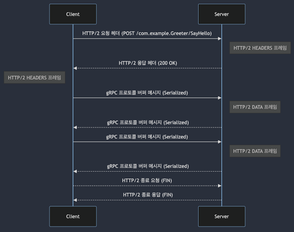
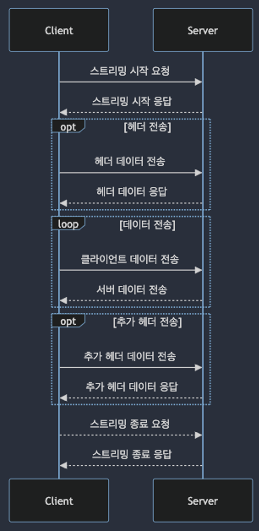
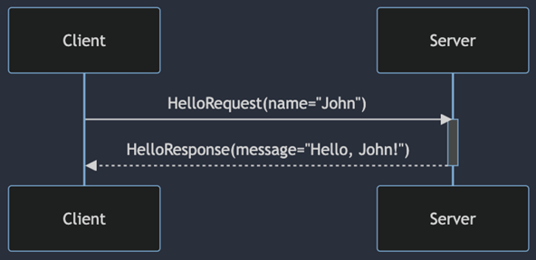

# gRPC 기본 개념

## 1. RPC 개념 소개

 - `RPC 작동 원리`
    - 클라이언트-서버 모델
    - 프로시저 호출
    - 스텁(Stub)
    - 마샬링과 언마샬링
 - `RPC 장점`
    - 추상화
        - 장점: 복잡성 감소, 개발자 친화적, 오류 감소
        - 구현 예시: 인터페이스 정의, 스텁 사용, 마샬링과 언마샬링
    - 언어 독립성
        - 의미: 프로그래밍 언어의 다양성, 상호 운용성
        - 구현 예시: 표준화된 프로토콜, 데이터 직렬화, 언어에 독립적인 인터페이스
    - 분산 처리 용이성
        - 의미: 다양한 시스템 통합, 통신의 간소화
        - 구현 예시: 서비스 지향 아키텍처(SOA), 마이크로 서비스 아키텍처(MSA), 분산 컴퓨팅
 - `RPC 단점`
    - 네트워크 신뢰성
        - 문제: 네트워크 의존성, 네트워크 문제와 RPC 실패
        - 해결 방안: 타임아웃 및 재시도 메커니즘, 로드 밸런싱과 장애 조치, 분산 시스템 설계 시 해당 부분 고려
    - 디버깅 어려움
        - 원인: 원격 프로시저 호출의 복잡성, 네트워크 관련 문제, 서버와 클라이언트의 상태 불일치, 오류 메시지의 부족 또는 불명확성
        - 디버깅을 위한 전략 및 도구: 로깅과 모니터링, 트레이싱 도구 사용, 환경 일관성 유지, 타임아웃 및 오류 처리 전략

<br/>

## 2. gRPC 서비스 요청 방식 이해

### gRPC와 Protobuf의 상호 작용

 - gRPC에서 사용되는 주요 인터페이스 정의 언어(IDL)
 - 데이터 구조를 효율적으로 직렬화
 - 작은 메시지 크기와 빠른 처리 속도로 네트워크 효율성을 높임

<br/>

### gRPC 서비스 요청 방식

 - `HTTP/2와의 상호작용`

<div align="center">
    
</div>
<br/>

 - `양방향 스트리밍 예시`
    - 스트리밍 시작 요청 및 응답
    - 헤더 프레임 전송
    - 데이터 프레임 전송 (스트리밍 동안)
    - 추가 헤더 전송(옵션)
    - 스트리밍 종료 요청 및 응답

<div align="center">
    
</div>
<br/>

## 3. 클라이언트 및 서버에서 gRPC 사용 예제

 - `간단한 gRPC 클라이언트-서버 예시`
    - 클라이언트가 서버에 이름을 보내면 서버가 인사말을 반환하는 예시

<div align="center">
    
</div>
<br/>

 - `.proto 정의`
    - 컴파일 명령어: protoc --java_out=generated src/main/proto/helloworld.proto
```proto
syntax = "proto3";

package helloworld;

message HelloRequest {
    string name = 1;
}

message HelloResponse {
    string message = 1;
}

service Greeter {
    rpc SayHello (HelloRequest) returns (HelloResponse);
}
```
<br/>

 - `서버 구현`
```java
public class HelloWorldServer {
    public static void main(String[] args) throws Exception {
        Server server = ServerBuilder.forPort(8080)
                                     .addService(new GreeterImpl())
                                     .build();
        server.start();
        server.awaitTermination();
    }

    static class GreeterImpl extends GreeterGrpc.GreeterImplBase {
        @Override
        public void sayHello(HelloRequest request, StreamObserver<HelloResponse> responseObserver) {
            String name = request.getName();
            HelloResponse response = HelloResponse.newBuilder()
                                                  .setMessage("Hello, " + name)
                                                  .build();
            responseObserver.onNext(response);
            responseObserver.onCompleted();
        }
    }
}
```
<br/>

 - `클라이언트 구현`
```java
public class HelloWorldClient {
    public static void main(String[] args) {
        ManagedChannel channel = ManagedChannelBuilder.forAddress("localhost", 8080)
                                                      .usePlaintext()
                                                      .build();
        GreeterGrpc.GreeterBlockingStub stub = GreeterGrpc.newBlockingStub(channel);

        HelloRequest request = HelloRequest.newBuilder()
                                           .setName("Dobby")
                                           .build();

        HelloResponse response = stub.sayHello(request);
        System.out.println("Server response: " + response.getMessage());

        channel.shutdown();
    }
}
```
<br/>

### gRPC 장점

 - protoc를 이용한 관련 코드 자동 생성
 - 커넥션 관리 불필요
 - 비즈니스 로직에 집중 가능
 - HTTP/2 기반의 이점

