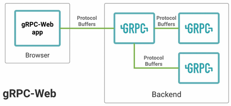
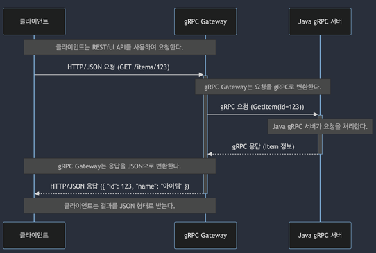

# gRPC 웹 및 REST 브리지

## 1. gRPC-Web 서비스 소개

gRPC-WEB은 웹 클라이언트에서 gRPC 서비스를 직접 호출 할 수 있게 해주는 Javascript 기반 라이브러리이다.  
gRPC-Web을 이용하면 브라우저에서 바로 gRPC 요청이 가능하고, 웹 개발에서 통신을 단순화하고, 서버 리소스를 효율적으로 사용 가능하다.  
 - 직접적인 gRPC 서비스 호출
 - 브라우저 호환성
 - 프로토콜 버퍼 사용
 - HTTP/2 기반의 효율적인 통신

<div align="center">
    
</div>
<br/>

### 간단한 gRPC-Web 클라이언트-서버 예시

 - `.proto 정의`
    - 컴파일 명령어: protoc -l=$DIR helloworld.proto --js_out=import_style=commonjs:$OUT_DIR --grpc-web_out=import_style=commonjs,mode=grpcwebtext:$OUT_DIR
    - mode=grpcwebtext: 바이너리가 아닌 텍스트 형식으로 전달, 페이로드는 base64로 인코딩, 단방향, 스트리밍 모두 지원
    - mode=grpcweb: 바이너리 protobuf 형식도 지원, 페이로드는 바이너리 protobuf 형식, 단방향 호출만 지원
```proto
syntax = "proto3";

package helloworld;

message HelloRequest {
    string name = 1;
}

message HelloResponse {
    string message = 1;
}

service Greeter {
    rpc SayHello (HelloRequest) returns (HelloResponse);
}
```
<br/>

 - `JS 클라이언트`
```javascript
var helloService = new proto.helloworld.GreeterServiceClient("http://localhost:8080");

var request = new proto.helloworld.HelloRequest();
request.setMessage(msg);
var metadata = {
    'custom-header-1': 'value'
};

helloService.SayHello(request, metadata, function(err, response) {
    if(err) {
        console.log(err.code);
        console.log(err.message);
    } else {
        console.log(response.getMessage());
    }
})
```
<br/>

 - `Java 서버`
```java
public class HelloWorldServer {
    public static void main(String[] args) throws Exception {
        Server server = ServerBuilder.forPort(8080)
                                     .addService(new GreeterImpl())
                                     .build();
        server.start();
        server.awaitTermination();
    }

    static class GreeterImpl extends GreeterGrpc.GreeterImplBase {
        @Override
        public void sayHello(HelloRequest request, StreamObserver<HelloResponse> responseObserver) {
            String name = request.getName();
            HelloResponse response = HelloResponse.newBuilder()
                                                  .setMessage("Hello, " + name)
                                                  .build();
            responseObserver.onNext(response);
            responseObserver.onCompleted();
        }
    }
}
```
<br/>

 - `프록시 서버 추가`
    - gRPC-WEB 클라이언트가 보낸 HTTP/1.1 요청을 gRPC 서버가 이해할 수 있는 HTTP/2 gRPC 요청으로 변환
    - 일반적인 Java gRPC 서버는 gRPC-Web 프로토콜을 지원하지 않기 떄문에, Envoy 프록시를 사용하거나, Armeria(JVM) 기반의 서버를 사용하는 것도 방법 중 하나이다.
```bash
docker-compose up -d node-server envoy commonjs-client
```
<br/>

## 2. RESTful API와 gRPC 간의 변환 방법 소개

### gRPC를 RESTful API 변환의 장점

 - 기존 REST 클라이언트 지원
 - 플랫폼 및 언어 독립성
 - 방화벽 및 인터넷 친화적
 - 간단한 디버깅과 모니터링

<br/>

### 방법 1. google.api.http

 - google.api.http option을 사용
    - HTTP GET 요청을 gRPC 메서드에 바인딩
    - gRPC 본문에 있는 데이터를 메시지 필드에 매핑 가능
 - Java 서버는 option을 처리하지 못한다.
    - Go gRPC Gateway를 사용해야 한다.
```bash
# java gRPC 서버 생성
protoc --java_out=<output_path> \ 
    --grpc-java_out=<output_path> \ 
    --proto_path=<proto_file_path> \ 
    your_service.proto

# gRPC Gateway 생성
protoc --go_out=<output_path> \ 
--go-grpc_out=<output_path> \ 
--grpc-gateway_out=<output_path> \ 
--proto_path=<proto_file_path> \ 
your_service.proto
```

<div align="center">
    
</div>
<br/>

### 방법 2. Spring으로 Gateway 직접 구현

 - `GrpcClientConfig`
```java
@Configuration
public class GrpcClientConfig {

    @Bean
    public ItemServiceGrpc.ItemServiceBlockingStub itemServiceStub() {
        ManagedChannel channel = ManagedChannelBuilder.forAddress("localhost", 9090)
                .usePlaintext()
                .build();
        return ItemServiceGrpc.newBlockingStub(channel);
    }
}
```
<br/>

 - `ItemController`
```java
@RestController
@RequestMapping("/api/items")
public class ItemController {

    private final ItemServiceGrpc.ItemServiceBlockingStub itemServiceStub;

    public ItemController(ItemServiceGrpc.ItemServiceBlockingStub itemServiceStub) {
        this.itemServiceStub = itemServiceStub;
    }

    @GetMapping("/{id}")
    public ResponseEntity<?> getItem(@PathVariable String id) {
        GetItemRequest request = GetItemRequest.newBuilder()
                                               .setId(id)
                                               .build();
        try {
            GetItemResponse response = itemServiceStub.getItem(request);
            return ResponseEntity.ok(Map.of(
                "name", response.getName(),
                "description", response.getDescription()
            ));
        } catch (StatusRuntimeException e) {
            return ResponseEntity.status(HttpStatus.INTERNAL_SERVER_ERROR)
                                 .body(e.getStatus().getDescription());
        }
    }
}
```
<br/>

### 방법 3 . Armeria Framework

 - JVM 기반의 Framework
 - Spring Integration
 - HTTP/2 지원
 - gRPC-Web 지원
 - 다양한 프로토콜과 통합

